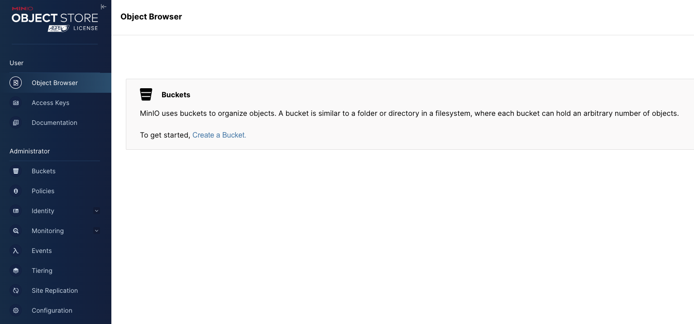

在现代软件开发的众多环节中，容器化技术已经成为了加速开发、简化部署的关键工具。Docker 作为市场上最流行的容器平台之一，提供了一种高效的方式来打包、分发和管理应用。在这片博文中，我们将探索如何利用 Docker Compose 来部署一个 MinIO 集群。在开发环境中，使用 Docker Compose 部署 MinIO 不仅能够保证环境的一致性，还允许开发者快速部署和撤销实例，极大地提高了开发效率。


## 1. MinIO 简介

MinIO 是一个高性能、兼容 AWS S3 的开源对象存储解决方案。它适用于存储大量非结构化数据，比如照片、视频、日志文件等。MinIO 可以在单机模式下运行，也可以配置为高可用的分布式模式。在本教程中，我们将使用 Docker Compose 在本地环境中部署一个三节点的 MinIO 集群。

## 2. Docker Compose 简介

Docker Compose 是一个用于定义和运行多容器 Docker 应用程序的工具。通过 Compose，您可以通过一个 YAML 文件来配置您的应用的服务。然后，使用一个简单的命令，就可以创建并启动所有配置中的服务。这让组织和管理容器变成了一件轻而易举的事情。

在开始之前，首先需要确保已经安装了 Docker Compose，如果没有安装或者不熟悉 Compose 的具体查阅 [Docker 实战：使用 Docker Compose 实现高效的多容器部署](https://smartsi.blog.csdn.net/article/details/138414972)。

## 3. Docker Compose 部署 MinIO

接下来，我们将一步步通过 Docker Compose 来部署 MinIO 集群。

### 3.1 创建项目目录

首先为项目创建一个目录。在这里，在我们的工作目录 `/opt/workspace/docker` 下创建一个名为 `minio` 的项目 ：
```shell
smartsi@localhost docker % mkdir minio
smartsi@localhost docker % cd minio
```
> 该目录是应用程序镜像的上下文。该目录应该只包含用于构建该镜像的资源。

### 3.2 构建 Compose 文件

Docker Compose 简化了对整个应用程序堆栈的控制，使得在一个易于理解的 YAML 配置文件中轻松管理服务、网络和数据卷。要使用 Docker Compose 部署，首先需创建一个 docker-compose.yml 文件，如下所示：
```yml
services:
  minio1:
    image: minio/minio:RELEASE.2024-05-10T01-41-38Z
    volumes:
      - m1_data:/data
    networks:
      - pub-network
    ports:
      - "9000:9000"
      - "9001:9001"
    environment:
      - MINIO_ROOT_USER=admin
      - MINIO_ROOT_PASSWORD=12345678
    command: server http://minio{1...3}/data --console-address ":9001"

  minio2:
    image: minio/minio:RELEASE.2024-05-10T01-41-38Z
    volumes:
      - m2_data:/data
    networks:
      - pub-network
    environment:
      - MINIO_ROOT_USER=admin
      - MINIO_ROOT_PASSWORD=12345678
    command: server http://minio{1...3}/data --console-address ":9001"

  minio3:
    image: minio/minio:RELEASE.2024-05-10T01-41-38Z
    volumes:
      - m3_data:/data
    networks:
      - pub-network
    environment:
      - MINIO_ROOT_USER=admin
      - MINIO_ROOT_PASSWORD=12345678
    command: server http://minio{1...3}/data --console-address ":9001"

volumes:
  m1_data:
  m2_data:
  m3_data:

networks:  # 加入公共网络
  pub-network:
      external: true
```

> 可以为使用 .yml 或 .yaml 扩展名

这个文件定义了一个 MinIO 集群，其中包含三个节点：`minio1`、`minio2` 和 `minio3`。每个节点都使用 MinIO 的官方 Docker 镜像，并将 MinIO 服务暴露在 9000、9001 端口上。此外，每个节点都设置了管理员用户名和密码。下面详细介绍具体配置。

#### 3.2.1 顶级配置

`services` 配置用于定义不同的应用服务。上边的例子定义了三个服务：`minio1`、`minio2` 以及 `minio3`，分别作为集群的三个节点。Docker Compose 会将每个服务部署在各自的容器中。在这里我们没有自定义容器名称，而是使用容器的默认名称，在这分别为 `minio1-1`、`minio2-1` 以及 `minio3-1`。

`networks` 配置用于声明服务要连接的网络 `pub-network`。`external: true` 表示网络是在 Docker Compose 配置文件之外定义的，即它已经存在了，Docker Compose 不需要尝试创建它。只要加入这个网络的服务就能够实现项目容器间以及跨项目通信。具体可以查阅 [Docker 实战：使用 Docker Compose 部署实现跨项目网络访问](https://smartsi.blog.csdn.net/article/details/138734487)。

`volumes` 配置用于声明 Docker Compose 创建新的数据卷 `m1_data`、`m2_data` 以及 `m3_data`。我们只负责声明，不需要手动创建，Docker Compose 会自动管理。默认情况下，在容器删除之后数据会丢失。为了解决这个问题，我们需要三个服务分别使用声明中的数据卷来将数据保存在宿主机上。

#### 3.2.2 service元素配置

`services` 配置定义了三个服务，我们以 `minio1` 服务为例，详细介绍服务的配置。

`image` 配置指定了要使用的 Docker 镜像及其版本。三个服务均使用 `minio/minio:RELEASE.2024-05-10T01-41-38Z` 镜像确保所有节点运行同一版本的 MinIO，保持集群的一致性。这里的版本 `RELEASE.2024-05-10T01-41-38Z` 可以根据需求替换为最新或特定版本，其中日期时间戳代表了该版本的构建时间。当然你也可以选择 `minio/minio:latest` 镜像，这会确保每次拉取都是最新的稳定版，但在生产环境中可能带来不确定性，因为“最新版”会随新版本发布而变化。选择特定版本的标签可以提供更多的控制和预测性，减少意外的更新可能造成的问题。

`volumes` 配置对于生产环境中 MinIO 集群的数据持久化是至关重要的。这意味着你需要将容器内的数据绑定到宿主机上的数据卷来存储数据，这样即使容器重启，数据也不会丢失。为每个 MinIO 节点提供了独立的数据卷 xxx_data，用于存储 MinIO 的数据(/data)。

`networks` 配置将服务连接到 pub-network 网络上。这个网络在 networks 一级key中声明已经创建，Docker Compose 不需要尝试创建它。加入这个网络之后，不同服务就可以通过服务名（`minio1`、`minio2`、`minio3`）找到并实现容器间以及跨项目的网络访问。

`ports` 配置用来将容器的端口映射到宿主机的端口，使得宿主机能够与集群进行通信。通常，只有服务需要直接从宿主机的网络访问时，我们才会映射端口。对于 MinIO 的分布式集群来说，节点之间的通信是在内部 Docker 网络中进行的，无需额外的端口映射。只有外部客户端需要访问集群时，才需要一个入口点，所以不需要为集群中的每个节点都映射端口到宿主机。我们只需要为集群中的一个节点映射端口即可。这个例子中，我们只将 9000 端口映射到了 minio1 节点，这足以让外部客户端通过宿主机的 9000 端口来访问到 MinIO 集群。如果还希望利用 MinIO 提供的 Web 界面 `MinIO Console` 进行管理和监控，可以选择为同一个节点映射控制台端口 9001。这样就可以在浏览器中使用这个端口来访问 MinIO Console。最终决定是否对多个节点映射端口，以及如何映射端口，取决于您的具体需求和网络架构。在大多数情况下，对单一节点映射端口是足够的，这保持了配置的简单性并减少了潜在的网络安全风险。
```yml
services:
  minio1:
    image: minio/xxx
    ports:
      - "9000:9000" # 映射 MinIO 的 API 端口
      - "9001:9001" # 仅当需要 MinIO 的控制台访问时映射该端口
    ...
  minio2:
    image: minio/xxx
    # minio2 无需端口映射
    ...
  minio3:
    image: minio/xxx
    # minio3 无需端口映射
    ...
```

`environment` 配置用来设置环境变量。这里，我们设置了访问 MinIO 实例所需的根用户和密码 (MINIO_ROOT_USER 和 MINIO_ROOT_PASSWORD)。

`command` 配置指定容器启动时运行的命令。它告诉 MinIO 以分布式模式启动，并且包括所有三个定义的节点。`--console-address ":9001"` 指定了 MinIO 管理控制台的地址。对每个服务都定义了相同的启动命令，这是为了确保每个节点都具备相同的配置信息以协同工作。

### 3.3 创建公共网络

上述配置文件中我们声明加入一个 `pub-network` 的网络：
```shell
networks:  # 加入公共网络
  pub-network:
      external: true
```
`external: true` 表示网络是在 Docker Compose 配置文件之外定义的，即它已经存在了，Docker Compose 不需要尝试创建它。首先要确保你已经创建了该网络，如果没有创建可以使用如下命令来创建：
```shell
docker network create pub-network
```

### 3.4 部署

在有了 docker-compose.yml 文件后，你需要在包含此文件的目录中运行 `docker compose up -d` 命令启动服务：
```shell
(base) localhost:minio wy$ docker compose up -d
[+] Running 11/11
 ✔ minio1 Pulled                                                                107.4s
 ✔ minio2 Pulled                                                                107.4s
   ✔ ddf997398e20 Already exists                                                12.0s
   ✔ df4a579dec01 Already exists                                                5.6s
   ✔ 8192a80982f2 Pull complete                                                 85.1s
   ✔ 362c568d646c Pull complete                                                 16.5s
   ✔ f1d1ac67109d Pull complete                                                 19.3s
   ✔ 6722841456ff Pull complete                                                 19.9s
   ✔ d5b199683645 Pull complete                                                 21.2s
   ✔ 4b0d9e6819e5 Pull complete                                                 22.3s
 ✔ minio3 Pulled                                                                107.4s
[+] Running 6/6
 ✔ Volume "minio_m1_data"    Created                                            0.0s
 ✔ Volume "minio_m2_data"    Created                                            0.0s
 ✔ Volume "minio_m3_data"    Created                                            0.0s
 ✔ Container minio-minio2-1  Started                                            1.4s
 ✔ Container minio-minio3-1  Started                                            1.4s
 ✔ Container minio-minio1-1  Started
```
上述命令会在后台启动 MinIO 集群的三个服务。

### 3.5 验证部署

一旦部署完成，你可以通过访问 minio1 服务节点的管理控制台来验证你的集群，管理控制台通过端口 9001 访问。可以在浏览器中输入 `http://localhost:9001` 来访问。使用环境变量中设置的 MINIO_ROOT_USER 和 MINIO_ROOT_PASSWORD 登录:


登录成功之后如下所示：




...
