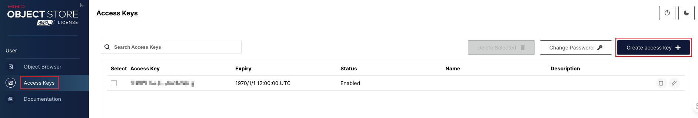
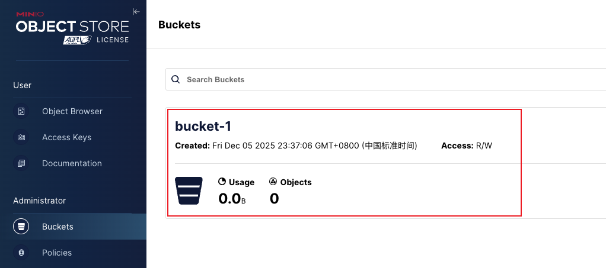
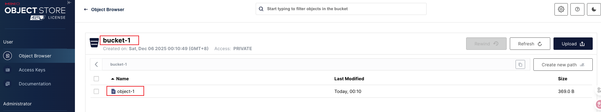

MinIO 是一个高性能的云原生对象存储系统，与 Amazon S3 API 完全兼容。作为现代应用程序的首选存储解决方案，MinIO 提供了简单、可靠的对象存储能力。本指南将详细介绍如何使用 MinIO Java SDK 来与 MinIO 服务器进行交互。

## 1. 环境准备

### 1.1 搭建 MinIO 服务

请详细查阅[MinIO 实战：使用 Docker Compose 部署 MinIO 集群](https://smartsi.blog.csdn.net/article/details/138742646)。

### 1.2 Maven 依赖

在 Java 中使用如下添加如下依赖：
```xml
<dependency>
    <groupId>io.minio</groupId>
    <artifactId>minio</artifactId>
    <version>8.5.14</version>
</dependency>
```

## 2. 基本操作

### 2.1 客户端初始化

在进行 Bucket 和 Object 操作之前，需要先初始化 MinIO 客户端 MinioClient：
```java
// MinIO 客户端
MinioClient minioClient = MinioClient.builder()
        .endpoint(ENDPOINT)
        .credentials(AK, SK)
        .build();
```
AK 和 SK 可以通过如下方式在控制台创建：



### 2.2 Bucket 操作

下面详细介绍 Bucket 的几个操作：创建、检查是否存在、列出、删除

- MakeBucket：创建 Bucket
- BucketExists：检查 Bucket 是否存在
- ListBuckets：列出所有 Bucket
- RemoveBucket：删除 Bucket

#### 2.2.1 MakeBucket

可以通过 MakeBucket 方法来创建 Bucket，如下所示创建一个名为 `bucket-1` 的 Bucket：
```java
// MinIO 客户端
MinioClient minioClient = MinioClient.builder()
        .endpoint(ENDPOINT)
        .credentials(AK, SK)
        .build();

String bucketName = "bucket-1";
// 构建参数
BucketExistsArgs bucketExistsArgs = BucketExistsArgs.builder().bucket(bucketName).build();
MakeBucketArgs makeBucketArgs = MakeBucketArgs.builder().bucket(bucketName).build();
// Bucket 不存在则创建
if (!minioClient.bucketExists(bucketExistsArgs)) {
    minioClient.makeBucket(makeBucketArgs);
    LOG.info("bucket {} is created successfully", bucketName);
} else {
    LOG.info("bucket {} is already created", bucketName);
}
```
> bucketExists 用来检查 Bucket 是否存在，下面会详细介绍。

创建 Bucket 所需要的参数通过 MakeBucketArgs 来构造，在这只需要通过 `bucket` 方法填充要创建的 Bucket 名称即可。

运行上述代码之后可以通过控制台查看我们创建的 Bucket，当然也可以通过 API 来查看(下面会详细介绍)：



> [完整示例](https://github.com/sjf0115/minio-example/blob/main/minio-quick-start/src/main/java/com/example/bucket/MakeBucket.java)

#### 2.2.2 BucketExists

上面介绍了通过 MakeBucket 方法来创建 Bucket，创建之前可以通过 BucketExists 来判断之前是否创建过：
```java
// MinIO 客户端
MinioClient minioClient = ...

String bucketName = "test-bucket";
// 构建参数
BucketExistsArgs bucketExistsArgs = BucketExistsArgs.builder().bucket(bucketName).build();
// 判断 Bucket 是否存
boolean exists = minioClient.bucketExists(bucketExistsArgs);
if (exists) {
    LOG.info("bucket {} exists", bucketName);
} else {
    LOG.info("bucket {} does not exist", bucketName);
}
```
检查 Bucket 是否存在所需要的参数通过 BucketExistsArgs 来构造，在这只需要通过 `bucket` 方法填充要检查的 Bucket 名称即可。

> [完整示例](https://github.com/sjf0115/minio-example/blob/main/minio-quick-start/src/main/java/com/example/bucket/BucketExists.java)

#### 2.2.3 ListBuckets

可以通过 ListBuckets 展示所有创建的 Bucket：
```java
// MinIO 客户端
MinioClient minioClient = MinioClient.builder()
        .endpoint(ENDPOINT)
        .credentials(AK, SK)
        .build();

List<Bucket> bucketList = minioClient.listBuckets();
for (Bucket bucket : bucketList) {
    LOG.info("bucket name: {}, createDate: {}", bucket.name(), bucket.creationDate());
}
```
列出所有 Bucket 不需要任何参数。

> [完整示例](https://github.com/sjf0115/minio-example/blob/main/minio-quick-start/src/main/java/com/example/bucket/ListBuckets.java)

#### 2.2.4 RemoveBucket

可以通过 RemoveBucket 删除指定的 Bucket：
```java
// MinIO 客户端
MinioClient minioClient = MinioClient.builder()
        .endpoint(ENDPOINT)
        .credentials(AK, SK)
        .build();

String bucketName = "bucket-1";
// 构建参数
BucketExistsArgs bucketExistsArgs = BucketExistsArgs.builder().bucket(bucketName).build();
RemoveBucketArgs bucketArgs = RemoveBucketArgs.builder().bucket(bucketName).build();
// Bucket 存在则删除
if (minioClient.bucketExists(bucketExistsArgs)) {
    minioClient.removeBucket(bucketArgs);
    LOG.info("bucket {} is removed successfully", bucketName);
} else {
    LOG.info("bucket {} does not exist", bucketName);
}
```
删除 Bucket 所需要的参数通过 RemoveBucketArgs 来构造，在这只需要通过 `bucket` 方法填充要删除的 Bucket 名称即可。

> [完整示例](https://github.com/sjf0115/minio-example/blob/main/minio-quick-start/src/main/java/com/example/bucket/RemoveBucket.java)

### 2.3 Object 操作

下面详细介绍 Object 的几个操作：
- PutObject：通用上传对象
- UploadObject：简单上传对象

上传、下载、删除、列出、获取对象信息

#### 2.3.1 PutObject

可以通过 `PutObject` 实现上传对象：
```java
// 示例1：上传内存数据
// MinIO 客户端
MinioClient minioClient = MinioClient.builder()
        .endpoint(ENDPOINT)
        .credentials(AK, SK)
        .build();

String bucketName = "bucket-1";
String objectName = "object-1";

// 上传数据
StringBuilder builder = new StringBuilder();
for (int i = 0;i < 10; i++) {
    builder.append(1000 + i).append("\n");
}
ByteArrayInputStream byteArrayInputStream = new ByteArrayInputStream(builder.toString().getBytes(StandardCharsets.UTF_8));

// 上传
PutObjectArgs objectArgs = PutObjectArgs.builder()
        .bucket(bucketName)
        .object(objectName)
        .stream(byteArrayInputStream, byteArrayInputStream.available(), -1)
        .build();
minioClient.putObject(objectArgs);
byteArrayInputStream.close();
LOG.info("Bucket: {} Object: {} is uploaded successfully", bucketName, objectName);
```
> [完整示例](https://github.com/sjf0115/minio-example/blob/main/minio-quick-start/src/main/java/com/example/object/PutObject.java)

或者
```java
// 示例2：上传本地文件
// 上传数据
File file = new File("/opt/data/province_info.txt");
FileInputStream fileInputStream = new FileInputStream(file);

// 上传
PutObjectArgs objectArgs = PutObjectArgs.builder()
        .bucket(bucketName)
        .object(objectName)
        .stream(fileInputStream, file.length(), -1)
        .build();
minioClient.putObject(objectArgs);
fileInputStream.close();
LOG.info("Bucket: {} Object: {} is uploaded successfully", bucketName, objectName);
```
> [完整示例](https://github.com/sjf0115/minio-example/blob/main/minio-quick-start/src/main/java/com/example/object/PutObjectFromFile.java)

`PutObject` 方法是一个通用的上传对象的方法，它允许你从 InputStream 上传数据。这意味着你可以上传任何数据，而不仅仅是本地文件，比如从网络流、内存中的数据等。上 Object 所需要的参数通过 PutObjectArgs 来构造，在这需要填充要上传的 Bucket、Object 以及输入流 InputStream。

> 需要注意的是，使用 `PutObject` 上传大文件时，需要自己处理分片上传，或者确保数据量不大。

#### 2.3.2 UploadObject

除了可以通过 `PutObject` 实现上传对象，也可以通过 `UploadObject` 实现上传对象，主要用于上传本地文件：
```java
// MinIO 客户端
MinioClient minioClient = MinioClient.builder()
        .endpoint(ENDPOINT)
        .credentials(AK, SK)
        .build();

String bucketName = "bucket-1";
String objectName = "object-1";
String fileName = "/opt/data/province_info.txt";
// 上传文件
UploadObjectArgs objectArgs = UploadObjectArgs.builder()
        .bucket(bucketName)
        .object(objectName)
        .filename(fileName)
        .build();
ObjectWriteResponse response = minioClient.uploadObject(objectArgs);
LOG.info("{} is uploaded to {}({}) successfully", fileName, response.object(), response.bucket());
```
`UploadObject` 是对 `PutObject` 方法的一个封装，但更专注于处理本地文件。该方法会自动处理文件的分片上传（如果文件较大），并且在上传过程中会计算文件的MD5校验和以确保数据完整性。上传 Object 所需要的参数通过 UploadObjectArgs 来构造，在这需要填充要上传的 Bucket、Object 以及输入的本地文件。

运行上述代码之后可以通过控制台查看我们创建的 Object，当然也可以通过 API 来查看(下面会详细介绍)：



> [完整示例](https://github.com/sjf0115/minio-example/blob/main/minio-quick-start/src/main/java/com/example/object/UploadObject.java)

#### 2.3.3 StatObject

```java
// MinIO 客户端
MinioClient minioClient = MinioClient.builder()
        .endpoint(ENDPOINT)
        .credentials(AK, SK)
        .build();

String bucketName = "bucket-1";
String objectName = "object-1";
// 详情
StatObjectArgs objectArgs = StatObjectArgs.builder().bucket(bucketName).object(objectName).build();
StatObjectResponse objectResponse = minioClient.statObject(objectArgs);
LOG.info("Bucket: {} Object: {}, Size: {}", objectResponse.bucket(), objectResponse.object(), objectResponse.size());
```

#### 2.3.4 GetObject

```java
// MinIO 客户端
MinioClient minioClient = MinioClient.builder()
        .endpoint(ENDPOINT)
        .credentials(AK, SK)
        .build();

String bucketName = "bucket-1";
String objectName = "object-1";

// 从 Object 中获取输入流
GetObjectArgs objectArgs = GetObjectArgs.builder().bucket(bucketName).object(objectName).build();
InputStream stream = minioClient.getObject(objectArgs);

// 从输入流中读取输出到控制台
byte[] buf = new byte[16384];
int bytesRead;
while ((bytesRead = stream.read(buf, 0, buf.length)) >= 0) {
    String result = new String(buf, 0, bytesRead, StandardCharsets.UTF_8);
    LOG.info("result: {}", result);
}
stream.close();
```

#### 2.3.5 ListObjects

```java
// MinIO 客户端
MinioClient minioClient = MinioClient.builder()
        .endpoint(ENDPOINT)
        .credentials(AK, SK)
        .build();

String bucketName = "bucket-1";
ListObjectsArgs objectsArgs = ListObjectsArgs.builder().bucket(bucketName).build();
Iterable<Result<Item>> results = minioClient.listObjects(objectsArgs);
for (Result<Item> result : results) {
    Item item = result.get();
    LOG.info("Object: {}, Size: {}, LastModified: {}", item.objectName(), item.size(), item.lastModified());
}
```

#### 2.3.6 RemoveObject

```java
// MinIO 客户端
MinioClient minioClient = MinioClient.builder()
        .endpoint(ENDPOINT)
        .credentials(AK, SK)
        .build();

String bucketName = "bucket-1";
ListObjectsArgs objectsArgs = ListObjectsArgs.builder().bucket(bucketName).recursive(true).build();
Iterable<Result<Item>> results = minioClient.listObjects(objectsArgs);
for (Result<Item> result : results) {
    Item item = result.get();
    LOG.info("Object: {}, Size: {}, LastModified: {}", item.objectName(), item.size(), item.lastModified());
}
```

#### 2.3.7 RemoveObjects

```java
// MinIO 客户端
MinioClient minioClient = MinioClient.builder()
        .endpoint(ENDPOINT)
        .credentials(AK, SK)
        .build();

String bucketName = "bucket-1";
List<DeleteObject> objects = new LinkedList<>();
objects.add(new DeleteObject("object-1"));
objects.add(new DeleteObject("object-2"));

RemoveObjectsArgs objectsArgs = RemoveObjectsArgs.builder().bucket(bucketName).objects(objects).build();
Iterable<Result<DeleteError>> results = minioClient.removeObjects(objectsArgs);
for (Result<DeleteError> result : results) {
    DeleteError error = result.get();
    LOG.info("Error in deleting object {}, {}", error.objectName(), error.message());
}
```

#### 2.3.8 DownloadObject

```java
// MinIO 客户端
MinioClient minioClient = MinioClient.builder()
        .endpoint(ENDPOINT)
        .credentials(AK, SK)
        .build();

String bucketName = "bucket-1";
String objectName = "object-3";
String fileName = "/opt/data/minio.txt";

// 下载
DownloadObjectArgs objectArgs = DownloadObjectArgs.builder()
        .bucket(bucketName)
        .object(objectName)
        .filename(fileName)
        .build();
minioClient.downloadObject(objectArgs);
LOG.info("{} is successfully downloaded to {}", objectName, fileName);
```

#### 2.3.9 CopyObject

```java
// MinIO 客户端
MinioClient minioClient = MinioClient.builder()
        .endpoint(ENDPOINT)
        .credentials(AK, SK)
        .build();

String sourceBucketName = "bucket-1";
String sourceObjectName = "object-3";
String targetBucketName = "bucket-1";
String targetObjectName = "object-4";

// 复制
CopySource copySource = CopySource.builder().bucket(sourceBucketName)
        .object(sourceObjectName).build();
CopyObjectArgs objectArgs = CopyObjectArgs.builder().bucket(targetBucketName).object(targetObjectName)
        .source(copySource).build();
minioClient.copyObject(objectArgs);
LOG.info("{}/{} copied to {}/{} successfully", sourceObjectName, sourceBucketName, targetObjectName, targetBucketName);
```
