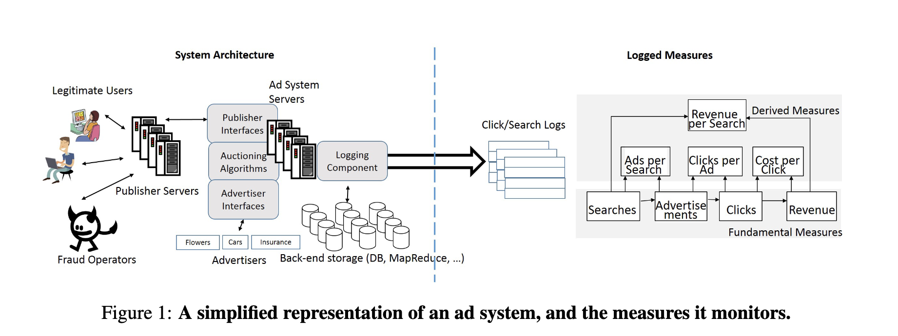

## 摘要

广告收入在支持免费网站方面起着至关重要的作用。当收入出现急剧下降或增加时，广告系统运营商必须找到根因并解决（例如，通过优化基础设施性能）。这种收入调试类似于系统文献中的诊断和根因分析，但更为普遍。基础设施故障可能只是其中一个潜在的原因，其他维度（例如，广告商、设备类型）也可能是潜在的原因。此外，每次点击成本等派生指标也会使问题复杂化。

该论文首次系统地探讨了收入调试问题。利用解释力、简洁性和惊奇度等概念，我们提出了一种新的多维根因算法，用于广告系统的基本指标和派生指标以确定最有可能归因的维度。此外，我们还在一个名为 Adtributor 的工具中实现了该归因算法以及可视化界面，以帮助故障排除人员快速识别潜在原因。基于对超大型广告系统的多个案例研究和广泛评估，我们表明 Adtributor 的准确率超过 95%，并有助于将故障排除时间缩短一个数量级。

## 1. 导言

今天许多免费网站都是靠广告收入来支撑的。网站广告有两种类型：搜索广告和展示广告。在搜索广告的场景下，终端用户访问诸如 `bing.com` 等广告主的网站，并输入一个查询短语进行搜索。搜索结果页面可能会包含一个或多个广告。如果用户点击其中一个广告，广告主就会获得收入。在展示广告的场景下，终端用户访问广告主的网站，比如 `cnn.com`可能会在页面的顶部或两侧看到广告。这些广告的展示也会为广告主带来收入。

广告系统每天为数百万这样的搜索和展示广告提供生成和结算。除了上面提到的用户和广告主，还有另外两个与广告系统交互的关键实体：**广告商**和**欺诈经营者**。向用户展示的广告是不同广告商之间竞价竞标的结果，这些广告商竞相出价以使他们的广告可以展示给用户。此外，还有各种各样的欺诈经营者试图篡夺一小部分广告的收入。

广告系统会管理用户、广告主、广告商和欺诈经营者之间的交互。广告系统执行各种与广告相关的算法，在广告商之间运行实时广告拍卖，将获胜的广告返回给广告主，监控用户点击，检测并删除潜在的欺诈活动，计算每个展示或点击广告的收入，并向广告商收取适当的出价金额，以及向广告主支付费用。广告系统的核心是一个大型分布式系统，由分布在多个数据中心的数千台服务器组成，这些服务器执行广告算法并管理广告的服务和计费。

本文的重点是调试广告系统。通常情况下，广告系统监控器会在发现相关指标出现异常时发出警报(例如，收入或搜索数量急剧下降)。我们的目标是自动找出这种异常的潜在根因。我们将我们的方法称为`收入调试`，来确认收入指标的正确性，尽管这个方法也适用于广告系统运营商所关心的多个指标。在本文中，我们介绍了一种新的收入调试算法，该算法分析了广告系统记录的大量数据，并将异常潜在根因的范围缩小到广告系统的子组件，以便人工故障排除员进一步排查。

根因识别和诊断是一个老问题，过去已经提出了各种各样的性能根因工具。但所有这些解决方案都侧重于性能/故障排查。在这里，我们解决一个类似但更常见的问题：广告系统中的诊断。虽然基础设施系统组件的性能/故障是异常检测的一个可能的根因，但也可能是依赖于与广告系统交互的其他组件的各种根因。例如如下所示例子：

- 教皇选举：
  - 我们注意到教皇选举导致收入下降，是因为许多搜索都是针对非货币化的查询词，如教皇或教皇选举，而这些词广告商通常不会竞标。展示的广告总数下降，导致收入异常下降。虽然将根因确定为教皇选举是不可操作的，但能确定根因仍然是很重要的，因为它排除了可操作的根因，如下面的例子。
- 浏览器广告故障：我们发现收入下降是由于更新配置文件时的手动错误造成的，该错误会导致在某些浏览器版本上无法展示广告。在这种情况下，快速识别有助于纠正配置错误，从而恢复广告收入。

广告系统调试的第一个挑战是数据的规模。每天都有数以亿计的搜索和点击，在每一次搜索或点击时执行诊断是无法实现的。因此，广告系统调试是通过聚合不同指标实现的。这些指标通常是在特定时间间隔内汇总的计数，例如过去1小时内产生的收入。只有这些汇总的计数出现异常行为才会触发根因识别。

与传统的系统故障诊断相比，广告系统的第二个显著特征是存在很多维度，需要能首先区分出能解释异常的维度。诸如收入之类的指标可以按照不同的维度(如广告商、浏览器或数据中心)进行拆解。例如，在例2中，如果按照浏览器维度来拆解，可以观察到一些浏览器版本没有产生它们"应有"的收入份额。但是，如果同样的收入按照广告商维度拆解，收入的分布可能不会有显著的区分。传统的系统根因算法，如 [SCORE]()，使用简洁性(奥卡姆剃刀)和解释力(是否能解释变化?)作为优化的主要参数，但没有考虑到多个维度。为了能区分异常维度，我们引入了惊奇度的概念，通过量化每个维度上值分布的变化来实现。例如，在例2中，浏览器维度的收入分布变化比广告商维度的收入分布变化更令人惊讶。因此，我们在本文中的**第一个贡献**是第3节中描述的根因算法，该算法除了简洁和解释力之外，还使用惊奇度来识别广告系统中的根因。

广告系统的第三个特点是派生指标的普遍性。考虑两个基本指标：每小时收入和每小时点击。根据这两个指标，我们可以定义一个叫做'每次点击成本'的派生指标，即收入除以点击。广告系统运营商监控许多这样的派生指标，这些指标是各种基本指标的函数(见图1)。例如，点击次数和收入变化可能本身很小，并不反常(例如，变化小于10%)。但是，相关变化确实是异常的(例如，收入下降10%，同时点击量增加 10%)，可以通过每次点击成本这个派生指标(20% 的变化)来衡量。正如我们在第4节中讨论的那样，将根因归因于派生指标是具有挑战性的。为了解决这个问题，我们为派生指标提出了一种新的偏导数启发归因解决方案，这是我们论文的**第二个贡献**。

我们的根因识别算法的结果是一组可能解释异常的候选集合。然而，这只是诊断过程中的第一步，在此过程中，故障排除程序可能会采取适当的措施来解决问题。为了帮助故障排除人员快速识别潜在的根因候选，我们在一个名为 Adtributor 的工具中实现了我们的根因识别算法和图形可视化工具，这是我们论文的**第三个贡献**。通过在生产系统中试点部署的经验，我们改进了 Adtributor 中的可视化界面和数据表示技术，以进一步缩短故障排除程序的周转时间。

最后，我们对我们的根因算法进行了广泛的评估。首先，我们列出并讨论了一组具有代表性的研究案例，这些研究案例突出了我们的根因工具的价值。其次，我们对两周真实广告系统数据中的 128 个异常警报进行了评估，发现我们的算法达到了95%以上的准确率。事实上，Adtributor 甚至还发现故障排除人员人工排查遗漏的一些异常根因。此外，该工具还将故障排除过程的速度提高了一个数量级。

## 2. 问题陈述

在本节中，我们首先介绍了系统概况，然后我们举例说明一个实际问题以及其根因。接下来，我们更精确地陈述问题并提出我们的解决方案。

### 2.1 系统概述

> 图1

图1展示了一个简化的广告系统，以及与广告系统直接交互的实体，如用户、欺诈经营者、广告主和广告商。广告系统本身有各种子组件，我们只展示了其中的一部分。

虽然日志模块会跟踪每一个搜索请求或广告点击，但由于其规模之大使得很难在单个请求级别发现问题。相反，系统会监控一系列聚合指标，如图1所示。从原始日志中，首先计算每个时间间隔接收到的总搜索次数、展示的广告总数、接收到的广告总点击量以及这些点击产生的总收入。这些指标都是具有可加性的，并且可以按照不同的维度拆分。例如，总收入是使用该系统的每个广告商的收入总和。总收入也是广告系统来自不同活跃地区的收入总和。我们称这种加法计量为基本指标。除此之外，系统还会监控一系列的不可加性的派生指标，这些指标是基本指标的函数，如每次搜索广告量(`搜索的广告量/总搜索次数`)、每个广告点击量(`点击量/广告量`)、每次点击成本(`总收入/点击量`)和每次搜索收入(`总收入/搜索次数`)。

任何一项指标的异常上升或下降都表明存在问题。因此，诊断引擎需要首先检测异常，然后进行根因分析。在本文中，我们核心关注根因分析这一方面，同时依赖于众所周知的基于 ARMA 模型方法[4]()进行异常检测。异常检测器根据8周的历史数据生成基于模型的测量值预测，同时考虑到正常的时间波动和星期波动。然后，它将实际值与预测值进行比较，当测量值的实际值与预测值有很大差异时，就会生成异常警报。我们生成警报的阈值差异是根据期望值的百分比偏差来测量的。在当前系统中，故障排除人员根据经验手动设置此值。对于每个警报，我们的目标是将指标中的异常归因于一个维度及其相应的元素。接下来我们定义这些术语：

- 维度：
  - 维度是一个轴线，沿着这个轴线可以投影一个测量值。例如，我们可以沿着广告客户的轴线来投射收入，并确定每个广告客户的收入。这种情况下的维度是`广告商`。派生的指标可以类似地跨维度进行投影。其他维度包括`广告主`、`数据中心`和`用户位置`。一般来说，一个广告系统要处理几十个这样的维度。注意，1美元的收益可以在一个维度中添加到广告商1，在第二个维度中添加到广告主3
- 元素：
  - 每个维度都有一个称为元素的值域。例如，"广告商"域包含以下元素:`{Geico, Microsoft, Toyota,Frito-Lay，…}`。"广告主"维度包含如下元素:`{Bing, Amazon, NetFlix，…}`。

表1提供了我们遇到的一些问题示例，包括可操作和不可操作的问题，需要对相应的维度和要素进行检测并找出根因。第1列展示问题可能发生在不同层面。第3列展示了异常度量。第4列为本文重点分析的根因分析结果。需要注意的是，第4列只是找出根因的第一步，但它至关重要，因为它为故障排除人员提供了问题实际所在的最佳提示。其他后处理技术(相关引擎、NLP技术、人工调查)使用多维分析的输出来更深入地挖掘，以找到最终的根因，如第5列所示，但这方面的根因超出了本文的范围。例如，在第9行中，虽然多维分析确实将问题缩小到几个查询字符串，但管理员必须从语义上解释这些字符串，才能确定根因是教皇选举。

| 类别    | 序号  | 症状          | 故障维度和元素          | 最终根因                                                                     |
| ----- | --- | ----------- | ---------------- | ------------------------------------------------------------------------ |
| 基础设施  | 1   | 展示的广告减少     | 数据中心：DC1         | 向数据中心 DC1 部署某些更新失败                                                       |
| 基础设施  | 2   | 收入下降        | 日志服务：L10、L11、L12 | 该错误导致这些日志服务器上出现异常大的日志，超出存储大小                                             |
| 广告系统  | 3   | 收入增加        | 分桶：B1、B2         | 桶是用来 AB 测试，在正交的流量子集中运行以测试新的算法。B1和B2桶使用了不同的算法导致展示的广告数增加                   |
| 广告系统  | 4   | 广告和收入减少     | 浏览器：WB1          | 配置文件错误导致无法向使用浏览器 WB1的用户展示广告                                              |
| 广告商   | 5   | 每次点击成本、收入增加 | 广告商：A1、A2、...、An | 这些广告商都是零售公司，它们在节假日购物旺季增加了预算。这导致拍卖价格上涨，从而增加了每次点击成本和收入。                    |
| 广告商   | 6   | 每次点击成本下降    | 广告商：Ax           | 一家大型广告商 Ax 大幅消减了市场营销预算。这导致该广告商的收入和每个广告点击量整体下降。这使得每次点击成本异常下降。             |
| 广告主   | 7   | 每个广告点击增加    | 广告主：P1           | 一家广告主推出了新的用户界面，使得在页面顶部展示了更多的广告，而不是页面两边。用户更倾向于点击页面顶部的广告，因此该广告主报告了更多的广告点击。 |
| 广告主   | 8   | 收入下降        | 广告主：P2、P3        | 广告主 P2 和 P3 开始屏蔽广告系统返回的广告，以便用户界面更简洁，从而导致他们的收入下降。                         |
| 用户    | 9   | 每次搜索广告下降    | 查询词：教皇、选举教皇、     | 在教皇选举期间，用户搜索 '教皇'、'教皇选举'等查询词，这是非货币化的搜索。这些搜索没有展示广告，因此每次搜索的广告量下降。          |
| 用户    | 10  | 收入下降        | 用户位置：新奥尔良        | 新奥尔良的一场飓风导致受影响地区的搜索量减少。                                                  |
| 欺诈经营者 | 11  | 搜索次数增加      | 用户代理字符串          | 大量搜索使用了相同的用户代理字符串。这是追踪到一个欺骗搜索请求并盲目复制用户代理字符串的僵尸。                          |

### 2.2 问题定义和范围

收入调试的多维分析问题是要找到最能解释某一指标异常涨跌的维度及其元素。在本文中，我们需要定义什么构成了异常的"最佳解释"。请看下面的例子，广告系统在某一特定时间的输入预计为100美元。实际上收入只有50美元。收入指标触发了警报，从而使故障排除人员注意到问题。当此类问题发生时，为了找到根因，广告系统会持续跟踪多个维度产生的收入。对于这个场景，考虑三个维度：数据中心(DC)、广告商(AD)和设备类型(DT)。表2、3、4展示了按照这些维度的收入值预测，以及归属于各个元素的值。

| 数据中心(DC) | 预测收入 | 实际收入 | 差异  |
|:--------:|:----:|:----:|:---:|
| X        | $94  | $47  | $47 |
| Y        | $6   | $3   | $3  |
| 总计       | $100 | $50  | $50 |

> 表2

| 广告商(AD) | 预测收入 | 实际收入 | 差异  |
|:-------:|:----:|:----:|:---:|
| A1      | $50  | $24  | $26 |
| A2      | $20  | $21  | -$1 |
| A3      | $20  | $4   | $16 |
| A4      | $10  | $1   | $9  |
| 总计      | $100 | $50  | $50 |

> 表3

| 设备类型(DT) | 预测收入 | 实际收入 | 差异  |
|:--------:|:----:|:----:|:---:|
| PC       | $50  | $49  | $1  |
| 手机       | $25  | $1   | $24 |
| 平板电脑     | $25  | $0   | $25 |
| 总计       | $100 | $50  | $50 |

> 表4

现在我们解释这些属性的语义。当广告系统接收到搜索查询时，它会将查询路由到数据中心，数据中心反过来提供大量广告作为响应。归属于数据中心的收入是通过该数据中心所提供的广告点击所获得的总收入。每个广告都有一个关联的广告主。当用户点击广告时，系统会向广告商收取预先确定的费用。归于广告商的收入是广告商广告点击的总成本。用户可以使用多种设备(可能是手机、平板电脑或个人电脑)进行搜索查询。归属于设备类型的收入是广告系统从该设备类型的广告点击中获得的所有收入的总和。

我们要回答的问题是：我们如何将收入下降精确到正确的维度及其元素?我们将问题重申如下：

"找到一个布尔表达式，以维度和元素为单位，使归因于该表达式的收入下降最好地解释了总收入的下降。"当我们研究如何确定"最佳"时，请看如下能解释收入下降50美元的表达式：

$$
Revenue\_Drop(DC == X) = \$47 \\
Revenue\_Drop(AD == A1 \vee AD == A3 \vee AD == A4) = \$51 \\
Revenue\_Drop(DT == 手机 \vee DT == 平板电脑) = \$49 \\
$$

例如，等式2表明广告商表第1,3,4行预测收入与实际收入之差的总和为51美元，这与总收入下降50美元非常接近。一般来说，这样的表达式可以包含多个维度，例如 $Revenue\_Drop(DT == PC \vee DC == X)$，它指的是来自数据中心 X 的使用 PC 的用户的收入下降。根据我们对广告系统大约一年的监测，通过人工研究和使用归因算法(将异常归因于多个维度)，我们发现，多个维度共同导致一个根因的情况非常罕见。因此，为了简化阐述，在本文中，我们的讨论仅限于寻找一个只包含一个维度及其元素的布尔表达式来解释异常变化。

为了理解什么是"最佳"维度及其元素，我们研究了几种标准。考虑下面的斯特劳曼方法，它是我们最终问题陈述的动机：

- 斯特鲁曼：找到一个维度及其一组元素，这些元素的收入下降至少是总收入下降的一个阈值比例 $T_{EP}$，这样的维度最简洁。

我们将一组元素的解释力(EP)量化为指标变化的百分比。我们将一组元素的简洁性(P)量化为表达式中元素的总数。因此，斯特鲁曼需要找到解释力至少为$T_{EP}$的表达式，并使用最少的元素数。奥卡姆剃刀理论表明，只要能在一定误差范围内解释下降，最简洁的集合就是最好的解释。通过这个论证，如果将$T_{EP}$设置为0.9，那么三个表达式中最好的维度和元素集在表达式1中，因为仅数据中心 X 一个元素就可以解释总下降的 94%。

然而，这种方法在多维度的情况下存在缺陷。虽然数据中心 X 的收入下降占总收入下降的94%，但需要注意的是，在数据中心 X 和 Y 上预测收入和实际收入是相等的。数据中心 X 提供了预测收入(100美元中的94美元)和实际收入(50美元中的47美元)的 94%。数据中心 Y 在这两个维度上都贡献了 6%。相比之下，在设备类型维度中，PC 设备类型贡献了预测收入的50%(100美元中有50美元)，但却贡献了实际收入的 98%(50美元中有49美元)。手机和平板电脑设备类型的贡献也相差很大，从预测收入的 25% 到实际收入的 0% 不等。广告主维度的贡献也各不相同，但没有设备类型的贡献大。

总体而言，设备类型维度不同元素的预测和实际收入之间的巨大变化令人惊讶的。因此，我们认为，与只使用表达的简洁性和解释力相比，那么惊讶更能说明问题。假设收入下降的根因是配置文件错误，导致手机和平板电脑上无法展示广告。虽然数据中心 X 也会出现巨大的收入下降，因为它提供了 94% 的多设备展示广告，但实际的根因可以通过设备类型维度（手机和平板电脑元素）来更好地解释。换句话说，等式3中的表达式是最好的，尽管它不是最简洁的。

为了捕捉这一观察结果，我们的方法包含了一个与表达式相关的"惊奇度"(S)的概念(第4节有精确的定义)。因此，对于任何指标，我们最终的收入调试问题陈述可以通过三个步骤来表述

- 对于一个维度，找到至少可以解释该维度变化的阈值比例($T_{EP}$)的所有元素集合(具有高解释力)。
- 在每个维度上所有这些集合中，找出最简洁的集合。
- 在每个维度上所有这些集合中，找出在贡献变化方面最令人惊讶的一个集合。

在模拟示例中，当 $T_{EP} = 0.9 $ 时，第一步将把集合缩小到数据中心维度的 $\{X\}$ 元素集合，广告主维度的 $\{A1, A3, A4\}$ 元素集合，设备类型维度上的 $\{ 手机, 平板电脑 \}$ 和 $\{PC, 手机, 平板电脑 \}$。第二步将每个维度上的集合缩小到 $\{X\}$，$\{A1, A3, A4\}$ 和 $\{ 手机, 平板电脑 \}$。第三步使用惊奇度来选择设备类型维度，并将其集合$\{ 手机, 平板电脑 \}$ 作为下降的最佳解释。

我们的算法在指标中使用每个元素的变化阈值 $T_{EEP}$ 来增加简洁的概念。我们不仅想要最小的元素集合，我们还想要那些对异常贡献至少为 $T_{EEP}$ 的元素。我们在第 4.4 节中说明，在最坏的情况下，解决这个问题可能需要指数级的时间(在元素数量上)。因此，我们使用贪心方法近似地解决了这个问题。

## 3. 根因识别算法

首先我们先定义一些符号来定义解释力和惊奇度。然后，我们介绍了根因识别算法。虽然基本指标和派生指标的算法是相同的，但计算派生指标的解释力和惊奇度的方式更为复杂，将在第4节中单独讨论。

### 3.1 符号

| 术语                       | 符号                                    | 示例                                 |
| ------------------------ | ------------------------------------- | ---------------------------------- |
| 维度                       | $D = \{D_1,D_2，…，D_n\}$               | $\{广告商，数据中心，...\}$                 |
| $D_i$ 维度的基数              | $C_i$                                 | 广告商有100个元素，数据中心有10个                |
| $D_i$ 的元素                | $E_i = \{E_{i1},E_{i2}，…，E_{iC_i} \}$ | 广告商的元素 $\{ Flowers123，...\}$       |
| 指标                       | $M= \{ m_1,m_2,...,m_k\}$             | $\{收入，搜索次数，...\}$                  |
| 元素 $E_{ij}$的指标 M 预测值与实际值 | $ F_{ij}， A_{ij} $                    | Flowers123 的收入：预测值为 $100，实际值为 \$90 |
| 指标 M 的总预测值和实际值           | $F(m)，A(m)$                           | 总收入：预测值为 $1000000，实际值为 \$=900000   |

表5汇总了本节中使用的重要术语及其符号。指标(例如，收入、搜索次数)使用 $M= \{ m_1,m_2,...,m_k\}$ 表示，维度集合(例如，广告商，数据中心)表示为 $D = \{D_1,D_2，…，D_n\}$。进一步，给定维度 $D_i$ 的元素集合表示为 $E_i = \{E_{i1},E_{i2}，…，E_{iC_i} \}$，其中 $C_i$ 是第 $i$ 个维度的基数，即 $D_i$ 维度的基数。例如，$E_{21}$ 可以是广告商维度的的一个元素，可能是"Flowers123"。

对于每个感兴趣的指标 $m \in M$(包括基本指标和派生指标)以及每个元素 $E_{ij}$，我们可以获取预测值$F_{ij}$以及实际值 $A_{ij}$。需要注意的是，如前所述，这些值是某个时间间隔内的总和(例如，对于广告商维度，元素 Flowers123，预测收入为100美元，实际收入为90美元)。对于收入或搜索次数等基本指标，指标的总预测值 $F(m)$ 和总实际值 $A(m)$ 在所有维度上都是一样的(例如，在前一节的示例中，预测收入为100美元，实际收入为50美元)。对于基本指标，总体指标值仅仅是各自维度元素的指标值的总和，但对于派生指标而言并非如此，因为它们不具有可加性(第4节)。因此，给定 $F(m)$ 和 $A(m)$，算法需要输出一个潜在的根因来解释两者之间的差异。为此，算法引入了解释力和惊奇度的概念，定义如下。

### 3.2 解释力

一个元素的解释力可以定义为通过给定元素值的变化来解释整体价值变化的百分比。对于基本指标，第 $i$ 个维度下的第 $j$ 个元素的解释力很简单：

$$
EP_{ij} = \frac{ A_{ij}(m) - F_{ij}(m) }{ A(m) - F(m) }
$$

例如，某一时刻的总搜索次数预测值为100万，实际值为80万，而某一数据中心 $DC1$ 同一时刻的搜索次数预测值为50万，实际值为40万。那么元素 $DC1$ 的解释力为 (0.4-0.5)/(0.8-1)= 50%。需要注意的是，如果元素的变化与整体变化的方向相反，则元素的解释力可以超过100%甚至是负的。但是，任何维度的所有元素的解释力之和应达到100%。因此，解释力充分解释了总体指标的变化。

> 解释力即元素值变化占整体变化的比值

### 3.3 惊奇度

正如在第2节的示例中所讨论的那样，与未发生变化的维度(例如，数据中心)相比，分布变化较大的维度(例如，设备类型)更有可能是根因。我们现在正式定义了一个惊奇度来衡量这个概念。对于每个元素 $E_{ij}$, 让 $p_{ij}(m)$ 为预测或先验概率值，其值计算如下所示：

$$
p_{ij} = \frac{F_{ij}(m)}{F(m)}
$$

给定一个新的异常观测值，让 $q_{ij}(m)$ 为实际或后验概率值，其值计算如下所示：

$$
q_{ij} = \frac{A_{ij}(m)}{A(m)}
$$

直观地说，如果后验概率分布与先验概率分布显著不同，对于给定维度的新观察结果就是令人惊讶的。两个概率分布 P 和 Q 之间的差异可以通过相对熵 Kullback-Leibler (KL)散度来描述。不过，在这里使用 KL 散度有两个问题。首先，KL 散度不是对称的。其次，只有当 $q_i=0$(只有当$p_i=0$)才定义 KL 散度，而在我们这里不成立(例如，广告商暂停他的广告活动)。因此，我们不能使用 KL 散度，而是使用一种称为 Jensen-Shannon (JS) 散度的指标来计算惊奇度，其定义为：

$$
D_{JS}(P,Q) = 0.5(\sum{ip_{i}}\log\frac{2p_i}{p_i + q_i} + \sum{iq_{i}}\log\frac{2q_i}{p_i + q_i})
$$

观察到 $D_{JS}(P,Q)$ 是对称的，即使$q_i=0$和/或 $pi=0$ 时也是有限的。此外，$0 \le D_{JS}(P,Q) \le 1$，其中 0 表示 P 和 Q 的分布没有变化，值越大表示差异越大。因此，为了计算$E_{ij}$的惊奇度 $S_{ij}$，我们使用 $p=p_{ij}(m)$ 和 $q=q_{ij}(m)$ 进行计算：

$$
S_{ij} = 0.5(p\log\frac{2p}{p + q} + q\log\frac{2q}{p + q})
$$

> 惊奇度即衡量预测值占比和实际值占比的偏离程度

### 3.4 算法

根因识别算法试图使用上面的解释力和惊奇度来解决第2节中的优化问题。需要注意的是，在最坏的情况下获得问题的最优解可能花费指数级的时间。这可以通过一个简单的例子来说明：假设一个大小为 n 的集合，其中每个元素都具有相同的解释力，我们选择集合的 $n/2$ 个元素来解释 $T_{EP}$。在这种情况下，基数为 $n/2$ 的每个可能的子集都可能是最小的(简洁)，并且具有$T_{EP}$的解释力。因此，我们必须比较所有这些子集(其数量与n成指数关系)的惊奇度，以找到具有最大惊奇度值的子集，即最优解。

> 图2

我们的算法(图2)使用了以下贪心启发式方法，而不是枚举解释力至少是 $T_{EP}$ 的各种最小基数子集。在每个维度中，在计算所有元素的惊奇度(第1-5行)之后，首先按照惊奇度从高到低的顺序对元素进行排序(第8行)。然后只要该元素本身至少解释了总异常变化的 $T_{EEP}$(第12 - 15行)就将每个元素添加到候选集合中。参数$T_{EEP}$帮助控制集合的基数(奥卡姆剃刀)。例如，如果 $T_{EEP}$ 为10%， $T_{EP}$ 为 67%，那么我们最多可以有7个元素可以解释异常变化。

此外，通过按惊奇度降序排列，我们贪婪地寻求候选集的惊奇度的最大化。该算法每个维度最多添加一个候选集(第16-19行)，只要候选集能够解释异常变化的大多数($T_{EP}$})的(解释力)，算法就会在每个维度上最多添加一个候选集(第16-19行)。最后，算法根据惊奇度对各种候选集进行排序，并返回最令人惊奇的前三个候选集作为潜在的根因候选集(第21-22行)。

## 4. 派生指标

派生指标你可以认为是基本指标的函数，因为与简单地基本指标相比，派生指标能揭示更多的信息。在本节中，我们将讨论如何计算派生指标的解释力和惊奇度。

### 4.1解释力

虽然将单个元素的贡献归因于派生指标的总体价值对于根因识别很重要，但这并不像计算基本指标那样直截了当。在本节中，我们首先从一个说明性示例开始，该示例有助于说明派生指标的解释力，然后提出我们对派生指标归因问题的解决方案。

举例说明。考虑表6和表7中的假设示例，分别展示了四个不同广告商在异常期间的收入和点击次数。对于这两个基本指标，利用解释力(公式4)就可以简单的将整体变化归因于每个广告商，并在标记为EP的列中。因此，对于收入下降，我们可以将其归因于广告商A1(400%)，而对于点击量的增加，我们可以将其归因于广告商A2(200%)。

| 广告商 | 预测收入 | 实际收入 | EP%  |
| --- | ---- | ---- | ---- |
| 整体  | 100  | 90   | -10  |
| A1  | 50   | 10   | 400  |
| A2  | 0    | 0    | 0    |
| A3  | 40   | 70   | -300 |
| A4  | 10   | 10   | 0    |

> 表6：收入

| 广告商 | 预测点击 | 实际点击 | EP%  |
| --- | ---- | ---- | ---- |
| 整体  | 500  | 580  | 16   |
| A1  | 100  | 20   | -100 |
| A2  | 200  | 360  | 200  |
| A3  | 100  | 100  | 0    |
| A4  | 100  | 100  | 0    |

> 表7：点击

| 广告商 | 预测每次点击成本 | 实际每次点击成本 | EP%   |
| --- | -------- | -------- | ----- |
| 整体  | 0.2      | 0.155    | -22.5 |
| A1  | 0.5      | 0.5      | 125   |
| A2  | 0        | 0        | 106   |
| A3  | 0.4      | 0.7      | -131  |
| A4  | 0.1      | 0.1      | 0     |

> 表8：每次点击成本

我们假设，如果某项数据与预期值相差至少20%，就会出现异常。需要注意的是，整体收入下降了10%，而点击次数却上升了16%，两者都没有超过异常阈值。相应的每次点击成本值如表8所示，并且使用相同的20%阈值，那么每次点击成本(下降22.5%)就要标记为异常。因此，可以看到派生指标也可以用于显示异常，而这些异常仅通过检查基本指标无法显示出来。我们在第6节中定量地证实了这一点。

派生指标归因问题如下：如何将每次点击总成本从0.2(预测值)下降到0.155(实际值)归因于每个广告商?    如果检查表8中每个广告主的每次点击成本，我们会发现广告主A1、A2、A4的每次点击成本没有变化，而广告主 A3 的每次点击成本增加了。因此，乍一看，似乎没有一个广告商应该为整体下降负责，但肯定至少有一个或多个广告商必须负责！在这种情况下，我们如何为这些广告商分配每次点击成本变化的解释力呢?

对基本指标的研究确实有助于揭示更多的信息。例如，尽管A1的每次点击成本保持不变，但与预期收入相比，A1的收入和点击量都下降了5倍。假设A1的每次点击成本(0.5)高于总体值(0.2)，5倍的下降意味着A1确实拉低了总体每次点击成本。如果我们使用A1的实际值，但假设其它的广告商都提供了各自的预测值，那么总体的每次点击成本就会下降到60/420 = 0.143，影响程度为-29%，这一事实可以进一步证实A1解释了总体派生平均值的下降。

类似地，虽然A2的收入与预测值一样为0，但A2的点击量却大幅增加，这最终降低了整体每次点击成本。同样，如果我们使用A2的实际值，但将其他广告商的值保持保持在预测值水平，那么整体每次点击成本将下降到100/660 = 0.152，影响为-24%。上述每次改变一个广告商数值的实践也表明，A1比A2对降低整体每次点击成本负有更大的责任(因为使用A1的实际值导致的整体价值低于A2)。

现在看一下A3，点击量没有变化，但A3的实际收入高于预测值，所以显然A3不是造成整体下滑的原因。在上述练习中使用A3的实际值实际上会将整体每次点击成本增加到0.26，影响为+30%。最后，A4的实际收入和点击量都没有变化。因此，A4对整体每次点击成本没有影响。将单个影响值归一化，使所有元素对整体变化的解释力达到100%，则上述计算得出A1的解释力为125%，A2为106%，A3为-131%，A4为0%。

总结上述示例中的观察结果，我们可以发现，一个元素对派生指标的解释力可以通过计算一个新的派生指标值来确定，其中使用了给定元素的实际值以及所有其他元素的预测值，并将该派生指标值与派生指标的预测值进行比较。

现在问题是，我们如何将这种直觉形式化以确定任意派生指标的解释力?我们接下来描述这个。

派生指标归因。我们从偏导数和有限差分微积分中找到了解决派生指标归因问题的方法。回想一下，偏导数是衡量一个由多个变量组成的函数在其中一个变化发生变化时的变化情况。然而，由于我们在离散域中运行，我们使用等价的有限差分微积分中的偏导数。

我们将元素 i 对派生指标的解释力定义为基本指标 $m_1，...，m_k$ 的函数 $h(m_1，...，m_k)$，作为对$h(.)$的有限差分对 i 的偏导数，归一化后使该维度的所有元素值之和为 100%。虽然上述定义是通用的，适用于基本指标任意函数的派生指标(只要它们在有限差分中是可微分的)，但我们现在通过 $A(m_1)/A(m_2)$ 形式的派生函数为例来说明，广告系统中的许多派生指标都是由这种函数构成的(图1)。例如，对于每次点击成本派生指标， $m_1$ 为收入，$m_2$ 为点击。

$f(.)/g(.)$的有限差分偏导数的形式为 $(\bigtriangleup f∗g − \bigtriangleup g∗f)/(g∗(g+ \bigtriangleup g))$，与连续域偏导数相似，只是分母多了一个$\bigtriangleup g$。因此，对于形式 $m_1/m_2$的派生指标，维度元素的解释力由下式给出

$$
EP_{ij} = \frac{  (A_{ij}(m_1) - F_{ij}(m_1)) * F(m_2) - (A_{ij}(m_2) - F_{ij}(m_2)) * F(m_1)  }{ F(m_2) * (F(m_2) + A_{ij}(m_2) - F_{ij}(m_2) )   }
$$

我们使用上面的公式计算每个元素的 $EP_{ij}$，并将其归一化，使它们相加为100%。表8展示了使用上述公式计算的每个广告商的解释力。我们可以看到，A1、A2、A4、A3 的排序以及它们各自对整体变化归因的解释力值与之前的直观观察一致。

### 4.2 惊奇度

回想一下，我们在第3.3节中根据指标 m 的先验和后验质量函数之间的相对熵(特别是 JS 散度)定义了基本指标的惊喜度。在本节中，我们试图将惊喜的概念扩展到多个指标的派生函数。考虑上一节中的每次点击成本的例子。计算派生指标的惊喜度的简单方法如下。就像基本指标一样，我们可以计算每个元素 $E_{ij} $的每次点击成本的先验概率值和后验概率值，$p_{ij}$(每次点击成本)和$q_{ij}$(每次点击成本)，然后像第 3.3 节那样计算惊喜度。

然而，这样的方法是行不通的。考虑表8中广告商A2的例子。A2的每次点击成本预测值为0，实际值也为零。因此，如果使用上述方法计算 A2 的惊喜度，它的值也会为0(无惊喜)。然而，我们发现A2对每次点击成本的整体变化有106%的解释力，因为A2的点击次数发生了变化。

从相对熵的角度考察问题，给定几个测度，首先需要计算这些指标的联合概率分布，然后计算联合概率分布函数的相对熵。如果指标是独立的，那么联合概率分布的相对熵(JS散度)就是单个指标的概率分布的相对熵的总和。在广告系统中，衡量指标并不总是严格独立的，因为其中的一些指标可能是相关的。例如，随着搜索次数的增加，预计收入也会增加。然而，作为一种近似算法，我们假设指标是独立的，派生指标的惊喜度计算为派生函数的每个指标的惊喜度的总和。

...
