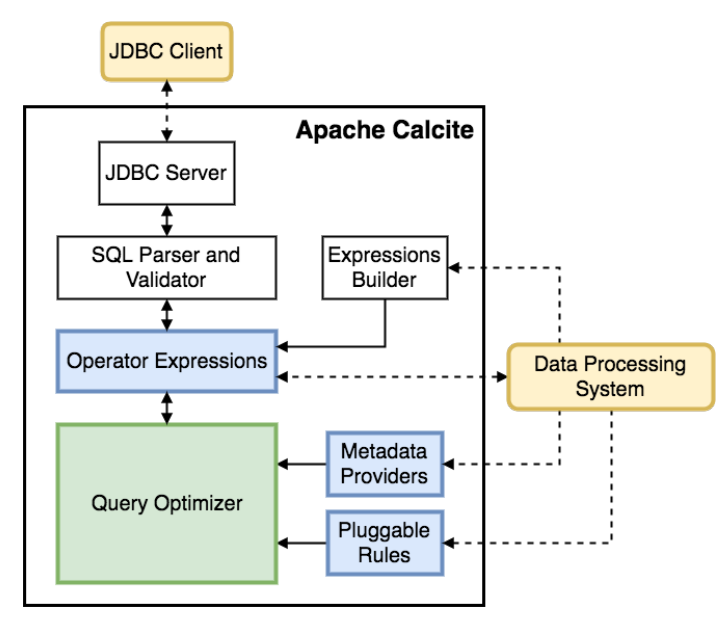
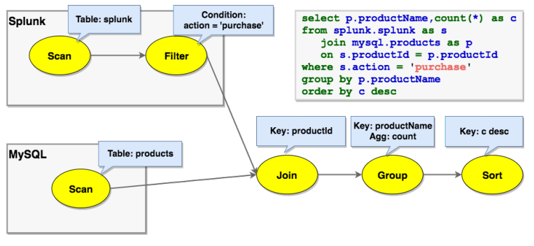
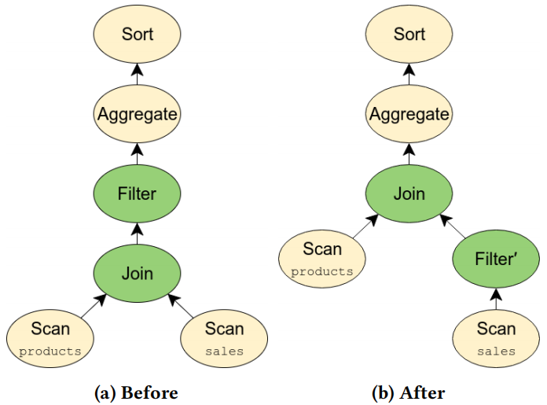

Apache Calcite 是一个基础软件框架，能够为许多流行的开源数据处理系统提供查询处理、查询优化以及查询语言的支持，例如 Apache Hive、Apache Storm、Apache Flink、Druid 以及 MapD 等等。Calcite 架构包含查询优化器、查询处理器以及适配器：模块化以及可扩展的查询优化器内置了上百种优化规则；查询处理器可以支持各种查询语言；为扩展性设计的适配器可以支持各种异构数据模型或存储(关系型、半结构化、流式以及地理空间数据等)。这种灵活、可嵌入且可扩展的架构设计使得 Apache Calcite 在大数据处理框架上成为一个很好的选择。Apache Calcite 目前是一个比较活跃的项目，将会持续引入对新类型数据源、查询语言以及查询处理和优化方法的支持。

本篇论文主要章节安排如下：
- 第 1 节介绍 Calcite 的开发背景
- 第 2 节讨论 Calcite 相关工作
- 第 3 节介绍 Calcite 的架构及其主要组件
- 第 4 节描述 Calcite 核心的关系代数
- 第 5 节介绍 Calcite 的适配器，这是一种定义如何读取外部数据源的抽象
- 第 6 节描述 Calcite 的优化器及其主要特性
- 第 7 节介绍 Calcite 处理不同查询处理范式的扩展
- 第 8 节概述了已经使用 Calcite 的数据处理系统
- 第 9 节讨论了框架未来的扩展

## 1. 介绍

在开创性的 System R 之后，传统的关系数据库引擎主导了数据处理领域。然而，早在 2005 年，Stonebraker 和 Çetintemel 就预测我们会看到一系列有特性的引擎的出现，例如列式存储，流处理引擎，文本搜索引擎等等。他们认为这些专用的引擎可以提供更具成本效益的性能，并且终结 `One size fits all` 的模式。现在已经有许多专门的开源数据系统越来越流行，如 Storm 和 Flink（流处理），Elasticsearch（文本搜索），Apache Spark，Druid 等。随着投资于针对其特定需求量身定制的数据处理系统，出现了两个主要问题：
- 这些专用系统的开发人员会遇到查询优化的问题、需要像 SQL 以及相关扩展(例如流查询、LINQ 的语言集成查询)查询语言的支持。如果没有统一的框架，每个开发工程师都独立开发类似的优化逻辑和支持语言会大大浪费人力。
- 使用这些专用系统的程序员通常必须将其中的几个集成在一起使用。可能依赖 Elasticsearch，Apache Spark 或者 Druid。我们需要构建能够支持跨异构数据源的优化查询的系统。

Apache Calcite 是为解决这些问题而开发的。它是一个完整的查询处理系统，提供了许多常见功能：查询执行，查询优化以及查询语言，这是任何数据库管理系统都需要的功能，但是不提供数据存储和管理功能，留给专用引擎来实现。Calcite 很快被 Hive、Drill、Storm 以及许多其他数据处理引擎采用了，为它们提供了高级查询优化和查询语言。例如，Hive 是一个建立在 Apache Hadoop 之上的流行数据仓库项目。随着 Hive 从批处理转向交互式 SQL 查询平台，很明显这个项目核心需要一个强大的优化器。因此，Hive 采用 Calcite 作为它的优化器，并且它们之间的集成越来越紧密。许多其他项目和产品也纷纷效仿，包括 Flink，MapD 等。

此外，Calcite 通过向多个系统暴露一个通用接口来实现跨平台优化。为了保证效率，优化器需要全局推理，例如，在物化视图跨不同系统中做出决策。建立一个通用框架并非没有挑战。特别是，框架需要有足够的可扩展性和灵活性来适应不同类型的集成系统。我们相信如下特性有助于 Calcite 在开源社区和行业中的广泛采用：
- 开源友好
  - 过去十年中，许多主要的数据处理平台要么是开源的，要么很大程度上是基于开源的。Calcite 是一个 Apache 软件基金会(ASF)孵化的开源框架，提供了协作开发项目的手段。此外，该软件由 Java 编写，更易与许多最新的数据处理系统（它们也大都由 Java 编写）进行集成，尤其是那些在 Hadoop 生态系统里的。
- 多种数据模型
  - Calcite 提供对查询优化和查询语言的支持，同时使用流和常规数据处理范例。Calcite 将流视为有时间顺序的记录或事件集合，这些记录或事件不像传统数据处理系统那样持久保存到磁盘。
- 灵活的查询优化器
  - 从规则到成本模型，优化器的每个组件都是可插拔和可扩展的。此外，Calcite 还支持多个计划引擎。因此，优化可以分解为由不同优化引擎处理的阶段，这取决于哪一个最适合该阶段。
- 跨系统支持
  - Calcite 框架可以跨多个查询处理系统和数据库后端来运行和优化查询。
- 可靠性
  - Calcite 是可靠的，因为它多年来的广泛使用导致了该平台的详尽测试。Calcite 还包含了一个涵盖很广的测试套件，用于验证系统的所有组件，包括查询优化器规则以及与后端数据源的集成。
- 支持 SQL 以及扩展
  - 许多系统都不提供自己的查询语言，而是更喜欢依赖现有的查询语言，例如 SQL。Calcite 提供对 ANSI 标准 SQL 的支持，以及各种 SQL 方言和扩展，例如，用于表达对流或嵌套数据的查询。此外，Calcite 还包含符合标准 Java API（JDBC）的驱动程序。

## 2. 相关工作

虽然 Calcite 目前是 Hadoop 生态系统中应用最广泛的大数据分析优化器，但其背后的许多思想并不新颖。例如，查询优化器基于来自 Volcano 和 Cascade 框架的思想构建，并结合其他广泛使用的优化技术，例如物化视图重写。还有其他系统试图填补与 Calcite 类似的角色。

Orca 是用于 Greenplum 和 HAWQ 等数据管理产品的模块化查询优化器。Orca 实现了一个框架，用于在两种已知的 Data eXchange Language 之间交换信息，从而将优化器与查询执行引擎解耦。Orca 还提供了用于验证生成的查询计划的正确性和性能的工具。与 Orca 不同的是，Calcite 还可以作为一个独立的查询执行引擎，可以与多个存储和处理后端，包括可插拔的规划器和优化器配合使用。

Spark SQL 扩展了 Apache Spark 以支持 SQL 查询执行，这也可以像在 Calcite 中一样对多个数据源执行查询。但是 Spark SQL 中的 Catalyst 优化器虽然也试图最小化查询执行成本，但缺少 Calcite 中使用的动态编程方法，并且容易陷入局部最小值的风险。

Algebricks 是一种查询编译器体系结构，为大数据查询处理提供数据模型无关的代数层和编译器框架。高级语言被编译为 Algebricks 逻辑代数。然后 Algebricks 生成针对 Hyracks 并行处理后端的优化作业。虽然 Calcite 与 Algebricks 共享模块化方法，但 Calcite 还支持基于成本的优化。在当前版本的 Calcite 中，查询优化器架构使用基于 Volcano 的基于动态编程的规划，以及 Orca 中的多阶段优化扩展。虽然原则上 Algebricks 可以支持多个处理后端（例如，Apache Tez，Spark），但是 Calcite 多年来为各种后端提供了经过充分测试的支持。

Garlic 是一个异构数据管理系统，它表示统一对象模型下来自多个系统的数据。但是，Garlic 不支持跨不同系统的查询优化，并依赖于每个系统来优化自己的查询。

FORWARD 是一个联合查询处理器，它实现了 SQL 的超集，称为 SQL++。SQL++ 有一个半结构化数据模型，它集成了 JSON 和关系数据模型，而 Calcite 通过在查询规划期间在关系数据模型中表示它们来支持半结构化数据模型。FORWARD 将用 SQL++ 编写的联合查询分解为子查询，并根据查询计划在底层数据库上执行它们。数据的合并发生在 FORWARD 引擎内部。

另一个联合数据存储和处理系统是 BigDAWG，它抽象了广泛的数据模型，包括关系，时间序列和流。BigDAWG 中的抽象单元称为信息孤岛。每个信息孤岛都有查询语言，数据模型并连接到一个或多个存储系统。在单个信息孤岛的范围内支持跨存储系统查询。Calcite 提供了统一的关系抽象，允许使用不同的数据模型查询后端。

Myria 是用于大数据分析的通用引擎，具有对 Python 语言的高级支持。它为其他后端引擎（如Spark和PostgreSQL）生成查询计划。

## 3. 架构

Apache Calcite 包含了许多传统数据库管理系统所具备的组件，但同时也放弃了一些其它的关键组件，例如数据存储、处理数据的算法以及用于存储元数据的存储库。Calcite 是有意放弃这些组件的，这样能让 Calcite 成为连接多数据存储以及多数据处理引擎的一种更好的选择，同时也为构建定制化的数据处理系统提供坚实的基础。



上图展示了 Apache Calcite 架构的主要组成组件。Calcite 采用关系操作树作为其内部表示。优化引擎主要包括三个组件：规则，元数据提供程序以及计划引擎，我们将在第 6 节详细讨论这些组件。图中虚线表示与外部框架的交互，Caclcite 提供了多种方式与外部框架交互。

首先，Calcite 包含一个查询解析器和验证器，可以将 SQL 查询转换为关系操作树。由于 Calcite 不包含存储层，它提供了一种可以通过适配器在外部存储引擎中定义模式 Schema 和视图的机制(第 5 节会详细介绍)，因此 Calcite 可以在这些引擎之上使用。其次，尽管 Calcite 为需要这种数据库语言支持的系统提供了优化的 SQL 支持，但它也为已经拥有自己的语言解析和解释的系统提供了优化支持：
- 有些系统支持 SQL 查询，但是没有或者只是有限的 SQL 查询优化。例如，Hive 和 Spark 最初均提供了对 SQL 查询的支持，但是它们并没有优化器。对于这种情况，一旦查询被优化后，Calcite 就可以将关系表达式转回 SQL。这种特性使得 Calcite 能够作为独立的系统在那些有 SQL 接口，但无优化器的数据管理系统之上运行。
- Calcite 架构不仅仅面向 SQL 查询优化。数据处理系统通常会为他们自己的查询语言选择他们自己的解析器。对于这种情况，Calcite 也能起作用。实际上，Calcite 还允许通过直接实例化关系操作来轻松地构造操作树。可以使用内置的关系表达式 Builder 接口来实现。例如，假设我们想使用表达式构建器表达如下 Apache Pig 脚本：
```sql
emp = LOAD 'employee_data' AS (deptno, sal);
emp_by_dept = GROUP emp by (deptno);
emp_agg = FOREACH emp_by_dept GENERATE GROUP as deptno, COUNT(emp.sal) AS c, SUM(emp.sal) as s;
dump emp_agg;
```
使用 Calcite 构建器来表示，具体如下：
```java
final RelNode node = builder.scan("employee_data")
    .aggregate(builder.groupKey("deptno"),
               builder.count(false, "c"),
               builder.sum(false, "s", builder.field("sal")))
    .build();
```
该接口展示了构建关系表达式所需的主要部分。优化阶段完成后，应用程序可以检索优化的关系表达式，然后可以将其映射回系统的查询处理单元。

## 4. 查询关系代数

操作符 Operators。关系代数是 Calcite 的核心。除了表达最常见的数据操作的操作符(例如 filter、project、join 等)之外。Calcite 还包括满足不同目的的其他操作符，例如，为了能够简洁地表示复杂的操作，或更有效地识别优化时机。例如，OLAP，决策制定和流应用程序通常使用窗口定义来表示复杂的分析函数，例如一段时间或一行或多行的数量的移动平均值。因此，Calcite 引入了一个窗口运算符，封装了窗口定义，即上限和下限，分区等，以及在每个窗口上执行的聚合函数。

特征 Traits。Calcite 没有使用不同的实体来分别表示逻辑和物理运算符。相反，会使用特征来描述与操作符相关的物理属性。这些特征有助于优化器评估不同备选方案的成本。改变属性值不会改变被评估的逻辑表达式，即，由给定运算符生成的行仍然会相同。  

在优化过程中，Calcite 会试图强制执行关系表达式上的某些特征，例如，指定列的排序顺序。关系操作符可以实现一个转换 converter 接口来指定如何转换表达式的特征。Calcite 包含了用来描述由关系表达式产生数据的物理特性的公共特征，例如排序、分组和分区。与 SCOPE 优化器类似，Calcite 优化器也可以推断这些属性，并利用它们避免不必要操作的计划。例如，如果排序操作符的输入已经正确排序(可能是因为这与后端系统中用于行的顺序相同)，则可以删除排序操作。

除了这些性质外，Calcite 的一个主要特点是即调用约定（calling convention）。本质上，特质表示表达式执行的数据处理系统。将调用约定当作特质，可以使 Calcite 能够保持透明的优化查询，对于跨引擎执行而言，该约定被看作是其他物理属性。



例如，考虑将存储在 MySQL 的 Products 表与存储在 Splunk 中的 Orders 表，如上图所示。首先，Orders 表的扫描发生在 Splunk 中，而 Products 表的扫描发生在位 jdbc-MySQL 中。这些表必须在各自的引擎中进行扫描。连接 JOIN 在逻辑约定中，这意味着关联操作在逻辑上没有选择具体的执行引擎。此外，上图中的 SQL 查询包含一个 filter(where子句)，通过适配器特定的规则(参见第5节)被下推到 Splunk。一种可能的实现是使用 Apache Spark 作为外部引擎：将关联 JOIN 操作转换到在 Spark 中实现，同时也将 MySQL 和 Splunk 的输入也转换至 Spark 中实现。还有一种更有效的实现：Splunk 可以通过 ODBC 实现对 MySQL 的查找，如此就可以实现整个操作在 Splunk 引擎中执行。

## 5. 适配器

Calcite 中的适配器是一种架构模式，定义了 Calcite 如何合并各种数据源以进行一般访问。下图描述了它的主要组件。本质上，适配器由模型 Model、模式 Schema 以及模式工厂组成。模型 Model 是被访问数据源的物理属性规范。模式 Schema 是模型中数据的定义，包括数据格式和布局。数据本身则是通过物理表进行访问的。Calcite 在适配器中定义的表接口用来读取数据并作为查询来执行。适配器会定义一组规则添加到计划器中。例如，通常会包括将各种类型的逻辑关系表达式转换为适配器约定的相应关系表达式的规则。模式工厂组件从模型 Model 中获取元数据信息并生成模式 Schema。

如第 4 节讨论的那样，Calcite 使用一种称为调用约定的物理特征来标识关系操作符并与指定的数据库后端对应。这些物理操作符为每个适配器中底层表提供了访问路径。在解析查询并将其转换为关系代数表达式时，将为每个表创建一个操作符来表示对该表上数据进行扫描。它是适配器必须实现的最小接口。如果适配器实现了表扫描操作符，那么 Calcite 优化器就能够使用客户端操作符(sorting、filtering、joins)对这些表执行任意 SQL 查询。

这个表扫描操作符包含了适配器向后端数据库发出扫描所需的必要信息。为了扩展适配器的功能，Calcite 定义了一个可枚举调用约定。具有可枚举调用约定的关系操作符通过迭代器接口简单地操作元组。这种调用约定允许 Calcite 在适配器中实现后端可能不可用的操作符，即定制自己的操作符。例如，枚举关联（EnumverableJoin）操作符通过收集其子节点的行数据，然后在指定的属性上进行关联。

如果查询只涉及表中一小部分数据，Calcite 枚举所有元组的效率就会很低。对此种情况，可以使用基于规则的优化器来实现对指定的适配器进行优化的规则。例如，假设查询只涉及对表进行过滤和排序。在后端执行过滤的适配器可以实现与 `LogicalFilter` 匹配的规则，并将其转换为适配器的调用约定。该规则将 LogicalFilter 转换为另一个 Filter 实例。这个新的 Filter 节点具有较低的关联成本，允许 Calcite 跨适配器优化查询。

适配器的使用是一种强大的抽象，它不仅可以优化特定后端查询，还可以跨多个后端查询。通过将所有可能的逻辑下推到每个后端，然后对结果数据执行 JOIN 和聚合，Calcite 能够回答涉及多个后端表的查询。实现适配器可以像提供表扫描操作符一样简单，也可以涉及许多高级优化的设计。关系代数中表示的任何表达式都可以通过优化器规则下推到适配器。

## 6. 查询过程和优化

查询优化器是 Calcite 框架的主要组件。Calcite 通过对关系表达式持续应用计划器规则来优化查询。这一过程由成本模型来进行指导，计划器引擎会尝试生成一个替代表达式，该表达式与原始表达式具有相同的语义，但成本更低。优化器中的每个组件都是可扩展的。用户可以添加关系运算符、规则、成本模型以及统计信息。

### 6.1 计划器规则

Calcite 包含一些列可以转换表达式树的计划器规则。特别是，计划器规则会与表达式树中的一个模式相匹配，并执行保留原表达式语义的转换。Calcite 中内置了几百个优化规则。然而，对于依赖 Calcite 进行优化的数据处理系统来说，也可以定制自己的规则进行重写。

例如，Calcite 为 Apache Cassandra 提供了一个适配器，Cassandra 是一个宽列式存储，其按表中列的子集对数据进行分区，然后在每个分区中根据其余列的子集进行排序。正如第5节所讨论的，为了提高效率，适配器将尽可能多的将查询处理下推到每个后端。一个将 Sort 下推到 Cassandra 的规则必须满足两个条件：
- 该表已经被过滤到单个分区（因为在单分区内才能支持排序）
- Cassandra 中分区排序必须具备公共的前缀

这就要求需要重写 CassandraFilter 来覆盖 LogicalFilter 以保证分区过滤被下推至 Cassandra 数据库中。将规则从 LogcialSort 转换至 CassandraSort 比较简单，但是在复杂场景下，保证下推操作符规则的灵活性很难。考虑如下有复杂影响规则的查询语句：
```sql
SELECT products.name, COUNT(*)
FROM sales JOIN products USING (productId)
WHERE sales.discount IS NOT NULL
GROUP BY products.name
ORDER BY COUNT(*) DESC;
```
上面查询对应的关系代数表达式如下图中的左图所示，因为 WHERE 子句只应用在 sales 表中，我们可以将过滤 Filter 下推到 JOIN 之前，如此就变成下图中右图所示的关系代数表达式。这种优化可以显著减少查询的执行时间，因为我们不必对满足谓词匹配的行执行关联操作。此外，如果 sales 表和 pruducts 表保存在各自的后端中，将 Filter 下推到 Join 之前可以使适配器将 Filter 下推至具体的后端中。Calcite 通过 FilterIntoJoinRule 规则实现了这样的优化，该规则检测 Filter 节点的父节点是否为 JOIN，如果是则执行前文说到的优化。这种的优化方式使得 Calcite 的优化方法非常灵活。


### 6.2 元数据 Provider

元数据是 Calcite 优化器的重要组成部分，它有两个主要目的：
- 指导计划器实现降低查询计划成本的目标
- 为优化器应用的规则提供信息

元数据 Provider 负责向优化器提供相应的信息。特别是，Calcite 中元数据 Provider 的默认实现包含了可以返回操作树中执行子表达式的总成本、表达式结果的行数和数据大小以及可以执行的最大并行度的函数。反过来，它也可以提供有关生成计划结构的信息，例如在某个树节点下面存在的过滤条件。

Calcite 为数据处理系统提供了将元数据信息注入框架的接口。数据处理系统可以选择重写 Provider 来覆盖现有的函数，或者可以在优化阶段提供自己的新元数据函数。然而，对于大所述系统而来，只提供输入数据的统计信息就足够了，例如，表的行数和大小，给定列的值是否唯一等，Calcite 的默认实现来完成其他的工作。

由于元数据 Provider 是可插拔的，所以其编译和实例化是使用 Janino 来完成，Janino 是 Java 的一个轻量级编译器。它们的实现包括对元数据结果的缓存，这会产生显著的性能提升，例如当我们计算多种类型的元数据时，例如指定 JOIN 的基数、平均行大小和可选择性时，所有这些计算都依赖于它们输入的基数。

### 6.3 计划器引擎

计划器引擎的主要目标是不断触发提供给引擎的规则，直到达到给定的目标。目前，Calcite 提供了两种不同的引擎。新引擎在 Calcite 框架中时可插拔的。

第一个是基于成本的计划器引擎，触发输入规则来降低整体表达式的成本。该引擎使用一种类似于 Volcano 的动态规划算法来创建和跟踪不同的可选计划，这些计划由规则触发而生成。最初，每个表达式与表达式属性的摘要和输入一起注册到计划器。当在表达式 e1 上触发规则并生成新表达式 e2 时，计划器会把 e2 添加到 e1 所属的等价表达式集合 Sa 中。此外，计划器会为新表达式生成一个摘要，并将其与之前在计划器中注册的摘要进行比较。如果发现与一个 e3 的表达式摘要相似，而这个表达式 e3 属于 Sb 集合，那么计划引擎会合并 Sa 和 Sb 两个集合。该过程一直持续到计划器达到配置的固定点。特别是，它可以(i)彻底地探索搜索空间，直到所有规则都应用于所有表达式，或者(ii)者采用启发式的方法来停止优化，当再进行计划迭代时，所花的成本不超过指定阈值。允许优化器决定选择哪个计划的成本函数是通过元数据 Provider 提供的。默认的代价函数实现结合了对给定表达式使用的CPU，IO和内存资源的估计。

第二种计划引擎是一个穷举计划引擎，该计划引擎穷举计划规则直至生成一个不再发生变化的表达式。这种计划引擎有助于快速执行规则，不需要考虑每个表达式的执行成本。

用户可以根据他们的具体需求选择哪种计划器引擎，当他们的系统需求发生变化时，从一个切换到另一个也非常简单。或者，用户可以选择生成多阶段优化逻辑，其中不同的规则集在优化过程的连续阶段中应用。重要的是，这两个计划器通过搜索不同的查询计划来帮助 Calcite 用户来减少总体优化时间。

### 6.4 物化视图

数据仓库中加速查询处理的最强大技术之一就是相关摘要或物化视图的预计算。很多 Calcite 适配器以及依赖于 Calcite 的项目都有自己的物化视图概念。例如，Cassandra 允许用户基于已有表自定义物化视图，且物化视图由系统自动来维护。这些引擎将其物化视图暴露给 Calcite。然后，优化器就有机会使用这些视图来重写传入的查询，而不是直接查询原始表。特别是，Calcite 提供了两种不同的基于物化视图的重写算法的实现。

第一种方法是基于视图替换。该算法的目标是使用充分利用物化视图的表达式来替代关系代数树中的等价部分。算法的过程如下：
- 将物化视图之上的 Scan 操作符和物化视图定义计注册到计划器中
- 转换在计划中尝试统一表达式触发的规则。视图不需要完全匹配被替换查询中的表达式，因为 Calcite 中的重写算法实现部分重写，其中包括额外的操作符来计算所需的表达式，例如，带有残余谓词条件的过滤器

第二种方法是基于 Lattices。一旦数据源被声明为一个 Lattice，Calcite 会将每一个物化表示为一个 tile，优化器能够利用 tile 来优化查询。一方面，在星型模式组织的数据源上，该重写算法匹配表达式非常有效，星型模式组织的数据源在 OLAP 中则很常见。另一方面，因其对底层架构有限制，导致其比视图替换的限制性更高。

## 7. 扩展 Calcite

正如我们在前面几节中提到的，Calcite 不仅针对 SQL 处理进行了定制。实际上，Calcite 为 SQL 对其他数据抽象(如半结构化、流和地理空间数据)上的查询提供了扩展。Calcite 内置了操作符来适配这些查询。除了可扩展的 SQL 外，Calcite 还包括语言集成的查询语言。我们将在下文描述这些扩展并提供相应的示例。

### 7.1 半结构化数据

Calcite 支持几种复杂的列数据类型，可以将关系数据和半结构化数据混合存储在表中。具体来说，列类型包括 ARRAY, MAP, 或者 MULTISET。此外，这些复杂类型还可以嵌套，因此，例如，有一个 Map，其中值为 ARRAY 数据类型。可以使用 `[]` 操作符来提取 ARRAY 和 MAP 以及其内嵌套的数据。存储在这些复杂类型中的值的具体类型不需要预先定义。

例如，Calcite 提供了 MongoDB 的适配器，MongoDB 是一个文件存储引擎，其数据文件格式类似于 JSON 文件。为了能让 Calcite 查询到 MongoDB 的数据，我们为每个文档集合创建一个表，且该表只有一列，列名为 `_MAP`：文档标识符到数据的映射。在许多情况下，都期望文档具有公共结构。表示邮政编码的文档集合可能每个都包含城市名称、纬度和经度的列。将这些数据展示为关系表是很有用的。在 Calcite 中，这是通过在提取所需值并将其转换为适当类型后创建视图来实现的。
```sql
SELECT CAST(_MAP['city'] AS varchar(20)) AS city,
    CAST(_MAP['loc'][0] AS float) AS longitude,
  CAST(_MAP['loc'][1] AS float) AS latitude
FROM mongo_raw.zips;
```
这种方式在半结构化数据上创建视图，可以让我们很容易无缝操作半结构化数据与结构化数据。

### 7.2 流

Calcite 为流查询提供了一流的支持，通过一组特定于流的标准 SQL 扩展，包括 STREAM 扩展以及窗口扩展，在 JOIN 或者其他操作中通过窗口表达式来隐式引入。这些扩展受到连续查询语言（Continuous Query Language）的启发，并试图跟标准 SQL 有效集成起来。STREAM 明确告诉诉用户对新增的记录感兴趣而不是已有的。
```sql
SELECT STREAM rowtime, productId, units
FROM orders
WHERE units > 25;
```
如没有指定关键字 STREAM ，对流的查询就会变成常规的 SQL 查询，表示系统应该处理从流中已接收到的数据，而不是新接收的数据。由于流固有的无界特性，窗口被用来解除阻塞操作符，如聚合和 JOIN。Calcite 的流扩展使用 SQL 分析函数来表达滑动和级联窗口聚合，如下例所示：
```sql
SELECT
  STREAM rowtime, productId, units,
  SUM(units) OVER (ORDER BY rowtime
    PARTITION BY productId
    RANGE INTERVAL '1' HOUR PRECEDING) unitsLastHour
FROM Orders;
```
滚动（Tumbling），跳跃（hopping）和会话窗口（session）函数可以使用 `TUMBLE`, `HOPPING`, `SESSION`函数以及一些工具函数（ `TUMBLE_END` 和 `HOP_END` ）来支持，这几个关键可以在 GROUP BY 或 SELECT 中来使用。
```sql
SELECT
  STREAM TUMBLE_END(rowtime, INTERVAL '1' HOUR) AS rowtime,
  productId,
  COUNT(*) AS c,
  SUM(units) AS units
FROM orders
GROUP BY TUMBLE(rowtime, INTERVAL '1' HOUR), productId;
```
涉及窗口聚合的流查询需要在 GROUP BY 子句或 ORDER BY 子句中写单调或准单调表达式。可以在关联 JOIN 子句中使用隐式（时间）窗口表达式来支持复杂的流与流之间的关联查询。
```sql
SELECT STREAM o.rowtime, o.productId, o.orderId, s.rowtime, AS shipTime
FROM orders AS o
JOIN shipments AS s
ON o.orderId = s.orderId AND s.rowtime BETWEEN o.rowtime AND o.rowtime + INTERVAL '1' HOUR
```
在隐式窗口的情况下，Calcite 的查询计划器会验证表达式是否是单调的。

### 7.3 地理空间数据

利用 Calcite 关系代数，Calcite 初步提供地理空间数据查询的能力支持。在核心实现中，Calcite 添加了 GEOMETRY 关键字，该关键字实现了对不同地理空间对象的封装，包括点（points）、曲线（curves）以及多边型（polygons）。后续 Calcite 将会完全符合 OpenGIS Simple Feature Access 规范，该规范定义地理空间数据的 SQL 接口标准。下面示例是查询阿姆斯特丹市的国家：
```sql
SELECT name
FROM (
    SELECT name,
      ST_GeomFromText('POLYGON((4.82 52.43, 4.97 52.43, 4.97 52.33, 4.82 52.33, 4.82 52.43))') AS "Amsterdam",
      ST_GeomFromText(boundary) AS "Country"
    FROM country
)
WHERE ST_Contains("Country", "Amsterdam");
```

### 7.4 集成 Java 语言查询

除了关系数据库之外，Calcite 还可以支持查询多种数据源。但是它的目标不仅仅是支持 SQL 语言。虽然 SQL 仍然是主要的数据库语言，但许多程序员倾向于语言集成语言，如 LINQ。与嵌入在 Java 或 C++ 代码中的 SQL 不同，语言集成查询语言允许程序员只使用一种语言编写所有代码。Calcite 为 Java 提供了语言集成查询 (或简称为 LINQ4J)，它严格遵循 Microsoft 的 LINKQ 为.NET 语言制定的约定。

## 8. 业界及学术界使用

Calcite 被广泛采用，特别是在业界的开源项目中。由于 Calcite 提供了一定的集成灵活性，这些项目要么选择：
- 将 Calcite 嵌入到它们的核心代码中，即将其用作类库
- 实现一个 Calcite 适配器进行联合查询处理。

此外，我们看到学术界越来越多的使用 Calcite 作为数据管理项目开发的基石。在下面，我们会描述不同的系统是如何使用 Calcite。

### 8.1 嵌入式 Calcite

表 1 展示了使用 Calcite 作为核心类库的软件列表，包括：
- 向用户提供的查询语言接口；
- 是否使用 Calcite 的 JDBC 驱动；
- 是否使用 Calcite 中的 SQL 解析器和校验器；
- 是否使用 Calcite 的查询关系代数表示对数据的操作；
- 依赖 Calcite 执行的引擎，例如集成 Calcite 的本地引擎，Calcite 操作符，或任何其他项目。



Drill 是一个基于 Dremel 的系统，灵活的数据处理引擎。其内部采用无模式 Schema 的 JSON 文档数据模型。类似于 SQL++，Drill 有自己的 SQL 方言，包含了对半结构化数据查询的扩展。

Hive 最初是因为作为 MapReduce 编程模型之上的 SQL 接口而流行起来。后来 Hive 朝着交互式的 SQL 查询引擎方向演进，并采用 Calcite 作为其规则及成本优化器。Hive 没有使用 Calcite 的 JDBC 驱动程序、SQL 解析器和验证器，而是使用自己的实现。Hive 将查询转换为 Calcite 操作符，优化后转换为 Hive 的物理代数。Hive 操作符可以被多个引擎执行，最流行的是 Apache Tez 和 ApacheSpark。

Apache Solr 是建立在 Apache Lucene 库之上的一个流行的全文分布式搜索平台。Solr 向用户公开了多个查询接口，包括类 REST 的 HTTP/XML 以及 JSON 接口。此外，Solr与 Calcite 集成来提供 SQL 能力。

Apache Phoenix 和 Apache Kylink 均是在 Apache HBase 上构建的，Apache HBase 是一款分布式 KV 存储模型，是在 BigTable 基础之上构建。Phoenix 提供了一个 SQL 接口和编排层来查询 HBase。相反，Kylin 专注于 OLAP 的 SQL 查询，通过声明物化视图和 HBase 中的数据构建 cubes，因此基于这些 cubes，可以使用 Calcite 优化器重写输入查询。在 Kylin 中，查询计划使用 Calcite 本地操作符和 HBase 组合来执行。

最近，Calcite 在流处理系统方面变理流行起来。诸如，Apache Apex，Flink，Apache Samza 以及 Storm 均集成了 Calcite，使其组件能够向用户提供流式 SQL 接口。最后，其他的商业系统也有采用 Calcite，例如 MapD，Lingual 和 Qubole Quark。

### 8.2 Calcite 适配器

不再是将 Calcite 当作类库来使用，其他的系统集成 Calcite 时，采用实现 Calcite 提供的适配器接口来读取它们的数据源。表 2 展示了 Calcite 中支持的适配器列表。实现这些适配器最关键是要实现 converter 组件，该组件负责将推送给系统的代数表达式转换成该系统支持的查询语言。表 2 还显示了 Calcite 将代数表达式转换成的目标语言。


JDBC 适配器支持多种 SQL 方言的生成，包括比较流行的数据库管理系统 PostgreSQL 以及 MySQL。反过来，Cassandra 则有类 SQL 查询语言 CQL。而 Apache Pig 则在 Pig Latin 中生成自己的查询表达式。Apahce Spark 的适配器采用 Java RDD 接口。最后，Druid，ElasticSearch 以及 Splunk 则是通过 REST HTTP 接口来进行查询，由 Calcite 生成的查询表达式为 JSOM 或 XML 格式的。

### 8.3 研究中使用

在研究场景下，Calcite 可以作为精准医疗和临床分析场景下的一种选择。在这些场景中，需要对异构医疗数据进行逻辑整合和对齐，这样有助于基于患者更全面的病史和基因组谱来评估最佳治疗方案。数据主要存放在科学数据库中，主要涉及患者的电子病历，各类结构化、半结构化报告（肿瘤学、精神病学、实验室测试、放射学等）、成像、信号以及序列数据。在这些情况下，Calcite 的统一查询接口和灵活的适配器架构能够很好地提供支持。正在进行的研究旨在为数组和文本源引入新的适配器以及能够支持高效连接异构数据源。

## 9. 未来工作

将来 Calcite 将专注于新功能的研发以及适配器架构的扩展上：
- 加强 Calcite 作为独立引擎的设计。这需要支持 DDL，物化视图，索引以及约束。
- 持续改进计划器的设计和灵活性。包括模块化，用户可定制计划器。
- 将新的参数化方法纳入优化器的设计。
- 支持扩展的 SQL 命令，函数，工具，完全符合 OpenGIS 规范。
- 为非关系型数据源提供新的适配器。
- 性能分析和检测的改进。

## 10. 结论

在数据使用上，新兴的数据管理实践和相关分析继续朝着多样化和异质的场景发展。同时，通过 SQL 方式获取数据的关系型数据源仍然是企业获取数据的基本方法。在这种分歧的情况，Apache Calcite 扮点着独特的角色，其不仅能够支持传统、常见的数据处理，也支持其他数据源处理，包括半结构化、流式和地理空间数据。另外，Apache Calcite 专注于灵活、可适配和可扩展的设计哲学也成为一个重要的因素，在大量的开源框架中，使其成为被广泛采用的查询优化器。Apache Calcite 动态且灵活的查询优化器和适配器架构使其能够被嵌入到各种数据处理框架中，包括：Hive，Drill，MapD，Flink。Apache Calcite 支持异质数据处理，同时其关系函数在功能和性能，也在不断得到提升。


原文：[Apache Calcite: A Foundational Framework for Optimized Query Processing Over Heterogeneous Data Sources](https://arxiv.org/pdf/1802.10233.pdf)
