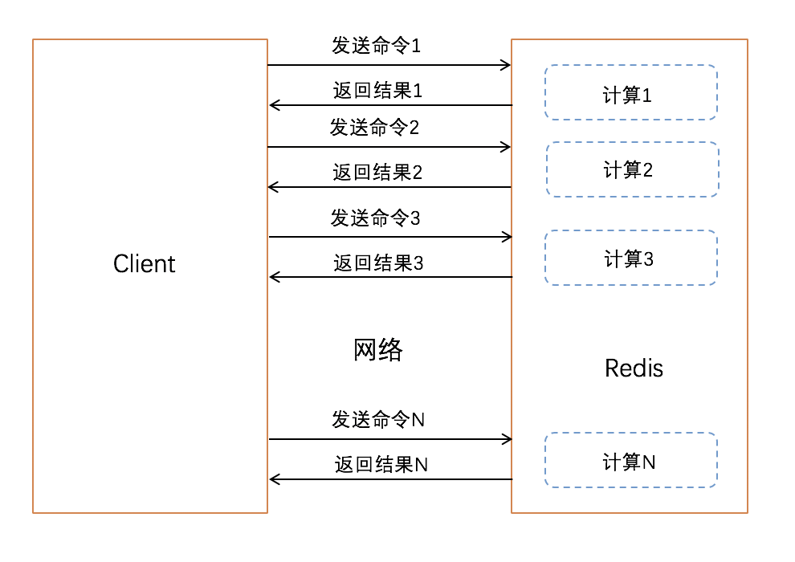
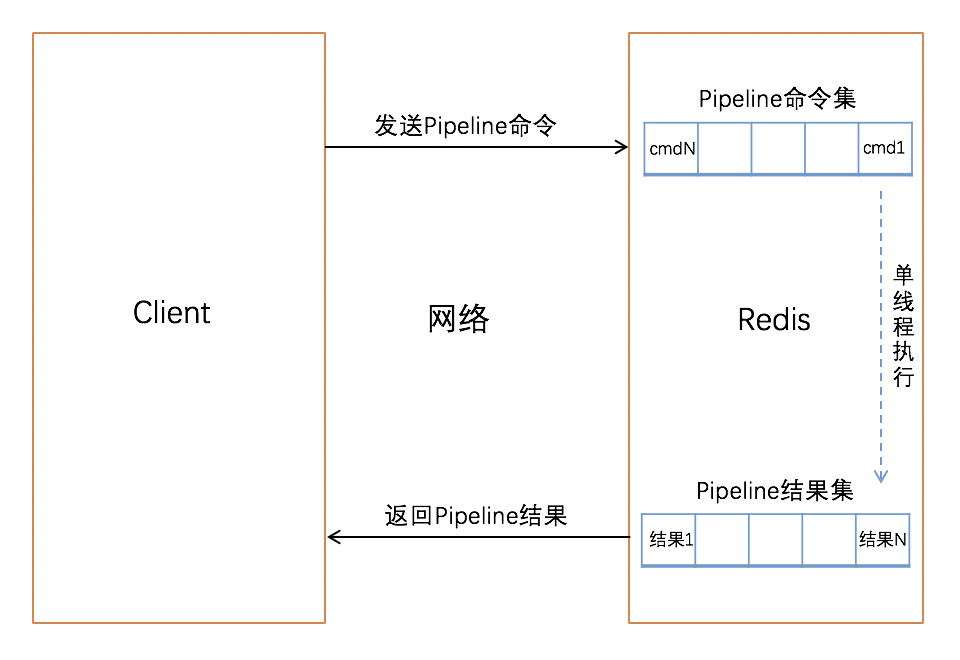

### 1. RTT

Redis 是一种基于客户端-服务端模型以及请求/响应协议的TCP服务。这意味着通常情况下 Redis 客户端执行一条命令分为如下四个过程：
- 发送命令
- 命令排队
- 命令执行
- 返回结果

客户端向服务端发送一个查询请求，并监听Socket返回，通常是以阻塞模式，等待服务端响应。服务端处理命令，并将结果返回给客户端。客户端和服务端通过网络进行连接。这个连接可以很快，也可能很慢。无论网络如何延迟，数据包总是能从客户端到达服务端，服务端返回数据给客户端。

这个时间被称为 RTT (Round Trip Time)，例如上面过程的发送命令和返回结果两个过程。当客户端需要连续执行多次请求时很容易看到这是如何影响性能的（例如，添加多个元素到同一个列表中）。例如，如果 RTT 时间是250毫秒（网络连接很慢的情况下），即使服务端每秒能处理100k的请求量，那我们每秒最多也只能处理4个请求。如果使用的是本地环回接口，RTT 就短得多，但如如果需要连续执行多次写入，这也是一笔很大的开销。

下面我们看一下执行 N 次命令的模型:



### 2. Pipeline

我们可以使用 Pipeline 改善这种情况。Pipeline 并不是一种新的技术或机制，很多技术上都使用过。RTT 在不同网络环境下会不同，例如同机房和同机房会比较快，跨机房跨地区会比较慢。Redis 很早就支持 Pipeline 技术，因此无论你运行的是什么版本，你都可以使用 Pipeline 操作 Redis。

Pipeline 能将一组 Redis 命令进行组装，通过一次 RTT 传输给 Redis，再将这组 Redis 命令按照顺序执行并将结果返回给客户端。上图没有使用 Pipeline 执行了 N 条命令，整个过程需要 N 次 RTT。下图为使用 Pipeline 执行 N 条命令，整个过程仅需要 1 次 RTT：



> Redis 提供了批量操作命令(例如 mget，mset等)，有效的节约了RTT。但大部分命令是不支持批量操作的。

### 3. Java Pipeline

Jedis 也提供了对 Pipeline 特性的支持。我们可以借助 Pipeline 来模拟批量删除，虽然不会像 mget 和 mset 那样是一个原子命令，但是在绝大数情况下可以使用：
```java
public void mdel(List<String> keys){
  Jedis jedis = new Jedis("127.0.0.1");
  // 创建Pipeline对象
  Pipeline pipeline = jedis.pipelined();
  for (String key : keys){
    // 组装命令
    pipeline.del(key);
  }
  // 执行命令
  pipeline.sync();
}
```

### 4. 性能测试

下表给出了不同网络环境下非 Pipeline 和 Pipeline 执行 10000 次 set 操作的效果：

| 网络 | 延迟 |非Pipeline | Pipeline |
| ---- | ---- | ---- | ---- |
| 本机 | 0.17ms | 573ms | 134ms |
| 内网服务器 | 0.41ms | 1610ms | 240ms |
| 异地机房 | 7ms | 78499ms | 1104ms |

> 因测试环境不同可能会得到不同的测试数据，本测试 Pipeline 每次携带 100 条命令。

我们可以从上表中得出如下结论:
- Pipeline 执行速度一般比逐条执行要快。
- 客户端和服务端的网络延时越大，Pipeline 的效果越明显。

### 5. 批量命令与Pipeline对比

下面我们看一下批量命令与 Pipeline 的区别:
- 原生批量命令是原子的，Pipeline 是非原子的。
- 原生批量命令是一个命令对应多个 key，Pipeline 支持多个命令。
- 原生批量命令是 Redis 服务端支持实现的，而 Pipeline 需要服务端和客户端的共同实现。

### 6. 注意点

使用 Pipeline 发送命令时，每次 Pipeline 组装的命令个数不能没有节制，否则一次组装的命令数据量过大，一方面会增加客户端的等待时间，另一方面会造成一定的网络阻塞，可以将一次包含大量命令的 Pipeline 拆分成多个较小的 Pipeline 来完成。


欢迎关注我的公众号和博客：


参考:
-  [Using pipelining to speedup Redis queries](https://redis.io/topics/pipelining#using-pipelining-to-speedup-redis-queries)
- Redis开发与运维
