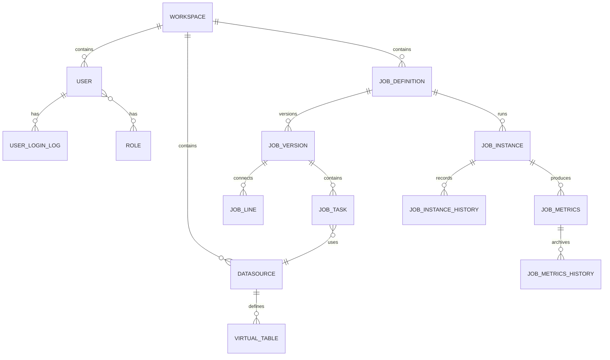

在数据集成领域，一个优秀的元数据模型设计是系统稳定运行的基石。Apache SeaTunnel Web 作为新一代数据集成平台的可视化管理端，其背后的数据模型设计蕴含了哪些精妙之处？本文将带你深入剖析 SeaTunnel Web 的实体概念与数据表设计，揭示其背后的架构思想。

---

## 1. 数据表全景图

SeaTunnel Web 共包含 13 张核心数据表，按业务域划分如下：
- 用户权限域
  - role
  - role_user_relation
  - user
  - user_login_log
- 数据源域
  - t_st_datasource
  - t_st_virtual_table
- 作业域
  - t_st_job_definition
  - t_st_job_version
  - t_st_job_task
  - t_st_job_line
  - t_st_job_instance
  - t_st_job_instance_history
  - t_st_job_metrics


| 表名 | 业务域 | 核心功能 |
|------|--------|----------|
| user | 用户权限 | 用户基本信息 |
| role | 用户权限 | 角色定义 |
| role_user_relation | 用户权限 | 用户-角色关联 |
| user_login_log | 用户权限 | 登录日志与Token管理 |
| t_st_datasource | 数据源 | 数据源连接配置 |
| t_st_virtual_table | 数据源 | 虚拟表定义 |
| t_st_job_definition | 作业 | 作业顶层定义 |
| t_st_job_version | 作业 | 作业版本管理 |
| t_st_job_task | 作业 | 任务节点配置 |
| t_st_job_line | 作业 | DAG连线关系 |
| t_st_job_instance | 作业 | 作业执行实例 |
| t_st_job_metrics | 作业 | 执行性能指标 |
| t_st_job_instance_history | 作业 | 实例历史记录 |

---

## 2. 用户权限域：轻量级 RBAC 模型

### 2.1 核心实体关系

SeaTunnel Web 采用了经典的 RBAC（Role-Based Access Control）模型：

- User(用户)
- RoleUserRelation(用户角色关联)
- Role(角色)

### 2.2 User 实体详解

概念：系统用户信息，支持多种认证方式：
```java
CREATE TABLE `user` (
  `id` int NOT NULL AUTO_INCREMENT,
  `username` varchar(255) CHARACTER SET utf8mb4 COLLATE utf8mb4_general_ci NOT NULL,
  `password` varchar(255) CHARACTER SET utf8mb4 COLLATE utf8mb4_general_ci NOT NULL,
  `status` tinyint NOT NULL,
  `type` tinyint NOT NULL,
  `create_time` datetime(3) NOT NULL DEFAULT CURRENT_TIMESTAMP(3),
  `update_time` datetime(3) NOT NULL DEFAULT CURRENT_TIMESTAMP(3) ON UPDATE CURRENT_TIMESTAMP(3),
  PRIMARY KEY (`id`) USING BTREE
) ENGINE=InnoDB AUTO_INCREMENT=4 DEFAULT CHARSET=utf8mb4 COLLATE=utf8mb4_general_ci ROW_FORMAT=DYNAMIC;
```

**亮点设计**：
- `auth_provider` 字段支持多种认证方式扩展（DB/LDAP/OAuth2 等）
- 默认用户 `admin` 密码采用 MD5 加密存储

### 2.3 Role 实体与预置角色

```sql
INSERT INTO `role`(`type`,`role_name`,`description`) values (0, 'ADMIN_ROLE', 'Admin User');
INSERT INTO `role`(`type`,`role_name`,`description`) values (1, 'NORMAL_ROLE', 'Normal User');
```

系统预置了两种角色：
| 角色 | 类型值 | 权限范围 |
|------|--------|----------|
| ADMIN_ROLE | 0 | 全局管理权限 |
| NORMAL_ROLE | 1 | 普通操作权限 |

### 2.4 UserLoginLog：Token 管理机制

```java
@Data
public class UserLoginLog {
    private Long id;
    private Integer userId;
    private String token;          // JWT Token
    private Boolean tokenStatus;   // Token 有效状态
    private Date createTime;
    private Date updateTime;
    private Long workspaceId;
}
```

**设计意图**：
- 支持 Token 的持久化管理
- 可实现 Token 失效、续期等高级功能
- 为单点登录（SSO）奠定基础

---

## 3. 数据源域：连接万物

### 4.1 Datasource 实体

数据源是 SeaTunnel 与外部系统交互的桥梁：

```java
@Data
@TableName("t_st_datasource")
public class Datasource {
    private Long id;
    private String datasourceName;
    private String pluginName;        // 如 mysql, kafka, elasticsearch
    private String pluginVersion;
    private String datasourceConfig;  // JSON 格式存储连接配置
    private String description;
    private Integer createUserId;
    private Integer updateUserId;
    private Date createTime;
    private Date updateTime;
    private Long workspaceId;
}
```

**核心设计思想**：

```
┌─────────────────────────────────────────────────────────────┐
│                      Datasource                              │
│  ┌─────────────┐  ┌─────────────┐  ┌─────────────┐          │
│  │ plugin_name │  │ plugin_ver  │  │ datasource  │          │
│  │   (类型)    │  │  (版本)     │  │ _config(配置)│          │
│  └─────────────┘  └─────────────┘  └─────────────┘          │
│         │                │                 │                 │
│         ▼                ▼                 ▼                 │
│  ┌─────────────────────────────────────────────────┐        │
│  │              插件化架构设计                       │        │
│  │   MySQL Plugin | Kafka Plugin | ES Plugin ...   │        │
│  └─────────────────────────────────────────────────┘        │
└─────────────────────────────────────────────────────────────┘
```

`datasource_config` 字段以 JSON 格式存储，支持不同类型数据源的差异化配置：

```json
{
  "host": "localhost",
  "port": 3306,
  "database": "test_db",
  "username": "root",
  "password": "******",
  "ssl": false
}
```

### 4.2 VirtualTable：虚拟表抽象

虚拟表为数据源提供了一层逻辑抽象：

```java
@Data
@TableName("t_st_virtual_table")
public class VirtualTable {
    private Long id;
    private Long datasourceId;          // 关联数据源
    private String virtualDatabaseName; // 虚拟数据库
    private String virtualTableName;    // 虚拟表名
    private String tableFields;         // 字段定义
    private String virtualTableConfig;  // 表配置
    private String description;
    // ... 审计字段
}
```

**应用价值**：
- 统一不同数据源的表结构表示
- 支持字段级别的元数据管理
- 为可视化配置作业提供数据基础

---

## 4. 作业域：核心业务模型

作业域是 SeaTunnel Web 最复杂的业务域，采用 **版本化管理** 和 **DAG 结构** 相结合的设计。

### 4.1 作业实体层次结构

```
JobDefinition (作业定义)
      │
      ├── JobVersion (作业版本)
      │        │
      │        ├── JobTask (任务节点)
      │        │
      │        └── JobLine (连线关系)
      │
      └── JobInstance (执行实例)
               │
               ├── JobMetrics (执行指标)
               │
               └── JobInstanceHistory (历史记录)
```

### 4.2 JobDefinition：作业定义

作业定义 JobDefinition 是作业的元信息容器，作业的顶层定义，代表一个数据同步任务：
```sql
-- JobDefinition
CREATE TABLE `t_st_job_definition` (
  `id` bigint NOT NULL,
  `name` varchar(50) CHARACTER SET utf8mb4 COLLATE utf8mb4_bin NOT NULL,
  `description` varchar(255) CHARACTER SET utf8mb4 COLLATE utf8mb4_bin DEFAULT NULL,
  `job_type` varchar(50) CHARACTER SET utf8mb4 COLLATE utf8mb4_bin DEFAULT NULL,
  `create_user_id` int NOT NULL,
  `update_user_id` int NOT NULL,
  `create_time` timestamp(3) NOT NULL DEFAULT CURRENT_TIMESTAMP(3),
  `update_time` timestamp(3) NOT NULL DEFAULT CURRENT_TIMESTAMP(3) ON UPDATE CURRENT_TIMESTAMP(3),
  PRIMARY KEY (`id`) USING BTREE,
  UNIQUE KEY `name` (`name`) USING BTREE
) ENGINE=InnoDB DEFAULT CHARSET=utf8mb4 COLLATE=utf8mb4_bin ROW_FORMAT=DYNAMIC
```

### 4.3 JobVersion：版本化管理

作业的版本管理，每次编辑保存生成新版本。当前实现中，一个 JobDefinition 只对应一个 JobVersion，ID 相同，采用"覆盖更新"模式：
```sql
-- JobVersion
CREATE TABLE `t_st_job_version` (
  `id` bigint NOT NULL,
  `job_id` bigint NOT NULL,
  `name` varchar(255) CHARACTER SET utf8mb4 COLLATE utf8mb4_bin NOT NULL,
  `job_mode` varchar(10) CHARACTER SET utf8mb4 COLLATE utf8mb4_bin NOT NULL,
  `env` text CHARACTER SET utf8mb4 COLLATE utf8mb4_bin,
  `engine_name` varchar(50) CHARACTER SET utf8mb4 COLLATE utf8mb4_bin NOT NULL,
  `engine_version` varchar(50) CHARACTER SET utf8mb4 COLLATE utf8mb4_bin NOT NULL,
  `create_user_id` int NOT NULL,
  `update_user_id` int NOT NULL,
  `create_time` timestamp(3) NOT NULL DEFAULT CURRENT_TIMESTAMP(3),
  `update_time` timestamp(3) NOT NULL DEFAULT CURRENT_TIMESTAMP(3) ON UPDATE CURRENT_TIMESTAMP(3),
  PRIMARY KEY (`id`) USING BTREE
) ENGINE=InnoDB DEFAULT CHARSET=utf8mb4 COLLATE=utf8mb4_bin ROW_FORMAT=DYNAMIC
```

| 字段 | 类型 | 说明 |
|------|------|------|
| id | bigint | 主键 |
| job_id | bigint | 关联作业定义ID |
| name | varchar(255) | 作业版本名称 |
| job_mode | varchar(10) | 作业模式（BATCH/STREAMING） |
| env | text | 环境配置（JSON） |
| engine_name | varchar(50) | 引擎类型 |
| engine_version | varchar(50) | 引擎版本 |

**关键设计**：
- `jobMode` 枚举支持批流一体
- `env` 字段存储 SeaTunnel 环境配置
- 支持多引擎类型切换

### 4.4 JobTask：任务节点

作业的具体任务节点，代表 Source、Transform 或 Sink：
```sql
-- JobTask
CREATE TABLE `t_st_job_task` (
  `id` bigint NOT NULL,
  `version_id` bigint NOT NULL,
  `plugin_id` varchar(50) CHARACTER SET utf8mb4 COLLATE utf8mb4_bin NOT NULL,
  `name` varchar(50) CHARACTER SET utf8mb4 COLLATE utf8mb4_bin NOT NULL,
  `config` text CHARACTER SET utf8mb4 COLLATE utf8mb4_bin,
  `transform_options` varchar(5000) CHARACTER SET utf8mb4 COLLATE utf8mb4_bin DEFAULT NULL,
  `output_schema` text CHARACTER SET utf8mb4 COLLATE utf8mb4_bin,
  `connector_type` varchar(50) CHARACTER SET utf8mb4 COLLATE utf8mb4_bin NOT NULL,
  `datasource_id` bigint DEFAULT NULL,
  `datasource_option` varchar(5000) CHARACTER SET utf8mb4 COLLATE utf8mb4_bin DEFAULT NULL,
  `select_table_fields` varchar(5000) CHARACTER SET utf8mb4 COLLATE utf8mb4_bin DEFAULT NULL,
  `scene_mode` varchar(50) CHARACTER SET utf8mb4 COLLATE utf8mb4_bin DEFAULT NULL,
  `type` varchar(50) CHARACTER SET utf8mb4 COLLATE utf8mb4_bin NOT NULL,
  `create_time` timestamp(3) NOT NULL DEFAULT CURRENT_TIMESTAMP(3),
  `update_time` timestamp(3) NOT NULL DEFAULT CURRENT_TIMESTAMP(3) ON UPDATE CURRENT_TIMESTAMP(3),
  PRIMARY KEY (`id`) USING BTREE,
  KEY `job_task_plugin_id_index` (`plugin_id`) USING BTREE
) ENGINE=InnoDB DEFAULT CHARSET=utf8mb4 COLLATE=utf8mb4_bin ROW_FORMAT=DYNAMIC
```
> 作业的 DAG（有向无环图）结构通过任务节点 JobTask 和连线关系 JobLine 共同表达。

| 字段 | 类型 | 说明 |
|------|------|------|
| id | bigint | 主键 |
| version_id | bigint | 关联作业版本ID |
| plugin_id | varchar(50) | 插件唯一标识 |
| name | varchar(50) | 任务名称 |
| config | text | 任务配置 |
| transform_options | varchar(5000) | 转换规则 |
| output_schema | text | 输出 Schema |
| connector_type | varchar(50) | 连接器类型 |
| datasource_id | bigint | 关联数据源ID |
| datasource_option | varchar(5000) | 数据源信息 |
| select_table_fields | varchar(5000) |  |
| type | varchar(50) | 类型（source/transform/sink） |

### 4.5 JobLine

DAG 中任务节点之间的连线关系：
```sql
CREATE TABLE `t_st_job_line` (
  `id` bigint NOT NULL,
  `version_id` bigint NOT NULL,
  `input_plugin_id` varchar(50) CHARACTER SET utf8mb4 COLLATE utf8mb4_bin NOT NULL,
  `target_plugin_id` varchar(50) CHARACTER SET utf8mb4 COLLATE utf8mb4_bin NOT NULL,
  `create_time` timestamp(3) NOT NULL DEFAULT CURRENT_TIMESTAMP(3),
  `update_time` timestamp(3) NOT NULL DEFAULT CURRENT_TIMESTAMP(3) ON UPDATE CURRENT_TIMESTAMP(3),
  PRIMARY KEY (`id`) USING BTREE,
  KEY `job_line_version_index` (`version_id`) USING BTREE
) ENGINE=InnoDB DEFAULT CHARSET=utf8mb4 COLLATE=utf8mb4_bin ROW_FORMAT=DYNAMIC
```
> 作业的 DAG（有向无环图）结构通过任务节点 JobTask 和连线关系 JobLine 共同表达。

| 字段 | 类型 | 说明 |
|------|------|------|
| id | bigint | 主键 |
| version_id | bigint | 关联作业版本ID |
| input_plugin_id | varchar(50) | 上游节点ID |
| target_plugin_id | varchar(50) | 下游节点ID |

**DAG 示意图**：
```
┌──────────────┐        ┌──────────────┐        ┌──────────────┐
│   JobTask    │        │   JobTask    │        │   JobTask    │
│   (Source)   │───────►│ (Transform)  │───────►│    (Sink)    │
│  pluginId: A │  Line  │  pluginId: B │  Line  │  pluginId: C │
└──────────────┘        └──────────────┘        └──────────────┘

JobLine: input=A, target=B
JobLine: input=B, target=C
```

### 4.6 JobInstance：执行实例

作业的执行实例，记录执行状态和结果，作业的每次运行都会产生一个执行实例：
```sql
CREATE TABLE `t_st_job_instance` (
  `id` bigint NOT NULL,
  `job_define_id` bigint NOT NULL,
  `job_status` varchar(50) CHARACTER SET utf8mb4 COLLATE utf8mb4_bin DEFAULT NULL,
  `job_config` text CHARACTER SET utf8mb4 COLLATE utf8mb4_bin NOT NULL,
  `engine_name` varchar(50) CHARACTER SET utf8mb4 COLLATE utf8mb4_bin NOT NULL,
  `engine_version` varchar(50) CHARACTER SET utf8mb4 COLLATE utf8mb4_bin NOT NULL,
  `job_engine_id` varchar(200) CHARACTER SET utf8mb4 COLLATE utf8mb4_bin DEFAULT NULL,
  `create_user_id` int NOT NULL,
  `update_user_id` int DEFAULT NULL,
  `create_time` timestamp(3) NOT NULL DEFAULT CURRENT_TIMESTAMP(3),
  `update_time` timestamp(3) NOT NULL DEFAULT CURRENT_TIMESTAMP(3) ON UPDATE CURRENT_TIMESTAMP(3),
  `end_time` timestamp(3) NULL DEFAULT NULL,
  `job_type` varchar(50) CHARACTER SET utf8mb4 COLLATE utf8mb4_bin NOT NULL,
  `error_message` varchar(4096) CHARACTER SET utf8mb4 COLLATE utf8mb4_bin DEFAULT NULL,
  PRIMARY KEY (`id`) USING BTREE
) ENGINE=InnoDB DEFAULT CHARSET=utf8mb4 COLLATE=utf8mb4_bin ROW_FORMAT=DYNAMIC
```

| 字段 | 类型 | 说明 |
|------|------|------|
| id | bigint | 主键 |
| job_define_id | bigint | 关联作业定义ID |
| job_status | varchar(50) | 作业状态 |
| job_config | text | 实际执行配置 |
| engine_name | varchar(50) | 执行引擎 |
| job_engine_id | varchar(200) | 引擎返回的作业ID |
| job_type | varchar(50) | 批/流模式 |
| end_time | timestamp | 结束时间 |
| error_message | varchar(4096) | 错误信息 |

**状态流转**：

```
┌─────────┐    ┌──────────┐    ┌─────────────┐    ┌──────────┐    ┌──────────┐
│ CREATED │───►│ RUNNING  │───►│ SUCCESS/    │───►│ FINISHED │───►│ FAILED   │
└─────────┘    └──────────┘    │ FAILING     │    └──────────┘    └──────────┘
                     │         └─────────────┘
                     │
                     ▼
               ┌──────────┐
               │ CANCELED │
               └──────────┘
```

### 4.7 JobMetrics：执行指标

记录作业执行过程中的关键性能指标：
```sql
-- JobMetrics
CREATE TABLE `t_st_job_metrics` (
  `id` bigint NOT NULL,
  `job_instance_id` bigint NOT NULL,
  `pipeline_id` int NOT NULL,
  `read_row_count` bigint NOT NULL,
  `write_row_count` bigint NOT NULL,
  `source_table_names` varchar(200) CHARACTER SET utf8mb4 COLLATE utf8mb4_bin DEFAULT NULL,
  `sink_table_names` varchar(200) CHARACTER SET utf8mb4 COLLATE utf8mb4_bin DEFAULT NULL,
  `read_qps` bigint DEFAULT NULL,
  `write_qps` bigint DEFAULT NULL,
  `record_delay` bigint DEFAULT NULL,
  `status` varchar(20) CHARACTER SET utf8mb4 COLLATE utf8mb4_bin DEFAULT NULL,
  `create_user_id` int NOT NULL,
  `update_user_id` int DEFAULT NULL,
  `create_time` timestamp(3) NOT NULL DEFAULT CURRENT_TIMESTAMP(3),
  `update_time` timestamp(3) NOT NULL DEFAULT CURRENT_TIMESTAMP(3) ON UPDATE CURRENT_TIMESTAMP(3),
  PRIMARY KEY (`id`) USING BTREE
) ENGINE=InnoDB DEFAULT CHARSET=utf8mb4 COLLATE=utf8mb4_bin ROW_FORMAT=DYNAMIC
```

| 字段 | 类型 | 说明 |
|------|------|------|
| id | bigint | 主键 |
| job_instance_id | bigint | 关联作业实例ID |
| pipeline_id | int | 管道ID |
| read_row_count | bigint | 读取行数 |
| write_row_count | bigint | 写入行数 |
| read_qps | bigint | 读取QPS |
| write_qps | bigint | 写入QPS |
| record_delay | bigint | 记录延迟 |


### 4.8 JobInstanceHistory

作业实例的历史DAG记录：
```sql
CREATE TABLE `t_st_job_instance_history` (
  `id` bigint NOT NULL,
  `dag` text CHARACTER SET utf8mb4 COLLATE utf8mb4_bin NOT NULL,
  `create_time` timestamp(3) NOT NULL DEFAULT CURRENT_TIMESTAMP(3),
  `update_time` timestamp(3) NOT NULL DEFAULT CURRENT_TIMESTAMP(3) ON UPDATE CURRENT_TIMESTAMP(3),
  PRIMARY KEY (`id`) USING BTREE
) ENGINE=InnoDB DEFAULT CHARSET=utf8mb4 COLLATE=utf8mb4_bin ROW_FORMAT=DYNAMIC
```

| 字段 | 类型 | 说明 |
|------|------|------|
| id | bigint | 主键 |
| dag | text | DAG结构（JSON） |

---

## 六、技术实现要点

### 6.1 ORM 框架选型

SeaTunnel Web 采用 **MyBatis-Plus** 作为 ORM 框架：

```java
@TableName("t_st_job_definition")
public class JobDefinition {
    @TableId(value = "id", type = IdType.INPUT)
    private Long id;

    @TableField("job_type")
    private String jobType;
}
```

**优势**：
- 简化 CRUD 操作，无需编写基础 SQL
- 支持动态 SQL 和复杂查询
- 良好的类型映射机制

### 6.2 主键策略

大部分实体采用 `IdType.INPUT` 策略：

```java
@TableId(value = "id", type = IdType.INPUT)
private Long id;
```

**设计考量**：
- 分布式环境下避免 ID 冲突
- 便于数据迁移和同步
- 通常结合雪花算法生成 ID

### 6.3 审计字段设计

统一的审计字段命名规范：

| 字段名 | 含义 | 自动填充 |
|--------|------|----------|
| create_time | 创建时间 | ✓ |
| update_time | 更新时间 | ✓ |
| create_user_id | 创建人 | 需要拦截器 |
| update_user_id | 更新人 | 需要拦截器 |

数据库层面自动更新时间：
```sql
`create_time` timestamp(3) NOT NULL DEFAULT CURRENT_TIMESTAMP(3),
`update_time` timestamp(3) NOT NULL DEFAULT CURRENT_TIMESTAMP(3) ON UPDATE CURRENT_TIMESTAMP(3)
```

### 6.4 命名规范

| 表前缀 | 含义 | 示例 |
|--------|------|------|
| `t_st_` | SeaTunnel 核心业务表 | t_st_job_definition |
| 无前缀 | 系统基础表 | user, role, workspace |

---

## 七、完整 ER 关系图



---

## 八、总结与展望

SeaTunnel Web 的数据模型设计体现了以下核心理念：

1. **领域驱动设计**：从业务域出发，职责清晰
2. **多租户隔离**：工作空间级别资源隔离
3. **版本化管理**：作业配置可追溯、可回滚
4. **插件化架构**：数据源类型可扩展
5. **审计追踪**：完善的操作记录机制

这种设计不仅支撑了当前的数据集成需求，也为未来的功能扩展（如数据血缘、数据质量、任务调度增强等）预留了足够的空间。

---

**参考资料**：
- Apache SeaTunnel 官方文档
- SeaTunnel Web 源码分析
