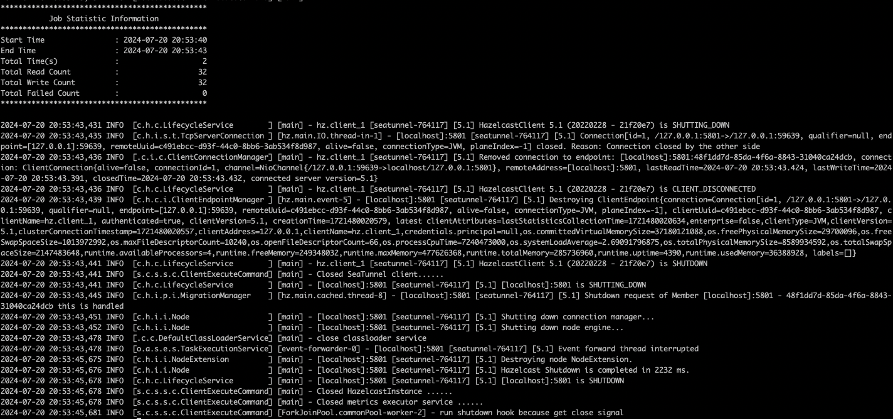

## 1. 准备工作

在开始本地运行前，您需要确保您已经安装了 SeaTunnel 所需要的软件：
- 安装Java (Java 8 或 11， 其他高于Java 8的版本理论上也可以工作) 以及设置 JAVA_HOME。


## 2. 下载

进入 SeaTunnel [下载页面](https://seatunnel.apache.org/download)下载最新版本的发布版安装包，目前最新版本为 2.3.5 版本：

SeaTunnel-Web 下载页与 SeaTunnel 在相同的页面，目前最新版本为 1.0.1 版本：


## 3. 安装

将下载的压缩包解压缩到指定目录下：
```
tar -zxvf apache-seatunnel-2.3.5-bin.tar.gz -C /opt/
tar -zxvf apache-seatunnel-web-1.0.1-bin.tar.gz -C /opt/
```

```
ln -s apache-seatunnel-2.3.5/ seatunnel
ln -s apache-seatunnel-web-1.0.1-bin/ seatunnel-web
```


## 4. 安装连接器插件

从 2.2.0-beta 版本开始，二进制包不再默认提供连接器依赖，因此在第一次使用它时，需要执行以下命令来安装连接器：
```shell
sh bin/install-plugin.sh 2.3.5
```
> 也可以从 Apache Maven Repository 手动下载连接器，然后将其移动至 connectors/seatunnel 目录下

通常你并不需要所有的连接器插件，所以可以通过配置 `config/plugin_config` 来指定所需要的插件，例如只需要 connector-console 插件，那么可以修改 `plugin.properties` 配置文件如下：
```
--seatunnel-connectors--
connector-console
--end--
```
在这我们的配置如下所示：
```
--connectors-v2--
connector-cdc-mysql
connector-clickhouse
connector-doris
connector-file-hadoop
connector-hive
connector-hudi
connector-iceberg
connector-jdbc
connector-kafka
connector-redis
--end--
```
这个配置文件中不需要的可以删掉或者注释掉，只下载自己需要的。默认是从 mvvm 下载，可能下载速度很慢：
```shll
# get seatunnel home
SEATUNNEL_HOME=$(cd $(dirname $0);cd ../;pwd)

# connector default version is 2.3.5, you can also choose a custom version. eg: 2.1.2:  sh install-plugin.sh 2.1.2
version=2.3.5

if [ -n "$1" ]; then
    version="$1"
fi

echo "Install SeaTunnel connectors plugins, usage version is ${version}"

# create the connectors directory
if [ ! -d ${SEATUNNEL_HOME}/connectors ];
  then
      mkdir ${SEATUNNEL_HOME}/connectors
      echo "create connectors directory"
fi

while read line; do
    first_char=$(echo "$line" | cut -c 1)

    if [ "$first_char" != "-" ] && [ "$first_char" != "#" ] && [ ! -z $first_char ]
        then
                echo "install connector : " $line
                ${SEATUNNEL_HOME}/mvnw dependency:get -DgroupId=org.apache.seatunnel -DartifactId=${line} -Dversion=${version} -Ddest=${SEATUNNEL_HOME}/connectors
    fi

done < ${SEATUNNEL_HOME}/config/plugin_config
```
> bin/install-plugin.sh

我这边安装了 Maven 并且配置了阿里云仓库，因此可以将上述脚本中的 `mvvm` 命令替换 `mvn` 改从 maven 中下载:
```shell
# get seatunnel home
SEATUNNEL_HOME=$(cd $(dirname $0);cd ../;pwd)

# connector default version is 2.3.5, you can also choose a custom version. eg: 2.1.2:  sh install-plugin.sh 2.1.2
version=2.3.5

if [ -n "$1" ]; then
    version="$1"
fi

echo "Install SeaTunnel connectors plugins, usage version is ${version}"

# create the connectors directory
if [ ! -d ${SEATUNNEL_HOME}/connectors ];
  then
      mkdir ${SEATUNNEL_HOME}/connectors
      echo "create connectors directory"
fi

while read line; do
    first_char=$(echo "$line" | cut -c 1)

    if [ "$first_char" != "-" ] && [ "$first_char" != "#" ] && [ ! -z $first_char ]
        then
                echo "install connector : " $line
                ${SEATUNNEL_HOME}/mvn dependency:get -DgroupId=org.apache.seatunnel -DartifactId=${line} -Dversion=${version} -Ddest=${SEATUNNEL_HOME}/connectors
    fi

done < ${SEATUNNEL_HOME}/config/plugin_config
```
运行上述安装连接器插件命令来安装插件：



连接器插件将下载到 `connectors` 这个目录下:
```shell
(base) localhost:connectors wy$ ls -al
total 736064
drwxrwxrwx  15 wy  wheel        480 Jul 20 19:43 .
drwxr-xr-x  15 wy  wheel        480 Jul 20 19:06 ..
-rw-r--r--   1 wy  wheel   30540348 Jul 20 19:39 connector-cdc-mysql-2.3.5.jar
-rw-r--r--   1 wy  wheel   30830325 Jul 20 19:39 connector-clickhouse-2.3.5.jar
-rw-r--r--   1 wy  wheel      77830 Nov  9  2023 connector-console-2.3.5.jar
-rw-r--r--   1 wy  wheel   11785663 Jul 20 19:39 connector-doris-2.3.5.jar
-rw-r--r--   1 wy  wheel     199577 Nov  9  2023 connector-fake-2.3.5.jar
-rw-r--r--   1 wy  wheel   42296458 Jul 20 19:39 connector-file-hadoop-2.3.5.jar
-rw-r--r--   1 wy  wheel   42318873 Jul 20 19:39 connector-hive-2.3.5.jar
-rw-r--r--   1 wy  wheel  157677173 Jul 20 19:41 connector-hudi-2.3.5.jar
-rw-r--r--   1 wy  wheel   30625934 Jul 20 19:42 connector-iceberg-2.3.5.jar
-rw-r--r--   1 wy  wheel     776369 Jul 20 19:42 connector-jdbc-2.3.5.jar
-rw-r--r--   1 wy  wheel   17276586 Jul 20 19:43 connector-kafka-2.3.5.jar
-rw-r--r--   1 wy  wheel    1372145 Jul 20 19:43 connector-redis-2.3.5.jar
-rw-r--r--   1 wy  wheel       5803 Nov  9  2023 plugin-mapping.properties
```
下载完成后将connectors下的 jar 包拷贝到 lib 下：
```
cp connectors/* lib/
```

## 5. 配置 SeaTunnel 同步作业

添加作业配置文件。编辑 `config/v2.batch.config.template` 文件，该文件决定了在启动 SeaTunnel 后数据输入、处理和输出的方式及逻辑。以下是一个配置文件示例:
```
env {
  # 环境变量配置
  parallelism = 2
  job.mode = "BATCH"
  checkpoint.interval = 10000
}

source {
  # 这是一个示例 Source 插件仅用于测试和演示插件的功能源
  FakeSource {
    parallelism = 2
    result_table_name = "fake"
    row.num = 16
    schema = {
      fields {
        name = "string"
        age = "int"
      }
    }
  }
}

sink {
  Console {
  }
}
```

## 6. 运行 SeaTunnel 作业

在命令行中，切换到 SeaTunnel 解压目录, 运行以下命令，启动 SeaTunnel 作业：
```
./bin/seatunnel.sh --config ./config/v2.batch.config.template -e local
```
此命令将以 Local 本地模式运行 SeaTunnel 作业。当您运行上述命令时，您可以在控制台中看到其输出。您可以将其视为命令是否成功运行的标志。
