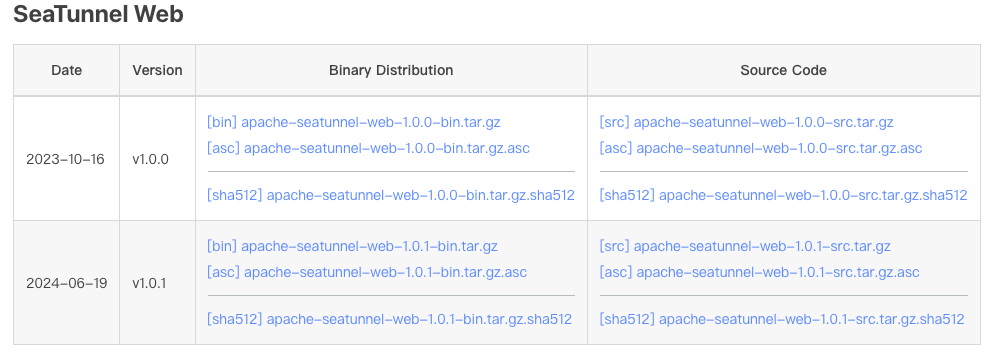
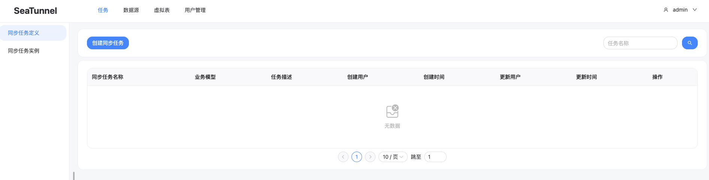

## 1. 准备工作

在开始本地运行前，您需要确保您已经安装了 SeaTunnel 所需要的软件：
- 安装Java (Java 8 或 11， 其他高于Java 8的版本理论上也可以工作) 以及设置 JAVA_HOME。

## 2. 下载

进入 SeaTunnel [下载页面](https://seatunnel.apache.org/download)下载最新版本的发布版安装包，目前最新版本为 1.0.1 版本：



## 3. 安装

将下载的压缩包解压缩到指定目录下：
```shell
tar -zxvf apache-seatunnel-web-1.0.1-bin.tar.gz -C /opt/
```
创建软连接，便于升级：
```shell
ln -s apache-seatunnel-web-1.0.1-bin/ seatunnel-web
```
设置 SeaTunnel Web 环境变量：
```shell
export SEATUNNEL_WEB_HOME=/opt/seatunnel-web
export PATH=${SEATUNNEL_WEB_HOME}/bin:$PATH
```

## 4. 配置

### 4.1 初始化数据库

初始化数据库有两种方式，一是使用官方提供的初始化脚本，二是直接运行初始化 SQL

#### 4.1.1 使用官方提供的初始化脚本

官方提供了一个 `init_sql.sh` 初始化数据库的脚本，使用之前需要修改 `seatunnel_server_env.sh` 文件来修改环境变量：
```shell
export HOSTNAME="127.0.0.1"
export PORT="3306"
export USERNAME="root"
export PASSWORD="root"
```
> 如果环境变量有冲突需要改下环境变量的名字以及 init_sql.sh 中的环境变量的名字，可以加上前缀 `SEATUNNELT_WEB_` 避免冲突。

修改环境变量之后运行 `init_sql.sh` 来初始化数据库。

### 4.1.2 直接运行初始化 SQL

`init_sql.sh` 初始化数据库的脚本核心是执行 `seatunnel_server_mysql.sql`：
```shell
workDir=`dirname $0`
workDir=`cd ${workDir};pwd`

source ${workDir}/seatunnel_server_env.sh

usage="Usage: seatunnel_server_env.sh must contain hostname/port/username/password."

if [[ ! -n "${HOSTNAME}" ]]  || [[ ! -n "${PORT}" ]] || [[ ! -n "${USERNAME}" ]] || [[ ! -n "${PASSWORD}" ]]; then
    echo $usage
    exit 1
fi

mysql -h${HOSTNAME} -P${PORT} -u${USERNAME} -p${PASSWORD} < ${workDir}/seatunnel_server_mysql.sql
```
所以你也可以直接选择跳过 `init_sql.sh` 初始化数据库的脚本来执行 `seatunnel_server_mysql.sql`。例如，你可以使用 Navicat 导入执行：


导入执行完后创建的表如下所示：


### 4.2 修改端口与数据源

修改 `conf/application.yml` 配置文件来修改端口号以及 Web 访问数据库的数据源信息：
```yml
server:
  port: 8801

spring:
  application:
    name: seatunnel
  jackson:
    date-format: yyyy-MM-dd HH:mm:ss
  datasource:
    driver-class-name: com.mysql.cj.jdbc.Driver
    url: jdbc:mysql://localhost:3306/seatunnel?useSSL=false&useUnicode=true&characterEncoding=utf-8&allowMultiQueries=true&allowPublicKeyRetrieval=true
    username: root
    password: root
  mvc:
    pathmatch:
      matching-strategy: ant_path_matcher
```

### 4.3 配置引擎服务信息

复制引擎服务中配置文件到 Web 配置目录下面。将 hazelcast-client 配置文件拷贝到 Web 的 conf 目录下：
```shell
cp /opt/seatunnel/config/hazelcast-client.yaml /opt/seatunnel-web/conf/
```
将插件配置文件拷贝到 Web 的 conf 目录下：
```shell
cp /opt/seatunnel/connectors/plugin-mapping.properties /opt/seatunnel-web/conf/
```

### 4.4 配置 MySQL 驱动

在这我们选择 MySQL 作为元数据库，需要对应的驱动包放到 libs 下：
```shell
cp mysql-connector-java-8.0.16.jar /opt/seatunnel-web/libs/
```

### 4.5 配置数据源JAR包

下载 SeaTunnel Web 的[源码](https://github.com/apache/seatunnel-web)，将 download_datasource.sh 拷贝到 script 目录下：
```
cp apache-seatunnel-web-1.0.1-src/seatunnel-server/seatunnel-app/src/main/bin/download_datasource.sh /opt/seatunnel-web/script/
```
根据你的需要选择需要下载的数据源，如果不下载在 Web 中配置数据源时会提示没有可用的数据源：
```shell
# get seatunnel web home
SEATUNNEL_WEB_HOME=$(cd $(dirname $0);cd ../;pwd)
DATASOURCE_DIR=${SEATUNNEL_WEB_HOME}/datasource

# If you don’t want to download a certain data source, you can delete the element below
datasource_list=(
  "datasource-plugins-api"
  "datasource-elasticsearch"
  "datasource-hive"
  "datasource-jdbc-clickhouse"
  "datasource-jdbc-hive"
  "datasource-jdbc-mysql"
  "datasource-jdbc-postgresql"
  "datasource-jdbc-starrocks"
  "datasource-jdbc-tidb"
  "datasource-kafka"
  "datasource-mysql-cdc"
  "datasource-starrocks"
  "datasource-mongodb"
)
```
默认是从 mvvm 下载，可能下载速度很慢，我这边安装了 Maven 并且配置了阿里云仓库，因此将脚本中的 `mvvm` 命令替换为 `mvn` 命令改从 maven 中下载：
```shell
for i in "${datasource_list[@]}"
do
        echo "$i"
        echo "Downloading datasource: " "$i"
  /opt/maven/bin/mvn dependency:get -DgroupId=org.apache.seatunnel -DartifactId="$i" -Dversion="$version" -Ddest="$DATASOURCE_DIR"
done
```
> "$SEATUNNEL_WEB_HOME"/mvnw -> /opt/maven/bin/mvn

下载之后的数据源 JAR 包存放于 datasource 目录下：
```
(base) localhost:datasource wy$ pwd
/opt/seatunnel-web/datasource
(base) localhost:datasource wy$ ll
total 346456
drwxr-xr-x  15 wy  wheel        480 Jul 22 07:22 ./
drwxr-xr-x  15 wy  wheel        480 Jul 22 07:08 ../
-rw-r--r--   1 wy  wheel    4811050 Jul 22 07:11 datasource-elasticsearch-1.0.1.jar
-rw-r--r--   1 wy  wheel  129470689 Jul 22 07:11 datasource-hive-1.0.1.jar
-rw-r--r--   1 wy  wheel   23470082 Jul 22 07:11 datasource-jdbc-clickhouse-1.0.1.jar
-rw-r--r--   1 wy  wheel     453216 Jul 22 07:11 datasource-jdbc-hive-1.0.1.jar
-rw-r--r--   1 wy  wheel     455821 Jul 22 07:11 datasource-jdbc-mysql-1.0.1.jar
-rw-r--r--   1 wy  wheel     456241 Jul 22 07:12 datasource-jdbc-postgresql-1.0.1.jar
-rw-r--r--   1 wy  wheel      18031 Jul 22 07:12 datasource-jdbc-starrocks-1.0.1.jar
-rw-r--r--   1 wy  wheel     455413 Jul 22 07:12 datasource-jdbc-tidb-1.0.1.jar
-rw-r--r--   1 wy  wheel   14077433 Jul 22 07:17 datasource-kafka-1.0.1.jar
-rw-r--r--   1 wy  wheel    2753901 Jul 22 07:22 datasource-mongodb-1.0.1.jar
-rw-r--r--   1 wy  wheel     455430 Jul 22 07:22 datasource-mysql-cdc-1.0.1.jar
-rw-r--r--   1 wy  wheel      20116 Jul 22 07:11 datasource-plugins-api-1.0.1.jar
-rw-r--r--   1 wy  wheel     457666 Jul 22 07:22 datasource-starrocks-1.0.1.jar
(base) localhost:datasource wy$
```

## 5. 启动 Web

启动 Web 之前，先启动 SeaTunnel：
```shell
sh bin/seatunnel-cluster.sh
```
然后通过如下命令来启动 Web 服务：
```shell
sh bin/seatunnel-backend-daemon.sh start
```

登录地址为 `http://localhost:8801`，此处的 `8801` 就是上述 application.yml 文件中配置的端口号。默认登录的用户名和密码为 admin/admin：


登录之后效果如下所示：



在上述配置数据源JAR包步骤之后就可以支持多种数据源的创建：


...
