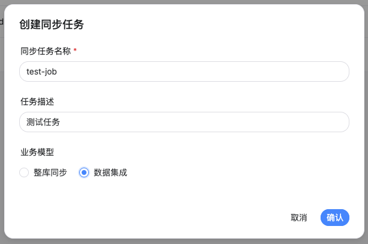

## 1. 创建作业定义



### 1.1 接口信息

| 项目 | 内容 |
| :------------- | :------------- |
| URL | POST /seatunnel/api/v1/job/definition |
| Controller |	JobDefinitionController#createJobDefinition |
| Service	| JobDefinitionServiceImpl#createJob() |

```java
@PostMapping
Result<Long> createJobDefinition(@RequestBody JobReq jobReq) throws CodeGenerateUtils.CodeGenerateException {
    if (jobService.getJob(jobReq.getName()).isEmpty()) {
        return Result.success(jobService.createJob(jobReq));
    } else {
        return Result.failure(SeatunnelErrorEnum.TASK_NAME_ALREADY_EXISTS);
    }
}
```

> org.apache.seatunnel.app.controller.JobDefinitionController#createJobDefinition

### 1.2 请求参数

请求参数 JobReq：
```java
@Data
public class JobReq {
    // 作业名称
    private String name;
    // 作业描述
    private String description;
    // DATA_INTEGRATION(批处理) 或 DATA_REPLICA(流处理)
    private BusinessMode jobType;
}
```
示例：
```json
{
    "description": "测试任务",
    "name": "test-job",
    "jobType": "DATA_INTEGRATION"
}
```

### 1.3 处理逻辑

```java
// JobDefinitionServiceImpl.createJob()
@Transactional
public long createJob(JobReq jobReq) {
    // 1. 生成唯一 ID
    long uuid = CodeGenerateUtils.getInstance().genCode();

    // 2. 创建 JobDefinition 记录
    jobDefinitionDao.add(JobDefinition.builder()
        .id(uuid)
        .name(jobReq.getName())
        .description(jobReq.getDescription())
        .jobType(jobReq.getJobType().name())
        .build());

    // 3. 创建 JobVersion 记录（env 为空）
    JobVersion.JobVersionBuilder builder = JobVersion.builder()
        .jobId(uuid)
        .name("1.0")
        .id(uuid)                      // jobVersionId = jobId
        .engineName(EngineType.SeaTunnel)
        .engineVersion("2.3.11");

    // 根据 jobType 设置 jobMode
    if (BusinessMode.DATA_INTEGRATION.equals(jobReq.getJobType())) {
        builder.jobMode(JobMode.BATCH);
    } else {
        builder.jobMode(JobMode.STREAMING);
    }

    jobVersionDao.createVersion(builder.build());
    return uuid;
}
```

### 1.4 返回值

返回值为 Result<Long>，标识一个作业定义ID：
```json
{
  "code": 0,
  "msg": null,
  "data": 21343715957248,
  "failed": false,
  "success": true
}
```

> /api/v1/job/21343715957248

## 2. 配置Source任务节点

/seatunnel/api/v1/job/task/21343715957248
