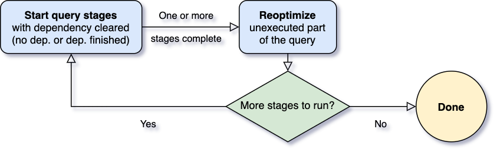
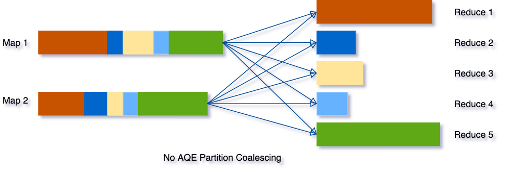
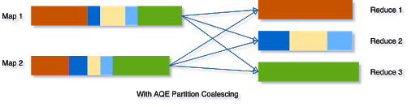
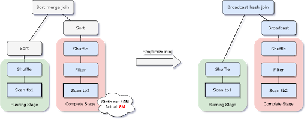
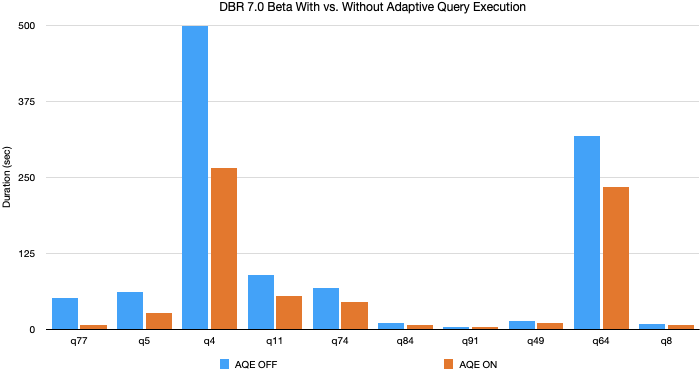

> 原文：[Adaptive Query Execution: Speeding Up Spark SQL at Runtime](https://databricks.com/blog/2020/05/29/adaptive-query-execution-speeding-up-spark-sql-at-runtime.html)

多年以来为了生成高质量的查询执行计划，社区一直在努力改进 Spark SQL 的查询优化器和规划器。最大的一个改进是基于成本的优化（CBO，cost-based optimization）框架，该框架收集并利用各种数据统计信息（如行数，值基数，NULL 值，最大/最小值等）来帮助 Spark 选择更好的计划。这些基于成本的优化技术例子有选择正确的 Join 类型（broadcast hash join vs sort merge join），在 hash join 的时候选择正确的构建顺序，或在多个 join 中调整 join 顺序。然而，过时的统计信息和不完善的基数估计可能导致查询计划不想理。自适应查询执行（Adaptive Query Execution）是新发布的 Apache Spark 3.0 版本中的新增功能，并且已在 Databricks Runtime 7.0 beta 中提供。希望根据查询执行过程中收集的运行时统计信息，通过重新优化和调整查询计划来解决这些问题。

## 1. 自适应查询执行 AQE 框架

自适应查询执行最大一个的挑战是**何时进行重新优化**。Spark 算子通常是以 Pipeline 形式运行，并以并行的方式执行。然而，shuffle 或 broadcast exchange 的出现打破了 Pipeline。我们称它们为物化点，这些物化点把查询分割了多个子部分并使用术语 Query Stage 来表示这些子部分。每个 Query Stage 都会物化它的中间结果(注: Query Stage 执行完成时获取执行的中间结果)，只有当运行物化的所有并行进程都完成时，才能继续执行下一个阶段。这为重新优化提供了一个绝佳的机会(注：Query Stage 边界是运行时优化的最佳时机)，因为此时所有分区上的数据统计都已经完成，并且后续操作还没有开始(注：天然的执行间歇)。

当查询开始时，自适应查询执行框架 AQE 首先启动所有叶子阶段（leaf stages），这些阶段不依赖于任何其他阶段。一旦其中一个或多个阶段完成物化，框架便会在物理查询计划中将它们标记为完成，并相应地更新逻辑查询计划，同时从完成的阶段检索运行时统计信息。基于这些新的统计信息，框架将运行优化程序、物理计划程序以及物理优化规则，其中包括常规物理规则和自适应执行特定的规则，如合并分区、Join 数据倾斜处理等。现在我们有了一个新优化的查询计划，其中包含一些已完成的阶段，自适应执行框架将搜索并执行新的查询阶段(其子阶段已完成全部物化)，并重复上面的`执行-重新优化-执行`过程，直到完成整个查询。

Spark 3.0 的 AQE 框架带来了以下三个特性：
- 动态合并 shuffle 分区
- 动态调整 Join 策略
- 动态优化数据倾斜的 Join

下面我们来详细介绍这三个特性。

## 2. 动态合并 shuffle 的分区

当在 Spark 中运行查询来处理非常大的数据时，shuffle 通常对查询性能产生非常重要的影响。Shuffle 是一个代价昂贵的算子，因为它需要跨网络移动数据，以便以下游算子所需的方式重新分布数据。

Shuffle 的一个关键属性是分区的数量。分区的最佳数量取决于数据，但是数据大小可能因在不同阶段、不同查询而有很大的差异，这使得分区数量很难调优：
- 如果分区数太少，那么每个分区处理的数据可能非常大，处理这些大分区的任务可能需要将数据溢写到磁盘（例如，涉及排序或聚合），从而减慢查询速度。
- 如果分区数太多，那么每个分区处理的数据可能非常小，并且将有大量的小的网络数据获取来读取 Shuffle 块，这也会由于低效的 I/O 模式而减慢查询速度。拥有大量的任务也会给 Spark 任务调度程序带来更多的负担。

为了解决这个问题，我们可以在开始时设置相对较多的 Shuffle 分区数(设置较大的初始分区数)，然后在运行时通过查看 Shuffle 文件统计信息将相邻的小分区合并为较大的分区。

假设我们运行 `SELECT max(i)FROM tbl GROUP BY j` 查询，输入表 `tbl` 的输入数据相当小，所以在分组之前只有两个分区。我们把初始的 Shuffle 分区数设置为 5，因此在本地分组之后，分组数据 Shuffle 到 5 个分区中。如果没有 AQE，Spark 将启动 5 个任务来完成最后的聚合。然而，这里有三个非常小的分区，为每个分区启动一个单独的任务将是一种浪费。

相反，AQE 将这三个小分区合并为一个，因此，最终的聚合现在只需要执行三个任务，而不是五个。

## 3. 动态调整 Join 策略

Spark 支持许多 Join 策略，其中 broadcast hash join 通常是性能最好的，前提是参加 join 的一张表的数据能够装入内存。由于这个原因，当 Spark 估计参加 join 的表数据量小于广播大小的阈值时，其会将 Join 策略调整为 broadcast hash join。但是，很多情况下这种大小估计可能会出错，例如存在一个有选择性的过滤器或者连接关系是一系列复杂的算子，而不仅仅是扫描。

为了解决这个问题，AQE 在运行时根据最精确的连接关系大小重新规划 Join 策略。在下面的示例中可以看到，Join 的右侧比估计值小得多，并且小到足以进行广播，因此在 AQE 重新优化之后，静态执行计划的 sort merge join 现在被调整为 broadcast hash join。

对于在运行时调整的 broadcast hash join ，我们可以进一步将常规的 shuffle 优化为本地化 shuffle 来减少网络流量。

## 4. 动态优化数据倾斜的 Join

当数据在集群中的分区之间分布不均时，就会发生数据倾斜。严重的数据倾斜会显著降低查询性能，特别是在进行 Join 操作时。AQE 倾斜 Join 优化从 Shuffle 文件统计信息中自动检测到这种倾斜。然后将倾斜的分区分割成更小的子分区，这些子分区将分别从另一侧连接到相应的分区。

假设表 A join 表 B，其中表 A 的分区 A0 里面的数据明显大于其他分区。

如果没有这个优化，这四个任务运行 sort merge join，其中一个任务将花费非常长的时间。优化之后，将有 5 个任务运行 join，但每个任务将花费大致相同的时间，从而获得总体更好的性能。

> 优化策略将把分区 A0 分成两个子分区 A0-0 和 A0-1，每个子分区都会 join 表 B 的对应分区 B0。

## 5. AQE 的 TPC-DS 表现

在我们使用 TPC-DS 数据和查询的实验中，自适应查询执行的查询性能提高了8倍，32个查询的性能提高了1.1倍以上。下面是通过 AQE 获得的10个 TPC-DS 查询性能提高最多的图表。

这些改进大部分来自动态分区合并和动态连接策略调整，因为随机生成的 TPC-DS 数据没有倾斜。在实际生产中，AQE 带来了更大的性能提升。

## 6. 启用 AQE

可以通过设置 SQL 的参数 `spark.sql.adaptive` 参数来启用 AQE。设置为 true 时将启用，在 Spark 3.0 中默认为 false，如果查询满足以下条件建议启用：
- 不是一个流查询
- 至少包含一个 Exchange(通常在有 join、聚合或窗口操作符时)或是一个子查询。

通过减少查询优化对静态统计的依赖，AQE 解决了 Spark 基于成本优化的最大难题之一：统计信息收集开销和估计准确性之间的平衡。为了获得最佳的估计准确性和规划结果，通常需要维护详细的、最新的统计信息，其中一些统计信息的收集成本很高，比如列直方图，可用于提高选择性和基数估计或检测数据倾斜。AQE 在很大程度上消除了对此类统计数据的需要，以及手动调优工作的需要。最重要的是，AQE 还使 SQL 查询优化对于任意 UDF 和不可预测的数据集变化（例如数据大小的突然增加或减少、频繁的和随机的数据倾斜等）更有弹性。
