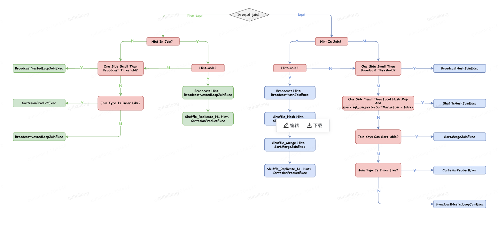
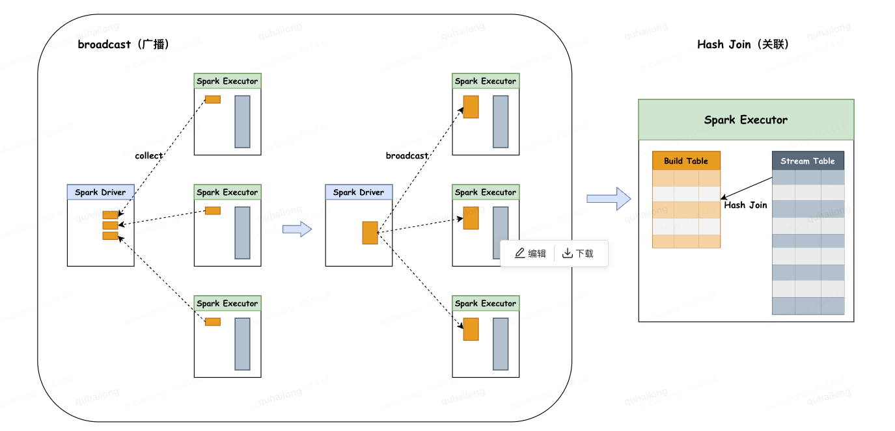
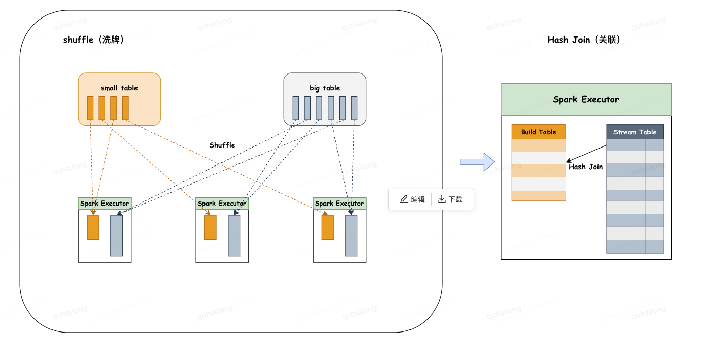
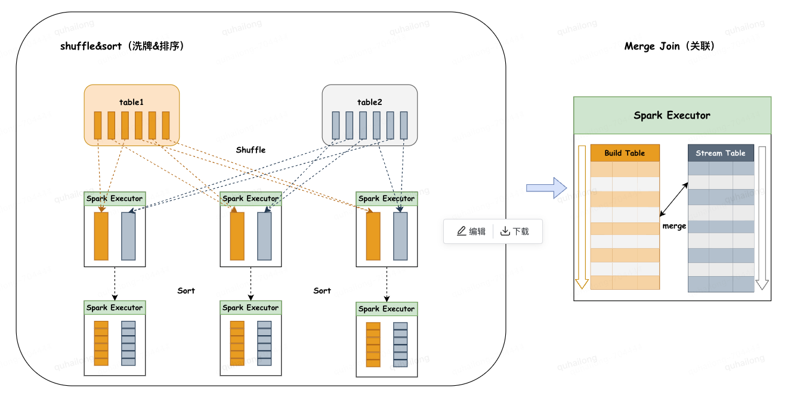
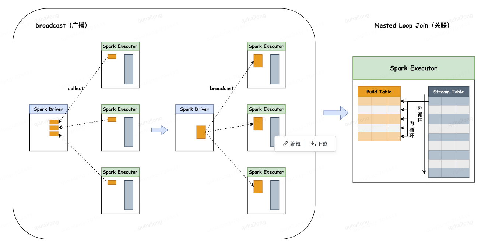

## 1. 五种连接策略

选择连接策略的核心原则是尽量避免 shuffle 和 sort 的操作，因为这些操作性能开销很大，比较吃资源且耗时，所以首选的连接策略是不需要 shuffle 和 sort 的 hash 连接策略。
- Broadcast Hash Join（BHJ）：广播散列连接
- Shuffle Hash Join（SHJ）：洗牌散列连接
- Shuffle Sort Merge Join（SMJ）：洗牌排列合并联系
- Cartesian Product Join（CPJ）：笛卡尔积连接
- Broadcast Nested Loop Join（BNLJ）：广播嵌套循环连接

## 2. 连接策略影响因素

### 2.1 连接类型是否为等值连接

等值连接是指一个连接条件中只包含 `=` 比较的连接，而非等值连接包含除 `=` 以外的任何比较，如 `<、>、>=、<=`，由于非等值连接是对不确定值的范围比较，需要嵌套循环，所以只有 CPJ 和 BMLJ 两种连接策略支持非等值连接，对于等值连接，所有连接策略都支持。

### 2.2 连接策略提示（Join strategy hint）

Spark SQL 为开发人员提供了通过连接提示对连接策略选择进行一些控制，共支持4种连接提示（Spark3.0.0版本）。
- BROADCAST
- SHUFFLE_MERGE
- SHUFFLE_HASH
- SHUFFLE_REPLICATE_NL

使用示例：
```sql
SELECT
  /*+ BROADCAST（table_B）*/ *
FROM table_A
INNER JOIN table_B
ON table_A.id = table_B.id
```

### 2.3 连接数据集的大小（Size of Join relations）

选择连接策略最重要的因素是连接数据集的大小，是否可以选择不需要 shuffle 和 sort 的基于 hash 的连接策略，就取决于连接中涉及的数据集的大小。

## 3. 连接策略优先级



## 4. 连接策略运行原理

### 4.1 Broadcast Hash Join（BHJ）：广播散列连接

- 主要分为两个阶段：
  - 广播阶段：通过 collect 算子将小表数据拉到 Driver 端，再把整体的小表广播致每个 Executor 端一份。
  - 关联阶段：在每个 Executor 上进行 HashJoin，为较小的表通过 join key 创建 hashedRelation 作为 build table，循环大表 stream table 通过 join key 关联 build table。
- 限制条件：
  - 被广播的小表大小必须小于参数：`spark.sql.autoBroadcaseJoinThreshold`，默认为10M。
  - 基表不能被广播，比如 Left Join 时，只能广播右表。
  - 数据集的总行数小于 MAX_BROADCAST_TABLE_ROWS 阈值，阈值被设置为 3.41 亿行。



### 4.2 Shuffle Hash Join（SHJ）：洗牌散列连接

- 主要分为两个阶段：
  - 洗牌阶段：通过对两张表分别按照 join key 分区洗牌，为了让相同 join key 的数据分配到同一 Executor 中。
  - 关联阶段：在每个 Executor 上进行 HashJoin，为较小的表通过 join key 创建 hashedRelation 作为 build table，循环大表 stream table 通过 join key 关联 build table。
- 限制条件：
  - 小表大小必须小于参数：`spark.sql.autoBroadcaseJoinThreshold`（默认为10M） * shuffle 分区数。
  - 基表不能被广播，比如 Left Join时，只能广播右表。
  - 较小表至少比较大表小3倍以上，否则性能收益未必大于 Shuffle Sort Merge Join。



### 4.3 Shuffle Sort Merge Join（SMJ）：洗牌排列合并联系

- 主要分为两个阶段：
  - 洗牌阶段：将两张大表分别按照 join key 分区洗牌，为了让相同 join key 的数据分配到同一分区中。
  - 排序阶段：对单个分区的两张表分别进行升序排序。
  - 关联阶段：两张有序表都可以作为 stream table 或 build table，顺序迭代 stream table 行，在 build table 顺序逐行搜索，相同键关联，由于 stream table 或 build table 都是按连接键排序的，当连接过程转移到下一个 stream table 行时，在 build table 中不必从第一个行搜索，只需从与最后一个 stream table 匹配行继续搜索即可。
- 限制条件：
  - 连接键必须是可排序的。



### 4.4 Cartesian Product Join（CPJ）：笛卡尔积连接

- 主要分为两个阶段：
  - 分区阶段：将两张大表分别进行分片，再将两个父分片a，b进行笛卡尔积组装子分片，子分片数量：a*b。
  - 关联阶段：会对 stream table 和 build table 两个表使用内、外两个嵌套的 for 循环依次扫描，通过关联键进行关联。
- 限制条件：
  - left join 广播右表，right join 广播左表，inner join 广播两张表。


### 4.5 Broadcast Nested Loop Join（BNLJ）：广播嵌套循环连接

- 主要分为两个阶段：
  - 广播阶段：通过 collect 算子将小表数据拉到 Driver 端，再把整体的小表广播致每个 Executor 端一份。
  - 关联阶段：会对 stream table 和 build table 两个表使用内、外两个嵌套的for循环依次扫描，通过关联键进行关联。
- 限制条件：
  - 仅支持内连接。
  - 开启参数：`spark.sql.crossJoin.enabled=true`。


