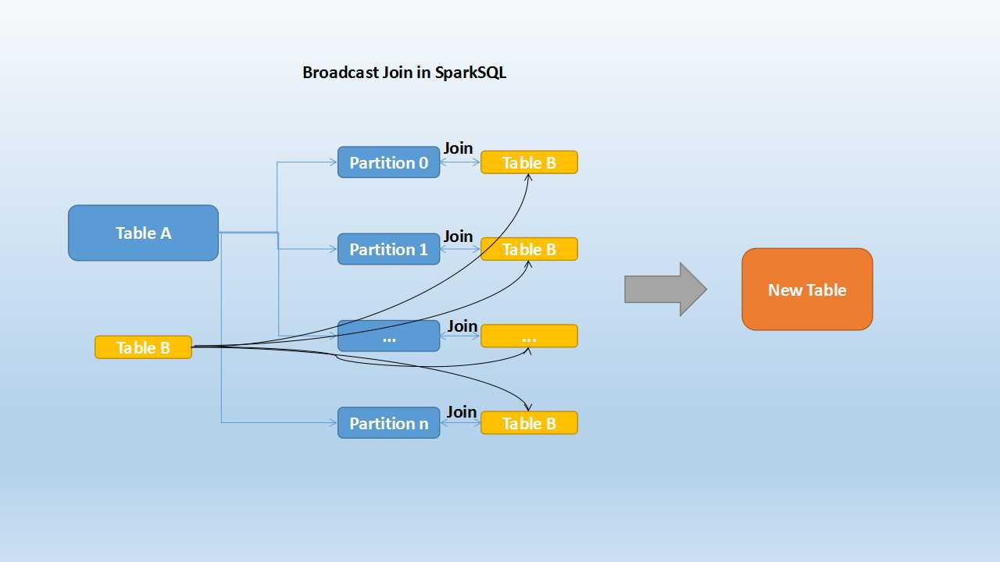
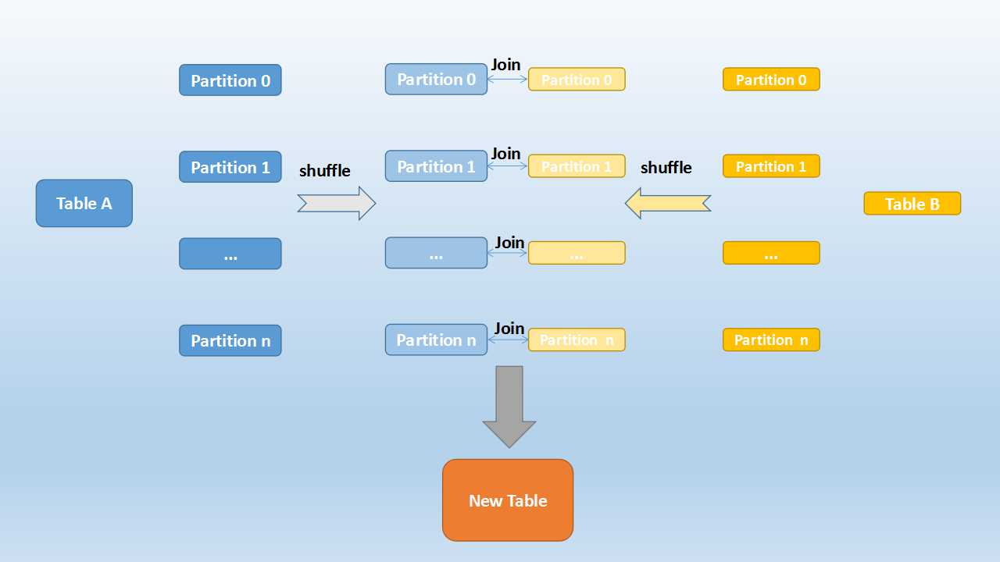
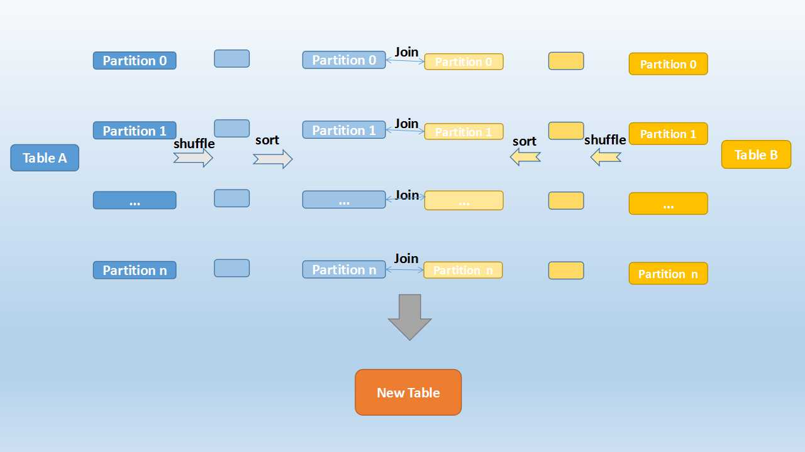
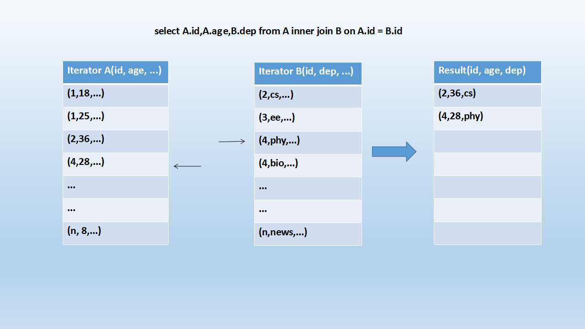

Join 是 SQL 语句中的常用操作，良好的表结构能够将数据分散在不同的表中，使其符合某种范式，减少表冗余、更新容错等。而建立表和表之间关系的最佳方式就是 Join 操作。

Spark SQL 作为大数据领域的 SQL 实现，自然也对 Join 操作做了不少优化，今天主要看一下在 Spark SQL 中对于 Join，常见的3种实现。

### 1. Broadcast Join

大家知道，在数据库的常见模型中（比如星型模型或者雪花模型），表一般分为两种：事实表和维度表。维度表一般指固定的、变动较少的表，例如联系人、物品种类等，一般数据有限。而事实表一般记录流水，比如销售清单等，通常随着时间的增长不断膨胀。

因为 Join 操作是对两个表中 key 值相同的记录进行连接，在 Spark SQL 中，对两个表做 Join 最直接的方式是先根据 key 分区，再在每个分区中把 key 值相同的记录拿出来做连接操作。但这样就不可避免地涉及到 shuffle，而 shuffle 在 Spark 中是比较耗时的操作，我们应该尽可能的设计 Spark 应用使其避免大量的 shuffle。

当维度表和事实表进行 Join 操作时，为了避免 shuffle，我们可以将大小有限的维度表的全部数据分发到每个节点上，供事实表使用。Executor 存储维度表的全部数据，一定程度上牺牲了空间，换取 shuffle 操作大量的耗时，这在 Spark SQL 中称作 Broadcast Join，如下图所示：

Table B 是较小的表，黑色表示将其广播到每个 Executor 节点上，Table A 的每个 partition 会通过 block manager 取到 Table A 的数据。根据每条记录的 Join Key 取到 Table B 中相对应的记录，根据 Join Type 进行操作。这个过程比较简单，不做赘述。

Broadcast Join 的条件有以下几个：
- 被广播的表需要小于 `spark.sql.autoBroadcastJoinThreshold` 所配置的值，默认是10M （或者加了broadcast join的hint）
- 基表不能被广播，比如left outer join时，只能广播右表

看起来广播是一个比较理想的方案，但它有没有缺点呢？也很明显。这个方案只能用于广播较小的表，否则数据的冗余传输就远大于 shuffle 的开销；另外，广播时需要将被广播的表现 collect 到 driver 端，当频繁有广播出现时，对 driver 的内存也是一个考验。

### 2. Shuffle Hash Join

当一侧的表比较小时，我们选择将其广播出去以避免 shuffle，提高性能。但因为被广播的表首先被 collect 到 driver 端，然后被冗余分发到每个 Executor 上，所以当表比较大时，采用 broadcast join 会对 driver 端和 Executor 端造成较大的压力。

但由于 Spark 是一个分布式的计算引擎，可以通过分区的形式将大批量的数据划分成n份较小的数据集进行并行计算。这种思想应用到 Join 上便是 Shuffle Hash Join 了。利用 key 相同必然分区相同的这个原理，Spark SQL 将较大表的 join 分而治之，先将表划分成n个分区，再对两个表中相对应分区的数据分别进行 Hash Join，这样即在一定程度上减少了driver广播一侧表的压力，也减少了 Executor 端取整张被广播表的内存消耗。其原理如下图：

Shuffle Hash Join分为两步：
- 对两张表分别按照 join keys 进行重分区，即 shuffle，目的是为了让有相同 join keys 值的记录分到对应的分区中
- 对对应分区中的数据进行 join，此处先将小表分区构造为一张 hash 表，然后根据大表分区中记录的 join keys 值拿出来进行匹配

Shuffle Hash Join的条件有以下几个：
- 分区的平均大小不超过 `spark.sql.autoBroadcastJoinThreshold` 所配置的值，默认是10M
- 基表不能被广播，比如left outer join时，只能广播右表
- 一侧的表要明显小于另外一侧，小的一侧将被广播（明显小于的定义为3倍小，此处为经验值）
我们可以看到，在一定大小的表中，Spark SQL 从时空结合的角度来看，将两个表进行重新分区，并且对小表中的分区进行 hash 化，从而完成 join。在保持一定复杂度的基础上，尽量减少 driver 和 Executor 的内存压力，提升了计算时的稳定性。

### 3. Sort Merge Join

上面介绍的两种实现对于一定大小的表比较适用，但当两个表都非常大时，显然无论适用哪种都会对计算内存造成很大压力。这是因为 join 时两者采取的都是 hash join，是将一侧的数据完全加载到内存中，使用 hashCode 取 join keys 值相等的记录进行连接。

当两个表都非常大时，Spark SQL 采用了一种全新的方案来对表进行 Join，即 Sort Merge Join。这种实现方式不用将一侧数据全部加载后再进行 hash join，但需要在　join　前将数据排序，如下图所示：

可以看到，首先将两张表按照 join keys 进行了重新 shuffle，保证 join keys 值相同的记录会被分在相应的分区。分区后对每个分区内的数据进行排序，排序后再对相应的分区内的记录进行连接，如下图示：

看着很眼熟吧？也很简单，因为两个序列都是有序的，从头遍历，碰到key相同的就输出；如果不同，左边小就继续取左边，反之取右边。

可以看出，无论分区有多大，Sort Merge Join都不用把某一侧的数据全部加载到内存中，而是即用即取即丢，从而大大提升了大数据量下sql join的稳定性。

原文：https://blog.csdn.net/asongoficeandfire/article/details/53574034
