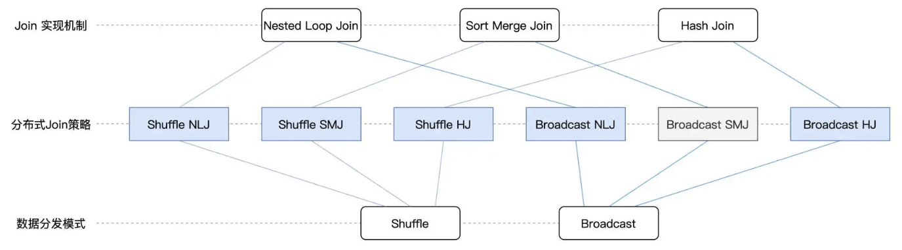

从实现机制的角度，Join 可以分为 NLJ（Nested Loop Join）、SMJ（Sort Merge Join）和 HJ（Hash Join）。也就是说，同样是内关联，我们既可以采用 NLJ 来实现，也可以采用 SMJ 或是 HJ 来实现。区别在于，在不同的计算场景下，这些不同的实现机制在执行效率上有着天壤之别。因此，了解并熟悉这些机制，对咱们开发者来说至关重要。接下来，我们以内关联为例，结合 tb_order 和 tb_province 这两张表，来说说它们各自的实现原理与特性。

## 1. Nested Loop Join

NLJ：Nested Loop Join 对于参与关联的两张表，如 tb_order 和 tb_province，按照它们在代码中出现的顺序，我们约定俗成地把 tb_order 称作左表，而把 tb_province 称作右表。在探讨关联机制的时候，我们又常常把左表称作是驱动表，而把右表称为基表。一般来说，驱动表的体量往往较大，在实现关联的过程中，驱动表是主动扫描数据的那一方。而基表相对来说体量较小，是被动参与数据扫描的那一方。在 Nested Loop Join 的实现机制下，算法会使用内外两个嵌套的 for 循环，来依次扫描驱动表与基表中的数据记录。在扫描的同时，还会判定关联条件是否成立，如内关联例子中的 `tb_order('province_id') == tb_province('id')`。如果关联条件成立，就把两张表的记录拼接在一起，然后对外进行输出。

在实现的过程中，外层的 for 循环负责遍历驱动表的每一条数据，如图中的步骤 1 所示。对于驱动表中的每一条数据记录，内层的 for 循环会逐条扫描基表的所有记录，依次判断记录的 id 字段值是否满足关联条件，如步骤 2 所示。不难发现，假设驱动表有 M 行数据，而基表有 N 行数据，那么 NLJ 算法的计算复杂度是 O(M * N)。尽管 NLJ 的实现方式简单、直观、易懂，但它的执行效率显然很差。

## 2. Sort Merge Join

SMJ：Sort Merge Join 鉴于 NLJ 低效的计算效率，SMJ 应运而生。Sort Merge Join，顾名思义，SMJ 的实现思路是先排序、再归并。给定参与关联的两张表，SMJ 先把他们各自排序，然后再使用独立的游标，对排好序的两张表做归并关联。

具体计算过程是这样的：起初，驱动表与基表的游标都会先锚定在各自的第一条记录上，然后通过对比游标所在记录的 id 字段值，来决定下一步的走向。对比结果以及后续操作主要分为 3 种情况：满足关联条件，两边的 id 值相等，那么此时把两边的数据记录拼接并输出，然后把驱动表的游标滑动到下一条记录；不满足关联条件，驱动表 id 值小于基表的 id 值，此时把驱动表的游标滑动到下一条记录；不满足关联条件，驱动表 id 值大于基表的 id 值，此时把基表的游标滑动到下一条记录。基于这 3 种情况，SMJ 不停地向下滑动游标，直到某张表的游标滑到尽头，即宣告关联结束。对于驱动表的每一条记录，由于基表已按 id 字段排序，且扫描的起始位置为游标所在位置，因此，SMJ 算法的计算复杂度为 O(M + N)。然而，计算复杂度的降低，仰仗的其实是两张表已经事先排好了序。但是我们知道，排序本身就是一项很耗时的操作，更何况，为了完成归并关联，参与 Join 的两张表都需要排序。因此，SMJ 的计算过程我们可以用“先苦后甜”来形容。苦，指的是要先花费时间给两张表做排序，而甜，指的则是有序表的归并关联能够享受到线性的计算复杂度。

## 3. HJ：Hash Join

考虑到 SMJ 对于排序的苛刻要求，后来又有人推出了 HJ 算法。HJ 的设计初衷是以空间换时间，力图将基表扫描的计算复杂度降低至 O(1)。

具体来说，HJ 的计算分为两个阶段，分别是 Build 阶段和 Probe 阶段。在 Build 阶段，在基表之上，算法使用既定的哈希函数构建哈希表，如上图的步骤 1 所示。哈希表中的 Key 是 id 字段应用（Apply）哈希函数之后的哈希值，而哈希表的 Value 同时包含了原始的 Join Key（id 字段）和 Payload。在 Probe 阶段，算法依次遍历驱动表的每一条数据记录。首先使用同样的哈希函数，以动态的方式计算 Join Key 的哈希值。然后，算法再用哈希值去查询刚刚在 Build 阶段创建好的哈希表。如果查询失败，则说明该条记录与基表中的数据不存在关联关系；相反，如果查询成功，则继续对比两边的 Join Key。如果 Join Key 一致，就把两边的记录进行拼接并输出，从而完成数据关联。好啦，到此为止，对于 Join 的 3 种实现机制，我们暂时说到这里。对于它们各自的实现原理，想必你已经有了充分的把握。至于这 3 种机制都适合哪些计算场景，以及 Spark SQL 如何利用这些机制在分布式环境下做数据关联，我们留到下一讲再去展开。
