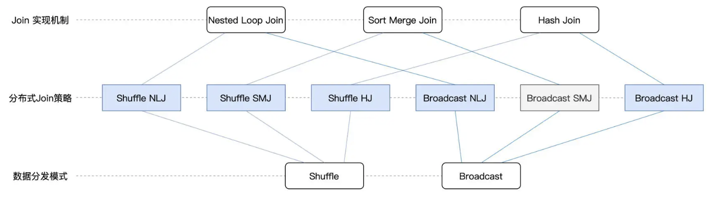

在上一讲，我们分别从关联形式与实现机制这两个方面，对数据分析进行了讲解和介绍。对于不同关联形式的用法和实现机制的原理，想必你已经了然于胸。不过，在大数据的应用场景中，数据的处理往往是在分布式的环境下进行的，在这种情况下，数据关联的计算还要考虑网络分发这个环节。我们知道，在分布式环境中，Spark 支持两类数据分发模式。一类是我们在第 7 讲学过的 Shuffle，Shuffle 通过中间文件来完成 Map 阶段与 Reduce 阶段的数据交换，因此它会引入大量的磁盘与网络开销。另一类是我们在第 10 讲介绍的广播变量（Broadcast Variables），广播变量在 Driver 端创建，并由 Driver 分发到各个 Executors。因此，从数据分发模式的角度出发，数据关联又可以分为 Shuffle Join 和 Broadcast Join 这两大类。将两种分发模式与 Join 本身的 3 种实现机制相结合，就会衍生出分布式环境下的 6 种 Join 策略。那么，对于这 6 种 Join 策略，Spark SQL 是如何支持的呢？它们的优劣势与适用场景都有哪些？开发者能否针对这些策略有的放矢地进行取舍？今天这一讲，咱们就来聊聊这些话题。

不论是 Shuffle Join，还是 Broadcast Join，一旦数据分发完毕，理论上可以采用 HJ、SMJ 和 NLJ 这 3 种实现机制中的任意一种，完成 Executors 内部的数据关联。因此，两种分发模式，与三种实现机制，它们组合起来，总共有 6 种分布式 Join 策略，如下图所示:

虽然组合起来选择多样，但你也不必死记硬背，抓住里面的规律才是关键，我们一起来分析看看。在这 6 种 Join 策略中，Spark SQL 支持其中的 5 种来应对不用的关联场景，也即图中蓝色的 5 个矩形。对于等值关联（Equi Join），Spark SQL 优先考虑采用 Broadcast HJ 策略，其次是 Shuffle SMJ，最次是 Shuffle HJ。对于不等值关联（Non Equi Join），Spark SQL 优先考虑 Broadcast NLJ，其次是 Shuffle NLJ。

不难发现，不论是等值关联、还是不等值关联，只要 Broadcast Join 的前提条件成立，Spark SQL 一定会优先选择 Broadcast Join 相关的策略。那么问题来了，Broadcast Join 的前提条件是什么呢？Broadcast Join 得以实施的基础，是被广播数据表（图中的表 2）的全量数据能够完全放入 Driver 的内存、以及各个 Executors 的内存，如下图所示。

另外，为了避免因广播表尺寸过大而引入新的性能隐患，Spark SQL 要求被广播表的内存大小不能超过 8GB。好，这里我们简单总结一下。只要被广播表满足上述两个条件，我们就可以利用 SQL Functions 中的 broadcast 函数来创建广播变量，进而利用 Broadcast Join 策略来提升执行性能。当然，在 Broadcast Join 前提条件不成立的情况下，Spark SQL 就会退化到 Shuffle Join 的策略。在不等值的数据关联中，Spark SQL 只有 Shuffle NLJ 这一种选择，因此咱们无需赘述。但在等值关联的场景中，Spark SQL 有 Shuffle SMJ 和 Shuffle HJ 这两种选择。尽管如此，Shuffle SMJ 与 Shuffle HJ 的关系，就像是关羽和周仓的关系。周仓虽说武艺也不错，但他向来只是站在关公后面提刀。大战在即，刘备仰仗的自然是站在前面的关羽，而很少启用后面的周仓。在 Shuffle SMJ 与 Shuffle HJ 的取舍上，Spark SQL 也是如此。学习过 Shuffle 之后，我们知道，Shuffle 在 Map 阶段往往会对数据做排序，而这恰恰正中 SMJ 机制的下怀。对于已经排好序的两张表，SMJ 的复杂度是 O(M + N)，这样的执行效率与 HJ 的 O(M) 可以说是不相上下。再者，SMJ 在执行稳定性方面，远胜于 HJ，在内存受限的情况下，SMJ 可以充分利用磁盘来顺利地完成关联计算。因此，考虑到 Shuffle SMJ 的诸多优势，Shuffle HJ 就像是关公后面的周仓，Spark SQL 向来对之视而不见，所以对于 HJ 你大概知道它的作用就行。

## 1. Shuffle Nested Loop Join

> 是否支持

## 2. Shuffle Sort Merge Join

## 3. Shuffle Hash Join

## 4. Broadcast Nested Loop Join

## 5. Broadcast Hash Join

## 总结
