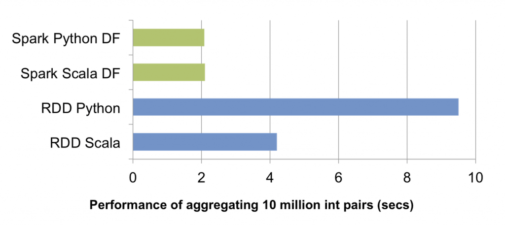

当我们首次开源 Apache Spark 时，我们的目标就是为通用编程语言（Java，Python，Scala）中的分布式数据处理提供一个简单的 API。Spark 在分布式数据集合（RDD）上通过函数转换实现分布式数据处理。这是一个非常强大的API：过去需要数千行代码才能表达的任务 Task 现在只需要几十行。

随着 Spark 不断的发展壮大，我们希望让更多的'大数据'工程师以外的用户能够利用分布式处理的强大功能。新的 DataFrames API 就是为了这个目标而创建的。这个 API 的灵感来自于 R 和 Python（Pandas）中的 Data Frame，但是从头开始设计以支持现代大数据和数据科学应用程序的需求。作为现有 RDD API 的扩展，DataFrame 具有以下特性：
- 能够处理从单台笔记本电脑上的千字节数据到大型群集上的数PB数据
- 支持各种数据格式和存储系统
- 通过 Spark SQL Catalyst 优化器实现代码优化
- 通过 Spark 无缝集成所有大数据工具和基础架构
- 可以在 Python，Java，Scala 和 R 中使用

对于熟悉其他编程语言数据框架的新用户，此 API 让他们感到很熟悉。对于现有的 Spark 用户，此扩展 API 将使 Spark 更易于编程，同时通过智能优化和代码生成来提高性能。

## 1. 什么是 DataFrames

在 Spark 中，DataFrame 是被组织成命名列的分布式数据集合。在概念上等同于关系数据库中的表或 R/Python 中的 data frame，但经过了优化器的优化。DataFrame 可以从各种来源构建，例如：结构化数据文件，Hive 表，外部数据库或现有的 RDD。如下示例展示了如何在 Java 中构建 DataFrame。Scala 和 Python 中提供了类似的API。
```java
SparkSession spark = SparkSession
      .builder()
      .appName("spark data frame example")
      .master("local[*]")
      .getOrCreate();
// 创建DataFrame
Dataset<Row> df = spark.read().json("spark-example-3.1/src/main/resources/data/people.txt");
```

## 2. 如何使用 DataFrames

DataFrames 构建完成后，将为分布式数据操作提供特定于域的语言。以下是使用 DataFrame 处理大量用户的人口统计数据的示例：
```java
// 过滤年龄在30岁以下的用户
Dataset<Row> young = df.filter(col("age").lt(30));
// 创建临时视图 young
young.createOrReplaceTempView("young");
// 统计用户数量
spark.sql("SELECT count(*) FROM young")
```
与 RDD 类似，DataFrame 也是惰性求值的。也就是说，计算只在需要在 Action 操作(例如显示结果，保存输出)时发生。这可以通过应用谓词下推以及字节码生成等技术来优化它们的执行，正如后面的"底层:智能优化和代码生成"一节所解释的那样。所有 DataFrame 操作也自动并行化并分布在集群上。

## 3. 支持的数据格式和来源

现代应用程序通常需要从各种来源收集和分析数据。DataFrame 支持从最流行的格式读取数据，包括 JSON文件、Parquet 文件、Hive 表，可以开箱即用。也可以通过 JDBC 从本地文件系统、分布式文件系统(HDFS)、云存储(S3)以及外部关系数据库系统读取数据。此外，通过 Spark SQL 的外部数据源 API, DataFrames 可以扩展到支持任何第三方数据格式或数据源。目前第三方扩展包括 Avro、CSV、ElasticSearch 和 Cassandra 等等。


DataFrame 对数据源的支持使应用程序能够轻松地组合来自不同数据源的数据(在数据库系统中称为联邦查询处理)。例如，可以将存储在 S3 中的站点的文本流量日志与 PostgreSQL 数据库连接起来，以计算每个用户访问该站点的次数。

## 4. 应用:高级分析和机器学习

数据科学家正在使用越来越复杂的技术，而不仅仅是 JOIN 和聚合。为了支持这一点，DataFrame 可以直接在 MLlib 的机器学习管道 API 中使用。此外，程序可以在 DataFrame 上运行任意复杂的用户自定义函数。大多数常见的高级分析任务都可以使用 MLlib 中的新管道 API 来指定。

## 5. 底层:智能优化和代码生成

与 R 和 Python 中急切求值的 Data Frame 不同，Spark 中的 DataFrame 的执行由查询优化器自动优化。在开始对 DataFrame 进行任何计算之前，Catalyst 优化器将用于构建 DataFrame 的操作编译为一个物理计划以供执行。因为优化器可以理解操作的语义和数据的结构，所以优化器可以做出明智的决策来优化计算速度。

在高层次上，有两种类型的优化。首先，Catalyst 应用逻辑优化，比如谓词下推。优化器可以将过滤器谓词下推到数据源中，从而使物理执行能够跳过不相关的数据。例如操作 Parquet 文件时，可以跳过整个块并且可以通过字典编码将字符串上的比较转换为更便宜的整数比较。例如在操作关系数据库时，谓词被下推到外部数据库中，以减少数据流量。

其次，Catalyst 将操作编译成执行的物理计划，并为这些计划生成 JVM 字节码，这些计划通常比手工编写的代码更优化。例如，可以在广播 JOIN 和 Shuffle JOIN 之间进行智能选择，以减少网络流量。还可以执行较低级别的优化，例如消除昂贵的对象分配和减少虚拟函数调用。因此，当现有的 Spark 程序迁移到 DataFrame 时，我们期望它们的性能得到改善。



上面的图表比较了在一台机器上对 1000 万整数对运行分组聚合的运行时性能。由于 Scala 和 Python 的 DataFrame 操作都被编译成 JVM 字节码执行，所以这两种语言之间几乎没有什么区别，而且它们的性能都比普通的 Python RDD 变体高出5倍，比 Scala RDD 变体高出2倍。

DataFrame 的灵感来自于之前的分布式数据框架，包括 Adatao 的 DDF 和 Ayasdi 的 BigDF。然而，与这些项目的主要区别在于 DataFrame 经过了 Catalyst 优化器优化，从而实现了类似于 Spark SQL 查询的优化执行。随着我们对 Catalyst 优化器的改进，该引擎也变得更加智能，在 Spark 的每个新版本中，应用程序都变得更快。


原文：https://databricks.com/blog/2015/02/17/introducing-dataframes-in-spark-for-large-scale-data-science.html
