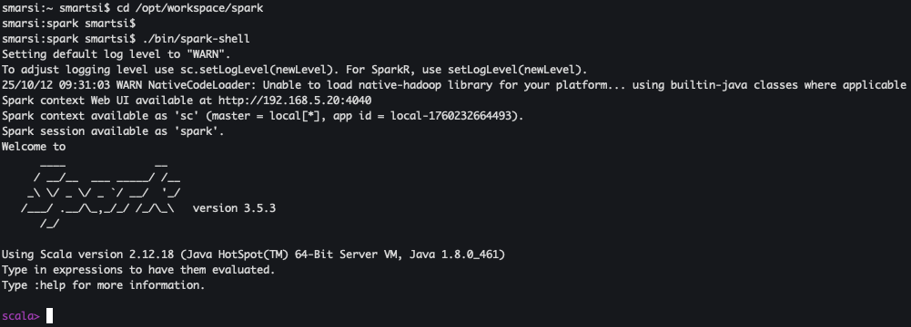
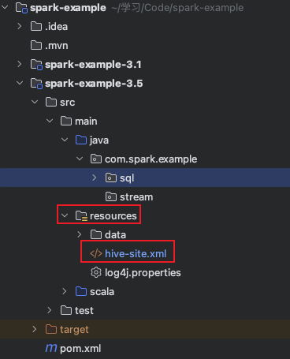

> Spark版本: 3.5.3

Spark SQL 支持读取和写入存储在 Apache Hive 中的数据。但是，由于 Hive 具有大量依赖项，这些依赖项不包含在默认 Spark 发行版中。如果在类路径 classpath 中可以找到 Hive 依赖项，Spark 会自动加载。需要注意的是这些 Hive 依赖项也必须存在于所有 Worker 节点上，因为需要访问 Hive 序列化和反序列化库 (SerDes)才可以访问存储在 Hive 中的数据。通过将 `hive-site.xml` 文件放在 Spark 的 `conf/` 中来完成 Hive 配置，此外如果还需要访问 HDFS，也需要将 `core-site.xml` 和 `hdfs-site.xml` 放在 `conf/` 中。

下面介绍几种读写 Hive 的交互方式。

## 1. 通过 spark-shell 读写 Hive

第一种方式通过 spark-shell 与 Hive 交互实现读写数据。

## 1.1 环境配置

Spark 要接管 Hive 需要把 `hive-site.xml` 拷贝到 `conf/` 目录下：
```
cp /opt/workspace/hive/conf/hive-site.xml /opt/workspace/spark/conf/
```
Spark 使用 Hive 元数据存储时，需要连接到 MySQL 数据库来存储元数据信息，因此需要把 Mysql 驱动 拷贝到 `jars/` 目录下：
```
cp /opt/workspace/hive/lib/mysql-connector-java-8.0.16.jar /opt/workspace/spark/jars/
```

> 如果访问不到hdfs, 则需要把core-site.xml和hdfs-site.xml 拷贝到conf/目录下.

### 1.2 启动 spark-shell

在 Spark shell 中，已经为你创建了一个专有的 `SparkContext`，可以直接通过变量 `sc` 访问，但是无法直接使用你自己创建的 `SparkContext` 的。可以用 `--master` 参数来设置 `SparkContext` 要连接的集群，用 `--jars` 来设置需要添加到 classpath 中的 JAR 包，如果有多个 JAR 包使用逗号分割符连接。你还可以通过 `--packages` 参数提供逗号分隔的 maven 坐标列表，将依赖关系（例如Spark Packages）添加到 shell 会话中。依赖项存在的任何可选存储库（例如Sonatype）可以传递给 `--repositories` 参数。

使用 `./bin/spark-shell` 命令来启动 spark-shell：



### 1.3 与 Hive 交互

#### 1.3.1 读取 Hive

查看所有数据库：
```sql
scala> spark.sql("show databases").show();
+---------+
|namespace|
+---------+
|  default|
+---------+
```

查看默认数据库下的所有表：
```sql
scala> spark.sql("show tables").show
+---------+--------------------+-----------+
|namespace|           tableName|isTemporary|
+---------+--------------------+-----------+
|  default|   dim_user_behavior|      false|
|  default|  dws_mt_qs_order_dd|      false|
|  default|                 src|      false|
|  default|            tb_order|      false|
|  default|     tb_order_bucket|      false|
|  default|tb_order_sorted_b...|      false|
|  default|          tb_payment|      false|
|  default|   tb_payment_bucket|      false|
|  default|tb_payment_sorted...|      false|
|  default|          tb_product|      false|
|  default|         tb_province|      false|
|  default|tmp_hive_managed_...|      false|
|  default|       user_behavior|      false|
+---------+--------------------+-----------+
```
运行 Spark SQL 查询订单表中的订单个数：
```sql
scala> spark.sql("SELECT COUNT(*) FROM tb_order").show();
+--------+
|count(1)|
+--------+
|20000000|
+--------+
```

#### 1.3.2 写入 Hive

创建 Hive 表:
```sql
scala> spark.sql("CREATE TABLE IF NOT EXISTS tmp_1 (key INT, value STRING) USING hive");
res3: org.apache.spark.sql.DataFrame = []
```
导入数据:
```sql
scala> spark.sql("LOAD DATA LOCAL INPATH '/Users/smartsi/学习/Code/spark-example/spark-example-3.5/src/main/resources/data/kv.txt' INTO TABLE tmp_1");
res4: org.apache.spark.sql.DataFrame = []
```
查询新创建的 Hive 表：
```sql
scala> spark.sql("SELECT * FROM tmp_1").show();
+---+-------+
|key|  value|
+---+-------+
|238|val_238|
| 86| val_86|
|311|val_311|
...
| 66| val_66|
|128|val_128|
|213|val_213|
+---+-------+
only showing top 20 rows
```
执行聚合函数统计新创建表中的行数：
```sql
// 聚合
scala> spark.sql("SELECT COUNT(*) FROM tmp_1").show();
+--------+
|count(1)|
+--------+
|     500|
+--------+
```

## 2. 通过 spark-sql 读写 Hive

第二种方式通过 spark-sql 与 Hive 交互实现读写数据。

在上述 spark-shell 中执行查询都需要运行 `spark.sql("").show` 格式命令，比较麻烦。Spark 专门给我们提供了书写 SQL 的工具: spark-sql。

> 环境配置与 spark-shell 一样，在 spark-shell 部分已经介绍过了，在这不再说明。

### 2.1 启动 spark-sql

使用 `./bin/spark-sql` 命令启动 spark-sql：
```
smarsi:spark smartsi$ ./bin/spark-sql
Setting default log level to "WARN".
To adjust logging level use sc.setLogLevel(newLevel). For SparkR, use setLogLevel(newLevel).
Spark Web UI available at http://192.168.5.20:4040
Spark master: local[*], Application Id: local-1760198943267
spark-sql (default)>
```

### 2.2 与 Hive 交互

### 2.2.1 读取 Hive

查看所有数据库：
```sql
spark-sql (default)> show databases;
default
Time taken: 0.648 seconds, Fetched 1 row(s)
```

查看默认数据库下的所有表：
```sql
spark-sql (default)> show tables;
dim_user_behavior
dws_mt_qs_order_dd
src
tb_order
tb_order_bucket
tb_order_sorted_bucket
tb_payment
tb_payment_bucket
tb_payment_sorted_bucket
tb_product
tb_province
tmp_1
tmp_hive_managed_table
user_behavior
Time taken: 0.118 seconds, Fetched 14 row(s)
```
运行 Spark SQL 查询订单表中的订单个数：
```sql
spark-sql (default)> SELECT COUNT(*) FROM tb_order;
20000000
Time taken: 2.82 seconds, Fetched 1 row(s)
```

#### 2.2.2 写入 Hive

创建 Hive 表:
```sql
spark-sql (default)> CREATE TABLE IF NOT EXISTS tmp_2 (key INT, value STRING) USING hive;
Time taken: 0.224 seconds
```
导入数据:
```sql
spark-sql (default)> LOAD DATA LOCAL INPATH '/Users/smartsi/学习/Code/spark-example/spark-example-3.5/src/main/resources/data/kv.txt' INTO TABLE tmp_2;
Time taken: 0.319 seconds
```
查询新创建的 Hive 表：
```sql
spark-sql (default)> SELECT * FROM tmp_2;
238	val_238
86	val_86
311	val_311
27	val_27
165	val_165
...
403	val_403
400	val_400
200	val_200
97	val_97
Time taken: 0.125 seconds, Fetched 500 row(s)
```
执行聚合函数统计新创建表中的行数：
```sql
spark-sql (default)> SELECT COUNT(*) FROM tmp_2;
500
Time taken: 0.109 seconds, Fetched 1 row(s)
```

## 3. 通过编程方式读写 Hive

第三种方式通过编程方式与 Hive 交互实现读写数据。

### 3.1 配置

将 Hive 的配置文件 `$HIVE_HOME/conf/hive-site.xml` 拷贝到 `resources` 目录下：



核心配置如下所示：
```xml
<configuration>
    <property>
        <name>hive.metastore.warehouse.dir</name>
        <value>/user/hive/warehouse</value>
    </property>

    <property>
        <name>hive.metastore.port</name>
        <value>9083</value>
    </property>

    <property>
        <name>javax.jdo.option.ConnectionUserName</name>
        <value>root</value>
    </property>

    <property>
        <name>javax.jdo.option.ConnectionPassword</name>
        <value>root</value>
    </property>

    <property>
        <name>javax.jdo.option.ConnectionURL</name>
        <value>jdbc:mysql://localhost:3306/hive_meta?createDatabaseIfNotExist=true</value>
    </property>

    <property>
        <name>javax.jdo.option.ConnectionDriverName</name>
        <value>com.mysql.cj.jdbc.Driver</value>
    </property>
</configuration>
```

### 3.2 添加依赖

与 Hive 交互需要添加 Hive 依赖：
```xml
<!-- Spark Hive -->
<dependency>
    <groupId>org.apache.spark</groupId>
    <artifactId>spark-hive_${scala.binary.version}</artifactId>
    <version>${spark.version}</version>
</dependency>
```
Spark 使用 Hive 元数据存储时，需要连接到 MySQL 数据库来存储元数据信息，因此需要添加如下 MySQL 驱动依赖：
```xml
<dependency>
    <groupId>mysql</groupId>
    <artifactId>mysql-connector-java</artifactId>
    <version>8.0.16</version>
</dependency>
```

### 3.3 与 Hive 交互

当使用 Hive 时，必须实例化支持 Hive 的 SparkSession，这样可以连接到持久化的 Hive 元数据，支持 Hive serdes 以及 Hive 用户自定义的函数。实例化支持 Hive 的 SparkSession 只需要在 SparkSession 中添加 `enableHiveSupport()`：
```java
SparkSession spark = SparkSession
        .builder()
        .master("local[*]")
        .appName("Java Spark Hive Example")
        .enableHiveSupport()
        .getOrCreate();
```

#### 3.3.1 读取 Hive

```java
SparkSession spark = SparkSession
        .builder()
        .master("local[*]")
        .appName("Java Spark Hive Example")
        .enableHiveSupport()
        .getOrCreate();

// 读取
spark.sql("show databases").show();
// +---------+
// |namespace|
// +---------+
// |  default|
// +---------+
spark.sql("show tables").show();
// +--------+--------------------+-----------+
// |database|           tableName|isTemporary|
// +--------+--------------------+-----------+
// | default|   dim_user_behavior|      false|
// | default|  dws_mt_qs_order_dd|      false|
// | default|            tb_order|      false|
// | default|     tb_order_bucket|      false|
// | default|tb_order_sorted_b...|      false|
// | default|          tb_payment|      false|
// | default|   tb_payment_bucket|      false|
// | default|tb_payment_sorted...|      false|
// | default|          tb_product|      false|
// | default|         tb_province|      false|
// | default|tmp_hive_managed_...|      false|
// | default|       user_behavior|      false|
// +--------+--------------------+-----------+
spark.sql("SELECT COUNT(*) FROM tb_order").show();
// +--------+
// |count(1)|
// +--------+
// |20000000|
// +--------+
```

#### 3.3.2 写入 Hive

```java
SparkSession spark = SparkSession
        .builder()
        .master("local[*]")
        .appName("HiveWriteExample")
        .enableHiveSupport()
        .getOrCreate();

// 创建 Hive 表
spark.sql("CREATE TABLE IF NOT EXISTS src (key INT, value STRING) USING hive");
// 导入数据
spark.sql("LOAD DATA LOCAL INPATH 'spark-example-3.5/src/main/resources/data/kv.txt' INTO TABLE src");

// 查询
spark.sql("SELECT * FROM src").show();
// +---+-------+
// |key|  value|
// +---+-------+
// |238|val_238|
// | 86| val_86|
// |311|val_311|
// ...

// 聚合
spark.sql("SELECT COUNT(*) FROM src").show();
// +--------+
// |count(1)|
// +--------+
// |    500 |
// +--------+
```

#### 3.3.3 转换 DataSet/DataFrame

从 Hive 读取的数据可以转为 DataSet/DataFrame，从而使用 DataSet/DataFrame 的能力：
```java
SparkSession spark = SparkSession
        .builder()
        .master("local[*]")
        .appName("HiveDataSetExample")
        .enableHiveSupport()
        .getOrCreate();

// DataFrame
// SQL 查询的结果本身就是 dataframe，并支持所有正常功能。
Dataset<Row> dataFrame = spark.sql("SELECT key, value FROM src WHERE key < 10 ORDER BY key");
dataFrame.show();
/*+---+-----+
|key|value|
+---+-----+
|  0|val_0|
|  0|val_0|
|  0|val_0|
|  2|val_2|
|  4|val_4|
|  5|val_5|
|  5|val_5|
|  5|val_5|
|  8|val_8|
|  9|val_9|
+---+-----+*/

// DataSet
Dataset<String> dataset = dataFrame.map(
        (MapFunction<Row, String>) row -> "Key: " + row.get(0) + ", Value: " + row.get(1),
        Encoders.STRING());
dataset.show();

/*+--------------------+
|               value|
+--------------------+
|Key: 0, Value: val_0|
|Key: 0, Value: val_0|
|Key: 0, Value: val_0|
|Key: 2, Value: val_2|
|Key: 4, Value: val_4|
|Key: 5, Value: val_5|
|Key: 5, Value: val_5|
|Key: 5, Value: val_5|
|Key: 8, Value: val_8|
|Key: 9, Value: val_9|
+--------------------+*/
```
