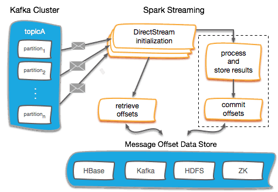

Apache Spark Streaming 经常与 Kafka 集成使用。但是，用户必须考虑管理 Kafka 的偏移量，以便从故障中恢复流应用程序。在这篇文章中，我们讲解一下如何管理 Kafka 的偏移量，如下提供了几种管理偏移量的方案：
- 在外部数据存储中存储偏移量 Offset
  - Checkpoints
  - HBase
  - ZooKeeper
  - Kafka
- 不管理偏移量 Offset

## 1. 偏移量 Offset 管理概述

Spark Streaming 与 Kafka 的集成允许用户从 Kafka 单个 Topic 甚至多个 Topic 中读取消息。Kafka Topic 通过存储消息的分布式分区来接收消息。每个分区按顺序维护接收到的消息，并用偏移量 Offset 来标识。开发人员可以在 Spark Streaming 作业中通过偏移量 Offset 来控制数据读取的位置，但是这需要好的偏移量 Offset 管理机制。

管理偏移量 Offset 对于保证流式应用程序在整个生命周期中数据的连贯性是非常有益的。例如，如果在应用程序停止或者报错退出之前没有将偏移量 Offset 保存在持久化存储中，那么偏移量范围 Offset Range 就会丢失。此外，如果没有保存每个分区已经读取的偏移量 Offset，Spark Streaming 作业就没有办法从上次断开(停止或者失败)的位置继续处理数据。



上图描述了 Spark Streaming 应用程序中管理偏移量 Offset 的一般流程。可以通过多种方式管理偏移量 Offset，但是一般来说都会遵循下面的步骤：
- 在 Direct DStream 初始化时，可以指定每个 Topic 分区的偏移量 Offset，从而让 Direct DStream 从指定的位置读取数据。偏移量 Offset 就是步骤4中所保存的 Offset 位置。
- 然后读取以及处理这批消息。
- 处理后，存储结果的同时也会保存偏移量 Offset。存储结果和提交偏移量 Offset 的虚线仅仅是显示了操作的一系列步骤。如果用户需要更严格的交付语义，需要进一步执行一系列操作，这包括幂等操作或者通过原子操作的方式保存偏移量 Offset。
- 最后，任何外部持久化存储（如 HBase、Kafka、HDFS 和 ZooKeeper）都可以用来跟踪哪些消息已被处理。即用外部持久化存储来保存偏移量 Offset。

结合业务需求，可以将不同的场景结合到上述步骤中。Spark 的编程灵活性可以让用户细粒度控制偏移量 Offset 的保存。考虑如下应用程序：Spark Streaming 应用程序从 Kafka 中读取消息，并查找 HBase 数据来丰富或转换消息，然后将消息发布到另一个 Topic 或者单独的系统（例如，其他消息传递系统，返回 到 HBase、Solr、DBMS 等）。在这种情况下，我们仅在消息成功发布到外部系统时才认为消息已处理。

## 1. 在外部存储偏移量

在本节中，我们将探索将偏移量 Offset 持久化到外部存储中的不同方案。

对于本节中提到的方法，如果使用 spark-streaming-kafka-0-10 库，我们建议你将 `enable.auto.commit` 设置为 `false`。这个配置仅适用于这个库，如果将 `enable.auto.commit` 设置为 `true`，那么意味着偏移量 Offset 会按照 `auto.commit.interval.ms` 配置的时间间隔自动提交。在 Spark Streaming 中，将其设置为 `true` 会在从 Kafka 读取消息时自动将偏移量 Offset 提交给 Kafka，但这并不一定意味着 Spark 已经完成了这些消息的处理。这不是我们想要的，如果要对偏移量 Offset 提交进行更好的控制，建议将 `enable.auto.commit` 设置为 `false`。

### 1.1 Spark Streaming Checkpoint

保存偏移量 Offset 最简单的方法就是启用 Spark Streaming 的 Checkpoint，因为在 Spark 框架中很容易实现。流处理程序中的 Checkpoint 专门用来保存应用程序的状态，在我们的例子中会保存到 HDFS 中，以便可以在失败时恢复。

对 Kafka 流进行 Checkpoint 会将偏移量 Offset 存储在 Checkpoint 中。如果出现故障，Spark Streaming 应用程序可以从 Checkpoint 中的偏移量 Offset 开始读取消息。但是，Spark Streaming Checkpoint 无法跨应用程序或对 Spark 升级进行恢复，因此这种方案不是很可靠，尤其是当你将此机制用于生产环境中重要的应用程序时。我们不建议通过 Spark Checkpoint 管理偏移量 Offset。

### 1.2 在 HBase 中存储偏移量 Offset

HBase 可以用作外部数据存储来可靠的保存偏移量 Offset。通过在外部存储偏移量 Offset，可以让 Spark Streaming 应用程序能够从任何时间点重新启动以及重新消费消息，只要消息在 Kafka 中仍然存在。

根据 HBase 的通用设计模式，应用程序能够利用 RowKey 和 Column 结构在同一个表中存储多个 Spark Streaming 应用程序和 Kafka Topic 的偏移量 Offset。在下面示例中，写入表的每条记录都可以通过由 Topic 名称、消费者组 ID 以及 Spark Streaming batchTime.milliSeconds 组成的 RowKey 来唯一区分。虽然 batchTime.milliSeconds 不是必需的，但是它能够更好地展示历史每批次的 Offset。HBase 存储30天的数据，如果超出30天则会被移除。下面是 HBase 表 DDL 和结构：
```
-- DDL
create 'stream_kafka_offsets', {NAME=>'offsets', TTL=>2592000}
-- RowKey 布局：
row:              <TOPIC_NAME>:<GROUP_ID>:<EPOCH_BATCHTIME_MS>
column family:    offsets
qualifier:        <PARTITION_ID>
value:            <OFFSET_ID>
```
对每一个批次的消息，使用 saveOffsets() 函数将从指定 Topic 中读取的 Offsets 保存到 HBase 中：
```scala
/*
 Save offsets for each batch into HBase
*/
def saveOffsets(TOPIC_NAME:String,GROUP_ID:String,offsetRanges:Array[OffsetRange],
                hbaseTableName:String,batchTime: org.apache.spark.streaming.Time) ={
  val hbaseConf = HBaseConfiguration.create()
  hbaseConf.addResource("src/main/resources/hbase-site.xml")
  val conn = ConnectionFactory.createConnection(hbaseConf)
  val table = conn.getTable(TableName.valueOf(hbaseTableName))
  val rowKey = TOPIC_NAME + ":" + GROUP_ID + ":" +String.valueOf(batchTime.milliseconds)
  val put = new Put(rowKey.getBytes)
  for(offset <- offsetRanges){
    put.addColumn(Bytes.toBytes("offsets"),Bytes.toBytes(offset.partition.toString),
          Bytes.toBytes(offset.untilOffset.toString))
  }
  table.put(put)
  conn.close()
}
```
在执行流式作业之前，首先使用 getLastCommittedOffsets() 函数从 HBase 中读取 Spark Streaming 应用程序停止时最后一次处理时所保存的 Kafka Topic Offset。
- 场景 1：第一次启动流式作业。从 Zookeeper 中获取给定 Topic 的分区数。所有 Topic 分区的偏移量 Offset 都设置置为 0。
- 场景 2：停止长时间运行的流式作业，给 Kafka Topic 添加新分区。从 Zookeeper 中获取给定 Topic 的分区数。对于 Topic 的所有旧分区，偏移量 Offset 设置为在 HBase 中保存的最新偏移量 Offset。对于 Topic 的所有新分区，偏移量 Offset 都设置为 0。
- 场景 3：停止长时间运行的流式作业，Topic 分区保持不动。在这种情况下，在 HBase 中保存的最新偏移量 Offset 作为每个 Topic 分区的偏移量 Offset。

在启动流式应用程序之后，如果 Topic 添加新分区，那么应用只能读取到应用程序启动之前检测到的老分区中的数据。如果要让流式作业从新添加的 Topic 分区中读取消息，则必须重新启动作业。

```scala
/* Returns last committed offsets for all the partitions of a given topic from HBase in  
following  cases.
*/

def getLastCommittedOffsets(TOPIC_NAME:String,GROUP_ID:String,hbaseTableName:String,
zkQuorum:String,zkRootDir:String,sessionTimeout:Int,connectionTimeOut:Int):Map[TopicPartition,Long] ={

  val hbaseConf = HBaseConfiguration.create()
  val zkUrl = zkQuorum+"/"+zkRootDir
  val zkClientAndConnection = ZkUtils.createZkClientAndConnection(zkUrl,
                                                sessionTimeout,connectionTimeOut)
  val zkUtils = new ZkUtils(zkClientAndConnection._1, zkClientAndConnection._2,false)
  val zKNumberOfPartitionsForTopic = zkUtils.getPartitionsForTopics(Seq(TOPIC_NAME
                                                 )).get(TOPIC_NAME).toList.head.size
  zkClientAndConnection._1.close()
  zkClientAndConnection._2.close()

  //Connect to HBase to retrieve last committed offsets
  val conn = ConnectionFactory.createConnection(hbaseConf)
  val table = conn.getTable(TableName.valueOf(hbaseTableName))
  val startRow = TOPIC_NAME + ":" + GROUP_ID + ":" +
                                              String.valueOf(System.currentTimeMillis())
  val stopRow = TOPIC_NAME + ":" + GROUP_ID + ":" + 0
  val scan = new Scan()
  val scanner = table.getScanner(scan.setStartRow(startRow.getBytes).setStopRow(
                                                   stopRow.getBytes).setReversed(true))
  val result = scanner.next()
  var hbaseNumberOfPartitionsForTopic = 0 //Set the number of partitions discovered for a topic in HBase to 0
  if (result != null){
  //If the result from hbase scanner is not null, set number of partitions from hbase
  to the  number of cells
    hbaseNumberOfPartitionsForTopic = result.listCells().size()
  }

val fromOffsets = collection.mutable.Map[TopicPartition,Long]()

  if(hbaseNumberOfPartitionsForTopic == 0){
    // initialize fromOffsets to beginning
    for (partition <- 0 to zKNumberOfPartitionsForTopic-1){
      fromOffsets += (new TopicPartition(TOPIC_NAME,partition) -> 0)
    }
  } else if(zKNumberOfPartitionsForTopic > hbaseNumberOfPartitionsForTopic){
  // handle scenario where new partitions have been added to existing kafka topic
    for (partition <- 0 to hbaseNumberOfPartitionsForTopic-1){
      val fromOffset = Bytes.toString(result.getValue(Bytes.toBytes("offsets"),
                                        Bytes.toBytes(partition.toString)))
      fromOffsets += (new TopicPartition(TOPIC_NAME,partition) -> fromOffset.toLong)
    }
    for (partition <- hbaseNumberOfPartitionsForTopic to zKNumberOfPartitionsForTopic-1){
      fromOffsets += (new TopicPartition(TOPIC_NAME,partition) -> 0)
    }
  } else {
  //initialize fromOffsets from last run
    for (partition <- 0 to hbaseNumberOfPartitionsForTopic-1 ){
      val fromOffset = Bytes.toString(result.getValue(Bytes.toBytes("offsets"),
                                        Bytes.toBytes(partition.toString)))
      fromOffsets += (new TopicPartition(TOPIC_NAME,partition) -> fromOffset.toLong)
    }
  }
  scanner.close()
  conn.close()
  fromOffsets.toMap
}
```
一旦我们有了最后提交的偏移量（本例中的 fromOffsets），我们就可以创建一个 Kafka Direct DStream：
```
val fromOffsets= getLastCommittedOffsets(topic,consumerGroupID,hbaseTableName,zkQuorum,
                                        zkKafkaRootDir,zkSessionTimeOut,zkConnectionTimeOut)
val inputDStream = KafkaUtils.createDirectStream[String,String](ssc,PreferConsistent,
                           Assign[String, String](fromOffsets.keys,kafkaParams,fromOffsets))
```
在 Kafka DStream 中完成消息处理后，我们可以通过调用 saveOffsets() 来存储 Topic 分区偏移量：
```
/*
For each RDD in a DStream apply a map transformation that processes the message.
*/
inputDStream.foreachRDD((rdd,batchTime) => {
  val offsetRanges = rdd.asInstanceOf[HasOffsetRanges].offsetRanges
  offsetRanges.foreach(offset => println(offset.topic,offset.partition, offset.fromOffset,
                        offset.untilOffset))
  val newRDD = rdd.map(message => processMessage(message))
  newRDD.count()
  saveOffsets(topic,consumerGroupID,offsetRanges,hbaseTableName,batchTime)
})
```
你可以查看 HBase 中为不同 Topic 和消费者组的存储的偏移量 Offset，如下所示：
```
hbase(main):001:0> scan 'stream_kafka_offsets', {REVERSED => true}
ROW                                                COLUMN+CELL
 kafkablog2:groupid-1:1497628830000                column=offsets:0, timestamp=1497628832448, value=285
 kafkablog2:groupid-1:1497628830000                column=offsets:1, timestamp=1497628832448, value=285
 kafkablog2:groupid-1:1497628830000                column=offsets:2, timestamp=1497628832448, value=285
 kafkablog2:groupid-1:1497628770000                column=offsets:0, timestamp=1497628773773, value=225
 kafkablog2:groupid-1:1497628770000                column=offsets:1, timestamp=1497628773773, value=225
 kafkablog2:groupid-1:1497628770000                column=offsets:2, timestamp=1497628773773, value=225
 kafkablog1:groupid-2:1497628650000                column=offsets:0, timestamp=1497628653451, value=165
 kafkablog1:groupid-2:1497628650000                column=offsets:1, timestamp=1497628653451, value=165
 kafkablog1:groupid-2:1497628650000                column=offsets:2, timestamp=1497628653451, value=165
 kafkablog1:groupid-1:1497628530000                column=offsets:0, timestamp=1497628533108, value=120
 kafkablog1:groupid-1:1497628530000                column=offsets:1, timestamp=1497628533108, value=120
 kafkablog1:groupid-1:1497628530000                column=offsets:2, timestamp=1497628533108, value=120
4 row(s) in 0.5030 seconds

hbase(main):002:0>
```
本节中的代码示例使用如下版本的 Spark Streaming Kafka 集成：

| GroupID | ArtifactID | Version |
| :------------- | :------------- | :------------- |
| org.apache.spark  | spark-streaming_2.11 | 2.1.0.cloudera1 |
| org.apache.spark  | spark-streaming-kafka-0-10_2.11 | 2.1.0.cloudera1 |

> 查看 [Github 链接](https://github.com/gdtm86/spark-streaming-kafka-cdh511-testing) 以获取完整的代码示例。

### 1.3 在 ZooKeeper 中存储偏移量 Offset

用户可以在 ZooKeeper 中存储偏移量 Offset，这可以提供一种可靠的方法来从上次停止的位置启动流处理。

在这个方案中，在启动时，Spark Streaming 作业将从 ZooKeeper 中为每个 Topic 分区检索最新处理的偏移量 Offset。如果发现了一个之前没有在 ZooKeeper 中管理的新分区，那么最新处理偏移量 Offset 默认从头开始。处理完每个批次后，用户可以选择存储已处理的第一个或者最后一个偏移量 Offset。此外，ZooKeeper 用来存储偏移量 Offset 的 znode 位置将使用跟旧的 Kafka 消费者 API 一样的格式。因此，用于跟踪或监控存储在 ZooKeeper 中的 Kafka 偏移量 Offset 的工具仍然有效。

初始化 ZooKeeper 连接来在 ZooKeeper 中检索和存储偏移量 Offset：
```
val zkClientAndConnection = ZkUtils.createZkClientAndConnection(zkUrl, sessionTimeout, connectionTimeout)
val zkUtils = new ZkUtils(zkClientAndConnection._1, zkClientAndConnection._2, false)
```
根据消费者组和 Topic 列表来从 ZooKeeper 中获取最后偏移量的方法。
```scala
def readOffsets(topics: Seq[String], groupId:String): Map[TopicPartition, Long] = {

 val topicPartOffsetMap = collection.mutable.HashMap.empty[TopicPartition, Long]
 val partitionMap = zkUtils.getPartitionsForTopics(topics)

 // /consumers/<groupId>/offsets/<topic>/
 partitionMap.foreach(topicPartitions => {
   val zkGroupTopicDirs = new ZKGroupTopicDirs(groupId, topicPartitions._1)
   topicPartitions._2.foreach(partition => {
     val offsetPath = zkGroupTopicDirs.consumerOffsetDir + "/" + partition

     try {
       val offsetStatTuple = zkUtils.readData(offsetPath)
       if (offsetStatTuple != null) {
         LOGGER.info("retrieving offset details - topic: {}, partition: {}, offset: {}, node path: {}", Seq[AnyRef](topicPartitions._1, partition.toString, offsetStatTuple._1, offsetPath): _*)

         topicPartOffsetMap.put(new TopicPartition(topicPartitions._1, Integer.valueOf(partition)),
           offsetStatTuple._1.toLong)
       }

     } catch {
       case e: Exception =>
         LOGGER.warn("retrieving offset details - no previous node exists:" + " {}, topic: {}, partition: {}, node path: {}", Seq[AnyRef](e.getMessage, topicPartitions._1, partition.toString, offsetPath): _*)

         topicPartOffsetMap.put(new TopicPartition(topicPartitions._1, Integer.valueOf(partition)), 0L)
     }
   })
 })

 topicPartOffsetMap.toMap
}
```
使用指定偏移量 Offset 来初始化 Kafka Direct Dstream 来处理消息：
```
val inputDStream = KafkaUtils.createDirectStream(ssc, PreferConsistent, ConsumerStrategies.Subscribe[String,String](topics, kafkaParams, fromOffsets))
```
通过如下方法将一组可恢复的偏移量 Offset 持久化到 ZooKeeper：
```
def persistOffsets(offsets: Seq[OffsetRange], groupId: String, storeEndOffset: Boolean): Unit = {
 offsets.foreach(or => {
   val zkGroupTopicDirs = new ZKGroupTopicDirs(groupId, or.topic);

   val acls = new ListBuffer[ACL]()
   val acl = new ACL
   acl.setId(ANYONE_ID_UNSAFE)
   acl.setPerms(PERMISSIONS_ALL)
   acls += acl

   val offsetPath = zkGroupTopicDirs.consumerOffsetDir + "/" + or.partition;
   val offsetVal = if (storeEndOffset) or.untilOffset else or.fromOffset
   zkUtils.updatePersistentPath(zkGroupTopicDirs.consumerOffsetDir + "/"
     + or.partition, offsetVal + "", JavaConversions.bufferAsJavaList(acls))

   LOGGER.debug("persisting offset details - topic: {}, partition: {}, offset: {}, node path: {}", Seq[AnyRef](or.topic, or.partition.toString, offsetVal.toString, offsetPath): _*)
 })
}
```
> Kafka Offset 在 ZooKeeper 中的存储路径为 /consumers/[groupId]/offsets/topic/[partitionId], 存储的值为 offset

### 1.4 在 Kafka 中存储偏移量 Offset

在 Apache Spark 2.1.x 的 Cloudera 版本中，spark-streaming-kafka-0-10 使用了新消费者 API（对外提供了 commitAsync API）。使用 commitAsync API 可以在确保输出已经存储后，消费者才向 Kafka 提交偏移量 Offset。新的消费者 API 将消费者的 group.id 作为唯一标识将偏移量 Offset 提交回 Kafka。

在 Kafka 中保存偏移量 Offset：
```
stream.foreachRDD { rdd =>
  val offsetRanges = rdd.asInstanceOf[HasOffsetRanges].offsetRanges
  // some time later, after outputs have completed
  stream.asInstanceOf[CanCommitOffsets].commitAsync(offsetRanges)
}
```
### 1.5 其他方案

值得一提的是，你还可以将偏移量 Offset 存储在 HDFS 等存储系统中。与上述方案相比，在 HDFS 中存储偏移量 Offset 不是一种太流行的方案，因为 HDFS 与 ZooKeeper 和 HBase 等其他系统相比具有更高的延迟。此外，如果管理不当，将每个批次的 offsetRanges 存储在 HDFS 中可能会带来小文件问题。

## 2. 不管理偏移量 Offset

管理偏移量 Offset 并不是 Spark Streaming 应用程序的必须要求。例如，实时活动监控只需要流应用程序的当前数据，这种情况下不需要管理偏移量 Offset。在这些不需要管理偏移量 Offset 的情况下，如果使用旧的 Kafka 消费者，可以将 Kafka 参数 `auto.offset.reset` 设置为 `largest` 或者 `smallest`，如果使用新的 Kafka 消费者，可以设置为 `earliest` 或者 `latest`。

当你将 `auto.offset.reset` 设置为 `smallest`（或者 `earliest`）重新启动作业时，将会从 Topic 分区的开头（最小偏移量）重新消费整个日志。使用此设置，将会读取仍保留在 Topic 中的所有消息。这可能会导致重复，具体取决于你的 Kafka Topic 保留时间。或者，如果你将 `auto.offset.reset` 设置为 `largest`（或者 `latest`）重新启动作业时，将会从 Topic 分区的最新偏移量开始读取消息。这可能会导致某些消息丢失。根据你的 Spark Streaming 应用程序的重要性及其所需的交付语义，这或许是一种可行的方案。

## 3. 总结

上面我们讨论的所有管理偏移量 Offset 的方案目的都是在帮助你更好的控制 Spark Streaming 的 Direct DStream。这些方案允许用户在流的生命周期中恢复流的状态，处理意外发生的故障，并提高持续计算和存储结果的准确性。

原文：[Offset Management For Apache Kafka With Apache Spark Streaming](https://blog.cloudera.com/offset-management-for-apache-kafka-with-apache-spark-streaming/)
