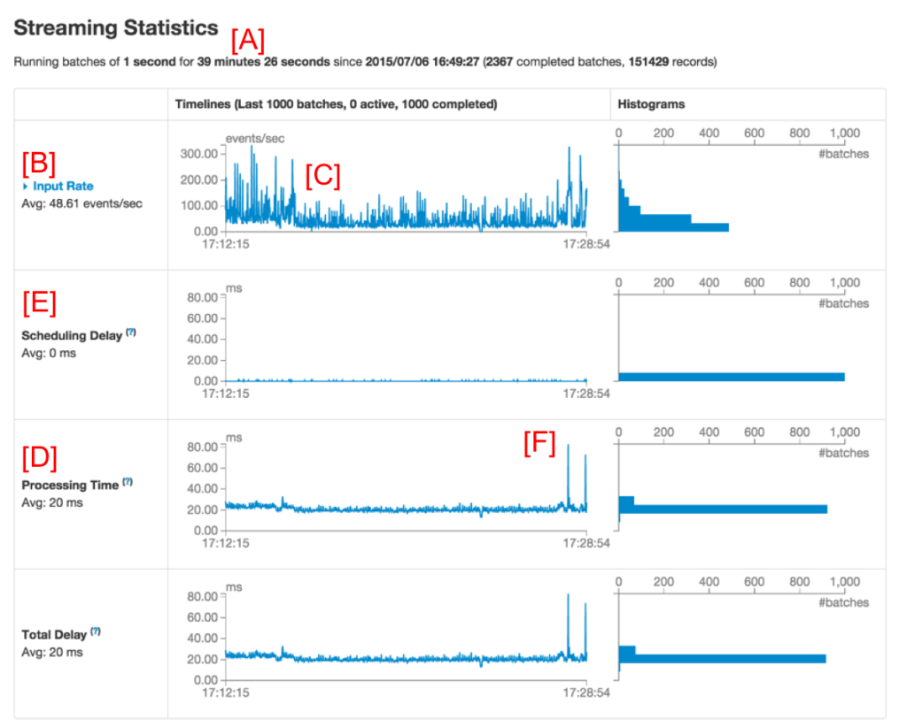
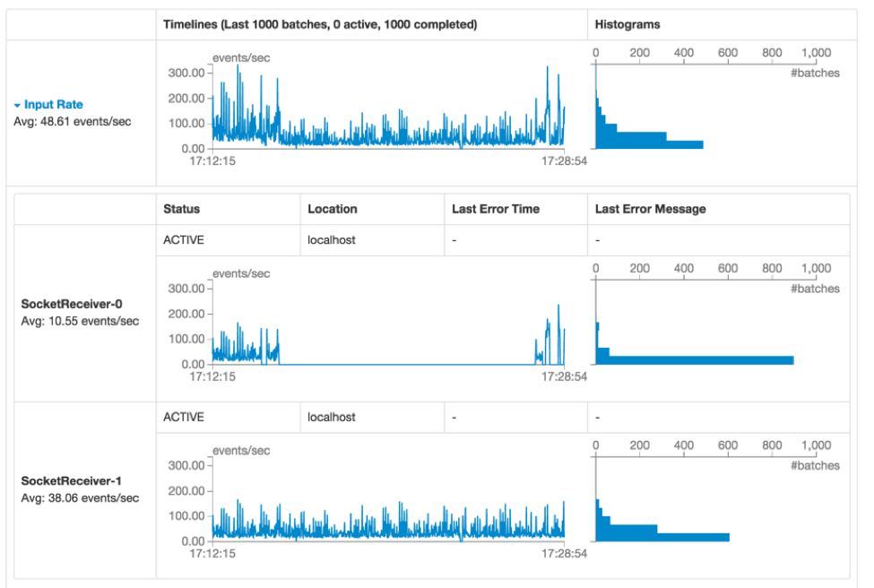
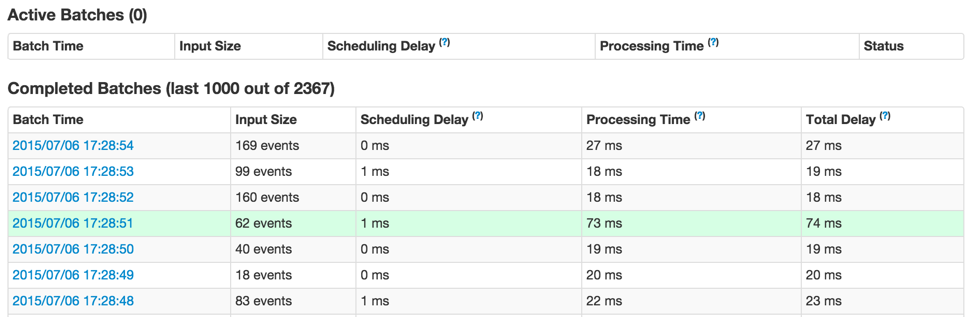
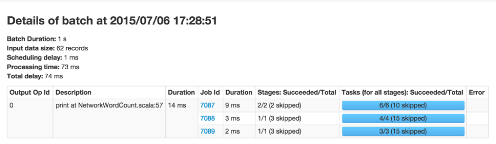
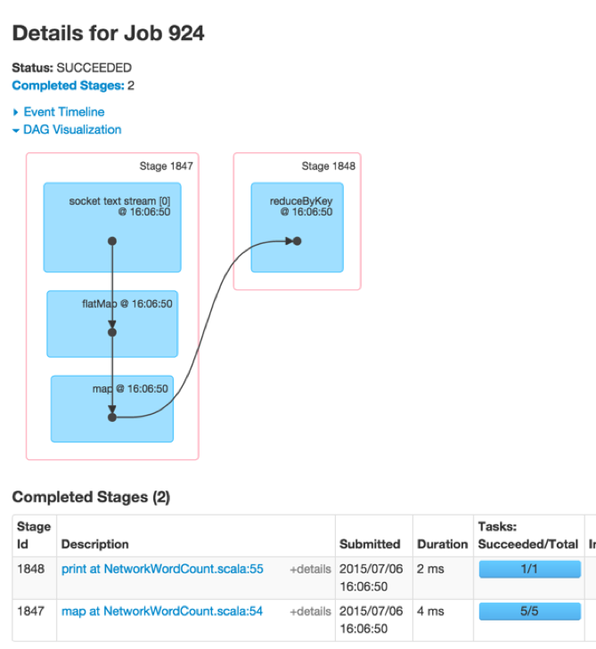
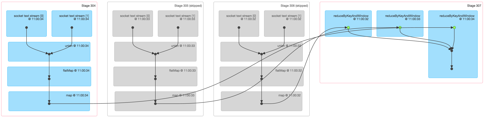
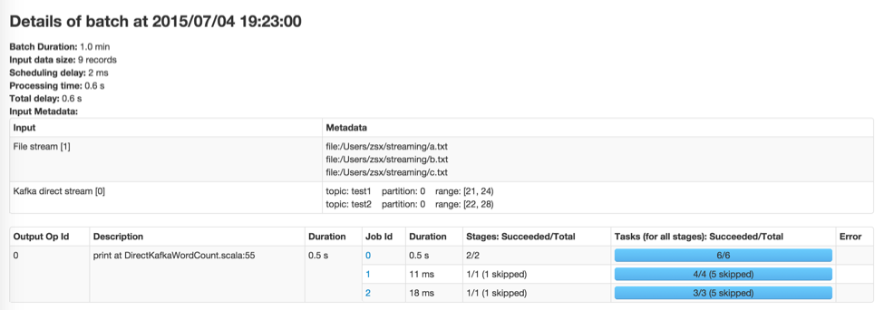

这篇博文将重点介绍为理解 Spark Streaming 应用程序而引入的新的可视化功能。我们已经更新了 Spark UI 中的 Streaming 标签页来显示以下信息：
- 时间轴视图和事件率统计，调度延迟统计以及以往的批处理时间统计
- 每个批次中所有 JOB 的详细信息
此外，为了理解在 Streaming 操作上下文中作业的执行情况，有向无环执行图的可视化增加了 Streaming 的信息。

让我们通过从头到尾分析 Streaming 应用程序的例子详细看一下上面这些新的功能。

### 1. 处理趋势的时间轴和直方图

当我们调试一个 Spark Streaming 应用程序的时候，我们更希望看到数据正在以什么样的速率被接收以及每个批次的处理时间是多少。Streaming 标签页中新的 UI 能够让你很容易的看到目前值以及之前 1000 个批次的趋势情况。当你在运行一个 Streaming 应用程序的时候，如果你去访问 Spark UI 中的 Streaming 标签页，你将会看到类似下图的一些内容（红色的字母，例如[A]，是我们的注释，并不是UI的一部分）。

> 图1

第一行（标记为 [A]）展示了 Streaming 应用程序当前的状态；在这个例子中，应用已经以1秒的批处理间隔运行了将近40分钟;在它下面是输入速率（Input rate）的时间轴（标记为 [B]），显示了 Streaming 应用从它所有的源头以大约每秒 49 个事件的速度接收数据。在这个例子中，时间轴（标记为[C]）显示了在中间位置平均速率有明显的下降，在时间轴快结束的地方应用又恢复了。如果你想得到更多详细的信息，你可以点击 Input Rate 旁边（靠近[B]）的下拉列表来显示每个源头各自的时间轴，正如下图所示：

> 图2

上图显示了这个应用有两个来源，(SocketReceiver-0 和 SocketReceiver-1)，其中的 SocketReceiver-0 导致了整个接收速率的下降，因为它在接收数据的过程中停止了一段时间。

这一页再向下（在图1中标记为 [D] ），处理时间（Processing Time）的时间轴显示，这些批次大约在平均 20 毫秒内被处理完成，和批处理间隔（在本例中是1s）相比花费的处理时间更少，意味着调度延迟（被定义为：一个批次等待之前批次处理完成的时间，被标记为 [E]）几乎是零，因为这些批次在创建的时候就可以被处理了。调度延迟是你的 Streaming 程序是否稳定的关键所在，UI 的新功能使得对它的监控更加容易。

### 3. 批次细节

再次参照第一个图，你可能很好奇，为什么向右的一些批次花费更长的时间才能完成（注意第一个图中的[F]）。你可以通过 UI 轻松的分析原因。首先，你可以点击时间轴视图中批处理时间比较长的点，这将会在页面下方产生一个关于完成批次的详细信息列表。

> 图3

显示了这个批次的所有主要信息（在上图中以绿色高亮显示）。正如你所看到的，这个批次较之其他批次有更长的处理时间。另一个很明显的问题是：到底是哪个 Spark Job 引起了这个批次的处理时间过长。你可以通过点击 Batch Time（第一列中的蓝色链接），这将带你看到对应批次的详细信息，向你展示输出操作和它们的 Spark Job，正如下图所示。

> 图4

上图显示有一个输出操作(Output Op Id = 0)，有 3 个 Spark Job。你可以点击 Job ID 链接继续深入到 stages 和 tasks 做更深入的分析。

### 4. Streaming RDDs 的有向无环执行图

一旦你开始分析批处理 Job 产生的 stages 和 tasks，更加深入的理解执行图将非常有用。正如之前的博文所说，Spark 1.4.0 加入了有向无环执行图（execution DAG ）的可视化（DAG即有向无环图），显示了 RDD 的依赖关系链以及如何处理 RDD 和一系列相关的 stages。如果在一个 Streaming 应用程序中，这些 RDD 是通过 DStreams 产生的，那么可视化将展示额外的 Streaming 语义。让我们从一个简单的 Streaming 字数统计（word count）程序开始，我们将统计每个批次接收的字数。程序示例 [NetworkWordCount](https://github.com/apache/spark/blob/master/examples/src/main/scala/org/apache/spark/examples/streaming/NetworkWordCount.scala) 。它使用 DStream 操作 flatMap, map 和 reduceByKey 来计算字数。任一个批次中一个 Spark Job 的有向无环执行图将会是如下图所示。

> 图5

可视化展示中的黑点代表着在批处理时 16:06:50 由 DStream 产生的 RDD。蓝色阴影的正方形是指用来转换 RDD 的 DStream 操作，粉色的方框代表这些转换操作执行的 stage。总之上图显示了如下信息：
- 数据是在批处理时间 16:06:50 通过一个 socket 文本流（ socket text stream ）接收的。
- 该 Job 中的两个 stage 使用 flatMap、map、reduceByKey 转换操作来计算单词个数

尽管这是一个简单的图表，它可以通过增加更多的输入流和类似 window 操作和 updateStateByKey 等高级的 DStream 转换操作而变得更加复杂。例如，如果我们通过一个含三个批次的滚动窗口来计算字数（即使用 reduceByKeyAndWindow），它的数据来自两个 socket 文本流，那么，一个批处理 Job 的有向无环执行图将会像如下图所示。

> 图6

上图显示了一个跨 3 个批次统计字数的 Spark Job 的许多相关信息：
- 前三个 stage 实际上是各自统计窗口中 3 个批次的字数。这有点像上面例子 NetworkWordCount 的第一个stage，使用的是 map 和 flatmap 操作。不过要注意以下不同点：
  - 这里有两个输入 RDD，分别来自两个 socket 文本流，这两个 RDD 通过 union 结合成一个 RDD，然后进一步转换，产生每个批次的中间统计结果。
  - 其中的两个 stage 都变灰了，因为两个较旧批次的中间结果已经缓存在内存中，因此不需要再次计算，只有最近的批次需要从头开始计算。
- 最后一个右边的 stage 使用 reduceByKeyAndWindow 来联合每个批次的统计字数最终形成一个“窗口”的字数。

这些可视化使得开发人员不仅能够监控 Streaming 应用程序的状态和趋势，而且能够理解它们与底层 Spark Job 和执行计划的关系。

### 5. 未来方向

Spark 1.5.0 中备受期待的一个重要提升是关于每个批次( JIRA ,  PR )中输入数据的更多信息。例如：如果你正在使用Kafka，批处理详细信息页面将会显示这个批次处理的topics, partitions和offsets，预览如下图：

> 图7

> 原文发布时为 2015.07.08

原文：[New Visualizations for Understanding Apache Spark Streaming Applications](https://databricks.com/blog/2015/07/08/new-visualizations-for-understanding-apache-spark-streaming-applications.html)
