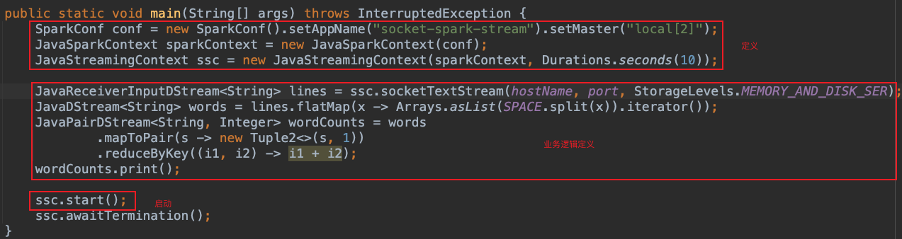

在进入如何编写自己的 Spark Streaming 程序之前，让我们看看一个简单的 Spark Streaming 程序的具体样子，更加直观的认识 Spark Streaming 的程序结构。我们会从一个实例入手来讲解 Spark Streaming 的程序结构。

任何一个 Spark Streaming 程序都会包含如下四个部分：
- 创建一个 Spark Streaming Context 
- 从数据源或者其他 DStream 定义一个或者多个 DStream
- 定义一个或者多个输出操作，物化 DStream 上的操作结果
- 启动 Spark Streaming Context 开始流处理过程

在 Spark Streaming Context 实例的定义和启动之间定义我们的流处理作业逻辑。也就是说在 Context 启动之前定义了整个流处理程序的脚手架，实际上定义了所有的 DStream 及其转换操作，同时将 Spark Streaming 程序的全部行为串联起来。



需要注意的是 Spark Streaming Context 一旦启动，便不能添加的新的 DStream，也不能修改现有的 DStream 结构。

## 1. 创建 Spark Streaming Context

Spark Streaming Context 职责之一是监控 Spark 集群中 DStream 的创建、配置与运行，因而会基于每个间隔所产生的 RDD 来创建作业，同时追踪 DStream 中的血缘关系。为了更清楚的理解这一点，我们来看如何创建一个 Spark Streaming Context 对流进行管理。最简单的方法是在 Spark Shell 中使用 Spark Streaming Context：
```
(base) localhost:~ wy$ spark-shell --master "local[2]"
...
Spark context Web UI available at http://192.168.5.21:4040
Spark context available as 'sc' (master = local[2], app id = local-1733571820123).
Spark session available as 'spark'.
Welcome to
      ____              __
     / __/__  ___ _____/ /__
    _\ \/ _ \/ _ `/ __/  '_/
   /___/ .__/\_,_/_/ /_/\_\   version 3.1.3
      /_/

Using Scala version 2.12.10 (Java HotSpot(TM) 64-Bit Server VM, Java 1.8.0_161)
Type in expressions to have them evaluated.
Type :help for more information.

scala>
```
在这我们创建一个具有两个执行线程的本地 StreamingContext，并且批处理间隔为 10 秒：
```scala
Spark context Web UI available at http://192.168.5.21:4041
Spark context available as 'sc' (master = local[2], app id = local-1733560667535).
Spark session available as 'spark'.
Welcome to
      ____              __
     / __/__  ___ _____/ /__
    _\ \/ _ \/ _ `/ __/  '_/
   /___/ .__/\_,_/_/ /_/\_\   version 3.1.3
      /_/

Using Scala version 2.12.10 (Java HotSpot(TM) 64-Bit Server VM, Java 1.8.0_161)
Type in expressions to have them evaluated.
Type :help for more information.

scala> import org.apache.spark.streaming._
import org.apache.spark.streaming._

scala> val ssc = new StreamingContext(sc, Seconds(10))
ssc: org.apache.spark.streaming.StreamingContext = org.apache.spark.streaming.StreamingContext@52a42e0f
```
或者使用 Java 代码实现：
```java
SparkConf conf = new SparkConf().setAppName("socket-spark-stream").setMaster("local[2]");
JavaSparkContext sparkContext = new JavaSparkContext(conf);
JavaStreamingContext ssc = new JavaStreamingContext(sparkContext, Durations.seconds(10));
```

> 初学者在测试 Spark Streaming 程序经常犯的一个错误是使用本地模式只分配一个核(`setMaster("local[1]")`) 或者运行在一个单核的虚拟机上。这样的话，接受者(Receiver)的数据消费会阻止该机器的 Spark 处理，从而造成流处理作业无法运行。

## 2. 定义 DStream

下面定义一个 DStream，监听来自本地 8088 端口的数据。DStream 本身不会执行数据处理，同 RDD 需要行动操作才能触发计算结果类似，DStream 也需要定义输出操作才能触发转换操作的执行。在下面我们使用 count 转换来统计每个批次间隔内所接收到的元素个数：
```scala
scala> val dstream = ssc.socketTextStream("localhost", 8088)
dstream: org.apache.spark.streaming.dstream.ReceiverInputDStream[String] = org.apache.spark.streaming.dstream.SocketInputDStream@74f6fa34

scala> val countStream = dstream.count()
countStream: org.apache.spark.streaming.dstream.DStream[Long] = org.apache.spark.streaming.dstream.MappedDStream@2ef4e7f3
```

## 3. 定义输出操作

下面我们会使用 print 行动操作在每个批次间隔输出 DStream 中的一部分元素：
```scala
scala> countStream.print()
```
此外还需要为流作业程序提供输入数据，需要在另外一个控制台，循环遍历一个包含字符的文件，并使用一个 Bash 脚本通过本地的 TCP socket 发送：
```shell
{while :; do cat words.txt; sleep 1; done;} | netcat -l -p 8088
```
这样就可以不断循环遍历文件，并且通过 TCP Socket 一直不停地发送数据。

## 4. 启动 Spark Streaming Context

到目前为止我们已经创建了 DStream，定义了一个简单的 count 转换操作以及一个 print 行动操作来输出结果。此外为流作业程序提供输入数据还启动了一个 Socket 服务，通过循环遍历一个包含字符的文件将其发送到 socket。但是，到目前我们迟迟没有等到输出结果。为了上述定义的转换真正的运行起来，我们需要启动 Spark Streaming Context：
```scala
scala> ssc.start()

scala>
-------------------------------------------
Time: 1733566290000 ms
-------------------------------------------
1392

-------------------------------------------
Time: 1733566330000 ms
-------------------------------------------
648
```

## 5. 停止 Streaming 进程

学习 Spark Streaming 的最后一步就是停止流处理的进程。一旦 StreamingContext 停止，其作用域内定义的所有 DStream 都将停止，也就不在消费数据：
```scala
scala> ssc.stop(stopSparkContext = false)
```
注意不能重启一个停止的 StreamingContext。如果需要重启一个已经停止的作业，则需要从 StreamingContext 创建开始重新执行整个过程。
