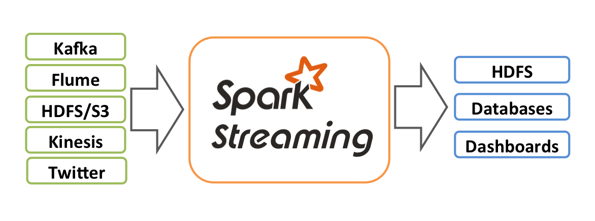

> Spark 版本：3.1.3

## 1. 概述

Spark Streaming 是 Spark Core API 的一个扩展，它对实时流式数据的处理具有可扩展性、高吞吐量、可容错性等特点。数据可以从诸如 Kafka，Flume，Kinesis 或 TCP 套接字等许多源中提取，并且可以使用由诸如 map，reduce，join 或者 window 等高级函数组成的复杂算法来处理。最后，处理后的数据可以推送到文件系统、数据库、实时仪表盘中。事实上，你可以将处理后的数据应用到 Spark 的机器学习算法、 图处理算法中去。



内部工作原理如下图所示。Spark Streaming 接收实时输入数据流，并将数据分成多个批次，然后由 Spark 引擎处理，批量生成最终结果数据流。


Spark Streaming 提供了一个叫做[离散流](https://smartsi.blog.csdn.net/article/details/59124906)(discretized stream)或称作 DStream 的高级抽象，它表示连续的数据流。DStreams 可以从如 Kafka，Flume和 Kinesis 等数据源的输入数据流创建，也可以通过对其他 DStreams 应用高级操作来创建。在内部，DStream 表示为 RDD 序列，即由一系列的 RDD 组成。

本文章介绍如何使用 DStreams 编写 Spark Streaming 程序。 可以使用 Scala，Java 或者 Python 编写 Spark Streaming 程序，本文只使用 Java 作为演示示例，其他可以参考[原文](http://spark.apache.org/docs/3.1.3/streaming-programming-guide.html)。

## 2. Maven依赖

与 Spark 类似，Spark Streaming 通过 Maven 提供。要编写自己的 Spark Streaming 程序，必须将以下依赖项添加到 Maven 项目中：
```xml
<dependency>
    <groupId>org.apache.spark</groupId>
    <artifactId>spark-streaming_2.12</artifactId>
    <version>3.1.3</version>
</dependency>
```

对于从 Spark Streaming Core API 中不存在的来源（如Kafka，Flume和Kinesis）获取数据，必须将相应的组件 spark-streaming-xyz_2.12 添加到依赖项中。 例如，一些常见的如下：

Source | Artifact
--- | ---
Kafka|spark-streaming-kafka-0-8_2.12
Flume|spark-streaming-flume_2.12
Kinesis|spark-streaming-kinesis-asl_2.12 [Amazon Software License]

## 3. 示例

在进入如何编写自己的 Spark Streaming 程序之前，让我们快速看看一个简单的 Spark Streaming 程序的具体样子。假设我们要在 Socket 的数据服务器接收的文本数据中统计包含的单词数。

首先，我们创建一个 JavaStreamingContext 对象，这是所有流功能的主要入口点。在这我们创建一个具有两个执行线程的本地 StreamingContext，并且批处理间隔为 1 秒：
```java
import org.apache.spark.SparkConf;
import org.apache.spark.api.java.JavaSparkContext;
import org.apache.spark.streaming.Durations;
import org.apache.spark.streaming.api.java.JavaStreamingContext;

SparkConf conf = new SparkConf().setAppName("socket-spark-stream").setMaster("local[2]");
JavaSparkContext sparkContext = new JavaSparkContext(conf);
JavaStreamingContext ssc = new JavaStreamingContext(sparkContext, Durations.seconds(1));
```

使用此 context，我们可以创建一个 DStream，表示来自 Socket 的流数据，需要指定主机名（例如 localhost）和端口（例如 9100）:
```java
import org.apache.spark.streaming.api.java.JavaReceiverInputDStream;

private static String hostName = "localhost";
private static int port = 9100;

// 以端口 9100 作为输入源创建DStream
JavaReceiverInputDStream<String> lines = ssc.socketTextStream(hostName, port);
```

DStream lines 表示从 Socket 接收的数据流。流中的每条记录都是一行文本。然后，我们要将每行文本切分为单词：
```java
// 从 DStream 中将每行文本切分为单词
JavaDStream<String> words = lines.flatMap(new FlatMapFunction<String, String>() {
    @Override
    public Iterator<String> call(String x) {
        return Arrays.asList(x.split(" ")).iterator();
    }
});
```
flatMap 是一个 DStream 操作，将源 DStream 中的每条记录拆分成多条新记录来创建新的 DStream。在我们例子中，每一行都被拆分成多个单词，并用 words 这个 DStream 来表示。下一步，我们计算单词的个数：
```java
// 在每个批次中计算单词的个数
JavaPairDStream<String, Integer> pairs = words.mapToPair(new PairFunction<String, String, Integer>() {
    @Override
    public Tuple2<String, Integer> call(String s) {
        return new Tuple2<>(s, 1);
    }
});

JavaPairDStream<String, Integer> wordCounts = pairs.reduceByKey(new Function2<Integer, Integer, Integer>() {
    @Override
    public Integer call(Integer i1, Integer i2) {
        return i1 + i2;
    }
});

// 将 DStream 中生成的每个RDD的前10个元素打印到控制台
wordCounts.print();
```
使用 PairFunction 函数将 DStream words 进一步映射为 `(word，1)` 键值对的 DStream。然后使用 Function2 函数计算每批次数据中的单词出现的频率。最后使用 wordCounts.print() 打印输出到控制台上。

需要注意的是，当以上这些代码被执行时，Spark Streaming 仅仅准备好了它要执行的计算，实际上并没有真正开始执行。在这些转换操作准备好之后，要真正执行计算，必须显式调用 StreamingContext 的 start() 方法。这样，SparkStreaming 就会开始把 Spark 作业不断的交给 SparkContext 去调度。执行会在另一个线程中进行，所以需要调用 awaitTermination() 函数来等待流计算完成，来防止应用退出：
```java
// 启动流计算环境 StreamingContext 并等待完成
ssc.start();
// 等待作业完成
ssc.awaitTermination();
```
> 一个 Streaming context 只启动一次，所以只有在配置好所有 DStream 以及所需的操作之后才能启动。

如果你已经下载和构建了 Spark 环境，你就能够用如下的方法运行这个例子。首先，你需要运行 Netcat 作为数据服务器：
```
xiaosi@yoona:~$ nc -lk 9100
hello I am flink hello
...
```
然后在另一个终端里使用如下方式运行我们的程序：
```
spark-submit --class com.spark.example.streaming.base.SocketWordCount /Users/wy/study/code/data-example/spark-example-3.1/target/spark-example-3.1-1.0.jar
```
输出信息：
```
-------------------------------------------
Time: 1665295160000 ms
-------------------------------------------
(am,1)
(flink,1)
(hello,2)
(I,1)
```
> 完整代码请查阅 [SocketWordCount](https://github.com/sjf0115/data-example/blob/master/spark-example-3.1/src/main/java/com/spark/example/streaming/base/SocketWordCount.java) 以及 Lambda 版本 [SocketWordCountLambda](https://github.com/sjf0115/data-example/blob/master/spark-example-3.1/src/main/java/com/spark/example/streaming/base/SocketWordCountLambda.java)

可以通过 Web UI 查看作业详情，点击 `http://localhost:4040/` 进入。
