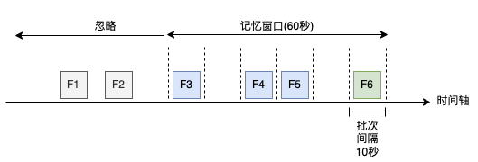
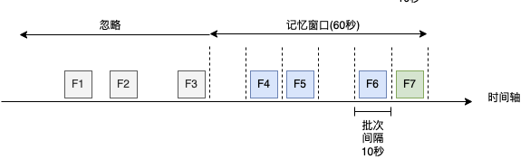

我们在入门示例[Spark Streaming 第一个应用程序 WordCount](https://smartsi.blog.csdn.net/article/details/127231676)中使用 `ssc.socketTextStream()` 通过 TCP 套接字连接接收文本数据。除了套接字，StreamingContext API 还提供了从文件创建 DStreams 作为输入源的方法，并且提供了多个版本。

## 1. 方法

从与 HDFS API 兼容的文件系统（即HDFS、S3、NFS等）上读取文件数据，其中最简单的方法就是从文件系统的路径中加载一个文本文件流：
```java
StreamingContext.textFileStream（dataDirectory）
```
类似的，也可以加载一个二进制文件流，并设置固定的记录长度参数：
```java
StreamingContext.binaryRecordsStream(directory, recordLength)
```
如果是自定义的数据格式，则可以使用文件 Source 的通用格式来调用：
```java
StreamingContext.fileStream(directory, kClass, vClass, fClass)
```
> 文件流不需要运行接收器 Recevier，因此不需要为接收文件数据分配任何内核。

## 2. 流程

在每个批次间隔，文件 Source 都会检查监控目录列表。目录中的新文件都会被读取为一个 RDD，并交由 Spark 处理。那新文件是如何定义的呢：
- 每个批次间隔都会计算目录列表
- 文件的年龄由最后修改时间戳来决定
- 修改时间戳在处理窗口间隔内的文件会被处理，并加入已处理文件列表
- 在处理窗口间隔内会记住已处理的文件，保证这些文件不会被再次选择
- 早于处理窗口间隔的文件会被忽略。如果文件再之前被记住，则会从记忆列表里移除，即遗忘掉

下面让我们详细看一下 Spark Streaming 中文件 Source 在某个时刻的记忆窗口：



从上图中可以看到记忆窗口长度为 60 秒，批次间隔为 10 秒，记忆窗口包含了 6 个批次。文件 F1 和 F2 处于被忽略区域，可能是因为之前被处理过了，也有可能是从程序上线开始就不曾出现在记忆窗口中。文件 F3、F4 和 F5 已经在之前中被处理了，则会从记忆列表中移除，被程序遗忘掉。文件 F6 是新产生的且不曾被处理，因此会加入记忆列表等待被处理。

等到下一个批次间隔，如下图所示，我们可以看到 F3 加入了被忽略区域、F6 从记忆列表中移除。新文件 F7 加入记忆列表等待被处理:



该过程会随着 Spark Streaming 一直持续进行。可以通过设置 `spark.streaming.minRememberDuration` 参数配置记忆窗口的长度，默认为 60 秒。需要注意的是这里假定文件系统的时钟与 Spark Streaming 作业中 executor 的时钟是保持同步的。这个参数对于动态调整 Spark Streaming 的数据保留时间至关重要，因为它决定了微批次在处理过程中应当保留数据的最小时间。假设配置 `spark.streaming.minRememberDuration` 参数为 45 秒，记忆窗口也可能不为 45 秒。因为记忆窗口还会根据微批来计算，实际记忆窗口计算公式为 `记忆窗口/批次间隔的值向上取值 * 批次间隔`，即批次间隔的整数倍数。假设使用默认 60 秒的记忆窗口和 45 秒的批次间隔，那么实际记忆窗口为 `ceil(60/45) * 45`，即实际的记忆窗口长度为 90 秒。

## 3. 实战

假设我们有一个 Hive 表 `tag_user`，其对应的 HDFS 文件路径为 `hdfs://localhost:9000/user/hive/warehouse/tag_user`：
```sql
CREATE TABLE `tag_user`(
  `tag_id` string COMMENT 'tag_id',
  `user_id` bigint COMMENT 'user id')
ROW FORMAT SERDE
  'org.apache.hadoop.hive.serde2.lazy.LazySimpleSerDe'
WITH SERDEPROPERTIES (
  'field.delim'='\t',
  'line.delim'='\n',
  'serialization.format'='\t')
STORED AS INPUTFORMAT
  'org.apache.hadoop.mapred.TextInputFormat'
OUTPUTFORMAT
  'org.apache.hadoop.hive.ql.io.HiveIgnoreKeyTextOutputFormat'
LOCATION
  'hdfs://localhost:9000/user/hive/warehouse/tag_user'
TBLPROPERTIES (
  'transient_lastDdlTime'='1734151868'
)
```
假设我们用 Spark Streaming 读取 Hive 表对应的 HDFS 文件：
```java
public class TextFileStreamSourceExample {
    public static void main(String[] args) throws InterruptedException {
        SparkConf conf = new SparkConf().setAppName("text-file-stream").setMaster("local[2]");
        JavaSparkContext sparkContext = new JavaSparkContext(conf);
        JavaStreamingContext ssc = new JavaStreamingContext(sparkContext, Durations.seconds(10));

        String path = "hdfs://localhost:9000/user/hive/warehouse/tag_user";
        JavaDStream<String> dStream = ssc.textFileStream(path);
        dStream.print();

        ssc.start();
        ssc.awaitTermination();
    }
}
```
运行上述程序之后，向 Hive 表插入两条记录：
```sql
INSERT INTO TABLE tag_user VALUES ('tag3', '3'), ('tag3', '4');
```
可以观察到程序输出如下两条记录：
```
-------------------------------------------
Time: 1734168670000 ms
-------------------------------------------
tag3	3
tag3	4
```
