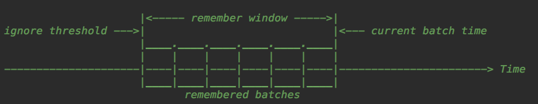

fileStream 是 Spark Streaming Basic Source 的一种，用于近实时地读取 HDFS（或者与 HDFS API 兼容的文件系统）指定目录中新写入的文件。之所以称之为近实时是因为文件的数据必须全部写入完成，并且被"移动"或"重命名"至要读取的目录中，这些文件才可以被处理。

## 1. fileStream

使用 Spark Streaming 读取 HDFS（或者与 HDFS API 兼容的文件系统）指定目录中新写入的文件可以使用 `fileStream` 方法。创建一个输入流来监视 Hadoop 兼容的文件系统中的新文件，并使用给定的键值类型和输入格式读取它们：
```java
def fileStream[K, V, F <: NewInputFormat[K, V]](
    directory: String,
    kClass: Class[K],
    vClass: Class[V],
    fClass: Class[F],
    filter: JFunction[Path, JBoolean],
    newFilesOnly: Boolean,
    conf: Configuration): JavaPairInputDStream[K, V] = {
  implicit val cmk: ClassTag[K] = ClassTag(kClass)
  implicit val cmv: ClassTag[V] = ClassTag(vClass)
  implicit val cmf: ClassTag[F] = ClassTag(fClass)
  def fn: (Path) => Boolean = (x: Path) => filter.call(x).booleanValue()
  ssc.fileStream[K, V, F](directory, fn, newFilesOnly, conf)
}

def fileStream[
    K: ClassTag,
    V: ClassTag,
    F <: NewInputFormat[K, V]: ClassTag
  ] (directory: String,
     filter: Path => Boolean,
     newFilesOnly: Boolean,
     conf: Configuration): InputDStream[(K, V)] = {
    new FileInputDStream[K, V, F](this, directory, filter, newFilesOnly, Option(conf))
  }
```
该方法中的几个参数如下所示：
- directory：监控新文件的 HDFS 目录
- kClass：读取 HDFS 文件键的类
- vClass：读取 HDFS 文件值的类
- fClass：读取 HDFS 文件的输入格式类
- filter：用户指定的文件过滤器，用于过滤 directory 中的文件
- newFilesOnly：是否只处理新文件，忽略目录中已有文件。如果为 true，表示忽略已有文件；如果为 false，表示需要处理已有文件；
- conf：Hadoop 配置

> fileStream 还有另外两个重载方法，在此不再赘述。

## 2. FileInputDStream

`fileStream` 的核心逻辑交由 `DStream` 的一个实现类 `FileInputDStream` 实现。而 `FileInputDStream` 的核心逻辑就是以固定的批次间隔时间 `duration` 不断地探测监控目录 `directory`，每次探测时将文件最近修改时间处于时间段 `(currentTime - duration, currentTime]` 内的新文件(此外还需满足其它过滤条件)封装为 RDD 最终交由 Spark 处理。该逻辑最终由 `compute` 方法实现：
```java
override def compute(validTime: Time): Option[RDD[(K, V)]] = {
  // 探测新文件
  val newFiles = findNewFiles(validTime.milliseconds)
  // 维护文件列表
  batchTimeToSelectedFiles.synchronized {
      batchTimeToSelectedFiles += ((validTime, newFiles))
  }
  recentlySelectedFiles ++= newFiles
  // 封装 RDD
  val rdds = Some(filesToRDD(newFiles))
  val metadata = Map(
    "files" -> newFiles.toList,
    StreamInputInfo.METADATA_KEY_DESCRIPTION -> newFiles.mkString("\n"))
  val inputInfo = StreamInputInfo(id, 0, metadata)
  ssc.scheduler.inputInfoTracker.reportInfo(validTime, inputInfo)
  rdds
}
```
整个过程可以分为探测新文件、维护文件列表、封装 RDD 几个核心步骤。探测新文件和封装 RDD 下面会详细介绍，在这先介绍一下为什么需要维护文件列表。假设探测时间间隔为 `duration`，当前时间为 `currentTime`，那么本次选择的文件初始想法是需要满足条件：文件的最近修改时间需要处于区间 `(currentTime - duration, currentTime]`，此时文件最后修改时间可能：
- 小于或等于 `currentTime - duration`，不在探测范围内
- 处于探测区间 `(currentTime - duration, currentTime)` 内；
- 等于 `currentTime`，处于探测边界；
- 大于 `currentTime`，不在探测范围内

如果文件最后修改时间处于探测边界等于 `currentTime`，那么有可能是在探测之前移动至监控目录 `directory`，但是也有可能是在探测完成之后被移动至监控目录(因为 FileStatus API 返回的修改时间在 HDFS 中似乎只返回秒粒度的时间。新文件的修改时间可能与前一次的最新修改时间相同)。如果是后者就可能会出现文件"丢失"的情况，因为下次探测的时间点为 `currentTime + duration`，探测的时间范围为 `(currentTime, currentTime + duration]`，最近修改时间等于 `currentTime` 的文件如果上一次探测时不处于探测区间，这次也不会处于探测区间。为了避免或减少文件"丢失"的情况，Spark Streaming 允许将探测的时间范围向"前"扩展为 `(currentTime - n * duration, currentTime]`，如下所示：



- 忽略阈值 ignore threshold：`currentTime - n * duration`
- 当前批次时间 current batch time：`currentTime`
- 记忆窗口 remember window：`n * duration`

也就是说，每一次探测时我们会选择文件的最后修改时间处于区间 `(ignore threshold, current batch time]` 的文件，但其中有些文件可能在前几次的探测中已经被处理，为了防止出现重复处理的情况，我们需要使用 `recentlySelectedFiles` 记录记忆窗口内已经被处理过的文件。

> 这里的 `n * duration` 为记忆窗口时长，下面会详细介绍

### 2.1 探测新文件

通过 `findNewFiles` 方法来探测新文件，核心点在于计算上图提到的忽略阈值和记忆窗口，然后根据忽略阈值就可以探测出新文件：
```java
private def findNewFiles(currentTime: Long): Array[String] = {
  try {
    lastNewFileFindingTime = clock.getTimeMillis()

    // 计算忽略阈值(记忆窗口)
    val modTimeIgnoreThreshold = math.max(
        initialModTimeIgnoreThreshold,
        currentTime - durationToRemember.milliseconds
    )

    // 计算新文件
    val directories = Option(fs.globStatus(directoryPath)).getOrElse(Array.empty[FileStatus])
      .filter(_.isDirectory)
      .map(_.getPath)
    val newFiles = directories.flatMap(dir =>
      fs.listStatus(dir)
        .filter(isNewFile(_, currentTime, modTimeIgnoreThreshold))
        .map(_.getPath.toString))
    val timeTaken = clock.getTimeMillis() - lastNewFileFindingTime
    if (timeTaken > slideDuration.milliseconds) {
      logWarning(
        s"Time taken to find new files $timeTaken exceeds the batch size. " +
          "Consider increasing the batch size or reducing the number of " +
          "files in the monitored directories."
      )
    }
    newFiles
  } catch {
      ...
  }
}
```

#### 2.1.1 计算忽略阈值 IgnoreThreshold

首先看一下如何计算忽略阈值 `modTimeIgnoreThreshold`，忽略阈值由两个变量决定:
- 根据 `newFilesOnly` 配置决定的文件修改时间初始化忽略阈值 `initialModTimeIgnoreThreshold`
  - 引入这个变量的应用场景是只处理当前新文件，忽略已存在的文件
- 记忆窗口时长 `durationToRemember`
```java
val modTimeIgnoreThreshold = math.max(
  initialModTimeIgnoreThreshold,
  currentTime - durationToRemember.milliseconds
)
```

通过下面两个变量的介绍我们可以看出忽略阈值 `modTimeIgnoreThreshold` 取决于 `newFilesOnly` 配置：
- 如果 `newFilesOnly` 为 true 表示只处理新文件，阈值为当前系统时钟
- 如果 `newFilesOnly` 为 false 表示还需要处理已有文件，阈值为当前时间往前倒退记忆窗口时长

##### 2.1.1.1 文件修改时间初始化忽略阈值 initialModTimeIgnoreThreshold

文件修改时间初始化忽略阈值 initialModTimeIgnoreThreshold 的值与 `fileStream` 中的 `newFilesOnly` 参数有关：
```java
private val initialModTimeIgnoreThreshold = if (newFilesOnly) clock.getTimeMillis() else 0L
```
`fileStream` 中的 `newFilesOnly` 参数表示 Spark Streaming 应用程序刚刚启动时是否处理监控目录 `directory` 中已有的文件。从上面代码中可以都看到：
- 如果 `newFilesOnly` 为 true 表示不需要处理监控目录 directory 中已有的文件，因此 `initialModTimeIgnoreThreshold` 的值被设置为系统时钟的当前时间，表示仅仅处理最近修改时间大于当前时间的文件，小于当前时间的文件自动被忽略；
- 如果 `newFilesOnly` 为 false 表示需要处理监控目录 directory 中已有的文件，因此 `initialModTimeIgnoreThreshold` 的值被设置为 0，表示只要有文件的最近修改时间就可以得到处理的机会，实际能否处理还需要看进一步的条件。

##### 2.1.1.2 记忆窗口时长 durationToRemember

记忆窗口时长 `durationToRemember` 为批次间隔大小 `slideDuration` 与记忆窗口批次个数的乘积：
```java
private val durationToRemember = slideDuration * numBatchesToRemember
```
> slideDuration 批次间隔大小

而记忆窗口中有多少个批次取决于批次间隔大小 `slideDuration` 和记忆窗口最小保留时长 `minRememberDurationS`：记忆窗口最小保留时长与批次间隔大小相除值向上取值：
```java
def calculateNumBatchesToRemember(batchDuration: Duration, minRememberDurationS: Duration): Int = {
  math.ceil(minRememberDurationS.milliseconds.toDouble / batchDuration.milliseconds).toInt
}

private val numBatchesToRemember = FileInputDStream.calculateNumBatchesToRemember(slideDuration, minRememberDurationS)
```
假设配置的记忆窗口最小保留时长为 60 秒，批次间隔大小为 45 秒，那么记忆窗口批次个数为 `ceil(60/45)=2`，即记忆窗口中包含两个批次。

那记忆窗口最小保留时长 `minRememberDurationS` 是怎么来的呢？可以通过 SparkConf 的 `spark.streaming.fileStream.minRememberDuration` 属性进行修改，如果不提供则默认值为 60s：
```java
private val minRememberDurationS = {
  Seconds(
      ssc.conf.getTimeAsSeconds(
          "spark.streaming.fileStream.minRememberDuration",
          ssc.conf.get("spark.streaming.minRememberDuration", "60s")
      )
  )
}
```
如果文件的修改时间比这个记忆窗口更早将会被忽略。如果新文件在此窗口中可见，那么该文件将在下一个批次处理中被处理。

从上面可以看到记忆窗口时长 `durationToRemember` 等于 `slideDuration * math.ceil(minRememberDurationS.milliseconds.toDouble / slideDuration.milliseconds).toInt`。


#### 2.1.2 计算新文件

新文件的计算依赖于 `isNewFile` 方法，新文件的标准需要满足以下四个条件：
- 过滤不满足过滤器 filter 指定的文件，此处的 filter 就是 fileStream 中指定的过滤器
- 过滤文件最近修改时间小于等于忽略阈值 modTimeIgnoreThreshold 的文件，即不处理某些历史文件
- 过滤文件最近修改时间大于系统时钟当前时间 currentTime 的文件，即不属于该批次的文件
- 过滤已处理过的文件，即文件没有出现在最近已处理文件的列表 recentlySelectedFiles 中

```java
private def isNewFile(fileStatus: FileStatus, currentTime: Long, modTimeIgnoreThreshold: Long): Boolean = {
  val path = fileStatus.getPath
  val pathStr = path.toString
  // (1) 过滤不满足过滤器 filter 指定的文件
  if (!filter(path)) {
    return false
  }
  // (2) 过滤文件最近修改时间小于等于忽略阈值 modTimeIgnoreThreshold 的文件
  val modTime = fileStatus.getModificationTime()
  if (modTime <= modTimeIgnoreThreshold) {
    return false
  }
  // (3) 过滤文件最近修改时间大于系统时钟当前时间 currentTime 的文件
  if (modTime > currentTime) {
    return false
  }
  // (4) 过滤已处理过的文件
  if (recentlySelectedFiles.contains(pathStr)) {
    return false
  }
  return true
}
```

### 2.2 封装 RDD

探测出新文件之后就需要封装为 RDD 交由 Spark 处理：
```java
override def compute(validTime: Time): Option[RDD[(K, V)]] = {
  // Find new files
  ...
  val rdds = Some(filesToRDD(newFiles))
  // Copy newFiles to immutable.List to prevent from being modified by the user
  val metadata = Map(
    "files" -> newFiles.toList,
    StreamInputInfo.METADATA_KEY_DESCRIPTION -> newFiles.mkString("\n"))
  val inputInfo = StreamInputInfo(id, 0, metadata)
  ssc.scheduler.inputInfoTracker.reportInfo(validTime, inputInfo)
  rdds
}
```
封装 RDD 的逻辑由 filesToRDD 方法实现：
```java
private def filesToRDD(files: Seq[String]): RDD[(K, V)] = {
  val fileRDDs = files.map { file =>
    val rdd = serializableConfOpt.map(_.value) match {
      case Some(config) => context.sparkContext.newAPIHadoopFile(
        file,
        fm.runtimeClass.asInstanceOf[Class[F]],
        km.runtimeClass.asInstanceOf[Class[K]],
        vm.runtimeClass.asInstanceOf[Class[V]],
        config)
      case None => context.sparkContext.newAPIHadoopFile[K, V, F](file)
    }
    if (rdd.partitions.isEmpty) {
      logError("File " + file + " has no data in it. Spark Streaming can only ingest " +
        "files that have been \"moved\" to the directory assigned to the file stream. " +
        "Refer to the streaming programming guide for more details.")
    }
    rdd
  }
  new UnionRDD(context.sparkContext, fileRDDs)
}
```
遍历新文件，将每一个新文件通过 SparkContext.newAPIHadoopFile 转换为一个RDD，最后形成一个 RDD 列表：fileRDDs。最后将 fileRDDs 转换为一个 UnionRDD 返回。
