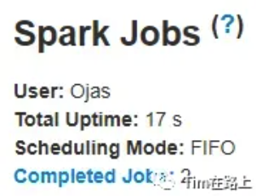
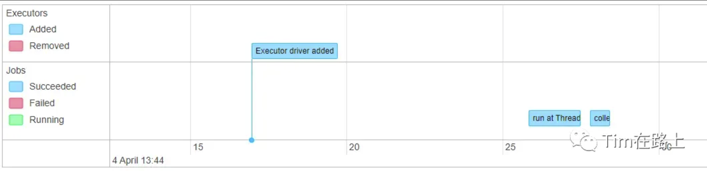

当我执行 Spark 时，经常会遇到 Spark 执行崩溃的状况，即使数据量也不是那么大，也有可能会出现大量的失联节点、作业 OOM 或者被挂起导致任务的执行失败。也许我们在调整一些参数后或者直接重试后又完成了运行，但为什么失败以及我们 Spark 任务是否完全健康我们可能无从得知。

Apache Spark 提供了一套 Web 用户界面，可用于监控 Spark 集群的状态和资源消耗。你可能经常打开查看，但如何系列的检查当前 Spark 的状态以及如何进行调优呢？

当 Spark 作业启动时，它会启动 Spark UI，并打印出您可以访问 UI 的 URI。您可以复制并粘贴 URI 以从任何 Web 浏览器进行访问。当您在本地运行时，默认会打印出 `http://localhost:4040` 地址。如果任务运行完成或者失败结束，可以通过部署的 Spark history Server 进行查看。

下面我们以非常简单的代码进行举例分析 SparkUI:
```scala
//创建员工DF
var  emp_df  = Spark.read.schema(emp_schema).csv( "/path/to/emp/emp.csv" )
//创建部门DF
var  dept_df  = Spark.read.schema(dept_schema).csv ( "/path/to/dept/dept.csv" )

// 员工表通过deptid join 部门表
val  join_df  = emp_df.join(dept_df, Seq( "deptid" ), "left" )

// 持久化
join_df.persist(StorageLevel.MEMORY_AND_DISK)

//执行收集操作
join_df.collect()
```

让我们打开 Spark UI 链接来检查执行情况。当您打开链接时，可以看到以下选项卡。


## 1. Jobs

Jobs 选项卡显示 Spark 应用程序中的所有 Job 作业，单击任何作业后，您将进入该特定作业的详细信息页面。Jobs 选项卡就像一个摘要页面，您可以在其中查看当前 Spark 应用程序运行所执行的所有作业。此页面还包含以下详细信息：
- 用户：当前用户
- 总正常运行时间
- 调度模式：详细信息请参阅spark文档。
- 状态为：活动、已完成、失败的作业数量。



在此下方您将看到事件时间线。事件时间轴告诉您关于 Spark 应用程序及时发生的事件。



在这里我们可以看到我们之前执行的作业的时间表。它从作业开始就告诉我们添加了执行程序，一旦添加了执行程序，我们就开始按顺序从第一个作业到最后一个作业执行作业。

在活动作业下方，我们可以看到该表，其中有已完成作业的列表。该表包含 JobID、作业描述、提交时间、持续时间、完成作业所经历的阶段以及成功阶段的状态与Stages总数的详细信息。

图片

从上面我们执行的 Spark 代码的作业图片中，我们可以得出结论，它分为 2 个Job。对于每个Job，“Description”列都有一个链接，使用该链接可以转到该特定Job的详细信息页面。

在详细信息页面中，我们有已打开的作业的状态。

有一个 DAG 可视化可用，通过查看这个我们可以了解作业的执行情况。

图片

查看DAG我们可以看到，作业分为3个阶段。就我们而言。

第 0 阶段：创建第一个 (emp_df) 数据DF

第 1 阶段：创建第二个（dept_df）数据DF

第 2 阶段：执行连接并创建第三个（join_df）数据DF

最后，在详细信息页面中，您将看到为作业执行的所有阶段的详细信息。

图片

如果您有多个作业，则所有作业都将显示在 Spark UI 的“Job”页面上，并显示持续时间以及是否正在分析存在性能问题的作业。

我们可以首先检查此选项卡中的作业并查找存在问题的作业，深入到任务级别以查看根本原因到底在哪里，并帮助调整作业。

综上，当我定位失败任务或者运行卡住（较慢）的任务是，在Job业务可以做的工作有：

我们要查看当前运行的所有Job，找到运行时间不正常的Job，或者失败的Job；

首先要判断其启动时间是否正常，有时候可能运行时间较长的原因是在等待资源，真实的任务启动时间并不长；

点进问题Job的详情页面，分析Job的DAG生成图是否符合预期以及是否可以优化，例如插入了过多的Shuffle;

在详细信息页面定位到运行较慢或失败的stage任务；

Stage
一项Job作业可以分为一个或多个Stage。

Job 后面有一个 Stage 选项卡，它整合了 Spark 应用程序中的所有 Stage。它就像我们的Job摘要页面一样。

图片

单击任何一个Stage将引导您进入包含该Stage的所有详细信息的页面。

Stage进一步划分为Task。根据该stage的任务数量，我们会将其显示在阶段详细信息页面上。

在我们的实例中，考虑Stage 0。在我们的示例上下文中，Stage详细信息页面包含读取 dept_df 的总时间等详细信息。该Stage还有一个有向无环图（DAG）的可视化表示，其中顶点表示 RDD 或 DataFrame，边表示要应用的操作。

图片

所有任务的摘要指标都显示在表格和时间线中。时间轴事件有助于我们了解数据随时间的分布、计算任务之间的时间和其他有用的参数。

除了您在下面看到的指标之外，还有其他两个指标，即溢出（磁盘）和溢出（内存），这俩指标仅当我们的stage中有溢出时才可用，否则您将看不到这些字段。

如果你正在寻找任务中的任何性能问题，这些指标会很有帮助。这些有助于发现我们工作中任何与倾斜、溢出、序列化相关的问题。

图片

例如，如果75%的任务执行时间只有8分钟，但Max执行时间为2小时，那么明显存在长尾任务；

如果Shuffle Read/Shuffle Write上看75%任务是400M，但25%任务是20G，那么就存在明显的数据倾斜任务。

在这些指标下面，我们有按Executor划分的聚合指标。这些显示了执行者之间的任务分配、完成时间和数据分布。

图片

最后我们有所有任务级别的详细信息。它包含当前阶段在执行器级别执行的每个任务的条目。任务是作业执行部分的最低级别，它直接作用于数据。

这告诉我们任务信息，例如完成所需的时间、工作的数据大小/记录数量等。这是我们可以检测与数据分布相关的任务级别问题的底层。

综上，在Stage页面上有很多的统计信息，可以方便的帮助分析和检查任务的状态：

首先，我们应该关注Event Timeline，通过其我们需要关注Stage的序列化与反序列化的时间，Shuffle Read、Write时间，任务的计算时间之间的比例是否正常，如果存在问题可以进行调节；

其次，最重要的就是关注Summary统计信息，可以通过其判断数据倾斜、数据溢出。以及序列化问题，我们可以针对性优化或者强制指定配置；

最后，就是Executor的聚合指标信息，如果任务执行卡住，我们可以找到哪一个Executor并进行针对性分析。

Storage
“Storage”选项卡显示应用程序中持久保存的 RDD 和 DataFrame（如果有）。摘要页面显示所有 RDD 的存储级别、大小和分区，详细信息页面显示 RDD 或 DataFrame 中所有分区的大小和使用执行器。

图片

您可以单击RDD名称来获取数据持久化的详细信息，例如数据在集群上的分布情况。

图片

通过这个页面我们可以分析程序的存储占用是否符合预期，以及进行持久化保存的状态。

Environment
“Environment”选项卡显示不同环境和配置变量的值，包括 JVM、Spark 和系统属性。

你也可以从中看到启动运行时的配置信息，方便进行查看分析；

图片

Executors
“Executors”选项卡显示有关为应用程序创建的执行器的摘要信息，包括内存和磁盘使用情况以及任务和洗牌信息。存储内存列显示已使用和保留用于缓存数据的内存量。

Executors 选项卡不仅提供资源信息（每个执行程序使用的内存、磁盘和核心数量），还提供性能信息（GC 时间和 shuffle 信息）。

图片

当我们程序可能由于机器性能的问题卡在某台机器，可以通过这个页面找到这台机器，可以将执行在这台机器上的任务进行kill掉，让spark自动重新调度到性能较好的机器上。

SQL
如果应用程序执行 Spark SQL 查询，则 SQL 选项卡会显示信息，例如查询的持续时间、作业以及物理和逻辑计划。参见下面的SS。其中包含正在执行的查询、执行所需的时间以及成功执行所需的作业 ID 的信息。您可以点击职位ID查看详细信息。

图片

如果我们单击最后一个查询的“collect at Demo.scala:124”链接，我们将看到 DAG 和查询执行的详细信息。

图片

单击底部的“Details”链接将显示逻辑计划和物理计划，其中说明了 Spark 如何解析、分析、优化和执行查询。

物理计划中受全阶段代码生成优化影响的步骤以星号为前缀，后跟代码生成 ID。这有助于了解正在执行的内容，并在需要时帮助调整查询。

图片


总而言之，SparkUI是 工作分析的一个非常重要的部分，以便使它们高性能和高效。帮助在创建集群、检测数据倾斜、数据溢出、任务分配方面做出最好的选择，帮助优化作业任务，以便顺利运行它们。
