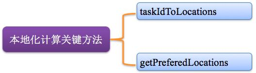
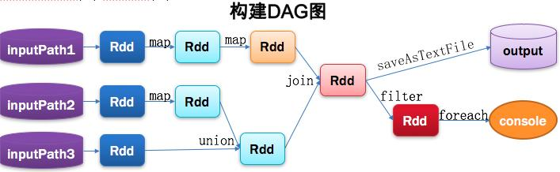

在大数据领域，只有深挖数据科学领域，走在学术前沿，才能在底层算法和模型方面走在前面，从而占据领先地位。

Spark的这种学术基因，使得它从一开始就在大数据领域建立了一定优势。无论是性能，还是方案的统一性，对比传统的 Hadoop，优势都非常明显。Spark 提供的基于 RDD 的一体化解决方案，将 MapReduce、Streaming、SQL、Machine Learning、Graph Processing 等模型统一到一个平台下，并以一致的API公开，并提供相同的部署方案，使得 Spark 的工程应用领域变得更加广泛。

### 1. Spark 专业术语定义

#### 1.1 Application：Spark应用程序

指的是用户编写的Spark应用程序，包含了Driver功能代码和分布在集群中多个节点上运行的Executor代码。

Spark应用程序，由一个或多个作业JOB组成，如下图所示。


#### 1.2 Driver：驱动程序

Spark 中的 Driver 即运行上述 Application 的 Main() 函数并且创建 SparkContext，其中创建 SparkContext 的目的是为了准备 Spark 应用程序的运行环境。在 Spark 中由 SparkContext 负责和 ClusterManager 通信，进行资源的申请、任务的分配和监控等；当 Executor 部分运行完毕后，Driver 负责将 SparkContext 关闭。通常 SparkContext 代表 Driver，如下图所示。


#### 1.3 Cluster Manager：资源管理器

指的是在集群上获取资源的外部服务，常用的有：Standalone，Spark 原生的资源管理器，由 Master 负责资源的分配；Haddop Yarn，由 Yarn 中的 ResearchManager 负责资源的分配；Messos，由 Messos 中的 Messos Master 负责资源管理，如下图所示。


#### 1.4 Executor：执行器

Application 运行在 Worker 节点上的一个进程，该进程负责运行 Task，并且负责将数据存在内存或者磁盘上，每个 Application 都有各自独立的一批 Executor，如下图所示。


#### 1.5 Worker：计算节点

集群中任何可以运行 Application 代码的节点，类似于 Yarn 中的 NodeManager 节点。在Standalone模式中指的就是通过Slave文件配置的Worker节点，在Spark on Yarn模式中指的就是NodeManager节点，在Spark on Messos模式中指的就是Messos Slave节点，如下图所示。


#### 1.6 RDD：弹性分布式数据集

Resillient Distributed Dataset，Spark的基本计算单元，可以通过一系列算子进行操作（主要有Transformation和Action操作），如下图所示。


#### 1.7 窄依赖

父RDD每一个分区最多被一个子RDD的分区所用；表现为一个父RDD的分区对应于一个子RDD的分区，或两个父RDD的分区对应于一个子RDD 的分区。如图所示。


#### 1.8 宽依赖

父RDD的每个分区都可能被多个子RDD分区所使用，子RDD分区通常对应所有的父RDD分区。如图所示。


常见的窄依赖有：map、filter、union、mapPartitions、mapValues、join（父RDD是hash-partitioned ：如果JoinAPI之前被调用的RDD API是宽依赖(存在shuffle), 而且两个join的RDD的分区数量一致，join结果的rdd分区数量也一样，这个时候join api是窄依赖）。

常见的宽依赖有groupByKey、partitionBy、reduceByKey、join（父RDD不是hash-partitioned ：除此之外的，rdd 的join api是宽依赖）。

#### 1.9 DAG：有向无环图

Directed Acycle graph，反应RDD之间的依赖关系，如图所示。


#### 1.10 DAGScheduler：有向无环图调度器

基于 DAG 划分 Stage 并以 TaskSet 的形势把 Stage 提交给 TaskScheduler；负责将作业拆分成不同阶段的具有依赖关系的多批任务；最重要的任务之一就是：计算作业和任务的依赖关系，制定调度逻辑。在 SparkContext 初始化的过程中被实例化，一个 SparkContext 对应创建一个 DAGScheduler。


#### 1.11 TaskScheduler：任务调度器

将 Taskset 提交给 worker（集群）运行并回报结果；负责每个具体任务的实际物理调度。如图所示。


#### 1.12 Job：作业

由一个或多个调度阶段所组成的一次计算作业；包含多个Task组成的并行计算，往往由Spark Action催生，一个JOB包含多个RDD及作用于相应RDD上的各种Operation。如图所示。


#### 1.13 Stage：调度阶段

一个任务集对应的调度阶段；每个Job会被拆分很多组Task，每组任务被称为Stage，也可称TaskSet，一个作业分为多个阶段；Stage分成两种类型ShuffleMapStage、ResultStage。如图所示。


1.14 TaskSet：任务集

由一组关联的，但相互之间没有Shuffle依赖关系的任务所组成的任务集。如图所示。


> 一个Stage创建一个TaskSet；

> 为Stage的每个Rdd分区创建一个Task,多个Task封装成TaskSet

#### 1.15 Task：任务

被送到某个Executor上的工作任务；单个分区数据集上的最小处理流程单元。如图所示


总体如图所示：


### 2. Spark运行基本流程


### 3. Spark运行架构特点

#### 3.1 Executor进程专属

每个Application获取专属的executor进程，该进程在Application期间一直驻留，并以多线程方式运行tasks。Spark Application不能跨应用程序共享数据，除非将数据写入到外部存储系统。如图所示。


#### 3.2 支持多种资源管理器

Spark与资源管理器无关，只要能够获取executor进程，并能保持相互通信就可以了，Spark支持资源管理器包含： Standalone、On Mesos、On YARN、Or On EC2。如图所示。


#### 3.3 Job提交就近原则

提交SparkContext的Client应该靠近Worker节点（运行Executor的节点)，最好是在同一个Rack（机架）里，因为Spark Application运行过程中SparkContext和Executor之间有大量的信息交换；如果想在远程集群中运行，最好使用RPC将SparkContext提交给集群，不要远离Worker运行SparkContext。如图所示。


#### 3.4 移动程序而非移动数据的原则执行

Task采用了数据本地性和推测执行的优化机制。关键方法：taskIdToLocations、getPreferedLocations。如图所示。



### 4. Spark核心原理透视

#### 4.1 计算流程


#### 4.2 从代码构建DAG图

```
Val lines1 = sc.textFile(inputPath1).map(···).map(···)
Val lines2 = sc.textFile(inputPath2).map(···)
Val lines3 = sc.textFile(inputPath3)
Val dtinone1 = lines2.union(lines3)
Val dtinone = lines1.join(dtinone1)
dtinone.saveAsTextFile(···)
dtinone.filter(···).foreach(···)
```
Spark的计算发生在RDD的Action操作，而对Action之前的所有Transformation，Spark只是记录下RDD生成的轨迹，而不会触发真正的计算。

Spark内核会在需要计算发生的时刻绘制一张关于计算路径的有向无环图，也就是DAG。



#### 4.3 将DAG划分为Stage核心算法

Application多个job多个Stage：Spark Application中可以因为不同的Action触发众多的job，一个Application中可以有很多的job，每个job是由一个或者多个Stage构成的，后面的Stage依赖于前面的Stage，也就是说只有前面依赖的Stage计算完毕后，后面的Stage才会运行。

划分依据：Stage划分的依据就是宽依赖，何时产生宽依赖，reduceByKey, groupByKey等算子，会导致宽依赖的产生。

核心算法：从后往前回溯，遇到窄依赖加入本stage，遇见宽依赖进行Stage切分。Spark内核会从触发Action操作的那个RDD开始从后往前推，首先会为最后一个RDD创建一个stage，然后继续倒推，如果发现对某个RDD是宽依赖，那么就会将宽依赖的那个RDD创建一个新的stage，那个RDD就是新的stage的最后一个RDD。然后依次类推，继续继续倒推，根据窄依赖或者宽依赖进行stage的划分，直到所有的RDD全部遍历完成为止。

#### 4.4 将DAG划分为Stage剖析

从HDFS中读入数据生成3个不同的RDD，通过一系列transformation操作后再将计算结果保存回HDFS。可以看到这个DAG中只有join操作是一个宽依赖，Spark内核会以此为边界将其前后划分成不同的Stage. 同时我们可以注意到，在图中Stage2中，从map到union都是窄依赖，这两步操作可以形成一个流水线操作，通过map操作生成的partition可以不用等待整个RDD计算结束，而是继续进行union操作，这样大大提高了计算的效率。


#### 4.5 提交Stages

调度阶段的提交，最终会被转换成一个任务集的提交，DAGScheduler通过TaskScheduler接口提交任务集，这个任务集最终会触发TaskScheduler构建一个TaskSetManager的实例来管理这个任务集的生命周期，对于DAGScheduler来说，提交调度阶段的工作到此就完成了。而TaskScheduler的具体实现则会在得到计算资源的时候，进一步通过TaskSetManager调度具体的任务到对应的Executor节点上进行运算。


#### 4.6 监控Job、Task、Executor

DAGScheduler监控Job与Task：要保证相互依赖的作业调度阶段能够得到顺利的调度执行，DAGScheduler需要监控当前作业调度阶段乃至任务的完成情况。这通过对外暴露一系列的回调函数来实现的，对于TaskScheduler来说，这些回调函数主要包括任务的开始结束失败、任务集的失败，DAGScheduler根据这些任务的生命周期信息进一步维护作业和调度阶段的状态信息。

DAGScheduler监控Executor的生命状态：TaskScheduler通过回调函数通知DAGScheduler具体的Executor的生命状态，如果某一个Executor崩溃了，则对应的调度阶段任务集的ShuffleMapTask的输出结果也将标志为不可用，这将导致对应任务集状态的变更，进而重新执行相关计算任务，以获取丢失的相关数据。

#### 4.7 获取任务执行结果

结果DAGScheduler：一个具体的任务在Executor中执行完毕后，其结果需要以某种形式返回给DAGScheduler，根据任务类型的不同，任务结果的返回方式也不同。

两种结果，中间结果与最终结果：对于FinalStage所对应的任务，返回给DAGScheduler的是运算结果本身，而对于中间调度阶段对应的任务ShuffleMapTask，返回给DAGScheduler的是一个MapStatus里的相关存储信息，而非结果本身，这些存储位置信息将作为下一个调度阶段的任务获取输入数据的依据。

两种类型，DirectTaskResult与IndirectTaskResult：根据任务结果大小的不同，ResultTask返回的结果又分为两类，如果结果足够小，则直接放在DirectTaskResult对象内中，如果超过特定尺寸则在Executor端会将DirectTaskResult先序列化，再把序列化的结果作为一个数据块存放在BlockManager中，然后将BlockManager返回的BlockID放在IndirectTaskResult对象中返回给TaskScheduler，TaskScheduler进而调用TaskResultGetter将IndirectTaskResult中的BlockID取出并通过BlockManager最终取得对应的DirectTaskResult。

#### 4.8 任务调度总体诠释


原文： https://www.toutiao.com/i6511498014832460301/?tt_from=weixin&utm_campaign=client_share&timestamp=1520998005&app=news_article&utm_source=weixin&iid=26380623414&utm_medium=toutiao_android&wxshare_count=1
