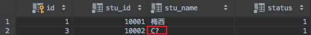
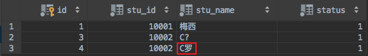

> MyBatis 版本：3.5.11

## 1. 问题

在通过 MyBatis 将数据插入 MySQL 数据库时，将中文插入数据后变成了问号：如下所示：



## 2. 解决方案

中文变成??这种类似的乱码时，多半是由于数据库编码的问题。在这我们的解决方案是在链接数据库的 url 后面加上 `&characterEncoding=utf8` 即可。在这我们使用的是 MMyBatis 持久化框架，所以需要在配置文件 `mybatis-config.xml` 里修改数据库连接，在 url 后面加上 `&amp;characterEncoding=utf8`。因为这里 `&` 需要转义字符为 `&amp`：
```xml
<?xml version="1.0" encoding="UTF-8" ?>
<!DOCTYPE configuration
        PUBLIC "-//mybatis.org//DTD Config 3.0//EN"
        "http://mybatis.org/dtd/mybatis-3-config.dtd">
<configuration>
    <!-- environments：配置数据库连接环境信息 可以配置多个 environment，通过 default 属性切换不同的 environment -->
    <environments default="prod">
        <environment id="prod">
            <transactionManager type="JDBC"/>
            <dataSource type="POOLED">
                <!--数据库连接信息-->
                <property name="driver" value="com.mysql.jdbc.Driver"/>
                <property name="url" value="jdbc:mysql:///test?useSSL=false&amp;characterEncoding=utf8"/>
                <property name="username" value="root"/>
                <property name="password" value="root"/>
            </dataSource>
        </environment>
    </environments>
    ...
</configuration>
```
修改完配置之后重新插入该记录中文不会变成问号：


