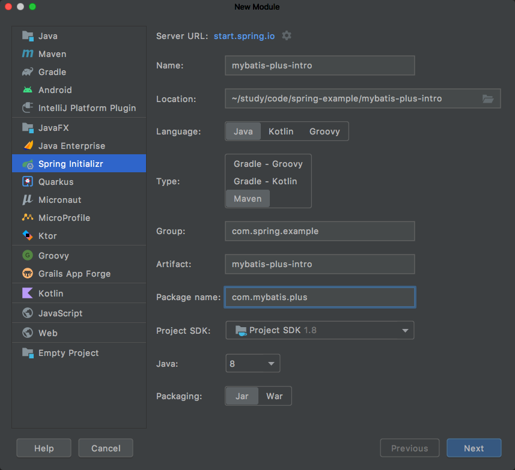
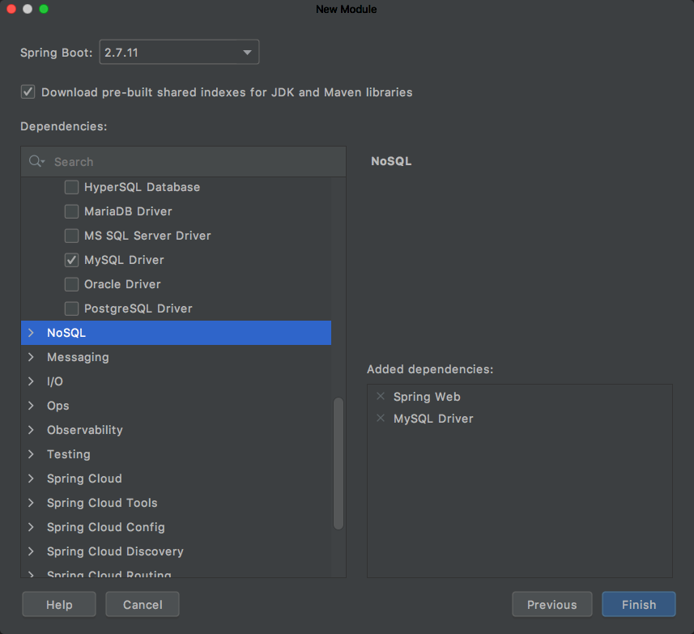

## 1. 简介

MyBatis-Plus（简称 MP）是一个 MyBatis 的增强工具，在 MyBatis 的基础上只做增强不做改变，为简化开发、提高效率而生。

> [MyBatis-Plus 中文官网](https://mybatis.plus/) 或者 [MyBatis-Plus](https://www.baomidou.com/)

Mybatis-Plus 是由 163（苞米豆）组织开发并且开源的。

> [Github地址](https://github.com/163/mybatis-plus)

### 1.1 特性

- 无侵入：只做增强不做改变，引入它不会对现有工程产生影响，如丝般顺滑
- 损耗小：启动即会自动注入基本 CURD，性能基本无损耗，直接面向对象操作
- 强大的 CRUD 操作：内置通用 Mapper、通用 Service，仅仅通过少量配置即可实现单表大部分 CRUD 操作，更有强大的条件构造器，满足各类使用需求
- 支持 Lambda 形式调用：通过 Lambda 表达式，方便的编写各类查询条件，无需再担心字段写错
- 支持主键自动生成：支持多达 4 种主键策略（内含分布式唯一 ID 生成器 - Sequence），可自由配置，完美解决主键问题
- 支持 ActiveRecord 模式：支持 ActiveRecord 形式调用，实体类只需继承 Model 类即可进行强大的 CRUD 操作
- 支持自定义全局通用操作：支持全局通用方法注入（ Write once, use anywhere ）
- 内置代码生成器：采用代码或者 Maven 插件可快速生成 Mapper 、 Model 、 Service 、 Controller 层代码，支持模板引擎，更有超多自定义配置等您来使用
- 内置分页插件：基于 MyBatis 物理分页，开发者无需关心具体操作，配置好插件之后，写分页等同于普通 List 查询
- 分页插件支持多种数据库：支持 MySQL、MariaDB、Oracle、DB2、H2、HSQL、SQLite、Postgre、SQLServer 等多种数据库
- 内置性能分析插件：可输出 Sql 语句以及其执行时间，建议开发测试时启用该功能，能快速揪出慢查询
- 内置全局拦截插件：提供全表 delete 、 update 操作智能分析阻断，也可自定义拦截规则，预防误操作

### 1.2 支持数据库

- mysql 、mariadb 、oracle 、db2 、h2 、hsql 、sqlite 、postgresql 、sqlserver 、presto 、Gauss 、Firebird
- Phoenix 、clickhouse 、Sybase ASE 、 OceanBase 、达梦数据库 、虚谷数据库 、人大金仓数据库 、南大通用数据库 、

## 1.3 框架结构


## 2. 快速开始

我们将通过一个简单的 Demo 来阐述 MyBatis-Plus 的强大功能。

### 2.1 数据准备

第一步我们先准备一下数据，现有一张 tb_user 表，其表结构如下：

| id | name | age |  email |
| :------------- | :------------- | :------------- | :------------- |
| 1	| Jone	| 18	| jone@163.com |
| 2	| Jack	| 20	| jack@163.com |
| 3	| Tom	| 28	| tom@163.com |
| 4	| Sandy	| 21	| sandy@163.com |
| 5	| Billie	| 24	| billie@163.com |

其对应的数据库 Schema 脚本如下：
```sql
DROP TABLE IF EXISTS tb_user;

CREATE TABLE tb_user (
    id BIGINT(20) NOT NULL COMMENT '主键ID',
    name VARCHAR(30) NULL DEFAULT NULL COMMENT '姓名',
    age INT(11) NULL DEFAULT NULL COMMENT '年龄',
    email VARCHAR(50) NULL DEFAULT NULL COMMENT '邮箱',
    PRIMARY KEY (id)
);
```
其对应的数据库 Data 脚本如下：
```sql
DELETE FROM tb_user;

INSERT INTO tb_user (id, name, age, email) VALUES
    (1, 'Jone', 18, 'jone@163.com'),
    (2, 'Jack', 20, 'jack@163.com'),
    (3, 'Tom', 28, 'tom@163.com'),
    (4, 'Sandy', 21, 'sandy@163.com'),
    (5, 'Billie', 24, 'billie@163.com');
```

### 2.2 初始化工程

我们使用 Spring Initializer 快速初始化一个 Spring Boot 工程，不了解的可以参考[SpringBoot 2.x 快速搭建入门项目](https://smartsi.blog.csdn.net/article/details/130333373)：





由于 idea 没有收录 Mybaits-Plus，所以在这不能直接选中添加依赖，只能手动添加：
```xml
<dependency>
   <groupId>com.baomidou</groupId>
   <artifactId>mybatis-plus-boot-starter</artifactId>
   <version>3.5.3.1</version>
</dependency>
```

### 2.3 配置

在 application.yml 配置文件中添加 MySQL 数据库的相关配置：
```yml
spring:
  datasource:
    url: jdbc:mysql://127.0.0.1:3306/test
    name: root
    password: root
    driver-class-name: com.mysql.cj.jdbc.Driver
```

### 2.4 编码

#### 2.4.1 编写实体类

编写实体类 User：
```java
public class User {
    private Long id;
    private String name;
    private Integer age;
    private String email;

    public Long getId() {
        return id;
    }

    public void setId(Long id) {
        this.id = id;
    }

    public String getName() {
        return name;
    }

    public void setName(String name) {
        this.name = name;
    }

    public Integer getAge() {
        return age;
    }

    public void setAge(Integer age) {
        this.age = age;
    }

    public String getEmail() {
        return email;
    }

    public void setEmail(String email) {
        this.email = email;
    }

    @Override
    public String toString() {
        return "User{" +
                "id=" + id +
                ", name='" + name + '\'' +
                ", age=" + age +
                ", email='" + email + '\'' +
                '}';
    }
}
```
> 也可以使用 Lombok 进行简化

#### 2.4.2 编写Mapper类

编写 dao 包下的 UserDao 接口：
```java
@Mapper
public interface UserDao extends BaseMapper<User> {

}
```


```
public interface BaseMapper<T> extends Mapper<T> {
    int insert(T entity);

    int deleteById(Serializable id);

    int deleteById(T entity);

    int deleteByMap(@Param("cm") Map<String, Object> columnMap);

    int delete(@Param("ew") Wrapper<T> queryWrapper);

    int deleteBatchIds(@Param("coll") Collection<?> idList);

    int updateById(@Param("et") T entity);

    int update(@Param("et") T entity, @Param("ew") Wrapper<T> updateWrapper);

    T selectById(Serializable id);
}
```

## 3. 进阶
