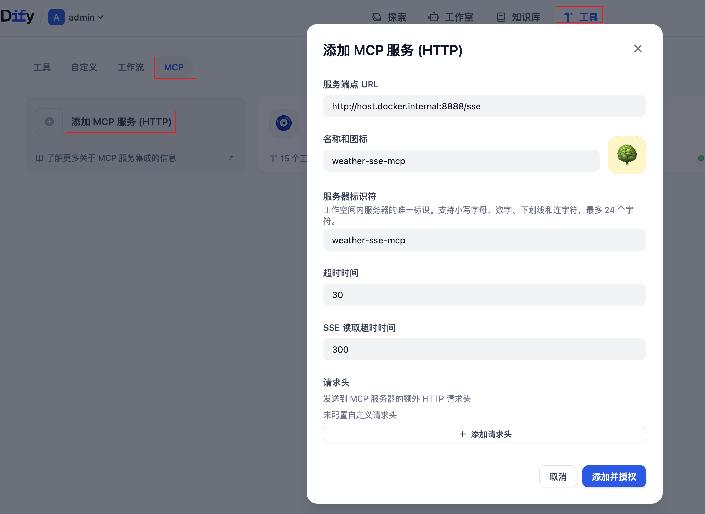
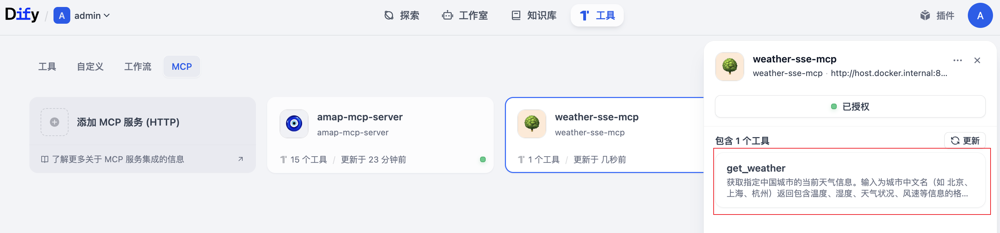
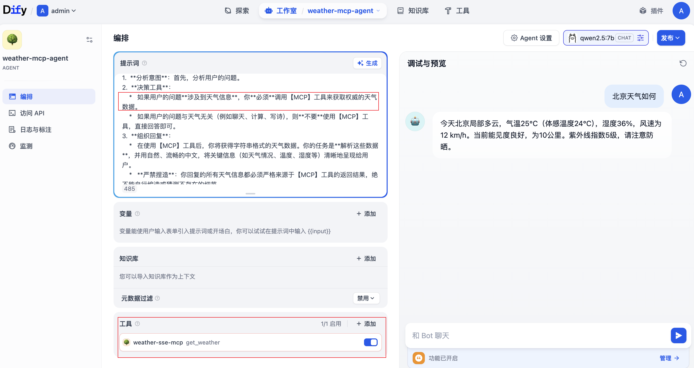

## 6. 客户端如何调用这个 MCP Server？

MCP Server 启动后，会在 `/mcp` 路径暴露 SSE（Server-Sent Events）端点。客户端通过 SSE 与 Server 建立长连接，然后收发 JSON-RPC 消息。

### 6.1 用 Spring AI MCP Client 连接

```java
// 1. 创建 SSE 传输层，指向 MCP Server
WebFluxSseClientTransport transport = new WebFluxSseClientTransport(
        WebClient.builder().baseUrl("http://localhost:8888"),
        McpJsonMapper.createDefault()
);
// 2. 创建同步客户端
McpSyncClient client = io.modelcontextprotocol.client.McpClient.sync(transport).build();

// 3. 初始化连接
client.initialize();
client.ping();

// 4. 列出 Server 暴露的所有工具
McpSchema.ListToolsResult tools = client.listTools();
System.out.println("可用工具: " + tools);

// 5. 调用 get_weather 工具
McpSchema.CallToolResult result = client.callTool(
        new McpSchema.CallToolRequest(
                "get_weather",           // Tool 名称
                Map.of("cityName", "北京")  // 参数
        )
);
System.out.println("天气结果: " + result.content());

// 6. 关闭连接
client.closeGracefully();
```

### 5.2 在 Dify 中使用 MCP 工具

> 在 Dify 中如何使用 MCP 工具，详细请查阅[Dify 实战：通过 Dify 快速接入 MCP Server](https://smartsi.blog.csdn.net/article/details/157619776)

首选在 Dify 中添加天气 MCP 服务：



创建之后可以看到 MCP 服务包含的 get_weather 工具：



在 Dify 中以创建一个 Agent 应用为例，验证接入 MCP Server 效果。输入合适的提示词并配置工具：



当用户问"北京天气如何？"时，Spring AI 会自动：
- 把问题发送给大模型
- 大模型读到 `get_weather` 的 description，判断需要调用
- Spring AI 执行 `WeatherService.getWeatherByCity("北京")`
- 拿到结果后再次发给大模型，让模型组织成自然语言回复

通过查看天气 MCP 服务日志输出如下，可以证明大模型调用 MCP 工具成功：
```
2026-05-01T11:10:11.351+08:00  INFO 53569 --- [oundedElastic-1] com.mcp.example.server.WeatherService    : 天气 MCP 查询结果：城市: 北京
天气情况: 局部多云
气压: 1011（mb）
温度: 25°C (体感温度: 24°C)
湿度: 36%
降水量:0.0 (mm)
风速: 12 km/h (E)
能见度: 10 公里
紫外线指数: 5
观测时间: 2026-05-01 10:54 AM
```
