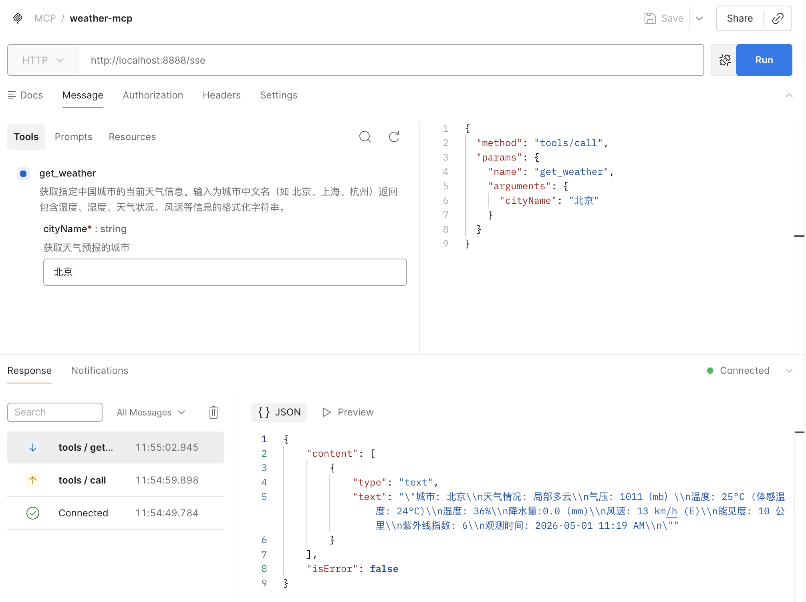

想象一下，你正在开发一个智能出行助手。用户问："我明天去北京出差，需要带伞吗？" 大模型本身没有实时数据，它的知识截止于训练日期，无法知道明天的天气预报。这时候，你的 AI 需要一个 **工具（Tool）** 来获取实时天气。

但传统的函数调用方式是碎片化的：每个框架有自己的定义格式，每个模型有自己的调用规范。**MCP（Model Context Protocol）** 的出现改变了这一切。它就像 AI 世界的"USB-C"接口，为模型与外部工具、数据源之间的通信提供了统一标准。

本文将带你使用 **Spring AI** 框架和免费的 **wttr.in** 天气服务，从零搭建一个 MCP（Model Context Protocol）天气服务，让大模型具备实时查询天气的能力。

---

## 1. 什么是 MCP？

MCP（Model Context Protocol）是 Anthropic 提出的一种开放协议，它定义了 **AI 模型与外部世界交互的标准方式**。通俗地说：大模型本身只拥有训练数据中的知识，它不知道今天的天气、无法查询你的数据库、不能调用你的内部 API。MCP 就是解决这个问题的"桥梁"——它让模型能够发现并使用外部工具（Tools），就像人用手去操作工具一样。

在 Spring AI 的世界里，MCP 分为两个角色：

| 角色 | 职责 | 对应依赖 |
|------|------|---------|
| **MCP Server** | 暴露工具（Tool），供模型调用 | `spring-ai-starter-mcp-server-webflux` |
| **MCP Client** | 连接 Server，让模型发现和使用工具 | `spring-ai-starter-mcp-client` |

本文我们先聚焦 **Server 端**——把天气查询能力封装成一个 MCP 服务。

> MCP 请详细阅读[MCP 入门：什么是 MCP 模型上下文协议](https://smartsi.blog.csdn.net/article/details/158430845)

## 2. wttr.in：命令行时代的天气神器

`wttr.in` 是一个面向开发者的免费天气服务。你可以在终端里如下使用：
```bash
curl wttr.in/北京
```

它会返回一张精美的 ASCII 艺术天气图：


它同时也提供 JSON 输出模式，方便程序解析：
```bash
curl "https://wttr.in/北京?format=j1&lang=zh"
```
返回的结构化数据如下（简化）：
```json
{
  "current_condition": [
    {
      "FeelsLikeC": "24",
      "FeelsLikeF": "75",
      "cloudcover": "0",
      "humidity": "36",
      "lang_zh": [
        {
          "value": "局部多云"
        }
      ],
      "localObsDateTime": "2026-05-01 11:19 AM",
      "observation_time": "03:19 AM",
      "precipInches": "0.0",
      "precipMM": "0.0",
      "pressure": "1011",
      "pressureInches": "30",
      "temp_C": "25",
      "temp_F": "78",
      "uvIndex": "6",
      "visibility": "10",
      "visibilityMiles": "6",
      "weatherCode": "116",
      "weatherDesc": [
        {
          "value": "Partly cloudy"
        }
      ],
      "weatherIconUrl": [
        {
          "value": "https://cdn.worldweatheronline.com/images/wsymbols01_png_64/wsymbol_0002_sunny_intervals.png"
        }
      ],
      "winddir16Point": "E",
      "winddirDegree": "97",
      "windspeedKmph": "13",
      "windspeedMiles": "8"
    }
  ],
  "nearest_area": [...],
  "weather": [...]
}
```

关键字段说明：

| 字段 | 类型 | 含义 |
|------|------|------|
| `temp_C` / `temp_F` | string | 实际温度，摄氏度 / 华氏度 |
| `FeelsLikeC` / `FeelsLikeF` | string | 体感温度，摄氏度 / 华氏度（综合湿度、风速等因素）|
| `humidity` | string | 相对湿度，百分比（如 `"36"` 表示 36%）|
| `cloudcover` | string | 云量覆盖百分比（`"0"` 表示无云， `"100"` 表示完全遮蔽）|
| `pressure` / `pressureInches` | string | 大气压，毫巴（hPa）/ 英寸汞柱 |
| `precipMM` / `precipInches` | string | 降水量，毫米 / 英寸（当前观测时段的累计降水）|
| `visibility` / `visibilityMiles` | string | 能见度，公里 / 英里 |
| `uvIndex` | string | 紫外线指数（`"0-2"` 低，`"3-5"` 中等，`"6-7"` 高，`"8-10"` 很高，`"11+"` 极高）|
| `weatherCode` | string | 天气状况数字编码（WWO 标准代码，如 `"113"` 晴朗、`"116"` 局部多云）|
| `weatherDesc` | array | 英文天气描述文本，如 `"Sunny"`、`"Partly cloudy"` |
| `lang_zh` | array | 本地化中文天气描述，如 `"晴朗"`、`"局部多云"` |
| `weatherIconUrl` | array | 天气图标 URL，可直接用于前端展示 |
| `windspeedKmph` / `windspeedMiles` | string | 风速，公里/小时(英里/小时) |
| `winddir16Point` | string | 风向，16 方位表示（如 `N`、`NE`、`E`、`SSW`）|
| `winddirDegree` | string | 风向，角度表示（`"0"` 为正北，`"90"` 为正东）|
| `localObsDateTime` | string | 本地观测时间（带时区）|
| `observation_time` | string | 观测 UTC 时间 |

> **注意**：`current_condition` 是一个数组，`weatherDesc` 也是数组，取值时记得取第一个元素。

---

## 3. 项目搭建

### 3.1 依赖管理

#### 3.1.1 Spring Boot 依赖管理

Spring Boot 本身提供 BOM（spring-boot-dependencies）管理 Boot 生态，通常由父 POM 管理：
```xml
<parent>
    <groupId>org.springframework.boot</groupId>
    <artifactId>spring-boot-starter-parent</artifactId>
    <version>3.5.14</version>
    <relativePath/>
</parent>
```

#### 3.1.2 Spring AI 依赖管理

Spring AI 也提供 BOM 来管理 Spring AI 生态，声明了 Spring AI 指定所有依赖的推荐版本：
```xml
<dependencyManagement>
    <dependencies>
        <dependency>
            <groupId>org.springframework.ai</groupId>
            <artifactId>spring-ai-bom</artifactId>
            <version>1.1.5</version>
            <type>pom</type>
            <scope>import</scope>
        </dependency>
    </dependencies>
</dependencyManagement>
```
统一管理 Spring AI 生态下所有组件的版本，你在 dependencies 中引入具体模块时无需再写版本号。

> Spring AI 是一个多模块项目，包含：spring-ai-core、spring-ai-openai、spring-ai-mcp-server-webmvc 等。这些模块之间有严格的版本兼容关系。如果没有 BOM，你需要手动确保每个模块版本一致，容易出错。

#### 3.1.3 添加依赖

添加 Spring Boot Web 和 Spring AI MCP 等相关依赖：
```xml
<dependencies>
    <!-- Spring Boot 模块：WebFlux 响应式 Web 服务器 -->
    <dependency>
        <groupId>org.springframework.boot</groupId>
        <artifactId>spring-boot-starter-webflux</artifactId>
    </dependency>

    <!-- Spring AI 模块：版本由 BOM 管理 -->
    <dependency>
        <groupId>org.springframework.ai</groupId>
        <artifactId>spring-ai-starter-mcp-server-webflux</artifactId>
    </dependency>

    <!-- Lombok -->
    <dependency>
        <groupId>org.projectlombok</groupId>
        <artifactId>lombok</artifactId>
        <scope>provided</scope>
    </dependency>
</dependencies>
```
Spring AI MCP Server 提供多种传输模式：**STDIO**（标准输入输出，适合本地进程通信）和 **SSE**（Server-Sent Events，适合远程服务）。本文选择 **WebFlux SSE 模式**，基于响应式编程，性能更好。你也可以选择 **WebMvc SSE 模式**，基于 Servlet，如果你更熟悉传统 Spring MVC 可以选这个。


> 完整 POM 如下所示：
```xml
<?xml version="1.0" encoding="UTF-8"?>
<project xmlns="http://maven.apache.org/POM/4.0.0"
         xmlns:xsi="http://www.w3.org/2001/XMLSchema-instance"
         xsi:schemaLocation="http://maven.apache.org/POM/4.0.0 http://maven.apache.org/xsd/maven-4.0.0.xsd">
    <modelVersion>4.0.0</modelVersion>
    <!-- 第一层：Spring Boot 父 POM，管理 Boot 生态 -->
    <parent>
        <groupId>org.springframework.boot</groupId>
        <artifactId>spring-boot-starter-parent</artifactId>
        <version>3.5.14</version>
        <relativePath/>
    </parent>

    <artifactId>starter-webflux-server</artifactId>

    <properties>
        <project.build.sourceEncoding>UTF-8</project.build.sourceEncoding>
        <java.version>17</java.version>
        <spring-ai.version>1.1.5</spring-ai.version>
    </properties>

    <!-- 第二层：导入 Spring AI BOM，管理 AI 生态 -->
    <dependencyManagement>
        <dependencies>
            <dependency>
                <groupId>org.springframework.ai</groupId>
                <artifactId>spring-ai-bom</artifactId>
                <version>${spring-ai.version}</version>
                <type>pom</type>
                <scope>import</scope>
            </dependency>
        </dependencies>
    </dependencyManagement>

    <dependencies>
        <!-- Spring Boot 模块：WebFlux 响应式 Web 服务器 -->
        <dependency>
            <groupId>org.springframework.boot</groupId>
            <artifactId>spring-boot-starter-webflux</artifactId>
        </dependency>

        <!-- Spring AI 模块：版本由 BOM 管理 -->
        <dependency>
            <groupId>org.springframework.ai</groupId>
            <artifactId>spring-ai-starter-mcp-server-webflux</artifactId>
        </dependency>

        <!-- Lombok -->
        <dependency>
            <groupId>org.projectlombok</groupId>
            <artifactId>lombok</artifactId>
            <scope>provided</scope>
        </dependency>
    </dependencies>

    <build>
        <plugins>
            <plugin>
                <groupId>org.apache.maven.plugins</groupId>
                <artifactId>maven-compiler-plugin</artifactId>
                <configuration>
                    <annotationProcessorPaths>
                        <path>
                            <groupId>org.projectlombok</groupId>
                            <artifactId>lombok</artifactId>
                        </path>
                    </annotationProcessorPaths>
                </configuration>
            </plugin>

            <plugin>
                <groupId>org.springframework.boot</groupId>
                <artifactId>spring-boot-maven-plugin</artifactId>
                <configuration>
                    <excludes>
                        <exclude>
                            <groupId>org.projectlombok</groupId>
                            <artifactId>lombok</artifactId>
                        </exclude>
                    </excludes>
                </configuration>
            </plugin>
        </plugins>
    </build>

</project>
```

### 3.2 配置文件

在 `application.yml` 中配置 MCP Server 配置：
```
server:
  port: 8888

spring:
  ai:
    mcp:
      server:
        enabled: true
        name: weather-mcp-webflux-server
        version: 1.0.0
        sse-endpoint: /sse
        sse-message-endpoint: /mcp/message
        capabilities:
          tool: true
```

配置说明：

| 属性 | 含义  |
| :------------- | :------------- |
| sse-endpoint | SSE 连接端点，Client 通过此端点建立事件流(观察客户端连接配置) |
| sse-message-endpoint	| 消息收发端点，Client 向 Server 发送工具调用请求 |
| capabilities.tool	| 声明本 Server 支持 Tool 能力 |

### 3.3 启动类

```java
@SpringBootApplication
public class McpServerApplication {
    public static void main(String[] args) {
        SpringApplication.run(McpServerApplication.class, args);
    }
}
```

---

## 4. 把天气查询封装成 MCP Tool

MCP Server 的核心是 **Tool（工具）**。Spring AI 用 `@Tool` 注解把任意 Java 方法暴露为 MCP 工具。

### 4.1 数据模型

根据 wttr.in 的 JSON 结构，定义三个 POJO：
```java
@Data
@JsonIgnoreProperties(ignoreUnknown = true)
public class Weather {
    @JsonProperty(value = "current_condition")
    private List<CurrentCondition> currentConditions;
}

@Data
@JsonIgnoreProperties(ignoreUnknown = true)
public class CurrentCondition {
    @JsonProperty(value = "FeelsLikeC")
    private String feelsLikeC;
    private String humidity;
    private String localObsDateTime;
    private String precipMM;
    private String pressure;
    @JsonProperty(value = "temp_C")
    private String tempC;
    private String uvIndex;
    private String visibility;
    @JsonProperty(value = "lang_zh")
    private List<WeatherLangZh> langZh;
    private String winddir16Point;
    private String windspeedKmph;
}

@Data
public class WeatherLangZh {
    private String value;
}
```
> @JsonIgnoreProperties(ignoreUnknown = true) 确保 wttr.in 返回的冗余字段不会导致反序列化失败。

### 4.2 WeatherService —— MCP Tool 的核心实现

WeatherService 是 MCP Tool 的核心实现：
```java
@Service
public class WeatherService {
    private static final String BASE_URL = "https://wttr.in";
    private final RestClient restClient;

    public WeatherService() {
        this.restClient = RestClient.builder()
                .baseUrl(BASE_URL)
                .defaultHeader("Accept", "application/json")
                .defaultHeader("User-Agent", "WeatherApiClient/1.0 (your@email.com)")
                .build();
    }

    //  Tool
    @Tool(name = "get_weather", description = "获取指定中国城市的当前天气信息。输入为城市中文名（如 北京、上海、杭州）返回包含温度、湿度、天气状况、风速等信息的格式化字符串。")
    public String getWeatherByCity(@ToolParam(description = "获取天气预报的城市", required = true) String cityName) {
        // wttr.in 返回 JSON 内容但 Content-Type 是 text/plain，
        // 先用 String 接收，再手动用 ObjectMapper 解析为 Weather
        String response = restClient.get()
                .uri("/{city_name}?format=j1&lang=zh", cityName)
                .retrieve()
                .body(String.class);

        Weather weather;
        try {
            ObjectMapper mapper = new ObjectMapper();
            weather = mapper.readValue(response, Weather.class);
        } catch (Exception e) {
            throw new RuntimeException("解析天气数据失败: " + e.getMessage(), e);
        }

        List<CurrentCondition> conditions = weather.getCurrentConditions();
        if (conditions == null || conditions.isEmpty()) {
            return null;
        }
        CurrentCondition condition = conditions.get(0);
        String result = String.format("""
                    城市: %s
                    天气情况: %s
                    气压: %s（mb）
                    温度: %s°C (Feels like: %s°C)
                    湿度: %s%%
                    降水量:%s (mm)
                    风速: %s km/h (%s)
                    能见度: %s 公里
                    紫外线指数: %s
                    观测时间: %s
                    """,
                cityName,
                condition.getLangZh().get(0).getValue(),
                condition.getPressure(),
                condition.getTempC(),
                condition.getFeelsLikeC(),
                condition.getHumidity(),
                condition.getPrecipMM(),
                condition.getWindspeedKmph(),
                condition.getWinddir16Point(),
                condition.getVisibility(),
                condition.getUvIndex(),
                condition.getLocalObsDateTime()
        );
        return result;
    }
}
```

代码要点解析：
- **`@Tool` 注解**：这是 Spring AI 暴露 MCP Tool 的关键。`name` 是工具标识，`description` 会被大模型读取，直接影响模型"是否调用"以及"如何调用"这个工具。**描述一定要清晰、包含示例**。
- **`@ToolParam`**：标注工具参数，`description` 帮助模型理解参数含义，`required` 标记是否必填。
- wttr.in 的特殊处理：它返回 JSON 内容但 Content-Type 声明为 text/plain，所以先用 String.class 接收响应体，再用 ObjectMapper 手动反序列化。

> **`@Tool` 的 `description` 非常重要**——它直接决定了大模型会不会调用你的工具。描述越清晰、越具体，模型判断越准确。

### 4.3 主应用类注册 Tool

在主应用类中通过 MethodToolCallbackProvider 将 WeatherService 中的 `@Tool` 方法注册为 MCP 工具：
```java
@SpringBootApplication
public class McpServerApplication {

    public static void main(String[] args) {
        SpringApplication.run(McpServerApplication.class, args);
    }

    @Bean
    public MethodToolCallbackProvider weatherTools(WeatherService weatherService) {
        return MethodToolCallbackProvider.builder()
                .toolObjects(weatherService)
                .build();
    }
}
```
MethodToolCallbackProvider 会自动扫描 weatherService 中所有标记了 `@Tool` 的方法，并将其暴露给 MCP Client。

---

## 5. 运行与验证

### 5.1 启动服务

直接运行 `McpServerApplication` 类或者使用如下命令启动 MCP Server：
```bash
./mvnw spring-boot:run
```
服务启动后，MCP Server 会暴露两个端点：
- `http://localhost:8888/sse` —— SSE 事件流端点
- `http://localhost:8888/mcp/message` —— 消息交互端点

### 5.2 验证 SSE 端点

运行如下命令验证 SSE 端点：
```
smarsi:~ smartsi$ curl http://localhost:8888/sse
event:endpoint
data:/mcp/message?sessionId=7edea68f-b612-4136-8e23-493c25f958c7
```
如果返回类似上述以 `event:endpoint` 开头的 SSE 流，说明 MCP Server 正常运行。

### 5.3 验证 Tool 调用

可以用 MCP Inspector 或任意支持 MCP Client 的工具连接 `http://localhost:8888/sse`，测试 get_weather 工具。输入参数 cityName = 北京，预期返回格式化的天气信息。在这使用 postman 测试：



---

## 6. 下一步：接入 MCP Client

本文完成的 MCP Server 可以独立运行，任何支持 MCP 协议的 Client 都可以连接它。下一篇文章将介绍如何在 Spring AI 应用中通过 MCP Client 连接这个天气服务，让大模型在对话中自动调用 get_weather 工具回答天气相关问题。

---

## 7. 总结

| 环节 | 关键动作 |
| :------------- | :------------- |
| 协议层 | MCP 统一了模型与工具的交互标准 |
| 服务端	| Spring AI @Tool + MethodToolCallbackProvider 暴露 Java 方法为 MCP Tool |
| 传输层	| WebFlux SSE 提供高性能的远程通信能力 |
| 数据源	| wttr.in 免费、免认证，适合快速原型 |

通过本文，你已经拥有了一个可独立部署、可被任何 MCP Client 发现的天气查询服务。
---
