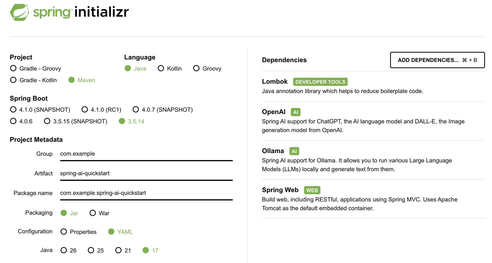

当大语言模型的浪潮席卷全球，我们 Java 开发者常常陷入一个尴尬的境地：Python 似乎成了 AI 的“官方语言”，而我们对 Spring 全家桶的深厚积累似乎暂时派不上用场。Spring AI 的出现，彻底打破了这一困局。

Spring AI 是 Spring 官方团队主导开发的开源项目，它为 Java/Spring 生态系统提供了一个统一、模块化、企业级友好的 AI 应用开发框架。核心理念是：AI 开发应遵循 Spring 哲学——POJO 编程、自动配置、可移植、可观测、可测试。

## 1. 环境准备

- JDK 17+（Spring Boot 3.x 的硬性要求）
- Maven 3.8+
- AI 模型厂商：
  - 百练：阿里云百炼大模型平台，国内访问友好
  - Ollama：本地运行环境，适合离线场景

> Spring AI 支持 Spring Boot 3.4.x 和 3.5.x 版本

## 2. 初始化 Spring Boot 工程

访问 [start.spring.io](https://start.spring.io/) 使用 Spring Initializr 方式初始化 Spring Boot 工程。在新应用中选择您需要使用的 AI 模型等：



在这选用 Spring Boot 3.5.14 版本，Spring AI 推荐使用 1.1.5 版本。完整 pom 如下：
```xml
<project xmlns="http://maven.apache.org/POM/4.0.0" xmlns:xsi="http://www.w3.org/2001/XMLSchema-instance"
         xsi:schemaLocation="http://maven.apache.org/POM/4.0.0 http://maven.apache.org/xsd/maven-4.0.0.xsd">
    <modelVersion>4.0.0</modelVersion>
    <!-- 第一层：Spring Boot 父 POM，管理 Boot 生态 -->
    <parent>
        <groupId>org.springframework.boot</groupId>
        <artifactId>spring-boot-starter-parent</artifactId>
        <version>3.5.14</version>
        <relativePath/>
    </parent>

    <artifactId>spring-ai-quickstart</artifactId>
    <name>spring-ai-quickstart</name>

    <properties>
        <project.build.sourceEncoding>UTF-8</project.build.sourceEncoding>
        <java.version>17</java.version>
        <spring-ai.version>1.1.5</spring-ai.version>
    </properties>

    <!-- 第二层：导入 Spring AI BOM，管理 AI 生态 -->
    <dependencyManagement>
        <dependencies>
            <dependency>
                <groupId>org.springframework.ai</groupId>
                <artifactId>spring-ai-bom</artifactId>
                <version>${spring-ai.version}</version>
                <type>pom</type>
                <scope>import</scope>
            </dependency>
        </dependencies>
    </dependencyManagement>

    <!-- 依赖 -->
    <dependencies>
        <!-- Spring Boot Web -->
        <dependency>
            <groupId>org.springframework.boot</groupId>
            <artifactId>spring-boot-starter-web</artifactId>
        </dependency>

        <!-- Spring AI Ollama 模型 -->
        <dependency>
            <groupId>org.springframework.ai</groupId>
            <artifactId>spring-ai-starter-model-ollama</artifactId>
        </dependency>

        <!-- Spring AI OpenAI协议 模型 -->
        <dependency>
            <groupId>org.springframework.ai</groupId>
            <artifactId>spring-ai-starter-model-openai</artifactId>
        </dependency>

        <!-- Spring Boot Lombok -->
        <dependency>
            <groupId>org.projectlombok</groupId>
            <artifactId>lombok</artifactId>
            <optional>true</optional>
        </dependency>

        <!-- Spring Boot 测试 -->
        <dependency>
            <groupId>org.springframework.boot</groupId>
            <artifactId>spring-boot-starter-test</artifactId>
            <scope>test</scope>
        </dependency>
    </dependencies>

    <build>
        <plugins>
            <plugin>
                <groupId>org.apache.maven.plugins</groupId>
                <artifactId>maven-compiler-plugin</artifactId>
                <configuration>
                    <annotationProcessorPaths>
                        <path>
                            <groupId>org.projectlombok</groupId>
                            <artifactId>lombok</artifactId>
                        </path>
                    </annotationProcessorPaths>
                </configuration>
            </plugin>

            <plugin>
                <groupId>org.springframework.boot</groupId>
                <artifactId>spring-boot-maven-plugin</artifactId>
                <configuration>
                    <excludes>
                        <exclude>
                            <groupId>org.projectlombok</groupId>
                            <artifactId>lombok</artifactId>
                        </exclude>
                    </excludes>
                </configuration>
            </plugin>
        </plugins>
    </build>
</project>
```

---

### 2.1 构件仓库

#### 2.1.1 正式版 - 使用 Maven Central

Spring AI 1.0.0 及后续版本已在 Maven Central 仓库提供。构建文件只需启用 Maven Central 即可，通常无需额外配置仓库:
```xml
<repositories>
    <repository>
        <id>central</id>
        <url>https://repo.maven.apache.org/maven2</url>
    </repository>
</repositories>
```
> Maven 构建默认包含 Maven Central，不需要额外配置

#### 2.1.2 快照版 - 添加快照仓库

如需使用开发版本（如 `1.1.0-SNAPSHOT`）或 `1.0.0` 之前的里程碑版本，需在构建文件中添加以下快照仓库:
```xml
<repositories>
  <repository>
    <id>spring-snapshots</id>
    <name>Spring Snapshots</name>
    <url>https://repo.spring.io/snapshot</url>
    <releases>
      <enabled>false</enabled>
    </releases>
  </repository>

  <repository>
    <name>Central Portal Snapshots</name>
    <id>central-portal-snapshots</id>
    <url>https://central.sonatype.com/repository/maven-snapshots/</url>
    <releases>
      <enabled>false</enabled>
    </releases>
    <snapshots>
      <enabled>true</enabled>
    </snapshots>
  </repository>

</repositories>
```

需要注意的是使用 Maven 构建 Spring AI 快照时，请检查镜像配置。若在 settings.xml 中配置了类似如下镜像：
```xml
<mirror>
    <id>my-mirror</id>
    <mirrorOf>*</mirrorOf>
    <url>https://my-company-repository.com/maven</url>
</mirror>
```
通配符 `*` 会将所有仓库请求重定向至该镜像，导致无法访问 Spring 快照仓库。请修改 mirrorOf 配置排除 Spring 仓库：
```xml
<mirror>
    <id>my-mirror</id>
    <mirrorOf>*,!spring-snapshots,!central-portal-snapshots</mirrorOf>
    <url>https://my-company-repository.com/maven</url>
</mirror>
```
此配置允许 Maven 直接访问 Spring 快照仓库，同时通过镜像获取其他依赖。


### 2.2 Spring Boot 依赖管理

Spring Boot 本身提供 BOM（spring-boot-dependencies）管理 Boot 生态，通常由父 POM 管理：
```xml
<parent>
    <groupId>org.springframework.boot</groupId>
    <artifactId>spring-boot-starter-parent</artifactId>
    <version>3.5.14</version>
    <relativePath/>
</parent>
```

### 2.3 Spring AI 依赖管理

Spring AI 也提供 BOM 来管理 Spring AI 生态，声明了 Spring AI 指定所有依赖的推荐版本：
```xml
<dependencyManagement>
    <dependencies>
        <dependency>
            <groupId>org.springframework.ai</groupId>
            <artifactId>spring-ai-bom</artifactId>
            <version>1.1.5</version>
            <type>pom</type>
            <scope>import</scope>
        </dependency>
    </dependencies>
</dependencyManagement>
```
此 BOM 仅包含依赖管理，不涉及插件声明或 Spring/Spring Boot 直接引用。可使用 Spring Boot 父 POM 或 Spring Boot BOM (spring-boot-dependencies) 管理 Spring Boot 版本。

### 2.4 添加依赖

添加 Spring Boot 和 Spring AI 等相关依赖：
```xml
<dependencies>
    <!-- Spring Boot Web -->
    <dependency>
        <groupId>org.springframework.boot</groupId>
        <artifactId>spring-boot-starter-web</artifactId>
    </dependency>

    <!-- Spring AI Ollama 模型 -->
    <dependency>
        <groupId>org.springframework.ai</groupId>
        <artifactId>spring-ai-starter-model-ollama</artifactId>
    </dependency>

    <!-- Spring AI OpenAI协议 模型 -->
    <dependency>
        <groupId>org.springframework.ai</groupId>
        <artifactId>spring-ai-starter-model-openai</artifactId>
    </dependency>

    <!-- Spring Boot Lombok -->
    <dependency>
        <groupId>org.projectlombok</groupId>
        <artifactId>lombok</artifactId>
        <optional>true</optional>
    </dependency>

    <!-- Spring Boot 测试 -->
    <dependency>
        <groupId>org.springframework.boot</groupId>
        <artifactId>spring-boot-starter-test</artifactId>
        <scope>test</scope>
    </dependency>
</dependencies>
```
如果调用本地 Ollama 大模型，则需要引入 spring-ai-starter-model-ollama 依赖；如果调用 OpenAPI 兼容协议的大模型，则需要引入 spring-ai-starter-model-openai 大模型。

## 3. 配置文件

在 `application.yml` 中配置阿里云百炼大模型应用ID、阿里云百炼API Key和业务空间ID（仅在子业务空间创建百炼大模型应用时需要）。
```
server:
  port: 8888

spring:
  application:
    name: spring-ai-quickstart
  ai:
    openai:
      # 配置系统变量
      api-key: ${DASHSCOPE_API_KEY}
      # url 后不要加 /v1 , spring ai 会自动添加
      base-url: https://dashscope.aliyuncs.com/compatible-mode
      chat:
        options:
          model: qwen3.5-35b-a3b
          temperature: 0.7

    ollama:
      base-url: http://localhost:11434
      chat:
        options:
          model: qwen2.5:7b
          temperature: 0.75
          top-p: 0.9
          max-tokens: 4096
```
这里有三个值得注意的点：
- 防止端口冲突，自定义新的端口 `8888`。
- base-url 不要带 `/v1`：Spring AI 内部会自动拼接 `/v1/chat/completions`。
- `${DASHSCOPE_API_KEY}` 占位符：Spring Boot 会自动从操作系统环境变量或 JVM 系统属性中解析，这是管理密钥的最佳实践。

> 安全提醒：请勿将 API Key 硬编码在配置文件中！推荐使用环境变量 DASHSCOPE_API_KEY 传入。

## 4. 核心实现

### 4.1 模型配置

ChatClient 是 Spring AI 的核心抽象。无论底层是 OpenAI 协议还是 Ollama，上层调用代码完全一致：
```java
@Configuration
public class ChatConfig {
    // 本地 Ollama 大模型
    /*@Bean
    public ChatClient localChatClient(OllamaChatModel chatModel) {
        return ChatClient.builder(chatModel)
                .build();
    }*/

    // 远程 OpenAI 兼容协议大模型：百练
    @Bean
    public ChatClient chatClient(OpenAiChatModel chatModel) {
        return ChatClient.builder(chatModel)
                .build();
    }
}
```

### 4.2 流式对话接口

ChatController 流式对话接口：
```java
@Slf4j
@RestController
@RequestMapping("/api/v1/")
public class ChatController {
    @Autowired
    private ChatClient chatClient;

    @GetMapping(value = "/chat", produces = "text/plain;charset=UTF-8")
    public Flux<String> chatStream(
            @RequestParam(value = "message", defaultValue = "你是谁") String message) {
        Flux<String> result = chatClient
                .prompt()
                .user(message)
                .stream()
                .content();
        log.info("chat: {}", message);
        return result;
    }
}
```
代码非常简洁：
- `prompt()`：创建一个提示词构建器
- `user(message)`：设置用户输入
- `stream()`：要求模型以流式方式返回（SSE）
- `content()`：从响应中提取纯文本流
- 返回类型 `Flux<String>` 是 Reactor 的响应式流，天然适合 SSE 场景。Spring Boot 会自动将其包装为 text/event-stream 格式输出到浏览器。

## 5. 启动并测试

### 5.1 设置百练模型api-key

如果选用百练模型，而非 Ollama 本地模型，需要设置如下系统变量：
```
export DASHSCOPE_API_KEY=你的api-key
```

### 5.2 启动应用

运行如下代码启动 Spring Boot 工程：
```java
@SpringBootApplication
public class AIQuickstartApplication {
    public static void main(String[] args) {
        SpringApplication.run(AIQuickstartApplication.class, args);
    }
}
```
或者使用如下命令启动应用：
```
mvn spring-boot:run
```

### 5.3 测试

浏览器直接访问：
```
http://localhost:8888/api/v1/chat?message=请用三句话介绍Spring AI
```
输出如下：
```
Spring AI 是一个专为 Java 开发者设计的开源框架，旨在简化生成式人工智能与 Spring Boot 应用的集成。它通过提供统一的抽象层和 API，屏蔽了不同大语言模型提供商的差异，支持快速构建聊天机器人及检索增强生成（RAG）应用。依托 Spring 生态系统的成熟机制，Spring AI 显著降低了开发门槛，使企业能更高效地利用 AI 技术。
```

> 源码：[spring-ai-quickstart](https://github.com/sjf0115/spring-ai-example/tree/main/spring-ai/spring-ai-quickstart)
