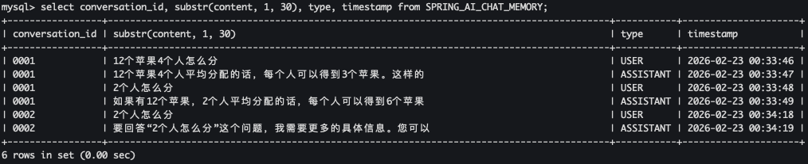

随着大语言模型（LLM）的火热，聊天机器人、智能客服等对话式 AI 应用已经走进了我们的日常生活。但你可能不知道，大多数大模型本身是“健忘”的——它们每次接收请求都是独立的，并不会记住你和它之前聊了什么。为了让 AI 能够像人一样拥有“记忆”，我们需要在应用层面帮它存储和回顾历史对话。Spring AI 作为 Spring 生态中专为 AI 应用开发的利器，提供了一个叫做 ChatMemory 的组件，可以帮我们轻松管理对话历史。今天，我们就来手把手地学习如何使用它，打造一个真正有记忆的智能对话应用。

## 1. 什么是 ChatMemory？

简单来说，`ChatMemory` 就是一个专门用来存储和回忆聊天消息的工具。它就像 AI 的“笔记本”，主要帮我们做这几件事：
- 记下来(存储)：把每次对话中用户说了什么、AI 回复了什么，都存起来。
- 想起来(检索)：在 AI 回答新问题之前，把之前聊过的相关内容拿出来，一起交给 AI 参考。
- 控制篇幅(管理)：限制记忆的长度，避免对话太长导致消耗过多的 tokens。
- 区分不同用户(支持)：可以为不同的对话（比如不同的用户、不同的会话）分别记录，互不干扰。

有了它，AI 就能在连续多轮的对话中保持连贯，比如记住你喜欢的称呼、之前提过的需求等。

## 2. ChatMemory 长什么样？

Spring AI 定义了 `ChatMemory` 接口，位于 `org.springframework.ai.chat.memory` 包中：
```java
public interface ChatMemory {
    String DEFAULT_CONVERSATION_ID = "default";
    String CONVERSATION_ID = "chat_memory_conversation_id";
    // 添加单条消息
    default void add(String conversationId, Message message) {
        Assert.hasText(conversationId, "conversationId cannot be null or empty");
        Assert.notNull(message, "message cannot be null");
        this.add(conversationId, List.of(message));
    }
    // 添加多条消息（比如一次交互的用户消息和AI回复）
    void add(String conversationId, List<Message> messages);
    // 获取某个会话的历史消息
    List<Message> get(String conversationId);
    // 清空某个会话的历史
    void clear(String conversationId);
}
```
- `add`：向指定会话添加消息列表（通常是一条用户消息 + 一条 AI 响应）。
- `get`：获取某个会话的历史消息。
- `clear`：清空某个会话的历史。

你可以把这个`ChatMemory` 接口想象成一个“记忆盒子”的说明书：只要知道会话的 ID，就能往里面放消息、取消息、清空盒子。

`ChatMemory` 接口允许你实现各种类型的 Chat Memory 以适应不同的场景。Spring AI 已经给我们提供了一种开箱即用的实现：`MessageWindowChatMemory`。它的工作方式就像一个“滑动窗口”——只保留每个会话最近 N 条消息，当消息太多时，会自动把最早的消息丢掉（但会保留系统级别的消息）。默认窗口大小是 20 条，你也可以自己调整：
```java
MessageWindowChatMemory memory = MessageWindowChatMemory.builder()
    .maxMessages(10)
    .build();
```
这个实现的好处是自动管理内存，不用担心无限制增长导致 token 超限。

### 3. 消息要存到哪里？

有了“记忆盒子”，我们还需要一个“仓库”来真正存放消息。Spring AI 提供了 `ChatMemoryRepository` 接口来抽象存储，下面介绍两种实现：内存和数据库。

### 3.1 InMemoryChatMemoryRepository —— 内存存储

`InMemoryChatMemoryRepository` 是最简单的存储方式，它用 `ConcurrentHashMap` 在内存中保存消息。如果不做任何配置，Spring AI 会自动创建一个该类型的 Bean，你直接注入就能用：
```java
@Autowired
ChatMemoryRepository chatMemoryRepository;
```
当然，你也可以手动创建：
```java
ChatMemoryRepository repository = new InMemoryChatMemoryRepository();
```
特点：速度快，适合开发测试或不需要持久化的场景。但应用重启后记忆就会丢失。

### 3.2 JdbcChatMemoryRepository —— 数据库存储（以 MySQL 为例）

如果你希望对话记忆能永久保存，即使重启应用也不丢失，那就可以用 `JdbcChatMemoryRepository` 存储方式，把消息存到关系数据库里。Spring AI 对 MySQL 等常见数据库都提供了支持。要想使用 `JdbcChatMemoryRepository` 首选添加如下依赖到项目中:
```xml
<dependency>
    <groupId>org.springframework.ai</groupId>
    <artifactId>spring-ai-starter-model-chat-memory-repository-jdbc</artifactId>
</dependency>
```
引入依赖之后 Spring AI 会自动创建一个该类型的 Bean，你直接注入就能用:
```java
@Autowired
JdbcChatMemoryRepository chatMemoryRepository;

ChatMemory chatMemory = MessageWindowChatMemory.builder()
  .chatMemoryRepository(chatMemoryRepository)
  .maxMessages(10)
  .build();
```
当然，你也可以手动创建，通过提供 `JdbcTemplate` 实例和 `JdbcChatMemoryRepositoryDialect` 来实现：
```java
ChatMemoryRepository chatMemoryRepository = JdbcChatMemoryRepository.builder()
    .jdbcTemplate(jdbcTemplate)
    .dialect(new PostgresChatMemoryRepositoryDialect())
    .build();

ChatMemory chatMemory = MessageWindowChatMemory.builder()
    .chatMemoryRepository(chatMemoryRepository)
    .maxMessages(10)
    .build();
```

## 4. 动手实践：打造有记忆的聊天服务

接下来，我们通过两个完整的示例，看看如何在 Spring Boot 应用中使用这些组件。我们将使用本地运行的 Ollama 大模型（qwen2.5:7b）作为 AI 引擎。

### 4.1 基于内存存储聊天记忆

#### 4.1.1 添加依赖

首先创建一个 Spring Boot 项目，引入必要的依赖：
```xml
<project xmlns="http://maven.apache.org/POM/4.0.0" xmlns:xsi="http://www.w3.org/2001/XMLSchema-instance"
         xsi:schemaLocation="http://maven.apache.org/POM/4.0.0 http://maven.apache.org/xsd/maven-4.0.0.xsd">
    <modelVersion>4.0.0</modelVersion>
    <parent>
        <groupId>org.springframework.boot</groupId>
        <artifactId>spring-boot-starter-parent</artifactId>
        <version>3.5.11</version>
        <relativePath/> <!-- lookup parent from repository -->
    </parent>

    <artifactId>chat-in-mempry</artifactId>
    <packaging>jar</packaging>

    <name>spring-ai-quickstart</name>
    <url>http://maven.apache.org</url>

    <properties>
        <java.version>17</java.version>
        <spring-ai.version>1.1.2</spring-ai.version>
    </properties>

    <dependencies>
        <!-- Web -->
        <dependency>
            <groupId>org.springframework.boot</groupId>
            <artifactId>spring-boot-starter-web</artifactId>
        </dependency>

        <!-- Ollama -->
        <dependency>
            <groupId>org.springframework.ai</groupId>
            <artifactId>spring-ai-starter-model-ollama</artifactId>
        </dependency>

        <!-- Lombok -->
        <dependency>
            <groupId>org.projectlombok</groupId>
            <artifactId>lombok</artifactId>
            <optional>true</optional>
        </dependency>

        <!-- 测试 -->
        <dependency>
            <groupId>org.springframework.boot</groupId>
            <artifactId>spring-boot-starter-test</artifactId>
            <scope>test</scope>
        </dependency>
    </dependencies>

    <dependencyManagement>
        <dependencies>
            <dependency>
                <groupId>org.springframework.ai</groupId>
                <artifactId>spring-ai-bom</artifactId>
                <version>${spring-ai.version}</version>
                <type>pom</type>
                <scope>import</scope>
            </dependency>
        </dependencies>
    </dependencyManagement>

    <build>
        <plugins>
            <plugin>
                <groupId>org.apache.maven.plugins</groupId>
                <artifactId>maven-compiler-plugin</artifactId>
                <configuration>
                    <annotationProcessorPaths>
                        <path>
                            <groupId>org.projectlombok</groupId>
                            <artifactId>lombok</artifactId>
                        </path>
                    </annotationProcessorPaths>
                </configuration>
            </plugin>
            <plugin>
                <groupId>org.springframework.boot</groupId>
                <artifactId>spring-boot-maven-plugin</artifactId>
                <configuration>
                    <excludes>
                        <exclude>
                            <groupId>org.projectlombok</groupId>
                            <artifactId>lombok</artifactId>
                        </exclude>
                    </excludes>
                </configuration>
            </plugin>
        </plugins>
    </build>
</project>
```


### 4.1.2 配置 ChatMemory 和 ChatClient

我们创建一个配置类，声明一个 `MessageWindowChatMemory` 的 Bean，设置窗口大小为 20 条消息。由于我们没有指定存储仓库，它会默认使用内存存储(`InMemoryChatMemoryRepository`):
```java
@Configuration
public class ChatConfig {
    @Bean
    public ChatMemory chatMemory() {
        return MessageWindowChatMemory.builder()
                .maxMessages(20)
                .build();
    }

    @Bean
    public ChatClient chatClient(OllamaChatModel chatModel, ChatMemory chatMemory) {
        return ChatClient.builder(chatModel)
                .defaultAdvisors(MessageChatMemoryAdvisor.builder(chatMemory).build())
                .build();
    }
}
```
这里的 advisors 就是告诉 ChatClient 使用我们之前配置的 ChatMemory。这样，每次请求时，ChatClient 会自动从 ChatMemory 中取出对应会话的历史消息，连同当前用户消息一起发给 AI，并把 AI 的回复再存回记忆里。

#### 4.1.3 配置文件

在 `application.yml` 中配置 Ollama 的连接信息和模型参数:
```
server:
  port: 8888

spring:
  application:
    name: ollama-example
  ai:
    ollama:
      base-url: http://localhost:11434
      chat:
        options:
          model: qwen2.5:7b             # ← 改这里就切换模型
          temperature: 0.75
          top-p: 0.9
          max-tokens: 4096
```

#### 4.1.4 创建聊天服务

我们写一个简单的 Controller，注入 Spring AI 的 ChatClient，然后分别提供 `/api/chat` 接口(同步返回) 和 `/chat/stream` 接口(流式返回)，接收用户消息并返回 AI 回复:
```java
@Slf4j
@RestController
@RequestMapping("/api")
public class ChatController {
    @Autowired
    private ChatClient chatClient;

    @GetMapping("/chat")
    public String chat(@RequestParam(value = "id") String conversationId,
                       @RequestParam(value = "message", defaultValue = "你是谁") String message) {
        String response = chatClient
                .prompt()
                // 通过监听器传入会话ID
                .advisors(a -> a.param(ChatMemory.CONVERSATION_ID, conversationId))
                .user(message)
                .call()
                .content();
        log.info("response : {}", response);
        return response;
    }

    @GetMapping(value = "/chat/stream", produces = "text/plain;charset=UTF-8")
    public Flux<String> chatStream(@RequestParam(value = "id") String conversationId,
                                   @RequestParam(value = "message", defaultValue = "你是谁") String message) {
        return chatClient
                .prompt()
                // 通过监听器传入会话ID
                .advisors(a -> a.param(ChatMemory.CONVERSATION_ID, conversationId))
                .user(message)
                .stream()
                .content();
    }
}
```

#### 4.1.5 测试

启动应用，访问 `http://localhost:8888/api/chat?message=12个苹果4个人怎么分&id=0001`，你会得到 AI 的问候:
```
如果12个苹果要平均分给4个人，那么每个人可以得到3个苹果。你可以将这12个苹果依次分配给每个人，每人获得3个，直到所有苹果都被公平地分配完。这样每个人拿到的苹果数量相同，做到了平均分配。
```
接着访问 `http://localhost:8888/api/chat?message=2个人怎么分&id=0001`（注意会话 id 相同），AI 会记得刚才的话题：
```
如果12个苹果要平均分给2个人，那么每个人可以得到6个苹果。你可以将这12个苹果依次分配给两个人，每人获得6个，直到所有苹果都被公平地分配完。这样每个人拿到的苹果数量相同，做到了平均分配。
```
AI 真的记住了！而且如果换一个会话 id=0002，它就不会记得之前的对话(AI 会重新开始对话)，实现了会话隔离:
```
要更具体地回答您的问题，我需要更多的信息。您是想要知道如何公平地分配某种东西（比如钱、食物或其他物品）给两个人吗？如果是这样，请告诉我您想分配的具体是什么，以及是否有任何特定的限制或要求。这样我可以提供更有帮助的建议。
```
> `http://localhost:8888/api/chat?message=2个人怎么分&id=0002`


### 4.2 基于MySQL存储聊天记忆

内存存储虽然简单，但应用重启后记忆就没了。如果我们希望长期保存对话，可以用数据库。Spring AI 提供了 `JdbcChatMemoryRepository`，只需稍加配置即可。

#### 4.2.1 依赖

除了之前的依赖，还需要加入:
```xml
<!-- Chat Memory -->
<dependency>
    <groupId>org.springframework.ai</groupId>
    <artifactId>spring-ai-starter-model-chat-memory-repository-jdbc</artifactId>
</dependency>

<!-- MySQL 驱动-->
<dependency>
    <groupId>com.mysql</groupId>
    <artifactId>mysql-connector-j</artifactId>
    <scope>runtime</scope>
</dependency>
```

#### 4.2.2 配置文件

在 `application.yml` 中增加数据库连接配置，并指定初始化数据库表（Spring AI 会自动执行建表脚本）:
```
server:
  port: 8888
spring:
  application:
    name: chat-jdbc-memory
  ai:
    ollama:
      base-url: http://localhost:11434
      chat:
        options:
          model: qwen2.5:7b             # ← 改这里就切换模型
          temperature: 0.75
          top-p: 0.9
          max-tokens: 4096
    chat:
      # ChatMemory
      memory:
          repository:
            jdbc:
              # 是否对数据库进行初始化：embedded-仅初始化嵌入数据库，always：初始化所有数据库, never: 不初始化
              initialize-schema: always
              # 初始化数据库脚本的路径
              schema: classpath:org/springframework/ai/chat/memory/repository/jdbc/schema-mysql.sql
              # 平台(数据库类型)
              platform: mysql
  datasource:
    # MySQL 数据库配置
    driver-class-name: com.mysql.cj.jdbc.Driver
    url: jdbc:mysql://localhost:3306/llm?useUnicode=true&characterEncoding=UTF-8&autoReconnect=true
    username: root
    password: root
```
> 注意：需要提前创建好数据库（比如 llm），Spring AI 会在启动时执行建表语句，创建一张 SPRING_AI_CHAT_MEMORY 表。

#### 4.2.3 配置 ChatMemory 和 ChatClient

这次我们需要把 `JdbcChatMemoryRepository` 注入到 `MessageWindowChatMemory` 中，同时构建带记忆的 ChatClient:
```java
@Configuration
public class ChatConfig {
    @Autowired
    private JdbcChatMemoryRepository chatMemoryRepository;

    @Bean
    public ChatMemory chatMemory() {
        return MessageWindowChatMemory.builder()
                .chatMemoryRepository(chatMemoryRepository)
                .maxMessages(20)
                .build();
    }

    @Bean
    public ChatClient chatClient(OllamaChatModel chatModel, ChatMemory chatMemory) {
        return ChatClient.builder(chatModel)
                .defaultAdvisors(MessageChatMemoryAdvisor.builder(chatMemory).build())
                .build();
    }
}
```
#### 4.2.4 创建聊天服务

与内存版类似，只是请求路径不同（这里用 `/api/jdbc/chat`），同样需要传入会话Id：
```java
@Slf4j
@RestController
@RequestMapping("/api/jdbc")
public class ChatController {
    @Autowired
    private ChatClient chatClient;

    @GetMapping("/chat")
    public String chat(@RequestParam(value = "id") String conversationId,
                       @RequestParam(value = "message", defaultValue = "你是谁") String message) {
        String response = chatClient.prompt()
                // 通过监听器传入会话ID
                .advisors(a -> a.param(ChatMemory.CONVERSATION_ID, conversationId))
                .user(message)
                .call()
                .content();
        log.info("response : {}", response);
        return response;
    }

    @GetMapping(value = "/chat/stream", produces = "text/plain;charset=UTF-8")
    public Flux<String> chatStream(@RequestParam(value = "id") String conversationId,
                                   @RequestParam(value = "message", defaultValue = "你是谁") String message) {
        return chatClient
                .prompt()
                // 通过监听器传入会话ID
                .advisors(a -> a.param(ChatMemory.CONVERSATION_ID, conversationId))
                .user(message)
                .stream()
                .content();
    }
}
```

#### 4.2.5 测试

启动应用，访问 `http://localhost:8888/api/jdbc/chat?message=12个苹果4个人怎么分&id=0001`，你会得到 AI 的问候:
```
12个苹果4个人平均分配的话，每个人可以得到3个苹果。这样的分配方法公平且简单，可以让每个人都获得相同的份额。当然，根据实际情况，也可以采用其他方式进行分享，比如轮流挑选、随机抽取等方法来决定每个人的苹果数量和种类，以增加分享的乐趣或者满足不同人的偏好。
```
接着访问 `http://localhost:8888/api/jdbc/chat?message=2个人怎么分&id=0001`，（注意会话 id 相同），AI 会记得刚才的话题：
```
如果有12个苹果，2个人平均分配的话，每个人可以得到6个苹果。这样的分配方法确保了公平性，每个人都得到了相同的份额。
```
AI 真的记住了！而且如果换一个会话 id=0002，它就不会记得之前的对话(AI 会重新开始对话)，实现了会话隔离:
```
要回答“2个人怎么分”这个问题，我需要更多的具体信息。您可以提供一些背景或者详细说明一下是关于什么事物或资源的分配？例如：

- 是指如何公平地分配一块蛋糕？
- 还是在讨论两个人如何共享一个项目任务？
- 或者是在探讨两种不同的资源（如时间、金钱）应该如何分配？

不同的情况需要采用不同的方法来解决。请提供更多信息，以便我能给出更准确的帮助和建议。
```
> `http://localhost:8888/api/jdbc/chat?message=2个人怎么分&id=0002`

此时去数据库里查看 `SPRING_AI_CHAT_MEMORY` 表，会发现消息已经被持久化:



## 5. 总结

通过本文的介绍，我们了解了 Spring AI 中 ChatMemory 的核心概念，以及如何利用它给大模型应用赋予记忆能力。无论是简单的内存存储，还是需要持久化的数据库存储，Spring AI 都提供了简洁的抽象和开箱即用的实现。借助 MessageChatMemoryAdvisor，我们只需几行代码就能让 ChatClient 自动管理对话历史，真正做到智能、连贯的对话。

未来，Spring AI 还会支持更多存储后端（如 PostgreSQL、MongoDB），甚至提供更高级的记忆策略（如摘要记忆、实体记忆）。让我们一起期待，并用这些工具打造更智能的 AI 应用吧！
