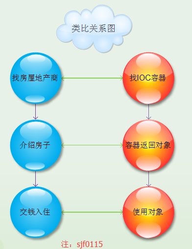

IoC（Inversion of Control）控制反转。在 Java 开发中，IoC 意味着控制权的转移，应用程序本身不负责依赖对象的创建和维护。而是由外部容器负责创建和维护。

2004年，Martin Fowler 探讨了同一个问题，既然 IoC 是控制反转，那么到底是"哪些方面的控制被反转了呢？"，经过详细的分析和论证后，得出答案："获得依赖对象的过程被反转了"。控制被反转之后，获得依赖对象的过程由自身管理变为了由 IoC 容器主动注入。于是他给"控制反转"取了一个更合适的名字，叫做"依赖注入"。他的这个答案，实际上给出了实现 IoC 的方法：注入。所谓依赖注入，就是由 IoC 容器在运行期间，动态的将某种依赖关系注入到对象之中。
- 控制权的转变：IoC意味着控制权的转移，应用程序本身不负责依赖对象的创建和维护，而是由外部容器负责创建和维护；传统Java SE程序设计，我们直接在对象内部通过new进行创建对象，是程序主动去创建依赖对象；现在IoC是有专门一个容器来创建这些对象，即由IoC容器来控制对象的创建；
- 何是反转：传统应用程序是由我们自己在对象中主动控制去直接获取依赖对象，也就是正转；而反转则是由容器来帮忙创建及注入依赖对象；

我们拿一个现实生活中的例子来说明：没有房屋地产商的时候，我们结婚需要房子住，怎么办呢？只能去自己盖一个房子。现在情况不同了，有了房屋地产商，我们自己不需要盖房子，只需要房屋地产商盖完房子，交上钱，挑一套自己喜欢的住就可以了。房屋地产商联系了我们与房子之间的关系，相对应的，IoC容器联系了对象与依赖对象之间的关系。

那具体什么是 IoC 容器呢？它在 Spring 框架中到底长什么样？说了这么多，其实对 IoC 容器的使用者来说，我们常常接触到的 BeanFactory 和 ApplicationContext 都可以看成是容器的具体表现形式。这些就是 IoC 容器，或者说在 Spring 中提 IoC 容器，从实现来说，指的是一个容器系列。这也就是说，我们通常所说的 IoC 容器，如果深入到 Spring 的实现去看，会发现 IoC 容器实际上代表着一系列功能各异的容器产品。只是容器的功能有大有小，有各自的特点。打个比方来说，就像是百货商店里出售的商品，我们举水桶为例子，在商店中出售的水桶有大有小；制作材料也各不相同，有金属的，有塑料的等等，总之是各式各样，但只要能装水，具备水桶的基本特性，那就可以作为水桶来出售来让用户使用。这在 Spring 中也是一样，它有各式各样的 IoC 容器的实现供用户选择和使用；使用什么样的容器完全取决于用户的需要，但在使用之前如果能够了解容器的基本情况，那会对容器的使用是非常有帮助的；就像我们在购买商品时进行的对商品的考察和挑选那样。

从上面叙述中也可以看出，并不存在单一的 Spring 容器。Spring 容器自带了几种容器实现，可以归纳为两种类型：
- Bean 工厂（Bean Factory，由org.springframework.beans.factory.BeanFactory 接口定义）是最简单的容器，提供基本的 DI 支持；
- 应用上下文（application由org.springframework.context.ApplicationContext 接口定义）；

基于 BeanFactory 之上构建，并提供面向应用的服务，例如从属性文件解析文本信息的能力，以及发布应用事件给感兴趣的事件监听者的能力。 虽然我们可以在Bean 工厂和应用上下文两者之间任选一种，但Bean 工厂对于大多数应用来说往往太低级了，因此应用上下文要比Bean 工厂更受欢迎。我们会把精力集中在应用上下文的使用上，不再浪费时间讨论Bean 工厂。

public class BookServiceImpl implements BookService {
    private BookDao bookDao;

    @Override
    public void save() {
        System.out.println("bookService save ....");
        bookDao.save();
    }

    // 通过 setter 方法实现依赖注入
    public void setBookDao(BookDao bookDao) {
        this.bookDao = bookDao;
    }
}
