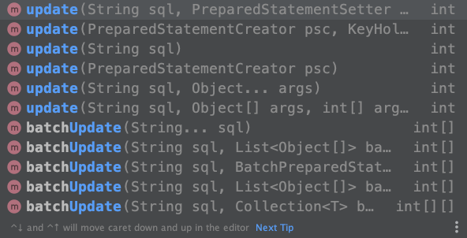
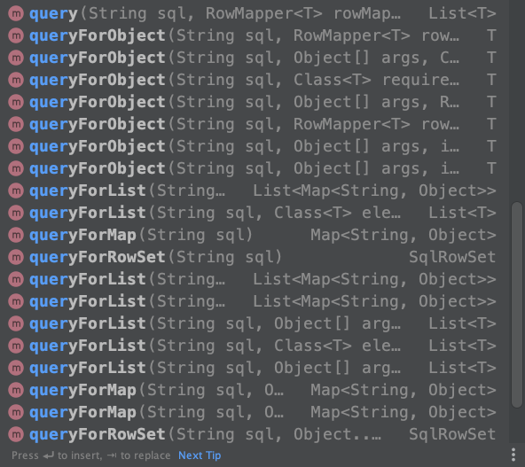

## 1. 什么是 JdbcTemplate

大家先回顾一下我们是如何操作数据库的？一般使用 JDBC 接口直接访问关系数据库，具体如下所示：
```java
Connection conn = null;
try {
    // JDBC4 之后不需要再显式通过 Class.forName 注册驱动
    // Class.forName(DRIVER);
    // 1. 获得数据库连接
    conn = DriverManager.getConnection(URL, "root", "root");
    // 2. 创建 PreparedStatement
    PreparedStatement statement = conn.prepareStatement(sql);
    // 3. 执行查询
    ResultSet rs = statement.executeQuery();
    // 遍历查询结果
    while(rs.next()){
        int id  = rs.getInt("id");
        ...
    }
} catch (SQLException e) {
    e.printStackTrace();
} finally {
    // 4. 关闭连接
    try {
        if (!Objects.equals(conn, null)) {
            conn.close();
        }
    } catch (SQLException e) {
        e.printStackTrace();
    }
}
```
> 详细代码请查阅：[JdbcSelectExample](https://github.com/sjf0115/common-example/blob/master/jdbc/src/main/java/com/jdbc/example/mysql/JdbcSelectExample.java)

通过 JDBC 接口访问数据库每次需要获取数据库连接、创建 PreparedStatement、执行SQL查询，最后关闭连接等等，操作还是比较繁琐的。Spring 为我们提供了一个对象，对 Jdbc 操作进行了封装，使其更简单。这就是本文要讲的 Spring JdbcTemplate。

Spring JdbcTemplate 具体是什么呢？Spring JdbcTemplate 是 Spring 框架中提供的一个对象，是对原始 JDBC API 对象的简单封装。用于和数据库交互，实现对表的 CRUD 操作。好处是 Spring 为我们提供了很多的操作模板，例如操作关系型数据的 JdbcTemplate 和 HibernateJdbcTemplate，操作 NoSQL 数据库的 RedisTemplate，操作消息队列的 JmsTemplate 等。

## 2. 快速入门

### 2.1 添加坐标依赖

在这关系型数据库我们选择的是 MySQL，所以需要引入 MySQL 的坐标依赖：
```xml
<dependency>
    <groupId>mysql</groupId>
    <artifactId>mysql-connector-java</artifactId>
    <version>8.0.22</version>
</dependency>
```
在这使用 Spring JdbcTemplate 来操作关系型数据库，需要引入 Spring 的相关坐标依赖：
```xml
<!-- Spring -->
<dependency>
    <groupId>org.springframework</groupId>
    <artifactId>spring-jdbc</artifactId>
    <version>5.2.10.RELEASE</version>
</dependency>

<dependency>
    <groupId>org.springframework</groupId>
    <artifactId>spring-context</artifactId>
    <version>5.2.10.RELEASE</version>
</dependency>

<dependency>
    <groupId>org.springframework</groupId>
    <artifactId>spring-tx</artifactId>
    <version>5.2.10.RELEASE</version>
</dependency>
```

### 2.2 创建数据库表和实体类

创建如下数据库表：
```sql
CREATE TABLE `tb_book` (
    `id` int(11) NOT NULL AUTO_INCREMENT,
    `type` varchar(20) DEFAULT NULL,
    `name` varchar(50) DEFAULT NULL,
    `description` varchar(255) DEFAULT NULL,
    PRIMARY KEY (`id`) USING BTREE
) ENGINE=InnoDB DEFAULT CHARSET=utf8;
```
创建如下实体类：
```java
public class Book {
    private Integer id;
    private String type;
    private String name;
    private String description;

    public Book() {
    }

    public Book(Integer id, String type, String name, String description) {
        this.id = id;
        this.type = type;
        this.name = name;
        this.description = description;
    }

    public Integer getId() {
        return id;
    }

    public void setId(Integer id) {
        this.id = id;
    }

    public String getType() {
        return type;
    }

    public void setType(String type) {
        this.type = type;
    }

    public String getName() {
        return name;
    }

    public void setName(String name) {
        this.name = name;
    }

    public String getDescription() {
        return description;
    }

    public void setDescription(String description) {
        this.description = description;
    }

    @Override
    public String toString() {
        return "Book{" +
                "id=" + id +
                ", type='" + type + '\'' +
                ", name='" + name + '\'' +
                ", description='" + description + '\'' +
                '}';
    }
}
```
### 2.3 使用 JdbcTemplate 访问数据库

使用 JdbcTemplate 访问数据库可以简化为三步：第一步创建数据源(使用 Spring 内置的数据源 DriverManagerDataSource)，第二步创建 JDBCTemplate，最后一步执行 SQL 即可：
```java
// 1. 创建数据源 Spring 内置的数据源
DriverManagerDataSource dataSource = new DriverManagerDataSource();
dataSource.setUrl("jdbc:mysql://localhost:3306/test?useSSL=false&characterEncoding=utf8");
dataSource.setDriverClassName("com.mysql.jdbc.Driver");
dataSource.setUsername("root");
dataSource.setPassword("root");

// 2. 创建 JDBCTemplate
JdbcTemplate template = new JdbcTemplate();
template.setDataSource(dataSource);

// 3. 执行 SQL
template.execute("INSERT INTO tb_book (type, name, description) VALUES('计算机理论', '深入理解 MyBatis', '好书')");
```

> 详细代码请查阅：[JDBCTemplateExample](https://github.com/sjf0115/spring-example/blob/main/spring-jdbc/src/main/java/com/spring/example/jdbc/JDBCTemplateExample.java)

## 3. Spring 操作 JdbcTemplate

上面是我们自己手动在应用程序中创建模板对象 JdbcTemplate 和数据源 DataSource，一般来说应用程序本身不负责依赖对象的创建和维护，而是交由 Spring 来创建和维护。所以我们可以将模板对象 JdbcTemplate 和数据源 DataSource 的创建权交给 Spring，在 Spring 容器内部将数据源 DataSource 注入到 JdbcTemplate 模板对象中，具体配置如下所示：
```xml
<?xml version="1.0" encoding="UTF-8"?>
<beans xmlns="http://www.springframework.org/schema/beans"
       xmlns:xsi="http://www.w3.org/2001/XMLSchema-instance"
       xsi:schemaLocation="http://www.springframework.org/schema/beans http://www.springframework.org/schema/beans/spring-beans.xsd">

    <!--  配置 JDBCTemplate  -->
    <bean id="jdbcTemplate" class="org.springframework.jdbc.core.JdbcTemplate">
        <property name="dataSource" ref="dataSource"/>
    </bean>

    <!--  配置数据源  -->
    <bean id="dataSource" class="org.springframework.jdbc.datasource.DriverManagerDataSource">
        <property name="driverClassName" value="com.mysql.jdbc.Driver"/>
        <property name="url" value="jdbc:mysql://localhost:3306/test?useSSL=false&amp;characterEncoding=utf8"/>
        <property name="username" value="root"/>
        <property name="password" value="root"/>
    </bean>
</beans>
```
配置上面之后我们实际执行一下，首先加载配置文件创建容器对象，根据容器对象获取模板对象 JDBCTemplate，最后直接执行 SQL 语句即可：
```java
// 加载配置文件得到上下文对象 即 容器对象
ApplicationContext ctx = new ClassPathXmlApplicationContext("applicationContext-xml.xml");
// 获取 JDBCTemplate 数据源是通过 XML 注入
JdbcTemplate template = (JdbcTemplate) ctx.getBean("jdbcTemplate");

// 执行 SQL
template.execute("INSERT INTO tb_book (type, name, description) VALUES('计算机理论', '深入理解 MyBatis', '好书')");
```

> 详细代码请查阅：[JDBCTemplateXMLExample](https://github.com/sjf0115/spring-example/blob/main/spring-jdbc/src/main/java/com/spring/example/jdbc/JDBCTemplateXMLExample.java)

## 4. JdbcTemplate 常见操作

JdbcTemplate 中以 update 开头的方法，用来执行增、删、改操作：



以 query 开头的方法，用来执行查询操作：



| 方法 | 说明 |
| :------------- | :------------- |
| execute | 单语句执行，一般用来执行 DDL 语句 |
| query | 将查询结果集封装为 JavaBean 对象 |
| queryForObject | 将查询结果集封装为对象 |
| queryForList | 将查询结果集封装为 List 集合 |
| queryForMap | 将查询结果集封装为 Map 集合 |
| queryForRowSet | 将查询结果集封装为 SqlRowSet |
| update | 执行单语句的更新操作，一般用来执行插入、更新或删除语句 |
| batchUpdate | 批量执行多个更新操作 |


### 4.1 DDL

可以使用 execute 方法来执行 DDL 操作，例如如下所示的创建表和删除表操作：
```java
// 加载配置文件得到上下文对象 即 容器对象
ApplicationContext ctx = new ClassPathXmlApplicationContext("applicationContext-xml.xml");
// 获取 JDBCTemplate 数据源是通过 XML 注入
JdbcTemplate template = (JdbcTemplate) ctx.getBean("jdbcTemplate");

// DDL - 创建表
template.execute("CREATE TABLE `tb_book_2` (\n" +
        "    `id` int(11) NOT NULL AUTO_INCREMENT,\n" +
        "    `type` varchar(20) DEFAULT NULL,\n" +
        "    `name` varchar(50) DEFAULT NULL,\n" +
        "    `description` varchar(255) DEFAULT NULL,\n" +
        "    PRIMARY KEY (`id`) USING BTREE\n" +
        ") ENGINE=InnoDB DEFAULT CHARSET=utf8;");

// DDL - 删除表
template.execute("DROP TABLE `tb_book_2`;");
```

> 详细代码请查阅：[JDBCTemplateDDLExample](https://github.com/sjf0115/spring-example/blob/main/spring-jdbc/src/main/java/com/spring/example/jdbc/operations/JDBCTemplateDDLExample.java)

### 4.2 DML-插入

JdbcTemplate 中以 update 开头的方法，用来执行增、删、改操作。update 方法只能执行单语句，如果想批量执行增加、删除、修改操作可以使用 batchUpdate。所以我们可以使用 update 或者 batchUpdate 方法来执行插入操作。先看一个最简单的情况，没有参数直接在 SQL 中写死：
```java
String sql = "INSERT INTO tb_book (type, name, description) VALUES('计算机理论', '深入理解 JdbcTemplate', '1')";
int nums = template.update(sql);
System.out.println("成功插入" + nums + "条记录");
```
一般最常用的还是在 SQL 中动态指定变量，这个使用可以使用 `?` 占位符：
```java
String sql = "INSERT INTO tb_book (type, name, description) VALUES(?, ?, ?)";
String type = "计算机理论";
String name = "深入理解 JdbcTemplate";
String desc = "2";
int nums2 = template.update(sql, type, name, desc);
System.out.println("成功插入" + nums2 + "条记录");
```
此外也还可以通过 PreparedStatementSetter 来设置参数，它是个函数式接口，内部有个 setValues 方法会传递一个 PreparedStatement参数：
```java
String sql = "INSERT INTO tb_book (type, name, description) VALUES(?, ?, ?)";
String type = "计算机理论";
String name = "深入理解 JdbcTemplate";
String desc = "3";
int nums3 = template.update(sql, new PreparedStatementSetter() {
    @Override
    public void setValues(PreparedStatement ps) throws SQLException {
        ps.setString(1, type);
        ps.setString(2, name);
        ps.setString(3, desc);
    }
});
System.out.println("成功插入" + nums3 + "条记录");
```
有时候我们可能还需要返回插入行的自增ID，这个时候可以使用如下语句来获取：
```java
String sql = "INSERT INTO tb_book (type, name, description) VALUES(?, ?, ?)";
String type = "计算机理论";
String name = "深入理解 JdbcTemplate";
String desc = "4";
KeyHolder keyHolder = new GeneratedKeyHolder();
int nums4 = template.update(new PreparedStatementCreator() {
    @Override
    public PreparedStatement createPreparedStatement(Connection con) throws SQLException {
        //手动创建PreparedStatement，注意第二个参数：Statement.RETURN_GENERATED_KEYS
        PreparedStatement ps = con.prepareStatement(sql, Statement.RETURN_GENERATED_KEYS);
        ps.setString(1, type);
        ps.setString(2, name);
        ps.setString(3, desc);
        return ps;
    }
}, keyHolder);
System.out.println("成功插入" + nums4 + "条记录");
System.out.println("新记录id：" + keyHolder.getKey().intValue());
```
上面几个示例一次只能操作一条记录，如果想批量插入多条记录怎么办呢？可以使用 batchUpdate 方法来批量操作，具体如下所示：
```java
String sql = "INSERT INTO tb_book (type, name, description) VALUES(?, ?, ?)";
List<Object[]> books = Arrays.asList(
        new Object[]{"计算机理论", "深入理解 JdbcTemplate", "51"},
        new Object[]{"计算机理论", "深入理解 JdbcTemplate", "52"},
        new Object[]{"计算机理论", "深入理解 JdbcTemplate", "53"},
        new Object[]{"计算机理论", "深入理解 JdbcTemplate", "54"});
int[] numsBatch = template.batchUpdate(sql, books);
for (int num : numsBatch) {
    System.out.println("批量插入" + num + "条记录");
}
```

> 详细代码请查阅：[JDBCTemplateInsertExample](https://github.com/sjf0115/spring-example/blob/main/spring-jdbc/src/main/java/com/spring/example/jdbc/operations/JDBCTemplateInsertExample.java)

### 4.2 DML-删除

JdbcTemplate 中删除操作与插入操作一样，都是以 update 开头的方法来执行单语句操作，使用 batchUpdate 执行批量操作。下面具体演示一个删除操作，详细可以参考插入操作：
```java
// 加载配置文件得到上下文对象 即 容器对象
ApplicationContext ctx = new ClassPathXmlApplicationContext("applicationContext-xml.xml");
// 获取 JDBCTemplate 数据源是通过 XML 注入
JdbcTemplate template = (JdbcTemplate) ctx.getBean("jdbcTemplate");

// 执行 SQL
int startId = 15;
int endId = 24;
int nums = template.update("DELETE FROM tb_book WHERE id >= ? AND id <= ?", startId, endId);
System.out.println("成功删除" + nums + "条记录");
```

> 详细代码请查阅：[JDBCTemplateDeleteExample](https://github.com/sjf0115/spring-example/blob/main/spring-jdbc/src/main/java/com/spring/example/jdbc/operations/JDBCTemplateDeleteExample.java)

### 4.3 DML-修改

JdbcTemplate 中修改操作与插入操作一样，都是以 update 开头的方法来执行单语句操作，使用 batchUpdate 执行批量操作。下面具体演示一个更新操作，详细可以参考插入操作：
```java
// 加载配置文件得到上下文对象 即 容器对象
ApplicationContext ctx = new ClassPathXmlApplicationContext("applicationContext-xml.xml");
// 获取 JDBCTemplate 数据源是通过 XML 注入
JdbcTemplate template = (JdbcTemplate) ctx.getBean("jdbcTemplate");

// 执行 SQL
String name = "深入理解 JdbcTemplate";
int id = 26;
int nums = template.update("Update tb_book SET name = ? WHERE id = ?", name, id);
System.out.println("成功更新" + nums + "条记录");
```

> 详细代码请查阅：[JDBCTemplateUpdateExample](https://github.com/sjf0115/spring-example/blob/main/spring-jdbc/src/main/java/com/spring/example/jdbc/operations/JDBCTemplateUpdateExample.java)

### 4.4 DML-查询

#### 4.4.1 queryForObject

> 单行单列 返回单值对象

根据指定的查询 SQL 返回得到一个结果对象，需要指定返回对象的类型以及具体的查询参数：
```java
<T> T queryForObject(String sql, Class<T> requiredType)
<T> T queryForObject(String sql, Class<T> requiredType, @Nullable Object... args)
<T> T queryForObject(String sql, @Nullable Object[] args, Class<T> requiredType)
<T> T queryForObject(String sql, Object[] args, int[] argTypes, Class<T> requiredType)
```
需要注意的是该查询只能查询返回结果是单行单列的查询。返回的结果将直接映射到相应的对象类型。具体如下所示：
```java
String sql = "SELECT name FROM tb_book WHERE id = ?";
String name = template.queryForObject(sql, String.class, 1);
System.out.println(name);
```
此外需要注意的是若 queryForObject 查询无结果时会报错：
```java
Exception in thread "main" org.springframework.dao.EmptyResultDataAccessException: Incorrect result size: expected 1, actual 0
```
即 queryForObject 方法要求必须返回一条记录。

> 单行多列 借助 RowMapper 返回 JavaBean 对象

返回单行单列的情况在业务中比较少见，一般都是要返回多列数据。queryForObject 方法可以借助 RowMapper 返回一个 JavaBean 对象，从而返回多列数据：
```java
<T> T queryForObject(String sql, RowMapper<T> rowMapper)
<T> T queryForObject(String sql, RowMapper<T> rowMapper, @Nullable Object... args)
<T> T queryForObject(String sql, @Nullable Object[] args, RowMapper<T> rowMapper)
<T> T queryForObject(String sql, Object[] args, int[] argTypes, RowMapper<T> rowMapper)
```
RowMapper 会将查询到的一行记录转换为 JavaBean 对象。具体如下示例：
```java
String sql = "SELECT id, type, name, description FROM tb_book WHERE id = ?";
Book book = template.queryForObject(sql, new RowMapper<Book>() {
    @Override
    public Book mapRow(ResultSet rs, int rowNum) throws SQLException {
        Book b = new Book();
        b.setId(rs.getInt(1));
        b.setType(rs.getString(2));
        b.setName(rs.getString(3));
        b.setDescription(rs.getString(4));
        return b;
    }
}, 1);
System.out.println(book);
```
需要注意的是若 queryForObject 查询无结果时同样还会报错。

#### 4.4.2 queryForList

> 多行单列 返回单列 List 对象

上面的方法只能查询单行单列，如果查询多行的话，可以选择 queryForList 方法。根据指定的查询 SQL 返回一个 List 结果对象，需要指定返回对象的类型以及具体的查询参数：
```java
<T> List<T> queryForList(String sql, Class<T> elementType);
<T> List<T> queryForList(String sql, Class<T> elementType, @Nullable Object... args);
<T> List<T> queryForList(String sql, Object[] args, Class<T> elementType);
<T> List<T> queryForList(String sql, Object[] args, int[] argTypes, Class<T> elementType);
```
需要注意的是上面 T 虽然是泛型，但是只支持 Integer 和 String 这种单数据类型，不支持自定义 Bean。所以只能用来查询单列数据。具体看如下示例：
```java
String sql = "SELECT name FROM tb_book WHERE id > ?";
List<String> list = template.queryForList(sql, String.class, 30);
System.out.println(list);
```

#### 4.4.3 queryForMap

> 单行多列 返回多列的 Map 对象

除了可以返回 List 结果对象之外，也可以返回一个 Map 结果对象，需要指定具体的查询参数：
```java
Map<String, Object> queryForMap(String sql)
Map<String, Object> queryForMap(String sql, Object[] args, int[] argTypes)
Map<String, Object> queryForMap(String sql, @Nullable Object... args)
```
需要注意的是 queryForMap 只能返回单条记录，但是可以查询多列字段：
```java
String sql = "SELECT id, name, type FROM tb_book WHERE id = ?";
Map<String, Object> map = template.queryForMap(sql, 30);
for (String k : map.keySet()) {
    System.out.println(k + ":" + map.get(k));
}
```

#### 4.4.4 queryForRowSet

> 多行多列 返回值为 SqlRowSet

根据指定的查询 SQL 返回得到一个 SqlRowSet 对象，可以指定查询参数：
```java
SqlRowSet queryForRowSet(String sql)
SqlRowSet queryForRowSet(String sql, @Nullable Object... args)
SqlRowSet queryForRowSet(String sql, Object[] args, int[] argTypes)
```
SqlRowSet 对象是一个集合对象，也就是说该方法可以查询多条记录。具体如下示例：
```java
String sql = "SELECT id, type, name FROM tb_book WHERE id > ?";
SqlRowSet rowSet = template.queryForRowSet(sql, 30);
while (rowSet.next()) {
    int id = rowSet.getInt(1);
    String type = rowSet.getString(2);
    String name = rowSet.getString(3);
    System.out.println("ID: " + id + ", type: " + type + ", name: " + name);
}
```

#### 4.4.5 query

最后一类方法是 query 方法，相比其他方法功能比较强大。目前可选的方法如下所示：
```java
// RowMapper
<T> List<T> query(String sql, RowMapper<T> rowMapper)
<T> List<T> query(String sql, RowMapper<T> rowMapper, @Nullable Object... args)
<T> List<T> query(String sql, @Nullable Object[] args, RowMapper<T> rowMapper)
<T> List<T> query(String sql, Object[] args, int[] argTypes, RowMapper<T> rowMapper)
<T> List<T> query(String sql, @Nullable PreparedStatementSetter pss, RowMapper<T> rowMapper)
<T> List<T> query(PreparedStatementCreator psc, RowMapper<T> rowMapper)
// ResultSetExtractor
<T> T query(String sql, ResultSetExtractor<T> rse)
<T> T query(String sql, ResultSetExtractor<T> rse, @Nullable Object... args)
<T> T query(String sql, @Nullable Object[] args, ResultSetExtractor<T> rse)
<T> T query(String sql, Object[] args, int[] argTypes, ResultSetExtractor<T> rse)
<T> T query(String sql, @Nullable PreparedStatementSetter pss, ResultSetExtractor<T> rse)
<T> T query(PreparedStatementCreator psc, ResultSetExtractor<T> rse)
// RowCallbackHandler
void query(String sql, RowCallbackHandler rch)
void query(String sql, RowCallbackHandler rch, @Nullable Object... args)
void query(String sql, @Nullable Object[] args, RowCallbackHandler rch)
void query(String sql, Object[] args, int[] argTypes, RowCallbackHandler rch)
void query(PreparedStatementCreator psc, RowCallbackHandler rch)
void query(String sql, @Nullable PreparedStatementSetter pss, RowCallbackHandler rch)
```

对于 query 方法的使用，根据结果的不同处理方式划分如下三种：
- RowMapper
- ResultSetExtractor
- RowCallbackHandler

##### 4.4.5.1 RowMapper

上面介绍过借助 RowMapper 可以将一行数据库记录转换为 JavaBean 对象，从而实现输出多列数据。具体如下所示：
```java
String sql = "SELECT id, type, name, description FROM tb_book WHERE id > ?";
List<Book> books = template.query(sql, new RowMapper<Book>() {
    @Override
    public Book mapRow(ResultSet rs, int rowNum) throws SQLException {
        Book b = new Book();
        b.setId(rs.getInt(1));
        b.setType(rs.getString(2));
        b.setName(rs.getString(3));
        b.setDescription(rs.getString(4));
        return b;
    }
}, 10);
```

##### 4.4.5.2 ResultSetExtractor

也可以借助 ResultSetExtractor 将多行数据库记录转换为 JavaBean List 对象，从而实现输出多行多列数据。具体如下所示：
```java
String sql = "SELECT id, type, name, description FROM tb_book WHERE id > ?";
List<Book> books = template.query(sql, new ResultSetExtractor<List<Book>>() {
    @Override
    public List<Book> extractData(ResultSet rs) throws SQLException, DataAccessException {
        List<Book> books = new ArrayList<>();
        while (rs.next()) {
            Book b = new Book();
            b.setId(rs.getInt(1));
            b.setType(rs.getString(2));
            b.setName(rs.getString(3));
            b.setDescription(rs.getString(4));
            books.add(b);
        }
        return books;
    }
}, 10);
```
可以看到与 RowMapper 的区别是：RowMapper 每次只传入一条记录，n次转换；而 ResultSetExtractor 方式是传入全部记录，1次转换。

##### 4.4.5.3 RowCallbackHandler

此外还有一种 RowCallbackHandler 回调方式，这种方式下 query 方法不返回结果，但是需要传入一个回调对象，查询到结果之后，会自动调用。具体如下所示：
```java
String sql = "SELECT id, type, name, description FROM tb_book WHERE id > ?";
template.query(sql, new RowCallbackHandler() {
    @Override
    public void processRow(ResultSet rs) throws SQLException {
        while (rs.next()) {
            Book book = new Book();
            book.setId(rs.getInt(1));
            book.setType(rs.getString(2));
            book.setName(rs.getString(3));
            book.setDescription(rs.getString(4));
            System.out.println(book);
        }
    }
},10);
```

> 详细代码请查阅：[JDBCTemplateSelectExample](https://github.com/sjf0115/spring-example/blob/main/spring-jdbc/src/main/java/com/spring/example/jdbc/operations/JDBCTemplateSelectExample.java)
