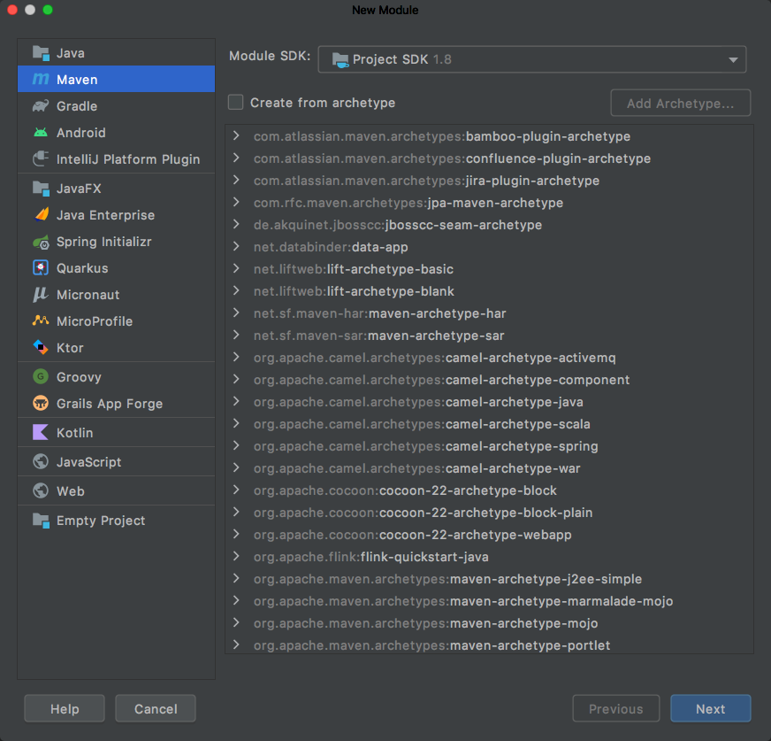
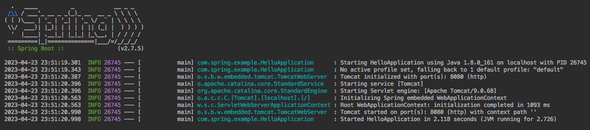
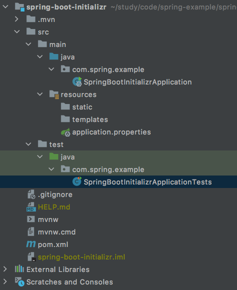

## 1. 手动方式搭建

在快速入门项目中我们要搭建一个 SpringBoot Web 工程，实现调用 hello 接口返回 `Hello SpringBoot!`。

### 1.1 创建 Maven 工程

在这我们创建一个名为 `spring-boot-hello` 的 Maven 模块 module，其他不需要选择什么：



### 1.2 添加依赖

创建好项目之后需要添加如下依赖：
```xml
<!-- SpringBoot工程需要继承的父工程 -->
<parent>
    <groupId>org.springframework.boot</groupId>
    <artifactId>spring-boot-starter-parent</artifactId>
    <version>2.7.5</version>
</parent>

<dependencies>
    <!-- Web开发需要的起步依赖 -->
    <dependency>
        <groupId>org.springframework.boot</groupId>
        <artifactId>spring-boot-starter-web</artifactId>
    </dependency>
</dependencies>
```

### 1.3 定义 Controller

为了实现调用 hello 接口返回 `Hello SpringBoot!`，需要实现一个 `HelloController`：
```java
package com.spring.example.controller;

import org.springframework.web.bind.annotation.RequestMapping;
import org.springframework.web.bind.annotation.RestController;

@RestController
public class HelloController {
    @RequestMapping("/hello")
    public String hello() {
        return "Hello SpringBoot!";
    }
}
```

### 1.4 编写引导类

最后还需要创建 SpringBoot 项目的程序入口，即引导类：
```java
package com.spring.example;

import org.springframework.boot.SpringApplication;
import org.springframework.boot.autoconfigure.SpringBootApplication;

@SpringBootApplication
public class HelloApplication {
    public static void main(String[] args) {
        SpringApplication.run(HelloApplication.class, args);
    }
}
```

### 1.5 测试

直接运行引导类 HelloApplication 的 main 方法即可，输出如下运行信息：



启动成功之后，在浏览器中访问 hello 接口(`http://localhost:8080/hello`)：
```
Hello SpringBoot!
```
看到上面信息表示我们的 SpringBoot Hello 项目构建成功了。

> 完整代码请查阅 []()

## 2. Spring Initializr 快速搭建

此外我们还可以通过 Spring Initializr 来快速搭建一个 SpringBoot 项目，无需手动添加上述 pom 依赖，也无需自己编写引导类，相对更方便一些。在这里我们要搭建一个 SpringBoot Web 工程，实现调用 hello 接口返回 `Hello SpringBoot Initializr!`。

### 2.1 创建工程

通过 Spring Initializr 快速搭建点击 Spring Initializr 选项而不是 Maven 选项：


这里我们创建的是 Web工程，所以选中 web 即可：


创建完毕，SpringBoot 会自动配置好我们需要的依赖以及相关目录：



自动生成的引导类如下所示：
```java
package com.spring.example;

import org.springframework.boot.SpringApplication;
import org.springframework.boot.autoconfigure.SpringBootApplication;

@SpringBootApplication
public class SpringBootInitializrApplication {
    public static void main(String[] args) {
        SpringApplication.run(SpringBootInitializrApplication.class, args);
    }
}
```

### 2.2 定义 Controller

为了实现调用 hello 接口返回 `Hello SpringBoot Initializr!`，需要实现一个 `HelloController`，如下所示：
```java
package com.spring.example.controller;

import org.springframework.web.bind.annotation.RequestMapping;
import org.springframework.web.bind.annotation.RestController;

@RestController
public class HelloController {
    @RequestMapping("/hello")
    public String hello() {
        return "Hello SpringBoot Initializr!";
    }
}
```

### 2.3 测试

直接运行引导类 SpringBootInitializrApplication 的 main 方法即可，输出如下运行信息：


启动成功之后，在浏览器中访问 hello 接口(`http://localhost:8080/hello`)：
```
Hello SpringBoot Initializr!
```
看到上面信息表示我们的 SpringBoot Initializr 项目构建成功了。
