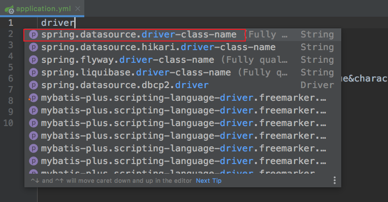
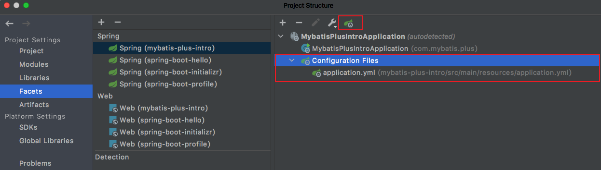
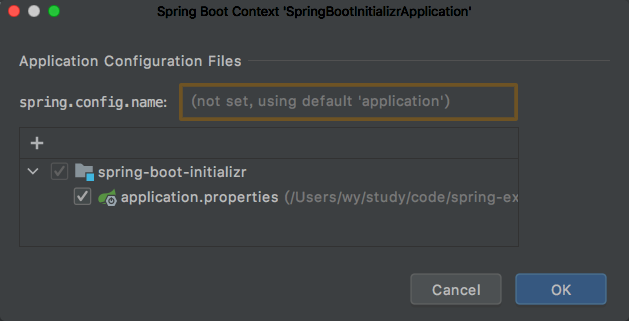

在开发 Spring Boot 应用过程中，我们希望在 application.yml 配置文件中 idea 会给我们进行提示，比如我们输入 `driver` 会自动提示出我们想要的 `spring.datasource.driver-class-name: `，如下所示：

但是由于各种各样的原因导致配置文件中没有提示。首先需要明确的是自动提示功能不是 SpringBoot 技术给我们提供的，而是 idea 给我们提供的。自动提示功能消失的原因可能比较多，在这我们主要解决的是 idea 认为我们写的配置文件不是一个配置文件，所以不提供自动提示功能。那我们如何解决这个问题呢？

首先打开设置，`Files`→`Project Structure`，在在弹出窗口的左侧选择 `Facets`，右侧 `Spring` 下选择自动提示功能消失的模块名称，在这我们的模块名称为 `spring-boot-initializer`：

正常情况下我们是可以看到当前模块对应的配置文件的：

如果没有看到模块对应的配置文件，那么导致无法自动提示原因可能就是在这。需要我们自己手动配置一下，点击 `Customize Spring Boot` 按钮（可以先点击一下引导类，否这是灰色不可点击状态）：

然后点击 `+` 选择我们的配置文件：

到此我们就配置完了，现在验证一下是否有了自动提示功能，比如，我们想修改一下端口号：

从上图中可以看到有了自动提示功能。
