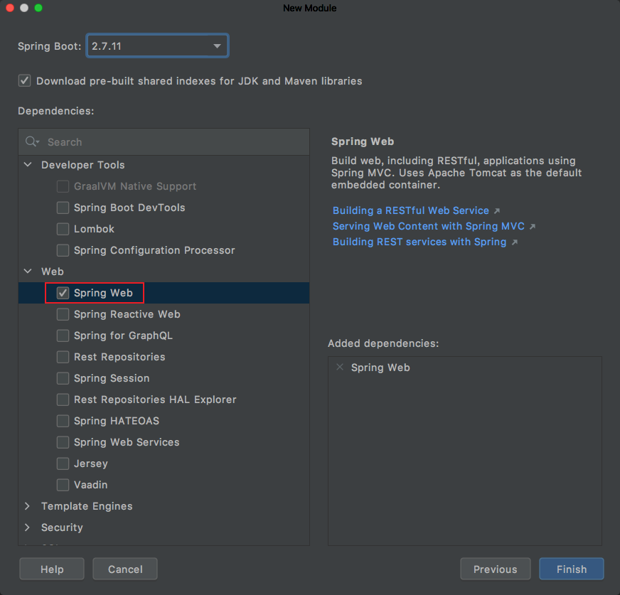

## 1. 创建工程

首先通过 Spring Initializr 来快速搭建一个 SpringBoot 项目，部分 pom 依无需手动添加赖，也无需自己编写引导类，相对更方便一些。通过 Spring Initializr 快速搭建点击 Spring Initializr 选项而不是 Maven 选项：


这里我们创建的是 Web工程，所以选中 web 即可：



此外还需要选中 MyBatis 和 MySQL。

工程创建之后会自动生成的引导类如下所示：
```java
package com.spring.example;

import org.springframework.boot.SpringApplication;
import org.springframework.boot.autoconfigure.SpringBootApplication;

@SpringBootApplication
public class SpringBootInitializrApplication {
    public static void main(String[] args) {
        SpringApplication.run(SpringBootInitializrApplication.class, args);
    }
}
```
最终依赖如下所示：
```xml
<!-- Web开发需要的起步依赖 -->
<dependency>
    <groupId>org.springframework.boot</groupId>
    <artifactId>spring-boot-starter-web</artifactId>
</dependency>

<!-- 集成 MyBatis -->
<dependency>
    <groupId>org.mybatis.spring.boot</groupId>
    <artifactId>mybatis-spring-boot-starter</artifactId>
    <version>${mybatis.spring.version}</version>
</dependency>

<!-- MySQL 数据驱动 -->
<dependency>
    <groupId>mysql</groupId>
    <artifactId>mysql-connector-java</artifactId>
</dependency>

<!-- 其他依赖 -->

<!-- Lombok -->
<dependency>
    <groupId>org.projectlombok</groupId>
    <artifactId>lombok</artifactId>
</dependency>
```

## 2. 配置数据源与 MyBatis 参数

在 `application.yml` 中配置数据源与MyBatis参数如下所示：
```
spring:
  datasource:
    driver-class-name: com.mysql.cj.jdbc.Driver
    url: jdbc:mysql://localhost:3306/test?useUnicode=true&characterEncoding=UTF-8&autoReconnect=true
    username: root
    password: root

mybatis:
  # 指定 mapper.xml 文件路径
  mapper-locations: classpath:mapper/*.xml
  # 指定实体类包路径 xxxMapper.xml 不用指定全限定名
  type-aliases-package: com.spring.example.bean
  configuration:
    # 开启驼峰命名转换
    map-underscore-to-camel-case: true
```

## 3. 实体类

在 `com.spring.example.bean` 包路径下定义 POJO 实体类 User：
```java
@Data
@NoArgsConstructor
@AllArgsConstructor
public class User {
    private Long id;
    private String name;
    private int age;
}
```

## 4. MyBatis 配置文件

### 4.1 创建 Mapper XML 定义映射配置

在 `resources/mapper/` 目录下创建 UserMapper.xml 文件：
```xml
<?xml version="1.0" encoding="UTF-8" ?>
<!DOCTYPE mapper
        PUBLIC "-//mybatis.org//DTD Mapper 3.0//EN"
        "http://mybatis.org/dtd/mybatis-3-mapper.dtd">

<!-- namespace 命名空间 -->
<mapper namespace="com.spring.example.mapper.UserMapper">

    <!-- type="User" 需要与配置文件 type-aliases-package 参数配合-->
    <resultMap id="BaseResultMap" type="com.spring.example.bean.User">
        <id column="id" jdbcType="BIGINT" property="id" />
        <result column="name" jdbcType="VARCHAR" property="name" />
        <result column="age" jdbcType="INTEGER" property="age" />
    </resultMap>

    <sql id="Base_Column_List">
        id, name, age
    </sql>

    <!-- 查询所有的用户 -->
    <select id="selectAll" resultMap="BaseResultMap">
        SELECT
        <include refid="Base_Column_List" />
        FROM tb_user
    </select>

    <!-- 根据指定的 Id 查询用户 -->
    <select id="selectById" parameterType="java.lang.Long" resultMap="BaseResultMap">
        SELECT
        <include refid="Base_Column_List" />
        FROM tb_user
        WHERE id = #{id}
    </select>
</mapper>
```
Mapper 映射文件中定义了 SQL 查询语句实现与数据库的交互，主要目的是实现 SQL 的统一管理。一个 SQL 语句既可以通过 XML 定义，也可以通过注解定义。因为 MyBatis 提供的所有特性都可以利用基于 XML 的映射语言来实现，在这我们采用 XML 来定义语句。

#### 4.2 定义 Mapper 数据层接口

```java
@Mapper
public interface UserMapper {
    List<User> selectAll();
    User selectById(Long id);
}
```

## 5. Service

Service 层 UserService 中提供 getList 和 getDetail 方法来获取所有用户和指定ID的用户：
```java
@Service
public class UserService {
    @Resource
    private UserMapper userMapper;

    /**
     * 获取用户列表
     * @return
     */
    public List<User> getList() {
        List<User> users = userMapper.selectAll();
        return users;
    }

    /**
     * 根据用户ID获取用户详细信息
     * @param id
     * @return
     */
    public Optional<User> getDetail(Long id) {
        User user = userMapper.selectById(id);
        if (user == null) {
            return Optional.empty();
        }
        return Optional.of(user);
    }
}
```

## 6. Controller

Controller 层 UserController 中提供 getList 和 getDetail 接口获取所有用户和指定ID的用户：
```java
@Slf4j
@RestController
@RequestMapping(value = "/user", produces = MediaType.APPLICATION_JSON_VALUE)
public class UserController {
    @Autowired
    private UserService userService;

    @GetMapping(value = "/list")
    public List<User> getList() {
        List<User> users = userService.getList();
        return users;
    }

    @GetMapping(value = "/detail")
    public User getDetail(@RequestParam Long id) {
        Optional<User> userOptional = userService.getDetail(id);
        return userOptional.orElse(null);
    }
}
```

## 7. 效果

请求 `http://localhost:8090/user/list` 接口获取所有用户：
```json
[
  {
    "id": 1,
    "name": "Jone",
    "age": 18
  },
  {
    "id": 2,
    "name": "Jack",
    "age": 20
  },
  {
    "id": 3,
    "name": "Tom",
    "age": 28
  },
  {
    "id": 4,
    "name": "Sandy",
    "age": 21
  },
  {
    "id": 5,
    "name": "Billie",
    "age": 24
  }
]
```
请求 `http://localhost:8090/user/detail?id=1` 接口获取 id 等于 1 的用户：
```json
{
  "id": 1,
  "name": "Jone",
  "age": 18
}
```
