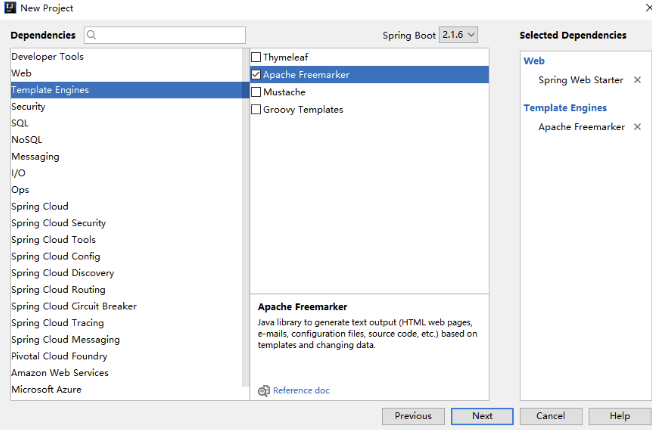
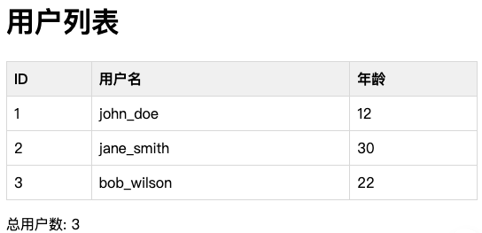

# Spring Boot 集成 FreeMarker：构建动态视图的完整指南

在现代化的 Web 应用中，视图层的选择直接影响着开发效率和系统性能。作为一款强大的模板引擎，FreeMarker 以其简洁的语法和出色的性能在 Java 生态中占据重要地位。本文将作为 Spring Boot 专家的视角，深入探讨如何高效集成 FreeMarker 到 Spring Boot 项目中。

## 1. FreeMarker 简介与优势

### 1.1 什么是 FreeMarker？

FreeMarker 是一款基于 Java 的模板引擎，专注于生成文本输出（HTML、XML、电子邮件、配置文件等）。它采用 MVC 模式，将业务逻辑与视图展示清晰分离。

### 1.2 核心优势

- **简洁语法**：类似 HTML 的标签语法，学习成本低
- **强大功能**：支持条件判断、循环、宏定义等复杂逻辑
- **高性能**：编译后的模板执行效率高
- **类型安全**：强类型检查减少运行时错误
- **国际化支持**：内置国际化处理机制

## 2. 项目搭建与配置

首先使用 Spring Initializr 创建项目，选择以下依赖：
- Spring Web
- FreeMarker



在 `pom.xml` 中依赖如下所示：
```xml
<dependencies>
  <!-- Web开发需要的起步依赖 -->
  <dependency>
      <groupId>org.springframework.boot</groupId>
      <artifactId>spring-boot-starter-web</artifactId>
  </dependency>

  <!-- FreeMarker -->
  <dependency>
      <groupId>org.springframework.boot</groupId>
      <artifactId>spring-boot-starter-freemarker</artifactId>
  </dependency>

  <!-- Lombok 简化代码 -->
  <dependency>
      <groupId>org.projectlombok</groupId>
      <artifactId>lombok</artifactId>
  </dependency>
</dependencies>
```

## 3. FreeMarker 详细配置

### 3.1 基础配置

在 `application.yml` 中配置 FreeMarker：
```yaml
spring:
  freemarker:
    # 是否启用 Freemarker 模板
    enabled: true
    # 是否开启缓存
    cache: false
    # Content Type
    content-type: text/html
    # 编码
    charset: utf-8
    # 模板后缀
    suffix: .ftl
    # 引用 request 的属性名称
    request-context-attribute: request
    # 是否暴露 request 域中的属性
    expose-request-attributes: false
    # 是否暴露session域中的属性
    expose-session-attributes: false
    # request 域中的属性是否可以覆盖 controller 的 model 的同名项。默认 false，如果发生同名属性覆盖的情况会抛出异常
    allow-request-override: true
    # session 域中的属性是否可以覆盖 controller 的 model 的同名项。默认 false，如果发生同名属性覆盖的情况会抛出异常
    allow-session-override: true
    # 暴露官方提供的宏
    expose-spring-macro-helpers: true
    # 启动时检查模板位置是否有效
    check-template-location: true
    # 优先加载文件系统的模板
    prefer-file-system-access: true
    # 模板所在位置（目录）
    template-loader-path:
      - classpath:/templates/
    settings:
      datetime_format: yyyy-MM-dd HH:mm:ss      # date 输出格式化
      template_update_delay: 30m                # 模板引擎刷新时间
      default_encoding: utf-8                   # 默认编码
```

### 3.2 参数详解

下面将详细介绍 Spring Boot 中 FreeMarker 的所有配置参数，包括每个参数的作用、使用场景和示例配置。

#### 3.2.1 spring.freemarker.cache

**作用**：是否启用模板缓存  
**默认值**：`false`  
**说明**：
- 开发环境建议设为 `false`，这样可以实时看到模板修改效果
- 生产环境必须设为 `true` 以提高性能
- 启用缓存后，模板会被编译并缓存，避免重复解析

```yaml
spring:
  freemarker:
    cache: false  # 开发环境
    # cache: true  # 生产环境
```

#### 3.2.2 spring.freemarker.charset

**作用**：模板文件编码  
**默认值**：`UTF-8`  
**说明**：
- 确保模板文件、输出内容和静态资源使用统一的字符编码
- 推荐始终使用 UTF-8 以避免中文乱码问题

```yaml
spring:
  freemarker:
    charset: UTF-8
```

#### 3.2.3 spring.freemarker.check-template-location

**作用**：是否检查模板路径是否存在  
**默认值**：`true`  
**说明**：
- 应用启动时会验证配置的模板路径是否有效
- 如果路径不存在，启动时会抛出异常
- 生产环境建议保持 `true` 确保配置正确

```yaml
spring:
  freemarker:
    check-template-location: true
```

#### 3.2.4 spring.freemarker.content-type

**作用**：设置响应的 Content-Type  
**默认值**：`text/html`  
**说明**：
- 控制 HTTP 响应头的 Content-Type
- 可根据需要设置为其他 MIME 类型

```yaml
spring:
  freemarker:
    content-type: text/html
    # content-type: text/xml    # 用于 XML 输出
    # content-type: text/plain  # 用于纯文本输出
```

#### 3.2.5 spring.freemarker.enabled

**作用**：是否启用 FreeMarker
**默认值**：`true`  
**说明**：
- 设为 `false` 完全禁用 FreeMarker

```yaml
spring:
  freemarker:
    enabled: true
```

#### 3.2.6 spring.freemarker.expose-request-attributes

**作用**：是否将请求属性添加到模型  
**默认值**：`false`  
**说明**：
- 设为 `true` 时，所有 `request.setAttribute()` 设置的属性都可在模板中访问
- 便于在拦截器、过滤器中设置全局数据

```yaml
spring:
  freemarker:
    expose-request-attributes: true
```

**使用示例**：
```java
// 在拦截器中设置请求属性
request.setAttribute("appName", "My Application");

// 在模板中直接访问
${appName}
```

#### 3.2.7 spring.freemarker.expose-session-attributes

**作用**：是否将 Session 属性添加到模型  
**默认值**：`false`  
**说明**：
- 设为 `true` 时，Session 中的所有属性都可在模板中访问
- 便于显示用户登录状态等 Session 数据

```yaml
spring:
  freemarker:
    expose-session-attributes: true
```

**使用示例**：
```java
// 在控制器中设置 Session 属性
session.setAttribute("currentUser", user);

// 在模板中直接访问
<#if currentUser??>
    欢迎, ${currentUser.username}!
</#if>
```

#### 3.2.8 spring.freemarker.expose-spring-macro-helpers

**作用**：是否暴露 Spring 宏支持  
**默认值**：`true`  
**说明**：
- 启用后可在模板中使用 Spring 的宏库
- 提供 `springMacroRequestContext` 变量访问 Spring 上下文

```yaml
spring:
  freemarker:
    expose-spring-macro-helpers: true
```

**使用示例**：
```ftl
<#import "spring.ftl" as spring/>
<!-- 使用 Spring 的表单绑定宏 -->
<@spring.formInput "user.username"/>
```

#### 3.2.9 spring.freemarker.request-context-attribute

**作用**：设置请求上下文属性名称  
**默认值**：无  
**说明**：
- 自定义请求上下文在模板中的变量名
- 如不设置，使用默认的 `springMacroRequestContext`

```yaml
spring:
  freemarker:
    request-context-attribute: "rc"
```

**使用示例**：
```ftl
<!-- 使用自定义的请求上下文变量名 -->
${rc.contextPath}
${rc.getThemeMessage('hello')}
```

#### 3.2.10 spring.freemarker.prefer-file-system-access

**作用**：是否优先使用文件系统访问  
**默认值**：`false`  
**说明**：
- 设为 `true` 时，优先从文件系统加载模板
- 便于开发时热重载模板文件
- 生产环境通常使用类路径加载

```yaml
spring:
  freemarker:
    prefer-file-system-access: true
```

#### 3.2.11 spring.freemarker.template-loader-path

**作用**：模板加载路径  
**默认值**：`classpath:/templates/`  
**说明**：
- 支持多个路径，用逗号分隔
- 支持类路径 (`classpath:`) 和文件系统路径 (`file:`)

```yaml
spring:
  freemarker:
    template-loader-path:
      - "classpath:/templates/"
      - "file:/opt/app/templates/"
```

#### 3.2.12 spring.freemarker.prefix

**作用**：视图名称前缀  
**默认值**：空  
**说明**：
- 在视图名前面添加的前缀
- 用于组织模板目录结构

```yaml
spring:
  freemarker:
    prefix: "views/"
```

**使用示例**：
```java
// 控制器返回 "user/list"
// 实际查找模板 "views/user/list.ftl"
return "user/list";
```

#### 3.2.13 spring.freemarker.suffix

**作用**：视图名称后缀  
**默认值**：`.ftlh`  
**说明**：
- 在视图名后面添加的后缀
- 指定模板文件扩展名

```yaml
spring:
  freemarker:
    suffix: ".ftl"
```

**使用示例**：
```java
// 控制器返回 "index"
// 实际查找模板 "index.ftl"
return "index";
```

#### 3.2.14 spring.freemarker.view-names

**作用**：可解析的视图名称模式  
**默认值**：空（解析所有视图）  
**说明**：
- 使用通配符模式限制哪些视图名使用 FreeMarker 解析
- 在多视图解析器场景下很有用

```yaml
spring:
  freemarker:
    view-names: "freemarker/*, email/*"
```

**使用示例**：
```java
// 只有匹配模式的视图名使用 FreeMarker
return "freemarker/user/list";    // 使用 FreeMarker
return "email/welcome";           // 使用 FreeMarker  
return "thymeleaf/home";          // 不使用 FreeMarker
```

#### 3.2.15 spring.freemarker.settings.*

**作用**：FreeMarker 原生配置  
**默认值**：无  
**说明**：
- 直接设置 FreeMarker Configuration 的属性
- 支持所有 FreeMarker 官方配置参数

```yaml
spring:
  freemarker:
    settings:
      datetime_format: yyyy-MM-dd HH:mm:ss      # date 输出格式化
      template_update_delay: 30m                # 模板引擎刷新时间
      default_encoding: utf-8                   # 默认编码
```

> 配置详细请查阅：[Templating Properties](https://springdoc.cn/spring-boot/application-properties.html#appendix.application-properties.templating)

## 4. 实体类与数据模型

### 4.1 实体类定义

定义一个 User 实体类：
```java
@Data
@Builder
@NoArgsConstructor
@AllArgsConstructor
public class User {
    private Long id;
    private String name;
    private int age;
}
```

### 4.2 服务层

定义一个 UserService 服务类：
```java
@Service
public class UserService {
    private List<User> users = new ArrayList<>();

    @PostConstruct
    public void init() {
        users = Arrays.asList(
                User.builder().id(1L).name("john_doe").age(12).build(),
                User.builder().id(2L).name("jane_smith").age(30).build(),
                User.builder().id(3L).name("bob_wilson").age(22).build()
        );
    }
    /**
     * 获取用户列表
     * @return
     */
    public List<User> getList() {
        // 模拟所有用户数据
        return users;
    }
}
```

## 5. Controller

定义一个 UserController 控制层类：
```java
@Slf4j
//@RestController  // 这会直接返回字符串，而不是渲染模板
@Controller // 这会渲染模板
@RequestMapping(value = "/user")
public class UserController {
    @Autowired
    private UserService userService;

    @GetMapping(value = "/list")
    public String getList(Model model) {
        List<User> users = userService.getList();
        model.addAttribute("users", users);
        model.addAttribute("size", users.size());
        // 返回视图名称
        // FreeMarker 会根据配置解析为 templates/users/list.ftl
        return "users/list";
    }
}
```
需要注意的是 getList 方法必须返回视图名称，在这为 `users/list`，FreeMarker 会根据配置解析为 `templates/users/list.ftl`，后面我们会创建对应路径下的 FreeMarker 模板。此外必须使用 `@Controller` 而不是 `@RestController`。`@RestController` 会直接返回字符串，而不是渲染模板。

## 6. FreeMarker 模板开发

`templates/users/` 路径下创建一个 `list.ftl` 模板用于展示用户列表：
```html
<!DOCTYPE html>
<html>
<head>
    <meta charset="UTF-8">
    <title>用户列表</title>
    <style>
        table { border-collapse: collapse; width: 100%; }
        th, td { border: 1px solid #ddd; padding: 8px; text-align: left; }
        th { background-color: #f2f2f2; }
    </style>
</head>
<body>
    <h1>用户列表</h1>

    <table>
        <thead>
            <tr>
                <th>ID</th>
                <th>用户名</th>
                <th>年龄</th>
            </tr>
        </thead>
        <tbody>
            <#list users as user>
                <tr>
                    <td>${user.id}</td>
                    <td>${user.name}</td>
                    <td>${user.age}</td>
                </tr>
            </#list>
        </tbody>
    </table>

    <p>总用户数: ${users?size}</p>
</body>
</html>
```

## 7. 测试

至此我们完成了 Spring Boot 与 FreeMarker 集成的全部代码开发。整体项目结构如下所示：
```shell
spring-boot-freemarker/
├── pom.xml
└── src
    └── main
        ├── java
        │   └── com
        │       └── spring
        │           └── example
        │               ├── SpringBootFreeMarkerApplication.java
        │               ├── bean
        │               │   └── User.java
        │               ├── controller
        │               │   └── UserController.java
        │               └── service
        │                   └── UserService.java
        └── resources
            ├── application.yml
            ├── logback.xml
            └── templates
                └── users
                    └── list.ftl
```
请求 `http://localhost:8090/user/list` 接口查询所有用户，效果如下所示：



> [完整代码](https://github.com/sjf0115/spring-example/tree/main/spring-boot-freemarker)
