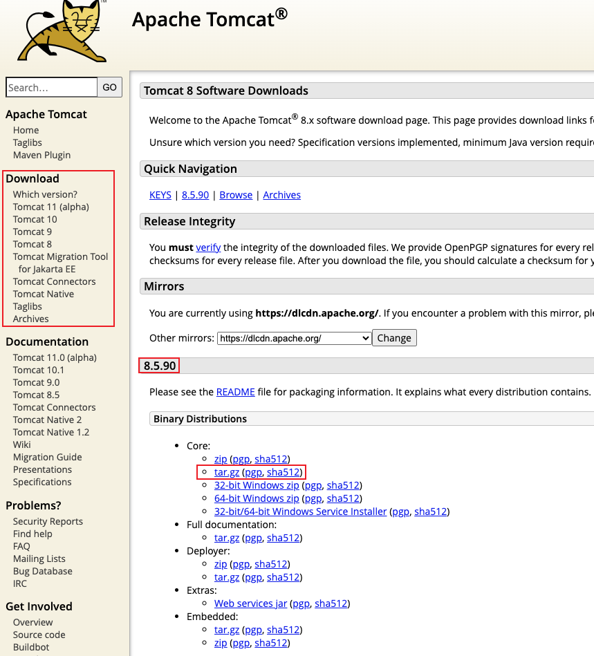
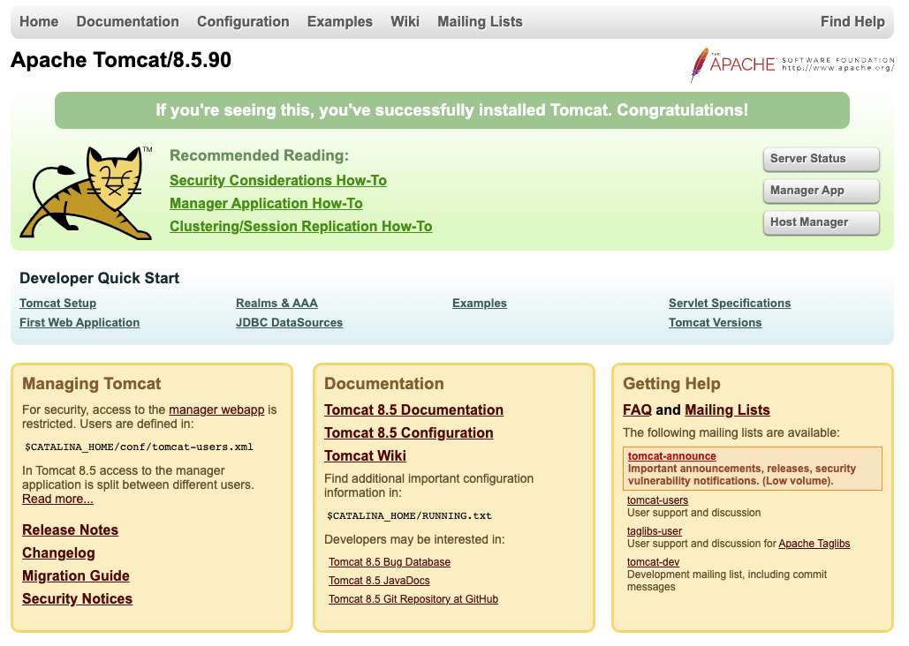

## 1. 下载安装

前往 [Apache Tomcat](https://tomcat.apache.org/index.html) 官网下载 Tomcat：



在这我们 Tomcat 8 为例(8.5.90)。把下载好的文件解压到 /opt 目录下：
```
sudo tar -zxvf apache-tamcat-8.5.90.tar.gz -C /opt/
```
> 通过 `tar.gz` 安装的 Tomcat 遇到了 ClassNotFoundException: org.apache.catalina.startup.Catalina 异常。最终通过 `.gz` 安装包解决通过。

创建软连接，便于升级：
```
sudo ln -s apache-tomcat-8.5.90/ tomcat
```

## 2. 启动服务

切换路径到 Apache Tomcat 的 bin 目录时，可能会遇到如下问题：
```
localhost:opt wy$ cd tomcat/bin/
-bash: cd: tomcat/bin/: Permission denied
```
如果提示 Permission denied 那是因为没有文件的权限。可以使用下面的 chmod 命令开放所有权限：
```
localhost:opt wy$ cd tomcat
localhost:tomcat wy$
localhost:tomcat wy$ sudo chmod 777 *
```
切换到 bin 目录下并执行启动文件：
```
localhost:bin wy$ ./startup.sh
-bash: ./startup.sh: Permission denied
```
如果提示 Permission denied 那是因为没有 `.sh` 文件的权限。可以跟上面类似使用 chmod 命令开放所有权限。再次执行 startup.sh 即可启动服务：
```
localhost:bin wy$ ./startup.sh
Using CATALINA_BASE:   /opt/tomcat
Using CATALINA_HOME:   /opt/tomcat
Using CATALINA_TMPDIR: /opt/tomcat/temp
Using JRE_HOME:        /Library/Java/JavaVirtualMachines/jdk1.8.0_161.jdk/Contents/Home
Using CLASSPATH:       /opt/tomcat/bin/bootstrap.jar:/opt/tomcat/bin/tomcat-juli.jar
Using CATALINA_OPTS:
Tomcat started.
```
在浏览器中访问 `http://localhost:8080` 即可看到提示：



## 3. 修改端口号

通过上面我们知道默认端口号为 8080，但很容易发生冲突，所以一般会修改默认的端口号，在这我们修改为 8070：
```xml
<Connector port="8070" protocol="HTTP/1.1"
               connectionTimeout="20000"
               redirectPort="8443"
               maxParameterCount="1000"
               />
```
这样修改之后，我们就可以通过 `http://localhost:8070/` 访问了。
