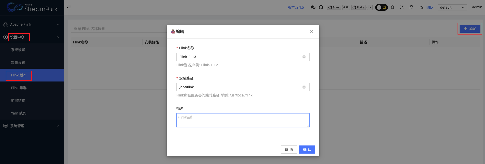

## 1.准备

为了顺利成功安装 StreamPark，首先需要准备好如下的环境：

| 环境 | 版本要求 | 是否必须 | 备注 |
| :------------- | :------------- | :------------- | :------------- |
| 操作系统  | Linux/MacOS | 是 | 不支持 Windows 系统 |
| Java	| 1.8+	|	是 | Java version >=1.8 |
| Scala	| 2.12+	| 是 |	Scala version >=2.12 |
| 数据库	| MySQL: 5.6+、Postgresql: 9.6+	| 否 |	默认使用 H2 数据库，支持 MySQL 和 Postgresql |
| Flink	| 1.12+	| 否 |	Flink 版本最低支持1.12 |
| Hadoop |	2+	|	否 | 非必须，如果部署作业至 Yarn，需要准备 Hadoop 环境 |
| Kubernetes |	1.16+	| 否 |	非必须，如果部署作业至 Kubernetes，需要准备 Kubernetes 集群 |

## 2.下载

您可以直接从官网下载最新版的 StreamPark，本文使用的是 2.1.5 版本，下载地址：https://streampark.apache.org/download

下载完成后，解压：
```
# 解压 streampark 安装包.
tar -zxvf apache-streampark_2.12-2.1.5-incubating-bin.tar.gz
```

可以看到解压后的目录如下：
```
├── bin
│    ├── startup.sh 							                        //启动脚本
│    ├── shutdown.sh 						                            //停止脚本
│    └── ......
├── conf
│    ├── config.yaml 						                            //项目配置文件
│    └── logback-spring.xml 				                            //日志配置文件
├── lib
│    └── *.jar 								                            //项目的 jar 包
├── logs 									                            //程序 log 目录
├── script
│    ├── data
│    │   ├── mysql-data.sql 					                        // mysql的ddl建表sql
│    │   └── pgsql-data.sql 					                        // pgsql的ddl建表sql
│    ├── schema
│    │   ├── mysql-schema.sql 				                            // mysql的完整初始化数据
│    │  └── pgsql-schema.sql 				                            // pgsql的完整初始化数据
│    └── upgrade
│        ├── mysql
│        │   ├── 1.2.3.sql 					                            //升级到 1.2.3版本需要执行的升级sql    
│        │   ├── 2.0.0.sql 					                            //升级到 2.0.0版本需要执行的升级sql
│        │   ├── ......
│        └── pgsql
│            └── ......  
└── temp 									                            //内部使用到的临时路径，不要删除
```
创建软连接，便于升级：
```
ln -s apache-streampark_2.11-2.1.5-incubating-bin/ streampark
```

## 3. 配置

### 3.1 使用外部数据库

默认是使用 H2 本地数据库来启动程序的，如果想集成外部 MySQL 或 Postgresql 数据库，需要修改安装目录下的 conf/config.yaml 文件，核心修改内容如下（这里以 MySQL 为例子）：
```
datasource:
  dialect: mysql
  username: root
  password: root
  url: jdbc:mysql://localhost:3306/streampark?useUnicode=true&characterEncoding=UTF-8&useJDBCCompliantTimezoneShift=true&useLegacyDatetimeCode=false&serverTimezone=GMT%2B8
```
接着需要手动连接外部数据库，并初始化 MySQL 建表脚本（位置：安装目录 /script/schema/mysql-schema.sql ）以及数据初始化脚本（位置：安装目录/script/data/mysql-data.sql）。

初始化 MySQL 建表脚本 `/script/schema/mysql-schema.sql` 之后，`streampark` 数据库下会创建如下几个表:
```
mysql> use streampark;
Reading table information for completion of table and column names
You can turn off this feature to get a quicker startup with -A

Database changed
mysql> show tables;
+----------------------+
| Tables_in_streampark |
+----------------------+
| t_access_token       |
| t_alert_config       |
| t_app_backup         |
| t_app_build_pipe     |
| t_external_link      |
| t_flink_app          |
| t_flink_cluster      |
| t_flink_config       |
| t_flink_effective    |
| t_flink_env          |
| t_flink_log          |
| t_flink_project      |
| t_flink_savepoint    |
| t_flink_sql          |
| t_member             |
| t_menu               |
| t_message            |
| t_role               |
| t_role_menu          |
| t_setting            |
| t_team               |
| t_user               |
| t_variable           |
| t_yarn_queue         |
+----------------------+
24 rows in set (0.00 sec)
```

初始化数据脚本 `/script/data/mysql-data.sql` 之后，数据表中会添加一些数据。例如，用户表中会插入一个 admin 用户:
```
mysql> select user_id, username from t_user;
+---------+----------+
| user_id | username |
+---------+----------+
|  100000 | admin    |
+---------+----------+
1 row in set (0.00 sec)
```

连接 MySQL 数据库需要配置 MySQL 驱动，否则会遇到如下异常：
```java
Exception in thread "main" java.lang.ExceptionInInitializerError: The datasource.dialect is MySQL, but the classes "com.mysql.cj.jdbc.Driver" and "com.mysql.jdbc.Driver" not found. Please ensure that the MySQL Connector/J is located under $streampark/lib.
Note: The MySQL Connector/J is not compatible with the Apache 2.0 license. You need to download it and place it into $streampark/lib.
        at org.apache.streampark.console.base.config.SpringProperties.dataSourceConfig(SpringProperties.java:79)
        at org.apache.streampark.console.base.config.SpringProperties.get(SpringProperties.java:56)
        at org.apache.streampark.console.StreamParkConsoleBootstrap.main(StreamParkConsoleBootstrap.java:54)
```
将 MySQL 驱动依赖复制到 Streampark 的 lib 目录下:
```
cp mysql-connector-java-8.0.16.jar /opt/streampark/lib/
```

以上步骤都准备好了，启动服务即可自动连接并使用外部的数据库。

### 3.2 配置文件

除此，安装目录下的 `conf/config.yaml` 文件可能需要修改（例如指定 hadoop 用户、kerberos 认证等），核心修改内容如下：
```
streampark:
  workspace:
    # 本地工作目录
    local: /opt/workspace/streampark
    # 存储资源至 hdfs 的根路径
    remote: hdfs:///streampark/
  proxy:
    # hadoop yarn 代理路径, 例如: knox 进程地址 https://streampark.com:8443/proxy/yarn
    yarn-url:
  yarn:
    # 验证类型
    http-auth: 'simple'  # 默认 simple或 kerberos
  # flink on yarn or spark on yarn, HADOOP_USER_NAME
  hadoop-user-name: hdfs
```

## 4. 启动

进入安装目录下的 bin 目录，启动：
```
# 进入安装目录下的 bin 目录
cd bin
# 启动程序
./startup.sh
```
> 启动程序后，可能会报如下错误：streampark.workspace.local: "/tmp/streampark" is an invalid path, please reconfigure in xxx/conf/config.yaml

这是因为 streampark 的本地工作目录不存在或者是没有指定合法的目录，处理方式很简单，可以直接使用默认配置，在 /tmp 目录直接新建 streampark 目录:
```
mkdir -p /tmp/streampark
```
或者配置安装路径下的 conf/config.yaml 文件的 streampark.workspace.local 的属性值为一个合法的本地路径。

再次执行 startup.sh，可以看到程序启动成功：


访问 StreamPark，地址为：http://127.0.0.1:10000：


> 账号密码: admin / streampark

登录系统后可以看到如下界面:


## 5. 部署作业

首次登录系统后，会发现已经有一个默认创建好的 FlinkSQL 作业。为了更好地演示，这里使用 Standalone 模式来运行这个作业。在此之前，需要先配置 Flink 版本与关联 Flink 集群。

> Flink 安装包需要与 StreamPark 服务同在一台服务器。

### 5.1 配置 Flink 版本

首先需要配置 Flink 版本，即指定本地 Flink 的解压路径。依次点击：设置中心 → Flink 版本 → 添加：



### 5.2 配置 Flink 集群

> 需要确保本地的 Flink 集群已经启动（直接进入 Flink 解压目录下的bin目录，执行./start-cluster.sh即可）

关联 Flink 集群，依次点击：设置中心 → Flink集群 → 添加：


> 注意集群URL中的端口号，修改为自己的设置或者默认的端口

### 5.3 配置作业

点击作业配置，进入作业配置页面：


只需要修改部署模式、Flink 版本、Flink 集群，保存即可：


点击上线：


启动作业：


启动成功后的可以看到 Flink UI 下面多了一个作业：


