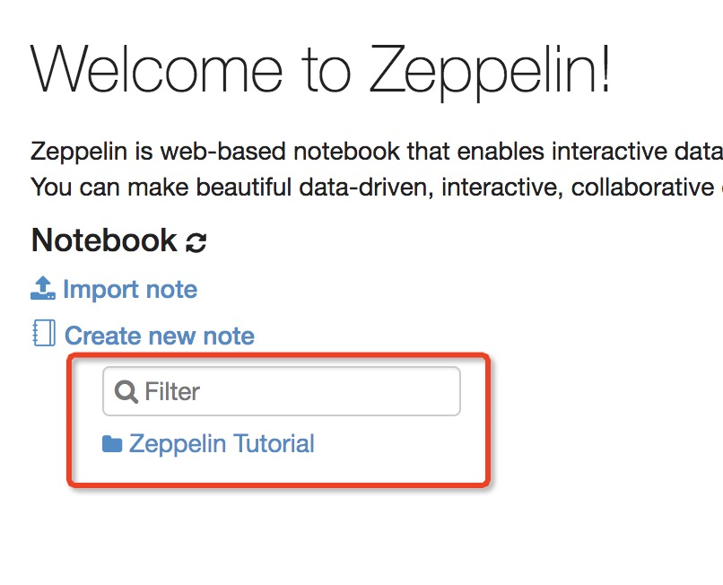

> Zeppelin版本：0.9.0

### 1. 安装

Apache Zeppelin 必须满足一下条件：

| 要求     | 条件     |
| :------------- | :------------- |
| Oracle JDK | 1.7以及以上，必须设置JAVA_HOME 环境变量 |
| os | Mac OSX、Ubuntu 14.X、CentOS 6.X、Windows 7 Pro SP1 |

如果满足以上条件可以点击进入[下载页面](http://zeppelin.apache.org/download.html)下载二进制包进行安装。目前稳定版本为 0.9.0 版本。


官方会提供两种二进制包，两者的唯一的区别是包含在二进制包中的解释器不同：
- zeppelin-0.9.0-bin-netinst.tgz：默认只会提供 Spark 的解释器。
- zeppelin-0.9.0-bin-all.tgz：会提供各种各样的解释器(例如，MySQL，ElasticSearch等)。

所以说要根据你的使用场景具体选择哪种二进制包。

> 解释器：Interpreter

下载完之后使用如下命令解压缩二进制包进行安装：
```shell
tar -zxvf zeppelin-0.9.0-bin-all.tgz -C /opt/
```
使用如下命令创建软连接便于升级：
```
ln -s zeppelin-0.9.0-bin-all/ zeppelin
```

### 2. 配置

进入 zeppelin 安装文件下的 conf 目录下，复制 `zeppelin-site.xml.template` 文件为 `zeppelin-site.xml`：
```
cp zeppelin-site.xml.template zeppelin-site.xml
```
修改 zeppelin-site.xml 配置文件，避免端口冲突将端口号修改为 8001：
```xml
<property>
  <name>zeppelin.server.port</name>
  <value>8001</value>
  <description>Server port.</description>
</property>
```

zeppelin.server.addr 的默认值是 127.0.0.1，所以你只能在 Zeppelin 那台机器上访问 Zeppelin，如果你要通过另外一台机器访问 Zeppelin，那么你就需要修改为 0.0.0.0：
```xml
<property>
  <name>zeppelin.server.addr</name>
  <value>0.0.0.0</value>
  <description>Server binding address</description>
</property>
```
> 推荐修改，社区版因为安全性的考虑，所以把默认值设成了 127.0.0.1，但这样的确对初学者来说不太方便

此外，我们还可以通过修改 zeppelin-env.sh 里的 ZEPPELIN_MEM 来修改 zeppelin server 的内存；通过修改 ZEPPELIN_INTP_MEM 来修改 interpreter 进程的内存。

我们还可以在 `/etc/profile` 配置文件下添加如下环境变量：
```
# Zeppelin
export ZEPPELIN_HOME=/opt/zeppelin
export PATH=${ZEPPELIN_HOME}/bin:$PATH
```
修改完成之后如行如下命令使之生效：
```shell
source /etc/profile
```

### 3. 命令行启动Zepperlin

使用如下命令启动Zepperlin：
```shell
zeppelin-daemon.sh start
```


如果没有配置环境变量，我们需要进到 Zeppelin 的 bin 目录下运行。启动成功之后，在浏览器中访问： http://localhost:8081 来验证是否启动成功。


> Zepperlin 服务器默认端口号为8081。

可以使用如下命令停止Zepperlin：
```shell
zeppelin-daemon.sh stop
```
### 4. 服务管理器启动Zepperlin

Zeppelin 可以使用 init 脚本作为一个服务自动重启(例如，使用 `upstart` 服务管理器)。

以下是一个重启脚本的示例，保存在 `/etc/init/zeppelin.conf`，这就允许使用如下命令行方式来管理服务：
```
sudo service zeppelin start  
sudo service zeppelin stop  
sudo service zeppelin restart
```
其他服务管理器可以使用类似的方法，传递 `upstart` 参数到 `zeppelin-daemon.sh` 脚本中：
```shell
zeppelin-daemon.sh upstart
```

zeppelin.conf：
```
description "zeppelin"

start on (local-filesystems and net-device-up IFACE!=lo)
stop on shutdown

# Respawn the process on unexpected termination
respawn

# respawn the job up to 7 times within a 5 second period.
# If the job exceeds these values, it will be stopped and marked as failed.
respawn limit 7 5

# 在本例中，zeppelin 安装在 /opt/zeppelin 目录下
chdir /opt/zeppelin
exec bin/zeppelin-daemon.sh upstart
```

### 5. Zeppelin UI

#### 5.1 首页

当你第一次连接到 Zeppelin，你将会看到如下主页面：


页面左侧会列出所有现有的笔记。这些笔记默认存储在 `$ZEPPELIN_HOME/Notebook` 文件夹下。

可以在文本输入框中通过名称过滤出我们想要看的笔记。我们还可以创建新的笔记，刷新现有笔记列表（主要考虑手动将它们复制到`$ZEPPELIN_HOME/Notebook`文件夹下的情况）并导入笔记：



点击 `Import Note`，会打开一个新对话框。在对话框中可以从本地磁盘或从远程位置导入你的笔记(如果您提供的URL)：


默认情况下，导入的笔记的名称与原始笔记相同，但可以通过提供新的名称来覆盖原始名称。

#### 5.2 菜单

##### 5.2.1 Notebook

`Notebook` 菜单提供了与主页中的笔记管理部分几乎相同的功能。从下拉菜单中，我们可以：
- 打开一个特定笔记
- 按名称过滤笔记
- 创建一个新笔记


##### 5.2.2 设置

此菜单可以让我们访问设置并显示有关 Zeppelin 的信息。如果使用默认 shiro 配置，用户名设置为 `anonymous`。如果需要设置身份验证，请参阅[Shiro身份验证](http://zeppelin.apache.org/docs/0.6.0/security/shiroauthentication.html)。


#### 5.3 解释器

在此菜单中，我们可以：
- 配置现有的解释器实例
- 添加/删除解释器实例


#### 5.4 配置

此菜单显示配置文件 `$ZEPPELIN_HOME/conf/zeppelin-site.xml` 中设置的所有 Zeppelin 配置:


参考：
- [Install](http://zeppelin.apache.org/docs/0.9.0/quickstart/install.html)
- [Explore Apache Zeppelin UI](http://zeppelin.apache.org/docs/0.9.0/quickstart/explore_ui.html)
