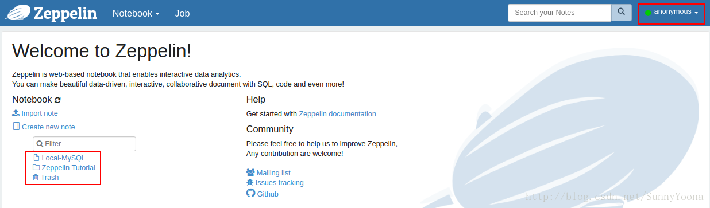
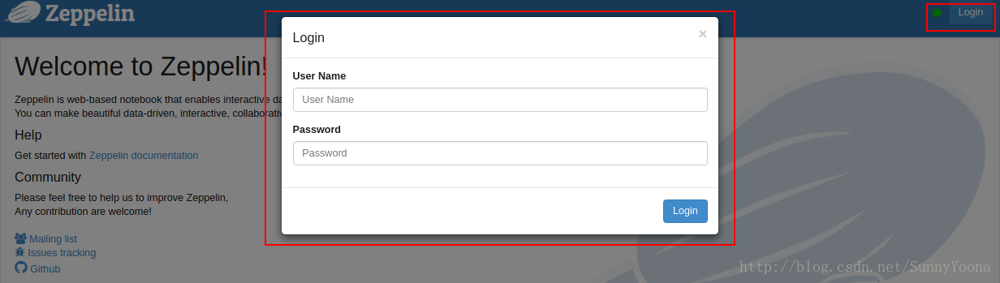

#### 1. 概述

我们在浏览器中输入　http://localhost:8080/　进入Zeppelin的主页，不需要用任何的验证就可以进入主页面：



换句话说，任何人在浏览器输入上面地址(本机)，都可以访问Zeppelin里的所有笔记．在上图中我们也可以看到我们的登陆用户是`anonymous`．

默认情况下，Zeppelin 允许匿名访问。 强烈建议您考虑设置 Apache Shiro 以进行身份验证

#### 2. 修改匿名访问

在 0.7.1 版本中，修改匿名访问需要修改配置文件。Zeppelin 启动默认是匿名（anonymous）模式登录的。如果设置访问登录权限，需要设置 conf/zeppelin-site.xml 文件下的 zeppelin.anonymous.allowed 选项为 false（默认为 true）。如果你还没有这个文件，只需将 conf/zeppelin-site.xml.template 复制为 conf/zeppelin-site.xml：
```xml
<property>
  <name>zeppelin.anonymous.allowed</name>
  <value>false</value>
  <description>Anonymous user allowed by default</description>
</property>
```
在0.9.0版本中，已经不需要修改上述配置文件，直接开启 Shiro即可。

#### 3. 开启Shiro

Apache Shiro 是一个功能强大且易于使用的 Java 安全框架，可执行身份验证、授权、加密和会话管理。下面一起看一下如何开启 Shiro。在刚安装完毕之后，默认情况下，在 conf 中，将找到 shiro.ini.template，该文件是一个配置示例，建议你通过执行如下命令行创建 shiro.ini 文件:
```
cp conf/shiro.ini.template conf/shiro.ini
```
我们添加一个 root 账号：
```
[users]
# List of users with their password allowed to access Zeppelin.
# To use a different strategy (LDAP / Database / ...) check the shiro doc at http://shiro.apache.org/configuration.html#Configuration-INISections
# To enable admin user, uncomment the following line and set an appropriate password.
#admin = password1, admin
root = root
user1 = password2, role1, role2
user2 = password3, role3
user3 = password4, role2
```

#### 4. 启动 Zeppelin

修改完配置之后，需要使用如下代码重启 Zeppelin 服务：
```
bin/zeppelin-daemon.sh start (or restart)
```
启动成功之后，就可以通过用户名与密码的方式访问 Zeppelin Note 页面。

#### 5. 登录

最后，你可以使用以下用户名/密码组合之一进行登录：



```
[users]
# List of users with their password allowed to access Zeppelin.
# To use a different strategy (LDAP / Database / ...) check the shiro doc at http://shiro.apache.org/configuration.html#Configuration-INISections
admin = admin
user1 = password2, role1, role2
user2 = password3, role3
user3 = password4, role2
```
在`conf/shiro.ini`文件中已经给我们加了一些测试账号，我们自己也可以在下面添加自己的用户xxx = yyy，角色也可以自行选择．更多细心请参考：http://zeppelin.apache.org/docs/0.7.1/security/shiroauthentication.html#3-start-zeppelin
