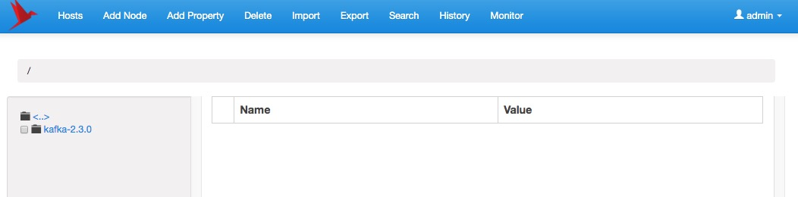

### 1. 简介

ZKUI 提供了一个图形化管理界面，可以针对 ZooKeepr 的节点值进行 CRUD 操作，同时也提供了安全认证。

### 2. 要求

由于 ZKUI 是基于 Java 开发的，所以需要安装 JDK。要求使用 Java 7 以上版本。

### 3. 安装

因为 ZKUI 需要手工进行编译、构建打包，所以还需要下载安装 Maven。从[代码库](https://github.com/DeemOpen/zkui)下载源码进行编译:
```
# 克隆代码
192:Code smartsi$ git clone git@github.com:DeemOpen/zkui.git
Cloning into 'zkui'...
remote: Enumerating objects: 586, done.
remote: Counting objects: 100% (12/12), done.
remote: Compressing objects: 100% (12/12), done.
remote: Total 586 (delta 6), reused 0 (delta 0), pack-reused 574 (from 1)
Receiving objects: 100% (586/586), 492.17 KiB | 255.00 KiB/s, done.
Resolving deltas: 100% (241/241), done.
```
然后编译、构建、打包：
```java
192:Code smartsi$ cd zkui/
192:zkui smartsi$ mvn clean install
...
[INFO] Installing /Users/smartsi/学习/Code/zkui/target/zkui-2.0-SNAPSHOT.jar to /Users/smartsi/.m2/repository/com/deem/zkui/2.0-SNAPSHOT/zkui-2.0-SNAPSHOT.jar
[INFO] Installing /Users/smartsi/学习/Code/zkui/pom.xml to /Users/smartsi/.m2/repository/com/deem/zkui/2.0-SNAPSHOT/zkui-2.0-SNAPSHOT.pom
[INFO] Installing /Users/smartsi/学习/Code/zkui/target/zkui-2.0-SNAPSHOT-jar-with-dependencies.jar to /Users/smartsi/.m2/repository/com/deem/zkui/2.0-SNAPSHOT/zkui-2.0-SNAPSHOT-jar-with-dependencies.jar
[INFO] ------------------------------------------------------------------------
[INFO] BUILD SUCCESS
[INFO] ------------------------------------------------------------------------
[INFO] Total time: 01:00 min
[INFO] Finished at: 2025-08-18T22:30:49+08:00
[INFO] ------------------------------------------------------------------------
```
编译成功后会生成如下文件:
```
192:zkui smartsi$ ls -al
total 104
drwxr-xr-x@ 16 smartsi  staff    512  8 18 22:30 .
drwxr-xr-x  12 smartsi  staff    384  8 18 22:28 ..
drwxr-xr-x@ 12 smartsi  staff    384  8 18 22:28 .git
-rw-r--r--@  1 smartsi  staff     45  8 18 22:28 .gitignore
-rw-r--r--@  1 smartsi  staff  11358  8 18 22:28 LICENSE-2.0.txt
-rw-r--r--@  1 smartsi  staff    416  8 18 22:28 Makefile
-rw-r--r--@  1 smartsi  staff   6216  8 18 22:28 README.md
-rw-r--r--@  1 smartsi  staff   2357  8 18 22:28 config.cfg
drwxr-xr-x@  5 smartsi  staff    160  8 18 22:28 docker
drwxr-xr-x@  8 smartsi  staff    256  8 18 22:28 images
-rw-r--r--@  1 smartsi  staff   1746  8 18 22:28 nbactions.xml
-rw-r--r--@  1 smartsi  staff   5374  8 18 22:28 pom.xml
-rw-r--r--@  1 smartsi  staff     43  8 18 22:28 run.sh
drwxr-xr-x@  4 smartsi  staff    128  8 18 22:28 src
drwxr-xr-x@ 10 smartsi  staff    320  8 18 22:30 target
-rwxr-xr-x@  1 smartsi  staff   1251  8 18 22:28 zkui.sh
```
将 `zkui` 下的 `config.cfg` 和 `target` 下的 `zkui-2.0-SNAPSHOT-jar-with-dependencies.jar` 复制到我们的工作目录下 `/opt/workspace/zkui`:
```bash
192:zkui smartsi$ cp config.cfg /opt/workspace/zkui/
192:zkui smartsi$ cp target/zkui-2.0-SNAPSHOT-jar-with-dependencies.jar /opt/workspace/zkui/
```
### 4. 配置

修改 `config.cfg` 配置:
```
# 指定端口
serverPort=9090

# ZooKeeper 实例
zkServer=localhost:2181,localhost:2182,localhost:2182

# 生产环境设置为 prod、开发环境设置为 dev。设置为 dev 每次会清除历史记录
env=prod

# MySQL 数据库配置
jdbcClass=com.mysql.cj.jdbc.Driver
jdbcUrl=jdbc:mysql://localhost:3306/zkui
jdbcUser=root
jdbcPwd=root

# 设置登录用户及其权限
userSet = {"users": [{ "username":"admin" , "password":"admin","role": "ADMIN" },{ "username":"test" , "password":"123","role": "USER" }]}
```
上面配置了需要连接的 ZooKeeper 集群的IP地址和端口。多个 zk 实例以逗号进行分割。例如：`server1:2181, server2:2181`。第一台服务器应始终是领导者。ZKUI 默认的用户名与密码是 `admin/manager` ，上面配置中我们修改为 `admin/admin`，同时修改用户 `appconfig` 的账号密码为 `test/123`。在这我们使用 MySQL 存储历史记录，必须注释掉 h2 数据库配置。

### 5. 运行

现在使用如下命令启动 ZKUI:
```
nohup java -jar zkui-2.0-SNAPSHOT-jar-with-dependencies.jar >/tmp/logs/zkui/zkui.log ＆
```

现在我们可以通过Web界面(http://localhost:9090)访问 ZKUI:





参考: [zkui - Zookeeper UI Dashboard](https://github.com/DeemOpen/zkui)
