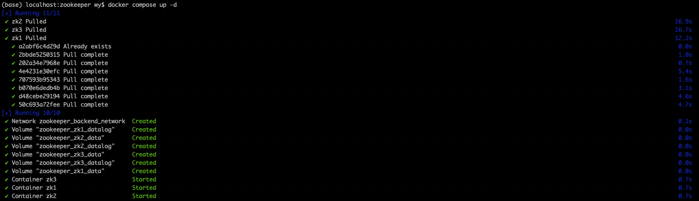

在现代软件开发的众多环节中，容器化技术已经成为了加速开发、简化部署的关键工具。Docker 作为市场上最流行的容器平台之一，提供了一种高效的方式来打包、分发和管理应用。在这片博文中，我们将探索如何利用 Docker Compose 来部署一个 Zookeeper 集群。在开发环境中，使用 Docker Compose 部署 Zookeeper 不仅能够保证环境的一致性，还允许开发者快速部署和撤销实例，极大地提高了开发效率。

## 1. ZooKeeper 简介

ZooKeeper是一个开源的分布式协调服务，用于管理大型分布式系统中的数据。它由Apache软件基金会提供，最初是Hadoop的一个子项目，但后来发展成为一个独立的顶级项目。ZooKeeper提供的一致性协调服务对于构建分布式应用和服务非常重要，特别是在需要精确的领导选举、配置管理、命名服务、分布式同步和提供分布式锁等功能时。

## 2. Docker Compose 简介

Docker Compose 是一个用于定义和运行多容器 Docker 应用程序的工具。通过 Compose，您可以通过一个 YAML 文件来配置您的应用的服务。然后，使用一个简单的命令，就可以创建并启动所有配置中的服务。这让组织和管理容器变成了一件轻而易举的事情。

在开始之前，首先需要确保已经安装了 Docker Compose，如果没有安装或者不熟悉 Compose 的具体查阅 [Docker 实战：使用 Docker Compose 实现高效的多容器部署](https://smartsi.blog.csdn.net/article/details/138414972)。

## 3. Docker Compose 部署 ZooKeeper

接下来，我们将一步步通过 Docker Compose 来部署一个至少包含三个节点的 ZooKeeper 集群。

### 3.1 创建项目目录

首先为项目创建一个目录。在这里，在我们的工作目录 `/opt/workspace/zookeeper`下创建一个名为 `zookeeper` 的项目：
```shell
smartsi@localhost docker % mkdir zookeeper
smartsi@localhost docker % cd zookeeper
```

> 该目录是应用程序镜像的上下文。该目录应该只包含用于构建该镜像的资源。

### 3.2 构建 Compose 文件

Docker Compose 简化了对整个应用程序堆栈的控制，使得在一个易于理解的 YAML 配置文件中轻松管理服务、网络和数据卷。要使用 Docker Compose 部署，首先需创建一个`docker-compose.yml`文件，如下所示：

```shell
services:
  zk1:
    image: zookeeper:3.6.3
    container_name: zk1
    environment:
      ZOO_MY_ID: 1
      ZOO_SERVERS: server.1=zk1:2888:3888;2181 server.2=zk2:2888:3888;2181 server.3=zk3:2888:3888;2181
    ports:
      - "2181:2181"
    volumes:
      - zk1_data:/data
      - zk1_datalog:/datalog
    networks:
      - backend_network

  zk2:
    image: zookeeper:3.6.3
    container_name: zk2
    environment:
      ZOO_MY_ID: 2
      ZOO_SERVERS: server.1=zk1:2888:3888;2181 server.2=zk2:2888:3888;2181 server.3=zk3:2888:3888;2181
    ports:
      - "2182:2181"
    volumes:
      - zk2_data:/data
      - zk2_datalog:/datalog
    networks:
      - backend_network

  zk3:
    image: zookeeper:3.6.3
    container_name: zk3
    environment:
      ZOO_MY_ID: 3
      ZOO_SERVERS: server.1=zk1:2888:3888;2181 server.2=zk2:2888:3888;2181 server.3=zk3:2888:3888;2181
    ports:
      - "2183:2181"
    volumes:
      - zk3_data:/data
      - zk3_datalog:/datalog
    networks:
      - backend_network

volumes:
  zk1_data:
  zk1_datalog:
  zk2_data:
  zk2_datalog:
  zk3_data:
  zk3_datalog:

networks:
  backend_network:
```

> 可以为使用 `.yml` 或 `.yaml` 扩展名

services 用于定义不同的应用服务。上边的例子定义了三个服务(`zk1`、`zk2`、`zk3`)，分别对应 ZooKeeper 集群的三个节点。Docker Compose 会将每个服务部署在各自的容器中，在这里我们自定义了容器名称，因此 Docker Compose 会部署三个名为 `zk1`、`zk2` 和 `zk3` 的容器。

networks 用于声明 Docker Compose 创建新的网络 `backend_network`。我们只负责声明，不需要手动创建，Docker Compose 会自动管理。为了实现三个服务之间的通信，需要这三个服务都加入到这个网络。在使用 Docker Compose 部署应用时，定义 `networks` 并不是必须的，但却是一个好的习惯。如果不显式定义和指定网络，Docker Compose 默认会为你的应用创建一个单独的网络，并且所有在 `docker-compose.yml` 文件中定义的服务都将自动加入这个网络。这意味着，即使你没有明确定义网络，服务之间也能够相互通信。

volumes 用于声明 Docker Compose 创建新的数据卷 `zk1_data`、`zk1_datalog` 等。我们只负责声明，不需要手动创建，Docker Compose 会自动管理。默认情况下，在容器删除之后容器中的数据将丢失。为了解决这个问题，我们需要三个服务分别使用声明中的数据卷来将数据保存在宿主机上。

services 定义的服务中包含如下指令：
- `image`：指定了要使用的 Docker 镜像及其版本。三个服务均使用 `zookeeper:3.6.3` 镜像确保所有节点运行同一版本的 ZooKeeper，保持集群的一致性。这里的版本 3.6.3 可以根据需求替换为最新或特定版本。
- `container_name`：自定义的容器名称，便于识别。
- `environment`：在 ZooKeeper 集群的配置中，每个节点需知其自身ID（ZOO_MY_ID）以及集群中其他成员的信息（ZOO_SERVERS），这些信息通过环境变量提供给每个容器
  - `ZOO_MY_ID`：这个环境变量指定了每个 ZooKeeper 实例的ID，作为每个 ZooKeeper 实例的唯一标识符。
  - `ZOO_SERVERS`：这个环境变量定义了集群中所有 ZooKeeper 实例的地址，这些信息用于集群成员之间的相互通信。
- `ports`：每个ZooKeeper实例容器的 2181 端口映射到宿主机的不同端口 (2181, 2182, 2183)。目的是为了在同一台宿主机上暴露多个 ZooKeeper 实例的客户端端口，使得宿主机能够与集群的每一个实例进行通信，方便直接访问和测试。
- `volumes`：对于生产环境中的 ZooKeeper 集群，数据持久化是至关重要的。这意味着你需要将容器内的数据绑定到宿主机上的数据卷来存储数据，这样即使容器重启，数据也不会丢失。为每个 ZooKeeper 节点提供了独立的数据卷 `xxx_data` 和 `xxx_datalog`，分别用于存储 ZooKeeper 的数据(`/data`)和事务日志(`/datalog`)。
- `networks`: 将三个服务都连接到 `backend_network` 网络上。这个网络在 `networks` 一级key中声明。加入这个网络之后，不同服务就可以通过服务名（`zk1`、`zk2`、`zk3`）找到并实现容器间的网络访问。


### 3.3 部署

在有了`docker-compose.yml`文件后，您需要在包含此文件的目录中运行 `docker compose up -d` 命令启动服务：



上述命令会在后台启动 ZooKeeper 集群的三个服务。

### 3.4. 验证

部署后，使用以下命令检查服务状态：
```shell
(base) localhost:zookeeper wy$ docker compose ps
NAME      IMAGE             COMMAND                  SERVICE   CREATED          STATUS          PORTS
zk1       zookeeper:3.6.3   "/docker-entrypoint.…"   zk1       26 minutes ago   Up 26 minutes   2888/tcp, 3888/tcp, 0.0.0.0:2181->2181/tcp, 8080/tcp
zk2       zookeeper:3.6.3   "/docker-entrypoint.…"   zk2       26 minutes ago   Up 26 minutes   2888/tcp, 3888/tcp, 8080/tcp, 0.0.0.0:2182->2181/tcp
zk3       zookeeper:3.6.3   "/docker-entrypoint.…"   zk3       26 minutes ago   Up 26 minutes   2888/tcp, 3888/tcp, 8080/tcp, 0.0.0.0:2183->2181/tcp
```
可以看到有三个服务已经启动成功，然后我们就可以用 `zkServer.sh status` 命令来查看每个 ZooKeeper 实例的状态：
```shell
localhost:zookeeper wy$ docker exec -it zk1 zkServer.sh status
ZooKeeper JMX enabled by default
Using config: /conf/zoo.cfg
Client port found: 2181. Client address: localhost. Client SSL: false.
Mode: follower

localhost:zookeeper wy$ docker exec -it zk2 zkServer.sh status
ZooKeeper JMX enabled by default
Using config: /conf/zoo.cfg
Client port found: 2181. Client address: localhost. Client SSL: false.
Mode: follower

localhost:zookeeper wy$ docker exec -it zk3 zkServer.sh status
ZooKeeper JMX enabled by default
Using config: /conf/zoo.cfg
Client port found: 2181. Client address: localhost. Client SSL: false.
Mode: leader
```
