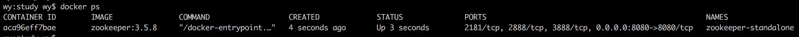

### 1. 下载镜像

我们使用官方提供的[Zookeeper镜像](https://hub.docker.com/_/zookeeper)：
```
docker pull zookeeper:3.5.8
```
> 选择 3.5.8 版本

当出现如下信息时表示镜像下载成功：
```shell
wy:study wy$ docker pull zookeeper:3.5.8
3.5.8: Pulling from library/zookeeper
...
Digest: sha256:12af523731cbe390f5332d6c1e254f1d56c734a786910d5582653445a5cee299
Status: Downloaded newer image for zookeeper:3.5.8
docker.io/library/zookeeper:3.5.8
```
通过如下命令查看下载的 Zookeeper 镜像：
```
docker images
```


### 2. Standalone模式

#### 2.1 启动容器

通过如下命令启动容器：
```
docker run -p 8080:8080 --name zookeeper-standalone --restart always -d zookeeper:3.5.8
```
上述命令在后台运行一个名为 `zookeeper-standalone` 的容器。由于 Zookeeper 是'快速失败'，因此最好通过 `--retart`参数设置容器在意外停止时自动重启。默认是 `no`，表示不重启。`-p` 参数将宿主机端口 8080 与容器端口 8080 映射。通过如下命令查看运行中的 Zookeeper 容器：
```
docker ps
```


通过上图我们可以看到容器对外暴露了4个端口：2181 2888 3888 8080（分别是 Zookeeper 客户端端口，主从节点交互信息的端口，选举端口以及 AdminServer 端口）。暴露端口主要是镜像包含了 `EXPOSE 2181 2888 3888 8080` 命令，具体可以参阅[镜像Dockerfile](https://github.com/31z4/zookeeper-docker/blob/95e63be6a0767ed462db2e5aa779047672cc3b35/3.5.8/Dockerfile)。

Zookeeper 3.5 版本开始提供 AdminServer 功能。AdminServer 是嵌入式 Jetty 服务器，为四字母命令提供 HTTP 接口。默认端口是8080。由于在启动容器时做了端口映射，我们可以直接通过 `http://localhost:8080/commands/stats` 进行访问：
```json
{
  "version" : "3.5.8-f439ca583e70862c3068a1f2a7d4d068eec33315, built on 05/04/2020 15:07 GMT",
  "read_only" : false,
  "server_stats" : {
    "packets_sent" : 0,
    "packets_received" : 0,
    "max_latency" : 0,
    "min_latency" : 0,
    "fsync_threshold_exceed_count" : 0,
    "client_response_stats" : {
      "last_buffer_size" : -1,
      "min_buffer_size" : -1,
      "max_buffer_size" : -1
    },
    "server_state" : "standalone",
    "avg_latency" : 0,
    "num_alive_client_connections" : 0,
    "provider_null" : false,
    "data_dir_size" : 0,
    "log_dir_size" : 424,
    "last_processed_zxid" : 0,
    "outstanding_requests" : 0
  },
  "client_response" : {
    "last_buffer_size" : -1,
    "min_buffer_size" : -1,
    "max_buffer_size" : -1
  },
  "node_count" : 5,
  "connections" : [ ],
  "secure_connections" : [ ],
  "command" : "stats",
  "error" : null
}
```

> 在Docker中容器默认是无法与外部通信，需要将容器内的端口映射到本地宿主机的端口，这样用户通过访问宿主机指定端口时相当于访问容器内的端口。

#### 2.2 进入容器

通过如下命令进入容器内：
```
wy:study wy$ docker exec -it zookeeper-standalone /bin/bash
root@6862ee5bda9c:/apache-zookeeper-3.5.8-bin#
root@6862ee5bda9c:/apache-zookeeper-3.5.8-bin#
root@6862ee5bda9c:/apache-zookeeper-3.5.8-bin#
```
容器的默认工作目录为 `/apache-zookeeper-3.5.8-bin`，是因为 Zookeeper 镜像做如下设置：
```shell
ARG DISTRO_NAME=apache-zookeeper-3.5.8-bin
WORKDIR $DISTRO_NAME
```
配置文件默认在 `/conf` 目录下，我们具体看一下默认配置：
```shell
root@d3a8ecd271fc:/apache-zookeeper-3.5.8-bin# cat /conf/zoo.cfg
dataDir=/data
dataLogDir=/datalog
tickTime=2000
initLimit=5
syncLimit=2
autopurge.snapRetainCount=3
autopurge.purgeInterval=0
maxClientCnxns=60
standaloneEnabled=true
admin.enableServer=true
server.1=localhost:2888:3888;2181
```
我们可以使用 `zkServer.sh status` 命令来查看 Zookeeper 启动状态：
```
root@d3a8ecd271fc:/apache-zookeeper-3.5.8-bin# zkServer.sh status
ZooKeeper JMX enabled by default
Using config: /conf/zoo.cfg
Client port found: 2181. Client address: localhost.
Mode: standalone
root@d3a8ecd271fc:/apache-zookeeper-3.5.8-bin#
```
从上面可以看到确实是 standalone 模式。

#### 2.3 连接Zookeeper服务

我们可以使用如下命令连接Zookeeper服务：
```
zkCli.sh -server 127.0.0.1:2181
```
如果看到如下信息，表示我们连接成功：


我们可以不用先进入容器再连接Zookeeper服务，使用如下命令一步到位：
```
docker exec -it zookeeper-standalone zkCli.sh -server 127.0.0.1:2181
```

### 3. 集群模式

> 这里我们就搭建3个 Zookeeper 节点的集群。

#### 3.1 启动容器

为了避免一个一个的启动，我们使用 docker-compose 的方式来启动 Zookeeper 集群。首先创建一个名为 docker-compose.yml 的文件, 其内容如下:
```xml
version: '3.1'

services:
  zoo1:
    image: zookeeper:3.5.8
    restart: always
    hostname: zoo1
    ports:
      - 2181:2181
    environment:
      ZOO_MY_ID: 1
      ZOO_SERVERS: server.1=0.0.0.0:2888:3888;2181 server.2=zoo2:2888:3888;2181 server.3=zoo3:2888:3888;2181

  zoo2:
    image: zookeeper:3.5.8
    restart: always
    hostname: zoo2
    ports:
      - 2182:2181
    environment:
      ZOO_MY_ID: 2
      ZOO_SERVERS: server.1=zoo1:2888:3888;2181 server.2=0.0.0.0:2888:3888;2181 server.3=zoo3:2888:3888;2181

  zoo3:
    image: zookeeper:3.5.8
    restart: always
    hostname: zoo3
    ports:
      - 2183:2181
    environment:
      ZOO_MY_ID: 3
      ZOO_SERVERS: server.1=zoo1:2888:3888;2181 server.2=zoo2:2888:3888;2181 server.3=0.0.0.0:2888:3888;2181
```
上述配置将以副本模式启动 Zookeeper 3.5.8，同时会告诉 Docker 运行三个 Zookeeper 容器：zoo1、zoo2、zoo3，并分别将本地的 2181, 2182, 2183 端口绑定到对应的容器的 2181 端口上。

ZOO_MY_ID 和 ZOO_SERVERS 是搭建 Zookeeper 集群需要设置的两个环境变量, 其中 ZOO_MY_ID 表示 Zookeeper 服务的 id, 它是1-255 之间的整数, 必须在集群中唯一。ZOO_SERVERS 是Zookeeper 集群的主机列表。

接着我们在 docker-compose.yml 当前目录下运行如下命令：
```
COMPOSE_PROJECT_NAME=zookeeper_cluster docker-compose up -d
```
> 或者指定配置文件名称 COMPOSE_PROJECT_NAME=zookeeper_cluster docker-compose -f docker-compose.yml up -d。

> 我们在 docker-compose up 前添加 COMPOSE_PROJECT_NAME=zookeeper_cluster 环境变量是为我们的 compose 工程起一个名字。

看到如下信息表示容器启动成功：
```shell
wy:zookeeper wy$ COMPOSE_PROJECT_NAME=zookeeper_cluster docker-compose up -d
Creating network "zookeeper_cluster_default" with the default driver
Creating zookeeper_cluster_zoo1_1 ... done
Creating zookeeper_cluster_zoo3_1 ... done
Creating zookeeper_cluster_zoo2_1 ... done
```

通过如下命令查看运行中的 Zookeeper 集群容器：
```
docker ps
```


#### 3.2 进入容器

通过如下命令进入 `zookeeper_cluster_zoo1_1` 容器内：
```
wy:zookeeper wy$ docker exec -it zookeeper_cluster_zoo1_1 /bin/bash
root@zoo1:/apache-zookeeper-3.5.8-bin#
root@zoo1:/apache-zookeeper-3.5.8-bin#
root@zoo1:/apache-zookeeper-3.5.8-bin#
root@zoo1:/apache-zookeeper-3.5.8-bin#
```
我们可以使用 `zkServer.sh status` 命令来查看 Zookeeper 的启动状态：
```
root@zoo1:/apache-zookeeper-3.5.8-bin# zkServer.sh status
ZooKeeper JMX enabled by default
Using config: /conf/zoo.cfg
Client port found: 2181. Client address: localhost.
Mode: follower
```
可以看到该节点是 Follower 节点，以此类推，查看 zookeeper_cluster_zoo2_1、zookeeper_cluster_zoo3_1 容器的启动状态：
```
wy:zookeeper wy$ docker exec -it zookeeper_cluster_zoo2_1 /bin/bash
root@zoo2:/apache-zookeeper-3.5.8-bin# zkServer.sh status
ZooKeeper JMX enabled by default
Using config: /conf/zoo.cfg
Client port found: 2181. Client address: localhost.
Mode: follower

wy:zookeeper wy$ docker exec -it zookeeper_cluster_zoo3_1 /bin/bash
root@zoo3:/apache-zookeeper-3.5.8-bin# zkServer.sh status
ZooKeeper JMX enabled by default
Using config: /conf/zoo.cfg
Client port found: 2181. Client address: localhost.
Mode: leader
```
从上面可以看到我们创建了一个主节点Leader，2个从节点Follower。

从配置文件中可以看到该 Zookeeper 节点的配置信息位于 `/conf/zoo.cfg` 文件中：
```
root@zoo1:/apache-zookeeper-3.5.8-bin# cat /conf/zoo.cfg
dataDir=/data
dataLogDir=/datalog
tickTime=2000
initLimit=5
syncLimit=2
autopurge.snapRetainCount=3
autopurge.purgeInterval=0
maxClientCnxns=60
standaloneEnabled=true
admin.enableServer=true
server.1=0.0.0.0:2888:3888;2181
server.2=zoo2:2888:3888;2181
server.3=zoo3:2888:3888;2181
```
> 以 zookeeper_cluster_zoo1_1 容器为例

#### 3.3 连接Zookeeper服务

使用如下命令在容器内连接该节点的 ZooKeeper 服务：
```
zkCli.sh -server localhost:2181
```
如果看到如下信息，表示我们连接成功：


我们也可以通过本地主机连接 Zookeeper 集群，因为我们将 zoo1, zoo2, zoo3 的 2181 端口分别映射到了本地主机的 2181, 2182, 2183 端口上, 因此我们使用如下命令连接 Zookeeper 集群：
```
zkCli.sh -server localhost:2181,localhost:2182,localhost:2183
```
如果看到如下信息，表示我们通过本地宿主机连接集群成功：


欢迎关注我的公众号和博客：


