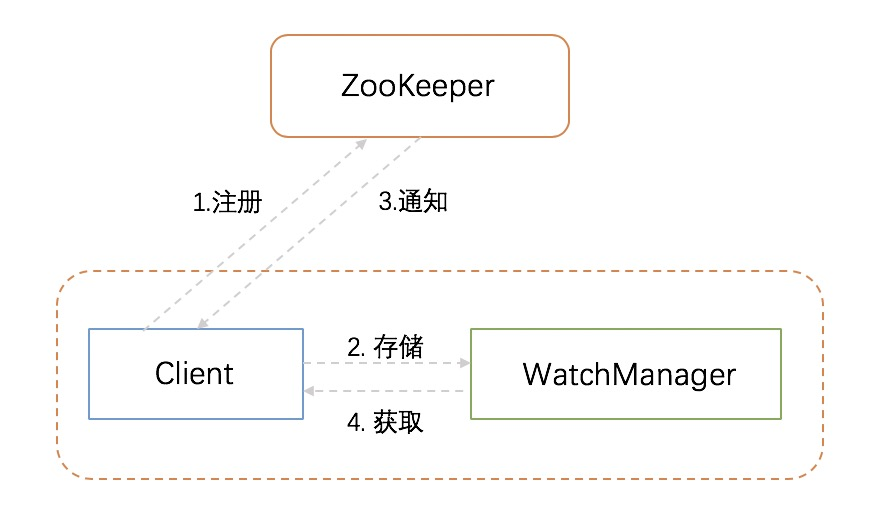

## 1. 工作流程

ZooKeeper 允许客户端向服务端注册一个 Watcher 监听，当服务端的一些指定事件触发了这个 Watcher，那么就向指定客户端（注册了对应 Watcher 监听的客户端）发送一个事件通知来实现分布式的通知功能。整个 Watcher 注册与通知过程如下图所示:



从上图可以看出 ZooKeeper 的 Watcher 机制主要由客户端线程、客户端 WatchManager 以及 ZooKeeper 服务器三部分组成。在具体流程上，客户端在向 ZooKeeper 服务器注册 Watcher 的同时(步骤一)，会将 Watcher 对象存储在客户端的 WatchManager 上(步骤二)。当 ZooKeeper 服务器触发了 Watcher 事件后，会向客户端发送通知(步骤三)。客户端线程从 WatchManager 取出对应的 Watcher 对象来执行回调逻辑(步骤四)。

## 2. Watcher接口

如果要想使用 Watcher 机制，我们需要实现 Watcher 接口类，实现其中的 `process()` 方法:
```java
public void process(WatchedEvent event);
```

在 ZooKeeper 中，接口类 Watcher 用于表示一个标准的事件处理器，其定义了事件通知相关的逻辑，包含 KeeperState 和 EventType 两个枚举类，分别代表了通知状态和事件类型。

### 2.1 Watcher类型

`ZooKeeper` 中有两个重要的 Watcher，一个是数据监视点，另一个是子节点监视点：
```java
public static enum WatcherType {
  // 子节点监视点
  Children(1),
  // 数据监视点
  Data(2),
  Any(3);
  ...
}
```
`getData()` 和 `exists()` 可以设置数据监视点。`getChildren()` 可以设置子节点监视点。我们也可以根据方法返回的数据类型来判断设置的监视点类型。`getData()` 和 `exists()` 返回有关节点的数据信息，而 `getChildren()` 返回子节点列表。因此，可以轻松通过返回的数据类型判断监视点类型。

创建、删除或者设置一个 `ZNode` 节点的数据都会触发其数据监视点。子节点监视点只有在 `ZNode` 的子节点创建或者删除时才会被触发。`setData()` 会触发正在设置的 `ZNode` 节点的数据监视点。`create()` 会同时触发正在创建的 `ZNode` 节点的数据监视点以及父 `ZNode` 节点的子节点监视点。`delete()` 会同时触发正要删除的 `Znode` 节点的数据监视点、子节点监视点，以及父 `ZNode` 节点的子节点监视点。

### 2.2 通知状态与事件类型

ZooKeeper 通知状态:
```java
@Public
public static enum KeeperState {
    @Deprecated
    Unknown(-1),
    Disconnected(0),
    @Deprecated
    NoSyncConnected(1),
    SyncConnected(3),
    AuthFailed(4),
    ConnectedReadOnly(5),
    SaslAuthenticated(6),
    Expired(-112),
    Closed(7);
    ...
}
```

ZooKeeper 事件类型:
```java
@Public
public static enum EventType {
    NodeCreated(1),
    NodeDeleted(2),
    NodeDataChanged(3),
    NodeChildrenChanged(4),
    None(-1),
    DataWatchRemoved(5),
    ChildWatchRemoved(6);
    ...
}
```
前三个事件类型都只涉及单个`ZNode`节点，而第四个事件类型涉及监视的 `ZNode` 节点的子节点。

同一个事件类型在不同的通知状态中代表的含义有所不同，下表列举了常见的通知状态和事件类型:

| 通知状态 | 状态说明| 事件类型 | 设置方法 | 触发条件 |
| --- | --- | --- | --- | --- |
| Unknown(-1) | 从3.1.0版本开始被废弃 | | | |
| Disconnected(0) | 客户端和服务器处于断开连接状态 | None(-1) |  | 客户端与ZooKeeper服务器断开连接	|
| NoSyncConnected(1) | 从3.1.0版本开始被废弃 | | | |
| SyncConnected(3) | 客户端和服务器处于连接状态 | None(-1) | | 客户端与服务器成功建立会话|
| SyncConnected(3) | 客户端和服务器处于连接状态 | NodeCreated(1)	| 通过exists调用设置 | Watcher监听的对应数据节点被创建，通过create调用触发 |
| SyncConnected(3) | 客户端和服务器处于连接状态 | NodeDeleted(2)	| 通过exists或者getData调用设置 | Watcher监听的对应数据节点被删除，通过delete调用触发 |
| SyncConnected(3) | 客户端和服务器处于连接状态 | NodeDataChanged(3)	| 通过exists或者getData调用设置 | Watcher监听的对应数据节点的数据内容发生变更，通过setData调用触发 |
| SyncConnected(3) | 客户端和服务器处于连接状态 | NodeChildrenChanged(4) |	通过getChildren调用设置 | Watcher监听的对应数据节点的子节点列表发生变更，通过create、delete调用触发 |
| AuthFailed(4)	| 权限验证失败状态，通常同时也会收到AuthFailedException异常 | None(-1) | | 通常有两种情况：(1)使用错误的scheme进行权限检查。(2)SASL权限检查失败。|
| Expired(-112) | 此时客户端会话失效，通常同时也会收到SessionExpiredException异常 | None(-1) | | 会话超时 |

上表中列举了 ZooKeeper 中最常见的几个通知状态和事件类型。对于 NodeDataChanged 事件类型，此处所说的变更包括节点的数据内容和数据的版本号 dataVersion 的变更。因此即使使用相同的数据内容来更新，也会触发这个事件通知，因为对于 ZooKeeper 来说，无论数据内容是否变更，一旦有客户端调用了数据更新的接口，且更新成功，就会更新 dataVersion 值。

NodeChildrenChanged 事件会在数据节点的子节点列表发生变更的时候被触发，这里说的子节点列表变化特指子节点个数和组合情况的变更，即新增子节点或删除子节点，而子节点内容的变化是不会触发这个事件的。

对于AuthFailed这个事件，需要注意的地方是，它的触发条件并不是简简单单因为当前客户端会话没有权限，而是授权失败。

### 2.3 回调方法Process

Process 方法是 Watcher 接口中的一个回调方法，当 ZooKeeper 向客户端发送一个 Watcher 事件通知时，客户单就会对相应的 process 方法进行回调，从而实现对事件的处理。process方法的定义如下：
```java
abstract public void process(WatchedEvent event);
```
这个回调方法的定义非常简单，我们重点看下方法的参数定义：WatchedEvent。WatchedEvent 包含了每一个事件的三个基本属性：通知状态（keeperState）、事件类型（eventType）和节点路径（path）。ZooKeeper 使用 WatchedEvent 对象来封装服务端事件并传递给 Watcher，从而方便回调方法 process 对服务端事件进行处理。

Example:
```java
public void process(WatchedEvent event) {
  Event.KeeperState state = event.getState();
  String path = event.getPath();
  // 连接状态
  if (state == Event.KeeperState.SyncConnected) {
      System.out.println("客户端与ZooKeeper服务器处于连接状态");
      connectedSignal.countDown();
      if(event.getType() == Event.EventType.None && null == event.getPath()) {
          System.out.println("监控状态变化");
      }
      else if(event.getType() == Event.EventType.NodeCreated) {
          System.out.println("监控到节点[" + path + "]被创建");
      }
      else if(event.getType() == Event.EventType.NodeDataChanged) {
          System.out.println("监控到节点[" + path + "]的数据内容发生变化");
      }
      else if(event.getType() == Event.EventType.NodeDeleted) {
          System.out.println("监控到节点[" + path + "]被删除");
      }
  }
  // 断开连接状态
  else if (state == Event.KeeperState.Disconnected){
      System.out.println("客户端与ZooKeeper服务器处于断开连接状态");
  }
  // 会话超时
  else if (state == Event.KeeperState.Expired){
      System.out.println("客户端与ZooKeeper服务器会话超时");
  }
}
```

## 3. 注册Watcher

我们知道创建一个 ZooKeeper 客户端对象实例时，可以向构造方法中传入一个默认的Watcher：
```java
public ZooKeeper(String connectString, int sessionTimeout, Watcher watcher);
```
这个 Watcher 将作为整个 ZooKeeper 会话期间的默认 Watcher，会一直被保存在客户端 ZKWatchManager 的 defaultWatcher 中。ZooKeeper 的API中所有读操作: `getData()`、`getChildren()` 以及 `exists()` 都可以选择在读取的 `ZNode` 节点上注册 Watcher。对于 ZooKeeper 节点的事件通知，我们可以使用默认的 Watcher，也可以单独实现一个 Watcher。例如，getData调用有两种方式注册 Watcher：
```java
public byte[] getData(String path, boolean watch, Stat stat)
public byte[] getData(final String path, Watcher watcher, Stat stat)
```
在这两个接口上都可以进行 Watcher 的注册，第一个接口通过一个 boolean 参数来标识是否使用上文提到的默认 Watcher 来进行注册，具体的注册逻辑和第二个接口是一致的。

## 4. Watcher特性

### 4.1 一次性

无论是服务端还是客户端，一旦一个 Watcher 被触发，ZooKeeper 都将其从相应的存储中移除。因此，开发人员在 Watcher 的使用上要记住的一点是需要反复注册。例如，如果客户端执行 `getData("/znode1"，true)`，后面对 `/znode1` 的更改或删除，客户端都会获得 `/znode1` 的监控事件通知。如果 `/znode1` 再次更改，如果客户端没有执行新一次设置新监视点的读取，是不会发送监视事件通知的。

这样的设计有效地减轻了服务端的压力。试想，如果注册一个 Watcher 之后一直有效，那么，针对那些更新非常频繁的节点，服务端会不断地向客户端发送事件通知，这无论对于网络还是服务端性能的影响都非常大。

### 4.2 客户端串行执行

客户端Watcher回调的过程是一个串行同步的过程，这为我们保证了顺序，同时，需要开发人员注意的一点是，千万不要因为一个Watcher的处理逻辑影响了整个客户端的Watcher回调。

### 4.3 轻量

WatchedEvent 是 ZooKeeper 整个 Watcher 通知机制的最小通知单元，这个数据结构中只包含三部分内容：通知状态、事件类型和节点路径。也就是说，Watcher 通知非常简单，只会告诉客户端发生了事件，而不会说明事件的具体内容。例如针对 NodeDataChanged 事件，ZooKeeper 的 Watcher 只会通知客户端指定数据节点的数据内容发生了变更，而对于原始数据以及变更后的新数据都无法从这个事件中直接获取到，而是需要客户端主要重新去获取数据——这也是 ZooKeeper 的 Watcher 机制的一个非常重要的特性。

另外，客户端向服务端注册 Watcher 的时候，并不会把客户端真实的 Watcher 对象传递给服务端，仅仅只是在客户端请求中使用 boolean 类型属性进行了标记，同时服务端也仅仅只是保存了当前连接的 ServerCnxn 对象。如此轻量的Watcher机制设计，在网络开销和服务端内存开销上都是非常廉价的。

英译对照:
 - `Watch`: 监视点

参考：
- ZooKeeper分布式过程协同技术详解
- 从Paxos到ZooKeeper分布式一致性原理与实践
