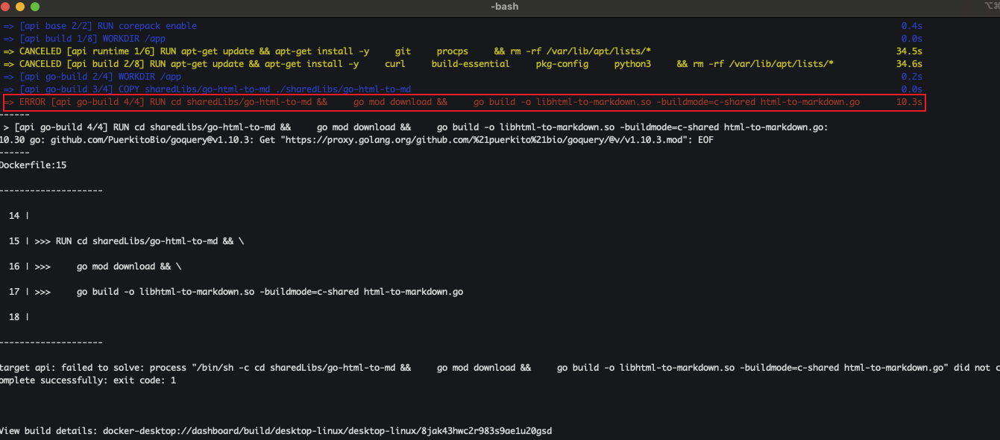
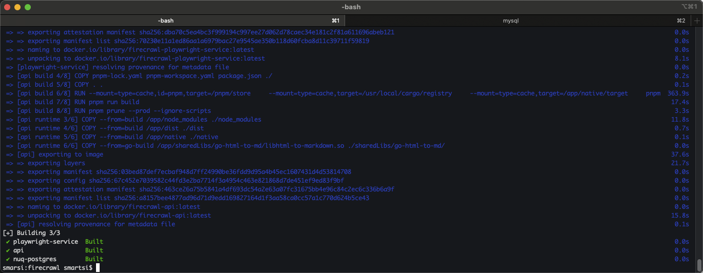
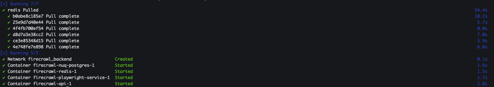
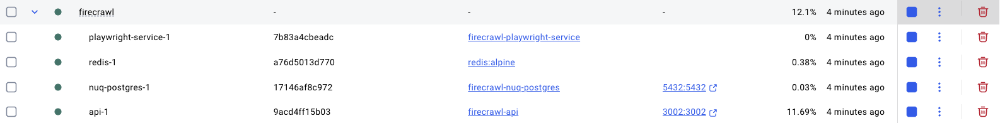
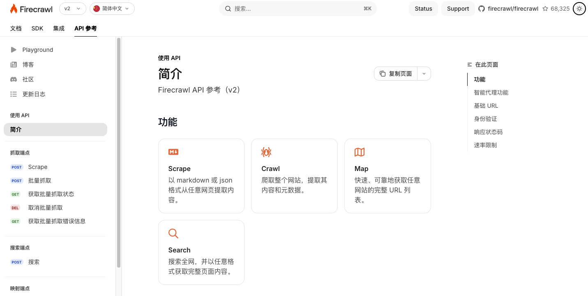
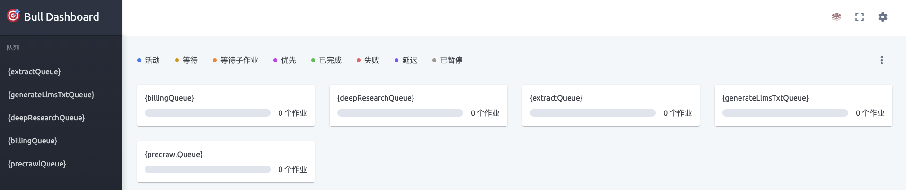

Firecrawl 是一个强大的网络爬虫工具，能够高效地抓取和提取网页数据。通过 Docker Compose，我们可以轻松地在本地环境中部署和运行 Firecrawl。本文将详细介绍如何使用 Docker Compose 进行本地化部署。

## 1. 前置要求

在开始之前，请确保您的系统已安装以下工具：
- Git
- Docker Engine
- Docker Compose

## 2. 配置文件

### 2.1 克隆 Firecrawl 项目仓库

在开始之前，请确保已安装 Git 工具。然后，在工作目录下执行以下命令，将 Firecrawl 源代码克隆到本地：
```
git clone git@github.com:firecrawl/firecrawl.git
```

### 2.2 配置环境变量

> 配置环境变量 (.env 文件)

找到项目目录下的 `apps/api/.env.example` 文件。将该文件复制到项目根目录并重命名为 `.env`：
```
cd firecrawl/apps/api
cp .env.example ../../.env
```
> 进入 firecrawl/apps/api 目录下，将 .env.example 复制到上两级目录（项目根目录）并命名为 .env

可以参考官方提供的配置模板修改：
```bash
# ===== 必填变量 ======
PORT=3002
HOST=0.0.0.0

# Note: PORT is used by both the main API server and worker liveness check endpoint

# To turn on DB authentication, you need to set up Supabase.
USE_DB_AUTHENTICATION=false

# ===== 可选变量 ======

## === AI features (JSON format on scrape, /extract API) ===
# Provide your OpenAI API key here to enable AI features
# OPENAI_API_KEY=

# Experimental: Use Ollama
# OLLAMA_BASE_URL=http://localhost:11434/api
# MODEL_NAME=deepseek-r1:7b
# MODEL_EMBEDDING_NAME=nomic-embed-text

# Experimental: Use any OpenAI-compatible API
# OPENAI_BASE_URL=https://example.com/v1
# OPENAI_API_KEY=

## === Proxy ===
# PROXY_SERVER can be a full URL (e.g. http://0.1.2.3:1234) or just an IP and port combo (e.g. 0.1.2.3:1234)
# Do not uncomment PROXY_USERNAME and PROXY_PASSWORD if your proxy is unauthenticated
# PROXY_SERVER=
# PROXY_USERNAME=
# PROXY_PASSWORD=

## === /search API ===
# By default, the /search API will use Google search.

# You can specify a SearXNG server with the JSON format enabled, if you'd like to use that instead of direct Google.
# You can also customize the engines and categories parameters, but the defaults should also work just fine.
# SEARXNG_ENDPOINT=http://your.searxng.server
# SEARXNG_ENGINES=
# SEARXNG_CATEGORIES=

## === Other ===

# Supabase Setup (used to support DB authentication, advanced logging, etc.)
# SUPABASE_ANON_TOKEN=
# SUPABASE_URL=
# SUPABASE_SERVICE_TOKEN=

# Use if you've set up authentication and want to test with a real API key
# TEST_API_KEY=

# This key lets you access the queue admin panel. Change this if your deployment is publicly accessible.
BULL_AUTH_KEY=CHANGEME

# This is now autoconfigured by the docker-compose.yaml. You shouldn't need to set it.
# PLAYWRIGHT_MICROSERVICE_URL=http://playwright-service:3000/scrape
# REDIS_URL=redis://redis:6379
# REDIS_RATE_LIMIT_URL=redis://redis:6379

# Set if you have a llamaparse key you'd like to use to parse pdfs
# LLAMAPARSE_API_KEY=

# Set if you'd like to send server health status messages to Slack
# SLACK_WEBHOOK_URL=

# Set if you'd like to send posthog events like job logs
# POSTHOG_API_KEY=
# POSTHOG_HOST=

## === System Resource Configuration ===
# Maximum CPU usage threshold (0.0-1.0). Worker will reject new jobs when CPU usage exceeds this value.
# Default: 0.8 (80%)
# MAX_CPU=0.8

# Maximum RAM usage threshold (0.0-1.0). Worker will reject new jobs when memory usage exceeds this value.
# Default: 0.8 (80%)
# MAX_RAM=0.8

# Set if you'd like to allow local webhooks to be sent to your self-hosted instance
# ALLOW_LOCAL_WEBHOOKS=true
```

打开新生成的 .env 文件，在这只保留如下参数：
```bash
PORT=3002
HOST=0.0.0.0
USE_DB_AUTHENTICATION=false
BULL_AUTH_KEY=CHANGEME
```
上述配置指定 Firecrawl API 服务监听本机的 3002 端口，允许所有网卡地址访问（0.0.0.0），不启用数据库用户认证，并使用默认的 Bull 队列管理密钥 CHANGEME（仅本地开发可使用默认值）。

## 3. 使用 Docker Compose 构建并启动容器

在项目根目录下，通过 Docker Compose 来构建和启动 Firecrawl 所需的所有容器服务。

### 3.1 构建容器

首先构建镜像：运行以下命令让 Docker 根据仓库内容构建应用镜像:
```
docker compose build
```
此时你可能会遇到如下异常信息：
```
ERROR [api go-build 4/4] RUN cd sharedLibs/go-html-to-md &&     go mod download &&     go build -o libhtml-to-markdown.so -buildmode=c-shared html-to-markdown.go       10.3s
```


这个错误表明在构建 Go 项目时，Docker 容器无法访问 proxy.golang.org（Google 的 Go 模块代理服务器），导致依赖下载失败。解决方案是修改 `firecrawl/apps/api/Dockerfile` 文件，找到 `cd sharedLibs/go-html-to-md &&` 附近：
```bash
RUN cd sharedLibs/go-html-to-md && \
    go mod download && \
    go build -o libhtml-to-markdown.so -buildmode=c-shared html-to-markdown.go
```
添加 `go env -w GOPROXY=https://goproxy.cn,direct && \` 语句：
```bash
RUN go env -w GOPROXY=https://goproxy.cn,direct && \
    cd sharedLibs/go-html-to-md && \
    go mod download && \
    go build -o libhtml-to-markdown.so -buildmode=c-shared html-to-markdown.go
```
清理缓存并重新构建：
```
docker compose build --no-cache
```
首次运行会自动下载所需基础镜像，耗时可能较长，当你看到如下信息时表示构建成功：



### 3.2 启动容器

构建容器之后可以使用如下命令来启动容器：
```
docker compose up -d
```

Docker Compose 将根据定义启动多个容器，包括 Firecrawl 主应用（API 服务）、后台工作进程、Playwright 微服务、Redis 数据库等：



## 4. 测试

### 4.1 验证容器状态

在终端执行 `docker compose ps` 可以查看当前运行的容器列表及其状态。也可以打开 Docker Desktop，进入 `Containers / Apps` 面板查看名为 firecrawl 的应用组下的各个容器是否都处于运行（Running）状态：



如果某些容器意外退出（Exited）或未正常运行，可执行 docker compose logs 或 docker compose logs -f 查看详细日志以定位问题。

### 4.2  Firecrawl 服务

按默认配置，Firecrawl 的 API 服务监听在本机的 3002 端口。启动成功后，可在浏览器中访问 http://localhost:3002 来验证服务是否对外提供接口：



Firecrawl 内置了任务队列的管理界面（基于 Bull Queue）。您可以在浏览器访问 http://localhost:3002/admin/CHANGEME/queues 查看当前爬取任务队列情况。这个界面将显示任务队列状态、执行中的任务等，用于监控 Firecrawl 的工作情况。



### 4.3 测试 API

如果您想测试 Firecrawl 的 API，可以运行以下命令：
```
curl -X POST http://localhost:3002/v1/crawl \
    -H 'Content-Type: application/json' \
    -d '{
      "url": "https://firecrawl.dev"
    }'
```
正常情况下会返回如下类似信息：
```
{"success":true,"id":"d74942aa-17b0-48f3-a822-3c2745872a75","url":"http://localhost:3002/v1/crawl/d74942aa-17b0-48f3-a822-3c2745872a75"}
```
