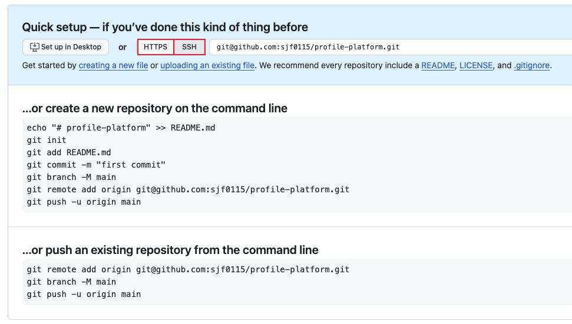

## 1. 问题

在使用 `git push -u origin main` 命令推送远程分支时要求输入用户名和密码，具体操作如下所示：
```shell
(base) localhost:profile-platform wy$ git branch -M main
(base) localhost:profile-platform wy$
(base) localhost:profile-platform wy$ git remote add origin https://github.com/sjf0115/profile-platform.git
(base) localhost:profile-platform wy$
(base) localhost:profile-platform wy$ git push -u origin main
Username for 'https://github.com':
```

## 2. 解决方案

原因是在添加远程库的时候使用了 https 的方式。所以使用的 https 的方式 push 到远程库。只需要重新设置成 ssh 的方式即可：
```shell
(base) localhost:profile-platform wy$ git remote add origin git@github.com:sjf0115/profile-platform.git
(base) localhost:profile-platform wy$
(base) localhost:profile-platform wy$ git push -u origin main
Enumerating objects: 21, done.
Counting objects: 100% (21/21), done.
Delta compression using up to 4 threads
Compressing objects: 100% (12/12), done.
Writing objects: 100% (21/21), 8.17 KiB | 1.63 MiB/s, done.
Total 21 (delta 0), reused 0 (delta 0), pack-reused 0
To github.com:sjf0115/profile-platform.git
 * [new branch]      main -> main
branch 'main' set up to track 'origin/main'.
```
如下图所示有 https 和 ssh 两种方式，我们选择 ssh 方式即可：


