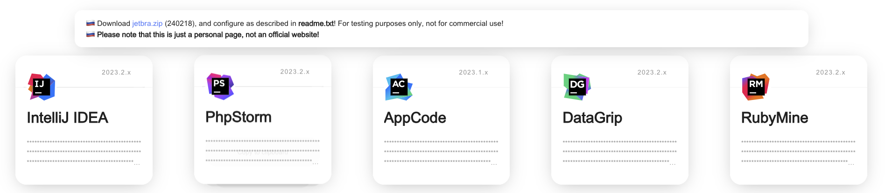
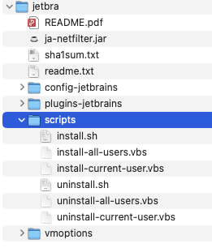
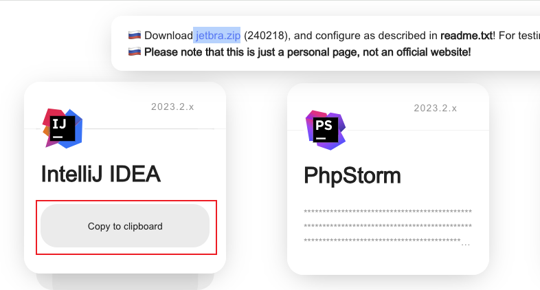
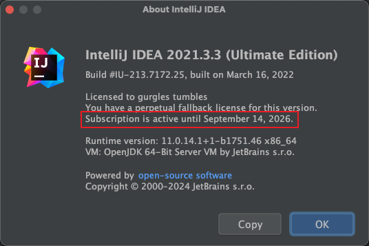

> 仅供 Idea 学习之用

## 1. 下载脚本

[点击](https://3.jetbra.in) `https://3.jetbra.in` 网址，如下所示：


随便点击一个有效的地址，例如点击第一个有效地址之后如下所示：



需要我们下载 ` jetbra.zip` 安装包到本地目录。

## 2. 执行脚本

进入到 `jetbra/scripts` 目录下：



在命令行中执行 `./install.sh` 脚本。如果提示没有权限执行，可以使用 sudo 执行：
```
sudo ./install.sh
```
运行过程中你有可能会遇到如下异常：
```
Could not set environment: 150: Operation not permitted while System Integrity Protection is engaged
Operation not permitted while System Integrity Protection is engaged
```
原因是系统集成保护 (SIP) 阻止了对环境变量的设置。要解决这个问题，你可以尝试如下步骤：
- 如果是 Intel 芯片
  - 重启电脑并长摁 `command+R` 键，直到看到 APPLE 图标进入恢复模式
  - 在顶部菜单栏选择 `实用工具 > 终端(Terminal)`。
  - 输入 `csrutil disable` 命令，然后按 `Enter` 即可禁用 SIP
  - 再次重启电脑即可
- 如果是 m2 芯片
  - 关机，不是重新启动
  - 长按开机键不松开，当屏幕出现 ⚙️ 齿轮是松开，点击齿轮，选择`继续`，就可以进去了。

禁用 SIP 之后再次执行 `./install.sh` 脚本：
```
(base) localhost:scripts wy$ sudo ./install.sh
Password:
done. the "kill Dock" command can fix the crash issue.
(base) localhost:scripts wy$
```

## 3. 获取激活码

完成以上步骤，这个时候才能打开 idea。激活码在我们之前点击的网址中：



这时候使用拷贝的激活码去激活 Idea 即可，如果遇到 `Key is invalid` 显示 key 不能使用重启一下电脑即可。如下是激活之后的效果：


