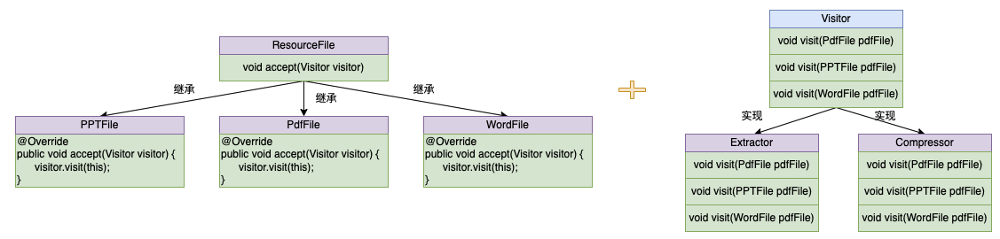

## 1. 定义

访问者模式（Visitor Pattern）是 GoF 提出的 23 种设计模式中的一种，属于行为模式。访问者者模式的英文翻译是 Visitor Design Pattern。在 GoF 的《设计模式》一书中，它是这么定义的：
```
Allows for one or more operation to be applied to a set of objects at runtime, decoupling the operations from the object structure.
```
翻译成中文就是：允许一个或者多个操作应用到一组对象上，解耦操作和对象本身。设计意图是解耦操作和对象本身，保持类职责单一、满足开闭原则以及应对代码的复杂性。

## 2. 实现

接下来，我们将详细介绍访问者模式是如何一步一步演化而来的。假设我们有三种格式的文件：PDF、PPT、Word。现在需要将这三种格式文件中的文本提取出来保存到 Txt 文件中。如果让你来实现，你会怎么来做呢？

### 2.1 V1-多态特性

如果只是简单实现这个功能并不难，不同的人有不同的写法，下面是我们的一种实现：
```java
// 抽象类-资源文件
public abstract class ResourceFile {
    protected String filePath;
    public ResourceFile(String filePath) {
        this.filePath = filePath;
    }
    // 提取文本保存到Txt文件
    public abstract void extract2txt();
}
// PDF 文件
public class PdfFile extends ResourceFile {
    public PdfFile(String filePath) {
        super(filePath);
    }
    public void extract2txt() {
        // 抽取 filePath 路径 PDF 中的文本并保存为同名的 Txt 文件中
        System.out.println("extract pdf to txt");
    }
}
// PPT 文件
public class PPTFile extends ResourceFile {
    public PPTFile(String filePath) {
        super(filePath);
    }
    public void extract2txt() {
        // 抽取 filePath 路径 PPT 中的文本并保存为同名的 Txt 文件中
        System.out.println("extract ppt to txt");
    }
}
// Word 文件
public class WordFile extends ResourceFile {
    public WordFile(String filePath) {
        super(filePath);
    }
    public void extract2txt() {
        // 抽取 filePath 路径 Word 中的文本并保存为同名的 Txt 文件中
        System.out.println("extract word to txt");
    }
}
```
其中，`ResourceFile` 是一个抽象类，包含一个抽象函数 `extract2txt`。`PdfFile`、`PPTFile`、`WordFile` 都继承 `ResourceFile` 类，并都各自重写了 `extract2txt` 函数实现自己的提取逻辑。在 ResourceFileDemo 类中，利用多态特性，根据对象的实际类型，来决定执行的是哪个方法：
```java
public class ResourceFileDemo {
    public static void main(String[] args) {
        List<ResourceFile> resourceFiles = new ArrayList<>();
        // 创建不同的资源文件
        resourceFiles.add(new PdfFile("a.pdf"));
        resourceFiles.add(new WordFile("b.word"));
        resourceFiles.add(new PPTFile("c.ppt"));
        // 提取文件
        for (ResourceFile resourceFile : resourceFiles) {
            resourceFile.extract2txt();
        }
    }
}
```
对于资源文件来说可能不只是需要实现提取文件中文本，还可能需要支持压缩等其他功能，那如果我们继续按照上面的实现思路，会出现违背开闭原则的问题，比如添加一个新的文件压缩功能，所有资源文件类都需要修改。此外把业务逻辑都耦合到资源文件类中，导致这些类的职责不够单一。

### 2.2 V2-函数重载

针对上面的问题，我们的解决方案是拆分解耦，把业务逻辑操作跟具体的数据结构解耦，设计成独立的类。重构之后的代码如下所示：
```java
// 抽象类-资源文件
public abstract class ResourceFile {
    protected String filePath;
    public ResourceFile(String filePath) {
        this.filePath = filePath;
    }
}
// PDF 文件
public class PdfFile extends ResourceFile {
    public PdfFile(String filePath) {
        super(filePath);
    }
}
// PPT 文件
public class PPTFile extends ResourceFile {
    public PPTFile(String filePath) {
        super(filePath);
    }
}
// Word 文件
public class WordFile extends ResourceFile {
    public WordFile(String filePath) {
        super(filePath);
    }
}
// 重点在这：单独提取一个提取器 Extractor
public class Extractor {
    public void extract2txt(PPTFile pptFile) {
        System.out.println("extract ppt to txt v2");
    }

    public void extract2txt(PdfFile pdfFile) {
        System.out.println("extract pdf to txt v2");
    }

    public void extract2txt(WordFile wordFile) {
        System.out.println("extract word to txt v2");
    }
}
```
与第一版本的明显区别是把业务提取文本逻辑与具体的资源类进行解耦，转移到单独的提取器 Extractor 类中。这其中最关键的一点设计是把抽取文本逻辑设计成了三个重载函数(在同一类中函数名相同、参数不同的一组函数)。在 ResourceFileDemo 类中，希望利用重载函数根据对象的实际类型，来决定执行的是哪个方法：
```java
public class ResourceFileDemo {
    public static void main(String[] args) {
        // 创建提取器
        Extractor extractor = new Extractor();
        // 创建不同的资源文件
        List<ResourceFile> resourceFiles = new ArrayList<>();
        resourceFiles.add(new PdfFile("a.pdf"));
        resourceFiles.add(new WordFile("b.word"));
        resourceFiles.add(new PPTFile("c.ppt"));
        // 提取文件
        for (ResourceFile resourceFile : resourceFiles) {
            // 编译报错
            //extractor.extract2txt(resourceFile);
        }
    }
}
```
不过，这种方案实现的代码是编译通过不了的，上面注释的代码行会报错。这是为什么呢？多态是一种动态绑定，可以在运行时获取对象的实际类型，来运行实际类型对应的方法。而函数重载是一种静态绑定，在编译时并不能获取对象的实际类型，而是根据声明类型执行声明类型对应的方法。在上面代码中 `resourceFiles` 包含的对象的声明类型都是 `ResourceFile`，而我们并没有在 Extractor 类中定义参数类型是 `ResourceFile` 的 `extract2txt` 重载函数，所以在编译阶段就通过不了。

## 2.3 V3-访问者模式雏形

针对上面的问题，那如何解决呢？先看一下重构之后的代码，如下所示：
```java
// 抽象类-资源文件
public abstract class ResourceFile {
    protected String filePath;
    public ResourceFile(String filePath) {
        this.filePath = filePath;
    }
    abstract public void accept(Extractor extractor);
}
// PDF 文件
public class PdfFile extends ResourceFile {
    public PdfFile(String filePath) {
        super(filePath);
    }

    @Override
    public void accept(Extractor extractor) {
        extractor.extract2txt(this);
    }
}
// PPT 文件
public class PPTFile extends ResourceFile {
    public PPTFile(String filePath) {
        super(filePath);
    }

    @Override
    public void accept(Extractor extractor) {
        extractor.extract2txt(this);
    }
}
// Word 文件
public class WordFile extends ResourceFile {
    public WordFile(String filePath) {
        super(filePath);
    }

    @Override
    public void accept(Extractor extractor) {
        extractor.extract2txt(this);
    }
}
// 提取器
public class Extractor {
    public void extract2txt(PPTFile pptFile) {
        System.out.println("extract ppt to txt v3");
    }

    public void extract2txt(PdfFile pdfFile) {
        System.out.println("extract pdf to txt v3");
    }

    public void extract2txt(WordFile wordFile) {
        System.out.println("extract word to txt v3");
    }
}
```
`ResourceFile` 抽象类中提供了一个 `accept` 抽象函数。`PdfFile`、`PPTFile`、`WordFile` 都继承 `ResourceFile` 类，并都各自重写了 `accept` 函数，均是调用 `Extractor` 的 `extract2txt` 函数，不过不同资源文件类中 `this` 类型是不同的。在 ResourceFileDemo 类中，利用多态特性，根据对象的实际类型，来决定执行的是哪个方法：
```java
public class ResourceFileDemo {
    public static void main(String[] args) {
        // 创建提取器
        Extractor extractor = new Extractor();
        // 创建不同的资源文件
        List<ResourceFile> resourceFiles = new ArrayList<>();
        resourceFiles.add(new PdfFile("a.pdf"));
        resourceFiles.add(new WordFile("b.word"));
        resourceFiles.add(new PPTFile("c.ppt"));
        // 提取文件
        for (ResourceFile resourceFile : resourceFiles) {
            resourceFile.accept(extractor);
        }
    }
}
```
在执行 `resourceFile.accept(extractor)` 的时候，根据多态特性，程序会调用实际类型的 accept 函数。比如 PdfFile 的 accept 函数 `extractor.extract2txt(this)`，此处的 this 类型是 `PdfFile`，在编译的时候就已经确定了，所以会调用 extractor 的 `extract2txt(PdfFile pdfFile)` 这个重载函数。这是理解访问者模式的关键所在。

现在，如果要继续添加新的功能，比如前面提到的压缩功能，根据不同的文件类型，使用不同的压缩算法来压缩资源文件，那我们该如何实现呢？我们需要实现一个类似 Extractor 类的新类 Compressor 类，在其中定义三个重载函数，实现对不同类型资源文件的压缩：
```java
// 抽象类-资源文件
public class Compressor {
    public void compress(PPTFile pptFile) {
        System.out.println("compress ppt v3");
    }

    public void compress(PdfFile pdfFile) {
        System.out.println("compress pdf v3");
    }

    public void compress(WordFile wordFile) {
        System.out.println("compress word v3");
    }
}
```
除此之外，我们还要在每个资源文件类中定义新的 accept 重载函数。具体的代码如下所示：
```java
// 抽象类-资源文件
public abstract class ResourceFile {
    protected String filePath;
    public ResourceFile(String filePath) {
        this.filePath = filePath;
    }
    abstract public void accept(Extractor extractor);
    abstract public void accept(Compressor compressor);
}
// PDF 文件
public class PdfFile extends ResourceFile {
    public PdfFile(String filePath) {
        super(filePath);
    }

    @Override
    public void accept(Extractor extractor) {
        extractor.extract2txt(this);
    }
    // 新增
    @Override
    public void accept(Compressor compressor) {
        compressor.compress(this);
    }
}
// PPT 文件
public class PPTFile extends ResourceFile {
    public PPTFile(String filePath) {
        super(filePath);
    }

    @Override
    public void accept(Extractor extractor) {
        extractor.extract2txt(this);
    }
    // 新增
    @Override
    public void accept(Compressor compressor) {
        compressor.compress(this);
    }
}
// Word 文件
public class WordFile extends ResourceFile {
    public WordFile(String filePath) {
        super(filePath);
    }

    @Override
    public void accept(Extractor extractor) {
        extractor.extract2txt(this);
    }
    // 新增
    @Override
    public void accept(Compressor compressor) {
        compressor.compress(this);
    }
}
```
上面代码跟第一版本一样存在违背开闭原则的问题，添加一个新的文件压缩功能，所有资源文件类都需要修改。

### 2.4 V4-访问者模式

针对这个问题，我们抽象出来一个 Visitor 接口，包含是三个命名非常通用的 `visit` 重载函数，分别处理三种不同类型的资源文件：
```java
public interface Visitor {
    void visit(PdfFile pdfFile);
    void visit(PPTFile pdfFile);
    void visit(WordFile pdfFile);
}
```
具体做什么业务处理，由实现这个 `Visitor` 接口的具体的类来决定，比如 `Extractor` 负责抽取文本内容，`Compressor` 负责压缩：
```java
public class Extractor implements Visitor {

    @Override
    public void visit(PdfFile pdfFile) {
        System.out.println("extract pdf to txt v4");
    }

    @Override
    public void visit(PPTFile pdfFile) {
        System.out.println("extract ppt to txt v4");
    }

    @Override
    public void visit(WordFile pdfFile) {
        System.out.println("extract word to txt v4");
    }
}

public class Compressor implements Visitor {
    @Override
    public void visit(PdfFile pdfFile) {
        System.out.println("compress pdf v4");
    }

    @Override
    public void visit(PPTFile pdfFile) {
        System.out.println("compress ppt v4");
    }

    @Override
    public void visit(WordFile pdfFile) {
        System.out.println("compress word v4");
    }
}
```
当我们新添加一个业务功能的时候，资源文件类不需要做任何修改。重构之后的代码如下所示：
```java
// 抽象类-资源文件
public abstract class ResourceFile {
    protected String filePath;
    public ResourceFile(String filePath) {
        this.filePath = filePath;
    }
    abstract public void accept(Visitor visitor);
}
// PDF 文件
public class PdfFile extends ResourceFile {
    public PdfFile(String filePath) {
        super(filePath);
    }

    @Override
    public void accept(Visitor visitor) {
        visitor.visit(this);
    }
}
// PPT 文件
public class PPTFile extends ResourceFile {
    public PPTFile(String filePath) {
        super(filePath);
    }

    @Override
    public void accept(Visitor visitor) {
        visitor.visit(this);
    }
}
// Word 文件
public class WordFile extends ResourceFile {
    public WordFile(String filePath) {
        super(filePath);
    }

    @Override
    public void accept(Visitor visitor) {
        visitor.visit(this);
    }
}
```
在 ResourceFileDemo 类中，根据多态特性调用实际类型的 accept 函数：
```java
public class ResourceFileDemo {
    public static void main(String[] args) {
        // 创建提取器
        Extractor extractor = new Extractor();
        // 创建压缩器
        Compressor compressor = new Compressor();

        // 创建不同的资源文件
        List<ResourceFile> resourceFiles = new ArrayList<>();
        resourceFiles.add(new PdfFile("a.pdf"));
        resourceFiles.add(new WordFile("b.word"));
        resourceFiles.add(new PPTFile("c.ppt"));

        // 提取&压缩文件
        for (ResourceFile resourceFile : resourceFiles) {
            resourceFile.accept(extractor);
            resourceFile.accept(compressor);
        }
    }
}
```
一般来说，访问者模式针对的是一组类型不同的对象（PdfFile、PPTFile、WordFile）。不过，尽管这组对象的类型是不同的，但是，它们继承相同的父类（ResourceFile）或者实现相同的接口。在不同的应用场景下，我们需要对这组对象进行一系列不相关的业务逻辑操作（抽取文本、压缩等），为了避免不断添加功能导致类（PdfFile、PPTFile、WordFile）不断膨胀，职责越来越不单一，以及避免频繁地添加功能导致的频繁代码修改，我们使用访问者模式，将对象与操作解耦，将这些业务逻辑操作抽离出来，定义在独立细分的访问者类（Extractor、Compressor）中。


