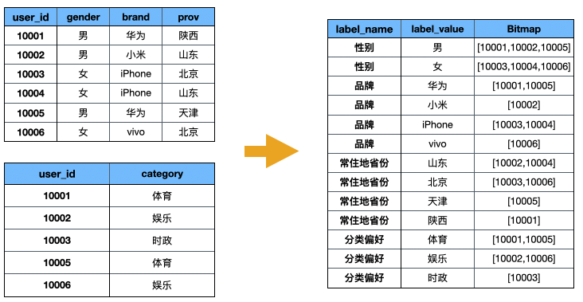

在上一篇文章[用户画像实战：使用宽表存储画像标签](https://smartsi.blog.csdn.net/article/details/140087260)中我们详细介绍了如何使用宽表存储画像标签。从这篇文章可以知道宽表存储画像标签存在运维成本高、扩展比较麻烦、产出延迟高以及资源浪费等问题，适合在标签数量较少(小于1000)、数据稳定（更新较少）的场景。

但是当业务标签越来越多时（大于1000列），一般就认为是超大规模的场景，宽表标签计算的方案将不再适合，因为当列越多时，更新效率将会越慢。在这我们提出一种新的存储方案：通过对标签表构建索引，将用户ID编码后以 Bitmap 格式保存，将关系运算转化 Bitmap 的交并差运算，进而加速实时计算性能。在超大规模用户属性洞察分析的场景中，使用 RoaringBitmap(详细介绍参考[Roaring Bitmap 更好的位图压缩算法](https://smartsi.blog.csdn.net/article/details/127833352)) 组件能够实现亚秒级的查询响应。有一些查询引擎(例如，ClickHouse、Doris等)已经提供了 RoaringBitmap 的计算能力。有一些引擎可能还没有提供(例如，Hive)，可以自定义实现，详细可以参考[Hive 实战：位图 Bitmap 系列-位图计算函数](https://smartsi.blog.csdn.net/article/details/139701146)。

## 1. 适用场景

使用 RoaringBitmap 的方案的可以适用于如下场景：
- 标签数量多：需要对多张大表进行关联运算，可以使用 BITMAP_AND 替换 JOIN 运算，可以降低内存消耗，Bitmap 使用 SIMD 指令优化可以将 CPU 使用率提升1~2个数量级。
- 数据规模大且需去重运算：如数十亿数据需要去重，Bitmap 结构天然去重，避免精确 UV 计算和内存的开销。

## 2. 标签数据分类

在介绍 Bitmap 计算方案之前，我们需要区分画像系统中常用的两类标签数据，针对这两类数据的计算模式大相径庭，我们需要依据数据模型和运算模式将合理的部分转化为 Bitmap 格式存储：
- 属性标签：主要描述用户的属性情况，例如用户性别、所在省份、已婚状态等，数据相对稳定，通常进行精准条件过滤。这类数据进行 Bitmap 压缩比会很高，并且 Bitmap 适合对应的运算。
- 行为标签：主要描述用户行为特征，描述用户在某个时间做了一件什么事，比如用户店铺浏览购买行为、用户登录活跃行为等，数据变更频率高，通常需要进行范围扫描，聚合过滤。这类数据不适合进行 Bitma 压缩，压缩比会很差，运算模式不适合 Bitmap 直接运算。

## 3. 属性标签处理

属性标签处理场景通常是描述用户的属性情况，数据相对稳定，通常进行精准条件过滤，通过 Bitmap 能实现高效的压缩和运算。

将上述需求中所有标签拼接到一张数据表中构建出一张宽表 `dws_app_user_profile_label_td`：

### 3.1 方案介绍

假设我们系统中存在两张属性标签表，如下图所示：


> dws_app_user_profile_attr_label_td 标签宽表描述用户基础属性标签


> dws_app_user_profile_prefer_label_td 标签宽表描述用户偏好标签

如果需求从上述两张表中圈选出使用喜欢体育的女性用户 `[gender = 女] & [category = 体育]`，通常可以关联、过滤最终获得用户。但在数据规模较大的场景，关联、去重运算会带来严重的性能负担。Bitmap 优化方案通过预构建标签的 Bitmap 表来减少即席运算的成本，比如将两张表中的列拆开分别构建 Bitmap 表如下所示，通过表中 Bitmap 的与运算计算出人数：



但是按列拆分的方案也存在一定的问题，当多列之间存在层级的组织关系时，上述的拆分和运算方式可能会导致计算错误的情况，如下图所示。


在描述店铺用户新客、老客信息的店铺用户表中，按照列拆分成描述店铺名称和客户类型的 Bitmap 表。当计算店铺 A 的新客用户 `[shop_id = A] & [cust_type = 新客]` 时会得到 `[10001]` 的用户集合，然而在真实的表中是不存在这种用户的。产生这种错误的原因是 cust_type、shop_id 两个字段存在一定的关联性，cust_type 不能单独存在，只有与 shop_id 一起使用时才有意义。因此可以将 shop_id 和 cust_type 组合值作为构建 Bitmap 表来避免这类错误。


根据以上方案介绍，需要将 user_id 压缩存储进 Bitmap，通过 Bitmap 与或非运算实现标签的对应运算。

### 3.2 方案实践

#### 3.2.1 用户信息编码处理

用户标识可能是字符类型的，由于 Bitmap 只能保存整数信息，因此需要先将 user_id 进行整数编码。对用户标识进行编码不仅可以方便存储进 Bitmap，还可以使 ID 信息保持连续性。如下图所示bitmap2由于存储的ID数据稀疏，存储效率相比bitmap1低很多，因此对ID编码处理，也会降低存储成本，提升运算效率。

对于数值类型，如果较为稀疏也可以考虑编码，但是进行编码有利有弊，例如在广告DMP系统中除了需要高性能的画像能力，也需要实时输出人群明细的能力；而一旦需要输出人群明细，就需要Join用户ID表进行还原，这一部分的性能开销，也应当纳入技术选型的考虑因素中。因此您可以依据使用场景权衡选择，是否进行编码建议如下：
- 字符ID：建议编码。
- 整数ID且需要频繁还原原始值：建议不编码。
- 整数ID且不需要还原原始值：建议编码。

#### 3.2.2 Bitmap 加工和查询

依据上述方案按列拆分的思路，将dws_userbase表与dws_shop_cust表进行拆分，按照分别为省份、性别的列Bitmap拆分为一个表，但是性别只有男、女两个选项，压缩出来的Bitmap只能分布于集群中的两个节点，计算存储都很不平均，集群的资源并不能充分利用。因此有必要将Bitmap拆分成多段，并将它们打散到集群中来提升并发执行的能力，假设将Bitmap打散成65536段，SQL命令如下。


当进行 `[shop_id = A] & [cust_type = 新客] & [province = 北京]` 的客群人数预估时，按照标签的与或非逻辑组织对应的Bitmap关系运算，即可完成对应的查询，SQL命令如下。
```sql
SELECT SUM(RB_CARDINALITY(rb_and(ub.bitmap, uc.bitmap)))
FROM
  (SELECT rb_or_agg(bitmap) AS bitmap,
          bucket
   FROM rb_dws_userbase_province
   WHERE province = '北京'
   GROUP BY bucket) ub
JOIN
  (SELECT rb_or_agg(bitmap) AS bitmap,
          bucket
   FROM rb_dws_shop_cust_sid_ctype
   WHERE shop_id = 'A'
     AND cust_type = '新客'
   GROUP BY bucket) uc ON ub.bucket = uc.bucket;
```

## 4. 行为标签处理

常见的实时表往往包含时间维度，比如按天汇总的用户行为实时表。就某一天的数据而言，用户的数据仅包含有限几条数据。由于Bitmap本身存在结构行存储开销，压缩成Bitmap不但不能节省存储空间，更可能造成存储浪费。另一方面，事实表典型的计算模式中需要汇总多天数据进行聚合过滤，如果使用Bitmap存储可能需要展开再汇总运算。同时由于这类数据变更频繁，有时更需要实时更新；在[option->bitmap]的存储结构中，无法直接找到需要更新的数据。因此Bitmap并不适合用于压缩行为数据，不适合进行汇总运算，不适合实时更新。

当涉及到行为标签数据处理的场景时，在Hologres中可以保持原有的存储格式。当发生事实表与属性表联合运算时，可以将实时表过滤结果实时生成Bitmap，再与属性表Bitmap索引进行运算。同时由于Bitmap索引表使用Bucket作为分布键（Distribution Key），通过Local Join提升性能。

当我们计算[province=北京] & [shop_id=A且7天未购买]的用户时，SQL命令如下所示。

## 5. 离线Bitmap处理方案

为了避免Bitmap数据计算对生产业务的影响，可以选择在离线完成Bitmap数据的加工，通过Hologres外部表能力从MaxCompute或者Hive中直接加载数据。离线处理Bitmap的过程与在线流程思路类似，也可以通过编码、聚合方式产生数据，在MaxCompute中离线构建Bitmap数据示例如下。


> [画像分析 - RoaringBitmap优化方案](https://www.alibabacloud.com/help/zh/hologres/use-cases/roaring-bitmaps?spm=a2c63.p38356.0.0.5b0813d7h5WDXZ)

。。。
