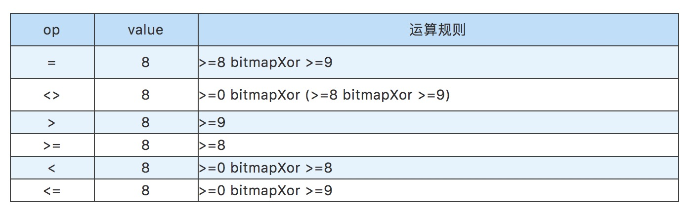

## 1. 背景介绍

DMP数据管理平台是实现用户精细化运营和和全生命周期运营的的基础平台之一。贝壳找房从2018年5月开始建设自己的DMP平台，提供了用户分群、消息推送、人群洞察等能力。关于贝壳DMP架构的介绍可参考文章：[DMP平台在贝壳的实践和应用](https://mp.weixin.qq.com/s/wEtbp6hmY28xq9R4TR-skQ)。

目前，贝壳DMP数据覆盖了贝壳和链家的数亿用户，用户偏好和行为数据量达到数十亿，拥有上千维画像标签。在海量用户画像数据基础上实现用户分群，同时满足业务方越来越复杂的标签组合需求，提高人群包构建速度同时保证数据准确性，为此，我们对DMP平台进行了持续的迭代优化。

本文主要介绍bitmap(位图)用户分群方法在贝壳DMP中的具体实践和应用。该方案上线后，贝壳DMP平台支持了秒级别的人群包数量预估，分钟级别的复杂人群包逻辑运算。

## 2. 用户分群方式介绍和对比

用户分群是在人群画像的基础上实现的。DMP平台上包含已经加工处理好的用户画像标签，运营等同学通过在前端选择一些标签，设定这些标签之间的逻辑关系，通过引擎层的计算，最终得到符合这些标签条件的用户的集合。

在Hive数据层，用户画像是以关系型数据表的形式进行存储的，即构建了用户-标签的映射关系。考虑到Hive查询速度等方面的限制，我们最终选择了ClickHouse(下文简称CH)作为DMP平台底层的存储和计算引擎。在Hive数据表产出之后，通过启动Spark任务将Hive中的画像数据导入到ClickHouse中。

在上一版本的实现中，CH中存储的是与Hive类似的关系型数据表。通过将人群包的标签组合逻辑转化成CH SQL，将标签取值条件转化成SQL的WHERE条件部分，过滤查找符合标签条件的用户，进行得到符合条件的目标用户集合。但是这种方式一般要涉及到全表数据的扫描和过滤，且画像数据一般存储在多张表中，当选择的标签分布在不同的表中时，还会涉及到中间结果之间的JOIN，限制了人群包数据的产出速度。

如果从另一个角度思考，使用标签进行用户分群，其本质还是集合之间的交、并、补运算。如果能够将符合每个标签取值的用户群提都提前构建出来，即构建好标签-用户的映射关系，在得到人群包的标签组合后直接选取对应的集合，通过集合之间的交/并/补运算即可得到最终的目标人群。bitmap是用于存储标签-用户的映射关系的比较理想的数据结构之一。ClickHouse目前也已经比较稳定的支持了bitmap数据结构，为基于bitmap的用户分群实现提供了基础。

## 3. Bitmap用户分群方案思路

我们以开源数据库 ClickHouse 的 bitmap 数据结构为基础，将符合某个标签的某个取值的所有用户ID（INT类型）存储在一个bitmap结构中，构建出每个标签的每个取值所对应的bitmap。

对于多个标签的逻辑组合，使用bitmapAnd、bitmapOr、bitmapXor函数进行bitmap之间的交、并、补运算（另外还有bitmapToArray、bitmapCardinality函数可用于bitmap的转换和基数计算），最终得到符合该标签组合的所有用户ID集合，即圈选出了所有符合这些画像标签的用户。

基于bitmap的用户分群方案完整流程如下图所示：

整个方案主要包含以下几个技术问题：
- 如何针对亿级用户构建全局连续唯一数字ID标识join_id？
- 如何设计bitmap生成规则使其适用于DMP上所有的画像标签？
- 如何将Hive表中的关系型数据以bitmap的形式保存到ClickHouse表中？
- 如何将标签之间的与/或/非逻辑转化成bitmap之间的交/并/补运算并生成bitmap SQL？

下面将逐一分析并解决这些问题。

### 3.1 亿级用户构建全局连续唯一数字ID

DMP系统中，用户都是使用STRING类型的cust_join_key（不同数据表中用来关联用户的关联键）来进行标识的，不能在bitmap中直接使用，需要用INT类型的用户ID来标识所有的用户。同时原hive表中也是不包含INT类型的用户ID这个字段的，所以需要提前准备好bitmap分群方案所需的bitmap_hive表。

如何为DMP平台上用STRING类型的cust_join_key标识的亿级用户生成全局唯一的数字ID呢？hive提供了基础的row_number() over()函数，但是在操作亿级别行的数据时，会造成数据倾斜，受限于Hadoop集群单机节点的内存限制，无法成功运行。为此我们创新性的提出了一种针对亿级行大数据量的全局唯一连续数字ID生成方法。其核心思想如下：

具体解释为：
- 将全部亿级数据按照一定的规则分成多个子数据集（假设共有M个子数据集，每个子数据集各有Ni行数据，M >= 1，Ni >= 1，1<= i <= M），确保每个子数据集的数据可以在Hadoop集群的单个节点上使用行号生成函数ROW_NUMBER() OVER (PARTITION BY col_1 ORDER BY col_2 ASC/DESC)生成行号。每个子数据集中的行号都是从1开始，最大的行号为Ni。
- 对于第1个子数据集（M = 1）的数据，其最终行号是1，2，3，4，...，N1；对于第2个子数据集（M = 2）的数据，其最终行号是1 + N1，2 + N1，3 + N1，4 + N1，...，N2 + N1；对于第3个子数据集（M = 3）的数据，其最终行号是1 + N1 + N2，2 + N1 + N2，3 + N1 + N2，4 + N1 + N2，...，N3 + N1 + N2；…以此类推，得到全部亿级数据的行号，通过该方法为每个STRING类型的cust_join_key分配的一个行号，该行号即可作为标识每个用户的全局唯一的数字ID应用在bitmap结构中。

前面提到，DMP所有的画像数据最终汇总到了4张Hive表中，分别保存用户的基本信息（base表）、偏好信息（prefer表）、行为信息（action表）和设备信息（device表）。构建好join_id后，还需要将join_id关联到用户画像表中，产出构建bitmap所需要的bitmap_hive表。到此也就完成了Hive数据层的准备工作。

### 3.2 Bitmap的设计

#### 3.2.1 标签梳理

在DMP用户画像标签体系中，标签数量多达上千个，根据标签属性，可将标签划分成枚举类型（enum）、连续值类型（continuous）、日期类型（date）。

枚举类型的标签，标签取值从维表中选择，标签和取值之间的逻辑关系只有等于、不等于，共2种。

连续值类型的标签，标签取值为整数，最小值是0，根据标签不同，部分标签最大值可取1、7、15…等，部分标签无最大取值限制。标签和取值之间的逻辑关系有等于、不等于、大于、大于等于、小于、小于等于，共6种。

日期类型的标签，标签取值格式为yyyy-MM-dd，一般选择过去的某个日期，标签和取值之间的逻辑关系有等于、不等于、大于、大于等于、小于、小于等于，共6种。

根据标签对应的字段个数，可将标签划分成单一标签和复合标签。一个单一标签对应一个 hive表（base表和device表）的字段，例如常驻城市、是否安装贝壳app、房屋近3天关注次数、最后一次浏览时间、设备使用习惯、贝壳激活距今天数等；对于复合标签，多个字段组合成一个标签。复合标签包含1个主要标签，同时包含1个或3个次要标签。

prefer表中，2个字段组合成一个标签，偏好字段对应主要标签，业务线字段对应次要标签。例如二手-偏好地铁、新房-偏好楼层、租赁-偏好面积等。

action表中，4个字段组合成一个标签，行为字段为主要标签，产品字段、业务线字段、业务城市字段为次要标签。例如贝壳-二手-北京-近7日活跃天数、贝壳-新房-天津-近7日搜索次数、链家-租赁-上海-近7日核访次数等。

两种不同的分类方式下，标签是可以任意组合的，其组合情况如下：

#### 3.2.2 bitmap的构建和运算转换

针对以上6大类标签，设计了针对每种标签的bitmap构建和运算转换规则。单一标签和复合标签这种分类情况中，两种类型标签的区别只是标签对应字段的数量。对于复合标签，约定将复合标签的所有字段名按照字典序排列，各个字段的取值也按照字段名的对应顺序排列，复合标签的主要标签即可按照单一标签的处理逻辑进行处理。因此，只针对枚举类型标签、连续值类型标签和日期类型标签三种标签类型进行设计即可。通过标签名dim和标签取值dim_value标识每个bitmap（此处做了简化，实际应用中每个bitmap是通过数据版本dt、标签所属hive表tbl、标签名dim和标签取值dim_value来标识的）。

Bitmap构建和运算转换的理论情况如下。

##### 3.2.2.1 枚举类型标签

标签和取值之间的逻辑关系只有等于、不等于，共2种。

可构建2大类bitmap：
- 将等于某个标签的某个取值的所有用户ID存储在一个bitmap中；
- 将全部用户存储在一个全量bitmap中。

单个标签取值到bitmap运算的转换关系为：

##### 3.2.2.2 连续值类型标签

标签和取值之间的逻辑关系有等于、不等于、大于、大于等于、小于、小于等于，共6种。

标签取值为整数，0、1、2、～。最小值为0，部分标签有最大值，部分标签理论上无最大值。根据线上标签使用情况，为部分标签确定一个最大值，即得到一个取值区间。

可构建2大类bitmap：
- 针对区间内的每个值，例如[0，100]区间内的每个值X，构建>=X的bitmap。即将标签取值>=0（>=1、～、>=6、>=7、～、>=100）的所有用户ID各存储在一个bitmap中；
- 全量bitmap即为标签取值>=0的bitmap。

单个标签取值到bitmap运算的转换关系为：

> 对于某个连续值标签，将取值>=8的人群存储在一个bitmap结构b1中，将取值>=9的人群存储在一个bitmap结构b2中，为圈出某个连续值标签取值=8的用户群体，使用b1和b2做异或运算即可。

##### 3.2.2.3 日期类型标签

标签和取值之间的逻辑关系有等于、不等于、大于、大于等于、小于、小于等于，共6种。所有的日期数据一定是小于当前日期的。同样根据实际情况和线上标签使用，需人为确定一个最大值，即得到一个取值区间。

同样可构建2大类bitmap：
- String类型 yyyy-MM-dd 处理成数值类型yyyyMMdd。对一个区间，例如[0，20200820]区间内的每个值X构建<=X的bitmap，即将标签取值<=20200820，<=20200819，<=20200818，<=20200817，<=20200816，<=20200815，...... 的所有用户ID存储在一个bitmap中；
- 全量bitmap即为标签取值<=-0d的bitmap。

单个标签取值到bitmap运算的转换关系为：

> 对于某个日期类型标签，将取值<=20200304的人群存储在一个bitmap结构b1中，将取值<=20200305的人群存储在一个bitmap结构b2中，为圈出某个连续值标签取值=2020-03-05的用户群体，使用b1和b2做异或运算即可。

#### 3.2.3 边界值的处理

对于一些连续值和日期类型的标签，当标签取值取到定义的边界值或者标签本身的边界值时，按照上面的转化规则，会出现取出不存在的bitmap的情况。为此，需要对部分标签的边界值情况进行处理。

以近7日活跃天数这个连续值类型标签为例，在底层hive数据中，该标签字段的取值时[0, 7]。假设该标签为单一标签，针对该标签会生成>=0, >=1, >=2, >=3, >=4, >=5, >=6, >=7共8个bitmap。对于取边界值等于7的情况，根据上述规则，会使用到>=8的bitmap，然而并不存在这个>=8的bitmap，造成结果为空。所以需要针对这种边界值进行转换处理。具体的针对边界值的处理方案如下：

3.2.2节提到，针对连续值类型和日期类型的标签，结合实际标签使用情况和数据库存储空间的限制，我们分别选择了[0,100]和[0,180]的区间构建bitmap。对于当边界值取到100或-180d的时候，也会出现因为不存在相关的bitmap而造成结果不准确的现象，此处可结合实际情况限制用户对标签的的最大取值为区间最大值减1或扩大区间范围以减少边界值的影响。

### 3.3 Bitmap_CK表的设计

bitmap数据是通过Spark任务以序列化的方式写入到CH中的，为此我们再CH中创建了一个null引擎的表，bitmap的类型为string。然后以null引擎的表为基础创建了一个物化视图表，通过base64Decode()函数将String类型的bitmap转换成CH中的AggregateFunction(groupBitmap, UInt32)数据结构，最后以物化视图表为物理表，创建分布式表用于数据的查询。同时为了减少CH集群的处理压力，我们还进行了一个优化，即在null引擎表之前创建了一个buffer引擎的表，数据最先写入buffer引擎的表，积攒到一定的时间/批次后，数据会自动写入到null引擎的表。

### 3.4 Hive的关系型数据到CH的bitmap数据

Spark任务中，先通过spark SQL将所需hive数据读取，保存在DataSet<Row>中。根据不同的标签类型按照3.2.2中设计的规则使用spark聚合算子进行运算。处理逻辑如下：

在这个过程中，我们还使用了bitmap的循环构建、spark任务调优、异常重试机制、bitmap构建后的数据验证等方法来提高任务的运行速度和稳定性。

### 3.5 bitmap SQL的生成

在2019年7-8月的优化迭代中，DMP建设了自己的标签后台系统，设计了用于存储人群包标签组合的存储格式，本次的生成bitmap SQL的过程也是完全兼容了之前的标签组合存储格式。

通过处理人群包的标签组合，确定所需要的bitmap以及这些bitmap之间的逻辑关系（下图红线标识），最终生成的bitmap SQL 示例如下图所示。同时通过使用GLOBAL IN代替比较耗时的GLOBAL ANY INNER JOIN，CH SQL运行效率也有了大幅度的提升。

## 4. 总结和展望

在整个方案的实现过程中，除解决上述技术问题外，我们还对bitmap方案的数据准确性验证、考虑到前后两种方案数据产出时间的差异，对两种SQL方案的选择切换、bitmap方案不适用的少数场景、bitmap SQL生成过程中全量bitmap的选择等问题进行了考虑。我们也对该方案中的核心技术申请了专利。

目前基于bitmap 的用户分群方案已经上线运行超过3个月，支持秒级别的人群包数量预估，分钟级别的复杂人群包逻辑运算，日均支持500+周期性人群包的运行，保障了消息推送任务的正常发送，日均触达用户数千万。

在下一步的工作中，我们将从覆盖全部用户画像标签、提升bitmap数据产出和构建速度、完善标签上线流程、丰富bitmap数据应用场景等方面对DMP平台进行持续的迭代优化。

欢迎关注我的公众号和博客：

原文：[Bitmap用户分群方法在贝壳DMP的实践和应用](https://mp.weixin.qq.com/s/VijSTxDj65cAl2XmbWHiJA)
